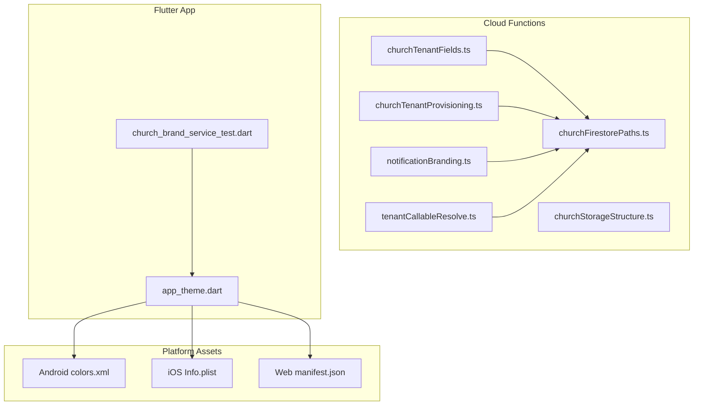
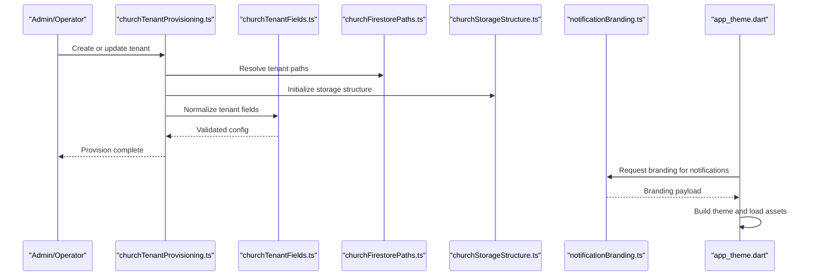
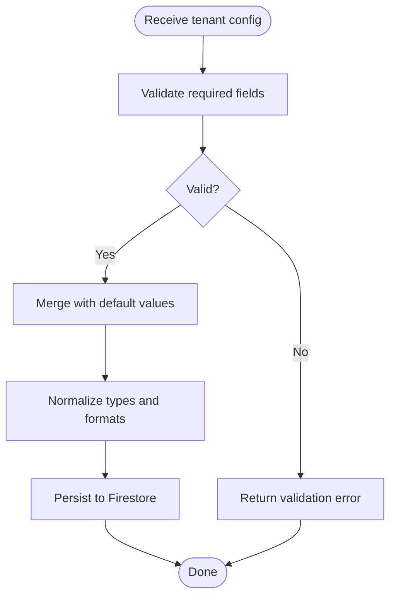
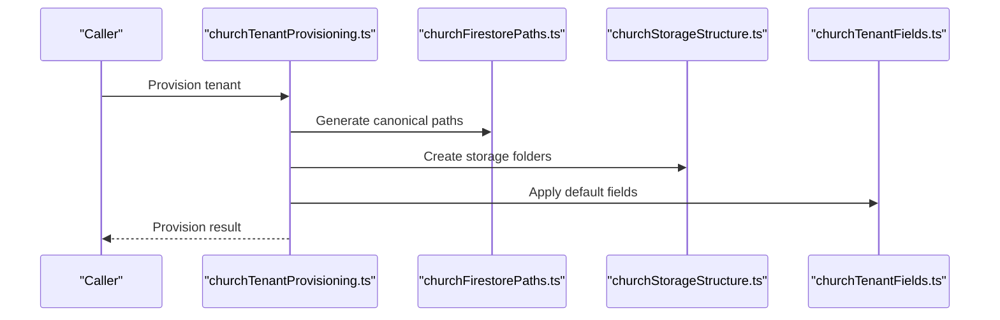
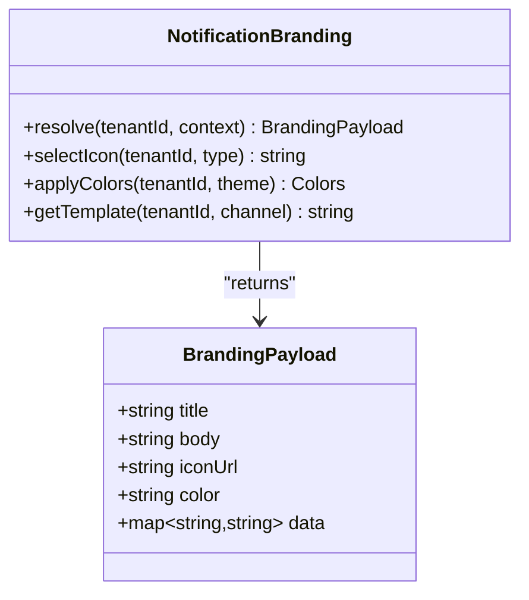
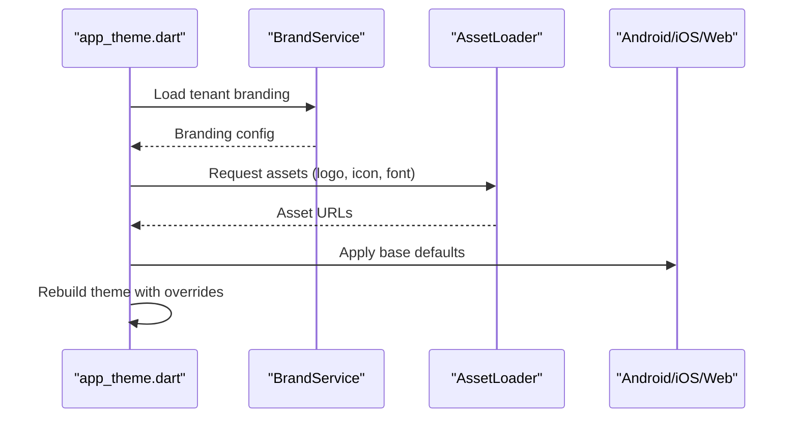
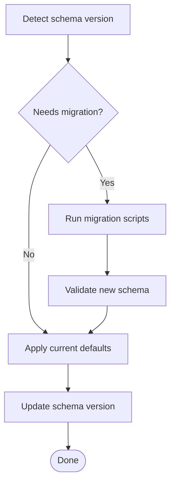
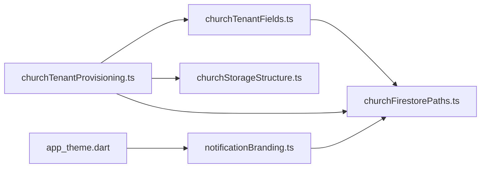

# Tenant Configuration & Branding

<cite>
**Referenced Files in This Document**
- [functions/src/churchTenantFields.ts](file://functions/src/churchTenantFields.ts)
- [functions/src/churchTenantProvisioning.ts](file://functions/src/churchTenantProvisioning.ts)
- [functions/src/notificationBranding.ts](file://functions/src/notificationBranding.ts)
- [functions/lib/churchTenantFields.js](file://functions/lib/churchTenantFields.js)
- [functions/lib/churchTenantProvisioning.js](file://functions/lib/churchTenantProvisioning.js)
- [functions/lib/notificationBranding.js](file://functions/lib/notificationBranding.js)
- [flutter_app/lib/app_theme.dart](file://flutter_app/lib/app_theme.dart)
- [flutter_app/test/church_brand_service_test.dart](file://flutter_app/test/church_brand_service_test.dart)
- [flutter_app/web/manifest.json](file://flutter_app/web/manifest.json)
- [flutter_app/android/app/src/main/res/values/colors.xml](file://flutter_app/android/app/src/main/res/values/colors.xml)
- [flutter_app/ios/Runner/Info.plist](file://flutter_app/ios/Runner/Info.plist)
- [functions/src/churchFirestorePaths.ts](file://functions/src/churchFirestorePaths.ts)
- [functions/src/churchStorageStructure.ts](file://functions/src/churchStorageStructure.ts)
- [functions/src/tenantCallableResolve.ts](file://functions/src/tenantCallableResolve.ts)
</cite>

## Table of Contents
1. Introduction
2. Project Structure
3. Core Components
4. Architecture Overview
5. Detailed Component Analysis
6. Dependency Analysis
7. Performance Considerations
8. Troubleshooting Guide
9. Conclusion

## Introduction
This document explains how tenant-specific configuration and branding are implemented across the system. It covers the tenant configuration schema (church settings, feature flags, customization options), the branding system for colors, logos, fonts, and visual elements, theme management, dynamic asset loading, runtime updates, notification branding, email templates, and platform-specific customizations. It also documents validation, default inheritance, and migration strategies to ensure consistent behavior across platforms and over time.

## Project Structure
The tenant configuration and branding capabilities span server-side functions, Flutter app themes, and platform assets:
- Server-side: Cloud Functions implement provisioning, field normalization, and notification branding resolution.
- Client-side: Flutter app loads theme and brand assets at runtime and applies them across UI layers.
- Platform assets: Android and iOS configurations provide base defaults that can be overridden by runtime tenant values.

**Diagram sources**
- [functions/src/churchTenantFields.ts](file://functions/src/churchTenantFields.ts)
- [functions/src/churchTenantProvisioning.ts](file://functions/src/churchTenantProvisioning.ts)
- [functions/src/notificationBranding.ts](file://functions/src/notificationBranding.ts)
- [functions/src/churchFirestorePaths.ts](file://functions/src/churchFirestorePaths.ts)
- [functions/src/churchStorageStructure.ts](file://functions/src/churchStorageStructure.ts)
- [functions/src/tenantCallableResolve.ts](file://functions/src/tenantCallableResolve.ts)
- [flutter_app/lib/app_theme.dart](file://flutter_app/lib/app_theme.dart)
- [flutter_app/test/church_brand_service_test.dart](file://flutter_app/test/church_brand_service_test.dart)
- [flutter_app/android/app/src/main/res/values/colors.xml](file://flutter_app/android/app/src/main/res/values/colors.xml)
- [flutter_app/ios/Runner/Info.plist](file://flutter_app/ios/Runner/Info.plist)
- [flutter_app/web/manifest.json](file://flutter_app/web/manifest.json)

**Section sources**
- [functions/src/churchTenantFields.ts](file://functions/src/churchTenantFields.ts)
- [functions/src/churchTenantProvisioning.ts](file://functions/src/churchTenantProvisioning.ts)
- [functions/src/notificationBranding.ts](file://functions/src/notificationBranding.ts)
- [flutter_app/lib/app_theme.dart](file://flutter_app/lib/app_theme.dart)
- [flutter_app/test/church_brand_service_test.dart](file://flutter_app/test/church_brand_service_test.dart)
- [flutter_app/android/app/src/main/res/values/colors.xml](file://flutter_app/android/app/src/main/res/values/colors.xml)
- [flutter_app/ios/Runner/Info.plist](file://flutter_app/ios/Runner/Info.plist)
- [flutter_app/web/manifest.json](file://flutter_app/web/manifest.json)

## Core Components
- Tenant Field Normalization: Ensures consistent schema for church settings, feature flags, and customization options across tenants.
- Tenant Provisioning: Initializes new tenants with default configuration and branding assets.
- Notification Branding: Resolves per-tenant branding for push notifications and emails.
- Theme Management: Centralized theme model used by Flutter to render tenant-specific visuals.
- Dynamic Asset Loading: Loads tenant-specific images, fonts, and icons at runtime.
- Platform Customization: Applies base defaults from Android/iOS/Web and overrides via runtime tenant config.

**Section sources**
- [functions/src/churchTenantFields.ts](file://functions/src/churchTenantFields.ts)
- [functions/src/churchTenantProvisioning.ts](file://functions/src/churchTenantProvisioning.ts)
- [functions/src/notificationBranding.ts](file://functions/src/notificationBranding.ts)
- [flutter_app/lib/app_theme.dart](file://flutter_app/lib/app_theme.dart)

## Architecture Overview
The architecture separates concerns between data normalization, provisioning, branding resolution, and client rendering:
- Firestore stores tenant configuration and branding metadata.
- Cloud Functions normalize fields, provision tenants, and resolve branding for notifications.
- Flutter app consumes normalized configuration to build themes and load assets dynamically.
- Platform assets provide fallbacks when tenant overrides are absent.

**Diagram sources**
- [functions/src/churchTenantProvisioning.ts](file://functions/src/churchTenantProvisioning.ts)
- [functions/src/churchTenantFields.ts](file://functions/src/churchTenantFields.ts)
- [functions/src/churchFirestorePaths.ts](file://functions/src/churchFirestorePaths.ts)
- [functions/src/churchStorageStructure.ts](file://functions/src/churchStorageStructure.ts)
- [functions/src/notificationBranding.ts](file://functions/src/notificationBranding.ts)
- [flutter_app/lib/app_theme.dart](file://flutter_app/lib/app_theme.dart)

## Detailed Component Analysis

### Tenant Configuration Schema
- Church Settings: Includes identifiers, contact info, operational preferences, and regional settings.
- Feature Flags: Boolean toggles enabling/disabling features per tenant.
- Customization Options: Branding tokens such as primary color, logo URL, font family, and accent palette.
- Validation: Required fields enforced; optional fields have safe defaults.
- Inheritance: Defaults applied if tenant-specific values are missing.

**Diagram sources**
- [functions/src/churchTenantFields.ts](file://functions/src/churchTenantFields.ts)

**Section sources**
- [functions/src/churchTenantFields.ts](file://functions/src/churchTenantFields.ts)

### Tenant Provisioning
- Initialization: Creates tenant record, sets up Firestore paths, and initializes storage buckets/folders.
- Seed Data: Populates default feature flags and branding placeholders.
- Idempotency: Supports re-provisioning without duplicating resources.

**Diagram sources**
- [functions/src/churchTenantProvisioning.ts](file://functions/src/churchTenantProvisioning.ts)
- [functions/src/churchFirestorePaths.ts](file://functions/src/churchFirestorePaths.ts)
- [functions/src/churchStorageStructure.ts](file://functions/src/churchStorageStructure.ts)
- [functions/src/churchTenantFields.ts](file://functions/src/churchTenantFields.ts)

**Section sources**
- [functions/src/churchTenantProvisioning.ts](file://functions/src/churchTenantProvisioning.ts)

### Notification Branding
- Resolution: Determines branding payload based on tenant ID and message context.
- Assets: Selects appropriate icon, color, and title for push/email.
- Templates: Supports per-tenant email template selection and variable substitution.

**Diagram sources**
- [functions/src/notificationBranding.ts](file://functions/src/notificationBranding.ts)

**Section sources**
- [functions/src/notificationBranding.ts](file://functions/src/notificationBranding.ts)

### Theme Management and Dynamic Asset Loading
- Theme Model: Centralized theme object containing colors, typography, and component styles.
- Runtime Updates: Fetches tenant branding and rebuilds theme without restart.
- Asset Loading: Loads logos, icons, and fonts from tenant-specific storage or CDN.
- Platform Overrides: Android colors.xml, iOS Info.plist, and Web manifest.json provide base defaults.

**Diagram sources**
- [flutter_app/lib/app_theme.dart](file://flutter_app/lib/app_theme.dart)
- [flutter_app/test/church_brand_service_test.dart](file://flutter_app/test/church_brand_service_test.dart)
- [flutter_app/android/app/src/main/res/values/colors.xml](file://flutter_app/android/app/src/main/res/values/colors.xml)
- [flutter_app/ios/Runner/Info.plist](file://flutter_app/ios/Runner/Info.plist)
- [flutter_app/web/manifest.json](file://flutter_app/web/manifest.json)

**Section sources**
- [flutter_app/lib/app_theme.dart](file://flutter_app/lib/app_theme.dart)
- [flutter_app/test/church_brand_service_test.dart](file://flutter_app/test/church_brand_service_test.dart)
- [flutter_app/android/app/src/main/res/values/colors.xml](file://flutter_app/android/app/src/main/res/values/colors.xml)
- [flutter_app/ios/Runner/Info.plist](file://flutter_app/ios/Runner/Info.plist)
- [flutter_app/web/manifest.json](file://flutter_app/web/manifest.json)

### Configuration Migration Strategies
- Backfill: Ensure legacy fields are migrated to canonical schema.
- Versioning: Track schema versions to apply incremental migrations.
- Rollback: Maintain backward compatibility during transitions.

[No diagram sources needed since this is a conceptual workflow]

**Section sources**
- [functions/src/churchTenantFields.ts](file://functions/src/churchTenantFields.ts)

### Platform-Specific Customizations
- Android: Base colors and icons defined in resources; runtime overrides applied via theme.
- iOS: App metadata and icons set in Info.plist; runtime branding updates supported.
- Web: Manifest defines site-wide branding; runtime updates adjust meta tags and assets.

**Section sources**
- [flutter_app/android/app/src/main/res/values/colors.xml](file://flutter_app/android/app/src/main/res/values/colors.xml)
- [flutter_app/ios/Runner/Info.plist](file://flutter_app/ios/Runner/Info.plist)
- [flutter_app/web/manifest.json](file://flutter_app/web/manifest.json)

## Dependency Analysis
Key dependencies and relationships:
- churchTenantFields depends on churchFirestorePaths for canonical keys.
- churchTenantProvisioning orchestrates storage structure and field normalization.
- notificationBranding resolves branding payloads using tenant context.
- app_theme.dart consumes branding services and platform defaults.

**Diagram sources**
- [functions/src/churchTenantFields.ts](file://functions/src/churchTenantFields.ts)
- [functions/src/churchTenantProvisioning.ts](file://functions/src/churchTenantProvisioning.ts)
- [functions/src/churchFirestorePaths.ts](file://functions/src/churchFirestorePaths.ts)
- [functions/src/churchStorageStructure.ts](file://functions/src/churchStorageStructure.ts)
- [functions/src/notificationBranding.ts](file://functions/src/notificationBranding.ts)
- [flutter_app/lib/app_theme.dart](file://flutter_app/lib/app_theme.dart)

**Section sources**
- [functions/src/churchTenantFields.ts](file://functions/src/churchTenantFields.ts)
- [functions/src/churchTenantProvisioning.ts](file://functions/src/churchTenantProvisioning.ts)
- [functions/src/churchFirestorePaths.ts](file://functions/src/churchFirestorePaths.ts)
- [functions/src/churchStorageStructure.ts](file://functions/src/churchStorageStructure.ts)
- [functions/src/notificationBranding.ts](file://functions/src/notificationBranding.ts)
- [flutter_app/lib/app_theme.dart](file://flutter_app/lib/app_theme.dart)

## Performance Considerations
- Cache tenant branding at app startup to minimize network calls.
- Use lazy loading for large assets like fonts and high-resolution logos.
- Batch field normalization operations during provisioning to reduce Firestore writes.
- Prefer CDN-hosted assets for faster global delivery.

[No sources needed since this section provides general guidance]

## Troubleshooting Guide
Common issues and resolutions:
- Missing tenant fields: Verify provisioning completed and defaults were applied.
- Invalid branding assets: Check asset URLs and permissions in storage.
- Theme not updating: Ensure runtime reload triggers theme rebuild.
- Platform overrides ignored: Confirm runtime values take precedence over static defaults.

**Section sources**
- [functions/src/churchTenantFields.ts](file://functions/src/churchTenantFields.ts)
- [functions/src/churchTenantProvisioning.ts](file://functions/src/churchTenantProvisioning.ts)
- [functions/src/notificationBranding.ts](file://functions/src/notificationBranding.ts)
- [flutter_app/lib/app_theme.dart](file://flutter_app/lib/app_theme.dart)

## Conclusion
The tenant configuration and branding system provides a robust foundation for multi-tenant customization. By separating schema normalization, provisioning, branding resolution, and client-side theme management, the system ensures consistency, scalability, and flexibility. Proper validation, default inheritance, and migration strategies enable smooth evolution of tenant configurations across platforms.

[No sources needed since this section summarizes without analyzing specific files]