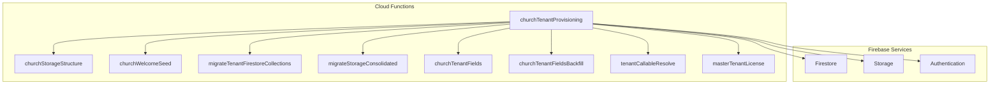
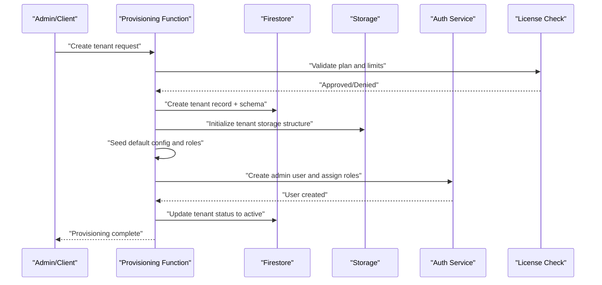
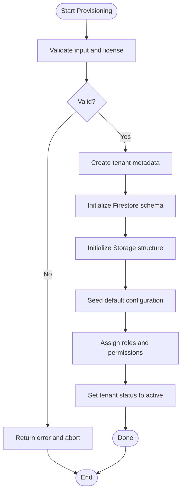
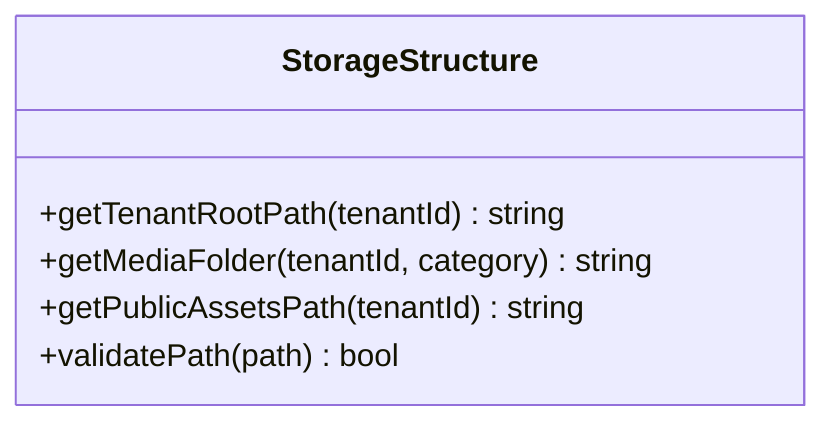
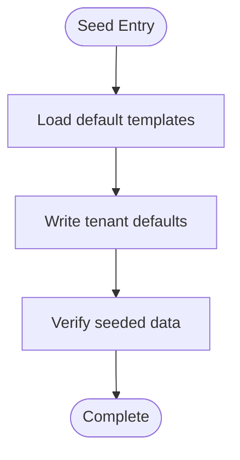
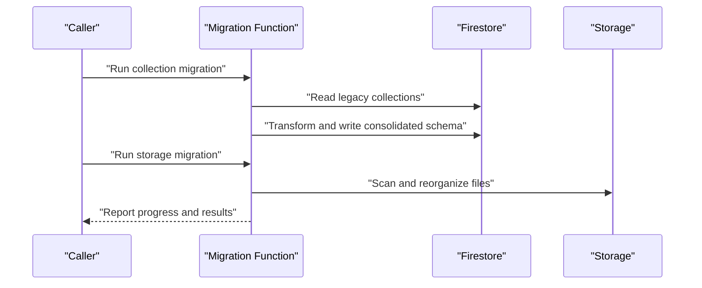
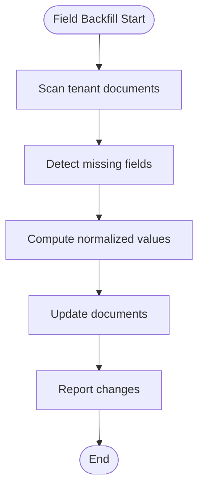
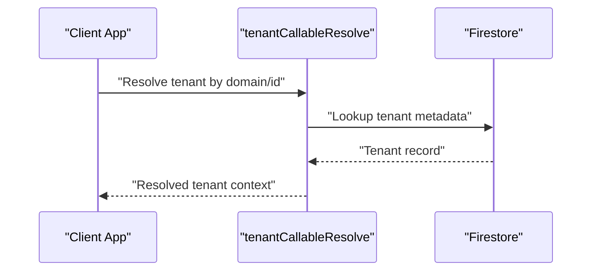
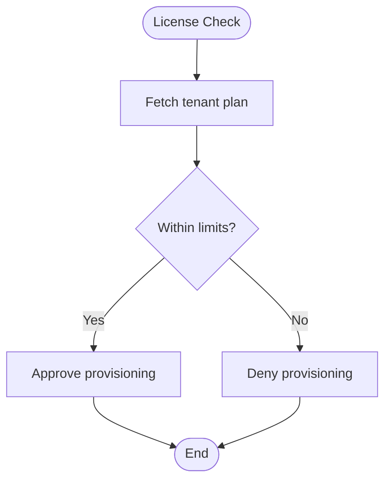
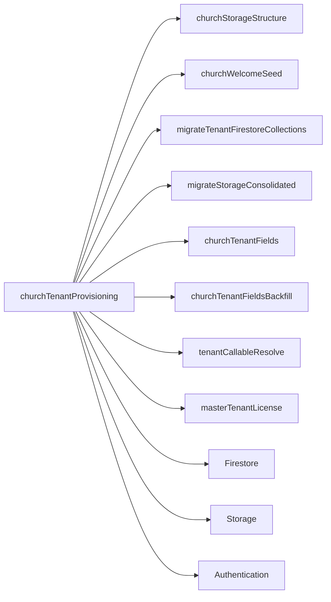

# Tenant Provisioning & Lifecycle

<cite>
**Referenced Files in This Document**
- [functions/src/churchTenantProvisioning.ts](file://functions/src/churchTenantProvisioning.ts)
- [functions/lib/churchTenantProvisioning.js](file://functions/lib/churchTenantProvisioning.js)
- [functions/src/churchTenantConsolidation.ts](file://functions/src/churchTenantConsolidation.ts)
- [functions/lib/churchTenantConsolidation.js](file://functions/lib/churchTenantConsolidation.js)
- [functions/src/churchStorageStructure.ts](file://functions/src/churchStorageStructure.ts)
- [functions/lib/churchStorageStructure.js](file://functions/lib/churchStorageStructure.js)
- [functions/src/churchWelcomeSeed.ts](file://functions/src/churchWelcomeSeed.ts)
- [functions/lib/churchWelcomeSeed.js](file://functions/lib/churchWelcomeSeed.js)
- [functions/src/migrateTenantFirestoreCollections.ts](file://functions/src/migrateTenantFirestoreCollections.ts)
- [functions/lib/migrateTenantFirestoreCollections.js](file://functions/lib/migrateTenantFirestoreCollections.js)
- [functions/src/migrateStorageConsolidated.ts](file://functions/src/migrateStorageConsolidated.ts)
- [functions/lib/migrateStorageConsolidated.js](file://functions/lib/migrateStorageConsolidated.js)
- [functions/src/churchTenantFields.ts](file://functions/src/churchTenantFields.ts)
- [functions/lib/churchTenantFields.js](file://functions/lib/churchTenantFields.js)
- [functions/src/churchTenantFieldsBackfill.ts](file://functions/src/churchTenantFieldsBackfill.ts)
- [functions/lib/churchTenantFieldsBackfill.js](file://functions/lib/churchTenantFieldsBackfill.js)
- [functions/src/tenantCallableResolve.ts](file://functions/src/tenantCallableResolve.ts)
- [functions/lib/tenantCallableResolve.js](file://functions/lib/tenantCallableResolve.js)
- [functions/src/masterTenantLicense.ts](file://functions/src/masterTenantLicense.ts)
- [functions/lib/masterTenantLicense.js](file://functions/lib/masterTenantLicense.js)
- [functions/src/index.ts](file://functions/src/index.ts)
- [functions/lib/index.js](file://functions/lib/index.js)
- [firestore.rules](file://firestore.rules)
- [storage.rules](file://storage.rules)
- [firebase.json](file://firebase.json)
</cite>

## Table of Contents
1. [Introduction](#introduction)
2. [Project Structure](#project-structure)
3. [Core Components](#core-components)
4. [Architecture Overview](#architecture-overview)
5. [Detailed Component Analysis](#detailed-component-analysis)
6. [Dependency Analysis](#dependency-analysis)
7. [Performance Considerations](#performance-considerations)
8. [Troubleshooting Guide](#troubleshooting-guide)
9. [Conclusion](#conclusion)
10. [Appendices](#appendices)

## Introduction
This document explains how the multi-tenant system provisions and manages church tenants end-to-end. It covers tenant creation from registration to deployment, database schema initialization, storage setup, configuration seeding, permission assignment, consolidation and migration strategies, data transformation during provisioning, programmatic and automated workflows, manual setup procedures, status management, deactivation, deletion with cleanup, error handling, rollback mechanisms, and monitoring.

## Project Structure
The tenant lifecycle is implemented primarily as Cloud Functions (TypeScript compiled to JavaScript), with Firestore and Storage rules enforcing security. Key areas:
- Provisioning orchestration and state transitions
- Storage structure utilities for tenant isolation
- Welcome seed for initial tenant configuration
- Migration helpers for Firestore collections and storage paths
- Field backfills and canonical field normalization
- Tenant resolution callable for runtime lookup
- License and master tenant utilities

**Diagram sources**
- [functions/src/churchTenantProvisioning.ts](file://functions/src/churchTenantProvisioning.ts)
- [functions/src/churchStorageStructure.ts](file://functions/src/churchStorageStructure.ts)
- [functions/src/churchWelcomeSeed.ts](file://functions/src/churchWelcomeSeed.ts)
- [functions/src/migrateTenantFirestoreCollections.ts](file://functions/src/migrateTenantFirestoreCollections.ts)
- [functions/src/migrateStorageConsolidated.ts](file://functions/src/migrateStorageConsolidated.ts)
- [functions/src/churchTenantFields.ts](file://functions/src/churchTenantFields.ts)
- [functions/src/churchTenantFieldsBackfill.ts](file://functions/src/churchTenantFieldsBackfill.ts)
- [functions/src/tenantCallableResolve.ts](file://functions/src/tenantCallableResolve.ts)
- [functions/src/masterTenantLicense.ts](file://functions/src/masterTenantLicense.ts)

**Section sources**
- [functions/src/index.ts](file://functions/src/index.ts)
- [functions/lib/index.js](file://functions/lib/index.js)
- [firebase.json](file://firebase.json)

## Core Components
- Provisioning Orchestrator: Creates tenant records, initializes Firestore schema, sets up Storage structure, seeds default configuration, assigns permissions, and updates lifecycle status.
- Storage Structure Utility: Provides canonical paths and folder layout per tenant to ensure isolation and consistent media organization.
- Welcome Seed: Populates initial tenant data such as default roles, settings, and onboarding content.
- Migration Helpers: Migrate legacy collections and storage layouts into consolidated structures; transform data during provisioning.
- Field Normalization and Backfill: Ensures canonical fields exist and are consistent across tenants.
- Tenant Resolution Callable: Resolves tenant context at runtime for clients and services.
- Master Tenant License: Validates and enforces licensing constraints for tenant activation.

**Section sources**
- [functions/src/churchTenantProvisioning.ts](file://functions/src/churchTenantProvisioning.ts)
- [functions/lib/churchTenantProvisioning.js](file://functions/lib/churchTenantProvisioning.js)
- [functions/src/churchStorageStructure.ts](file://functions/src/churchStorageStructure.ts)
- [functions/lib/churchStorageStructure.js](file://functions/lib/churchStorageStructure.js)
- [functions/src/churchWelcomeSeed.ts](file://functions/src/churchWelcomeSeed.ts)
- [functions/lib/churchWelcomeSeed.js](file://functions/lib/churchWelcomeSeed.js)
- [functions/src/migrateTenantFirestoreCollections.ts](file://functions/src/migrateTenantFirestoreCollections.ts)
- [functions/lib/migrateTenantFirestoreCollections.js](file://functions/lib/migrateTenantFirestoreCollections.js)
- [functions/src/migrateStorageConsolidated.ts](file://functions/src/migrateStorageConsolidated.ts)
- [functions/lib/migrateStorageConsolidated.js](file://functions/lib/migrateStorageConsolidated.js)
- [functions/src/churchTenantFields.ts](file://functions/src/churchTenantFields.ts)
- [functions/lib/churchTenantFields.js](file://functions/lib/churchTenantFields.js)
- [functions/src/churchTenantFieldsBackfill.ts](file://functions/src/churchTenantFieldsBackfill.ts)
- [functions/lib/churchTenantFieldsBackfill.js](file://functions/lib/churchTenantFieldsBackfill.js)
- [functions/src/tenantCallableResolve.ts](file://functions/src/tenantCallableResolve.ts)
- [functions/lib/tenantCallableResolve.js](file://functions/lib/tenantCallableResolve.js)
- [functions/src/masterTenantLicense.ts](file://functions/src/masterTenantLicense.ts)
- [functions/lib/masterTenantLicense.js](file://functions/lib/masterTenantLicense.js)

## Architecture Overview
The provisioning workflow is event-driven via Cloud Functions. A typical flow:
- Triggered by a registration or admin action
- Orchestrates Firestore writes for tenant metadata and schema
- Initializes Storage folders and policies
- Seeds default configuration and roles
- Assigns permissions based on license and policy
- Updates tenant status through lifecycle states
- Emits audit logs and metrics for observability

**Diagram sources**
- [functions/src/churchTenantProvisioning.ts](file://functions/src/churchTenantProvisioning.ts)
- [functions/src/churchStorageStructure.ts](file://functions/src/churchStorageStructure.ts)
- [functions/src/churchWelcomeSeed.ts](file://functions/src/churchWelcomeSeed.ts)
- [functions/src/masterTenantLicense.ts](file://functions/src/masterTenantLicense.ts)

## Detailed Component Analysis

### Provisioning Orchestrator
Responsibilities:
- Validate inputs and license constraints
- Create tenant metadata and initialize Firestore schema
- Initialize Storage structure for tenant isolation
- Seed default configuration and roles
- Assign permissions and create initial users
- Manage lifecycle status transitions
- Handle errors and rollbacks

**Diagram sources**
- [functions/src/churchTenantProvisioning.ts](file://functions/src/churchTenantProvisioning.ts)
- [functions/lib/churchTenantProvisioning.js](file://functions/lib/churchTenantProvisioning.js)

**Section sources**
- [functions/src/churchTenantProvisioning.ts](file://functions/src/churchTenantProvisioning.ts)
- [functions/lib/churchTenantProvisioning.js](file://functions/lib/churchTenantProvisioning.js)

### Storage Structure Utility
Responsibilities:
- Provide canonical path templates for tenant storage
- Ensure consistent folder hierarchy across tenants
- Support media categorization and access control alignment

**Diagram sources**
- [functions/src/churchStorageStructure.ts](file://functions/src/churchStorageStructure.ts)
- [functions/lib/churchStorageStructure.js](file://functions/lib/churchStorageStructure.js)

**Section sources**
- [functions/src/churchStorageStructure.ts](file://functions/src/churchStorageStructure.ts)
- [functions/lib/churchStorageStructure.js](file://functions/lib/churchStorageStructure.js)

### Welcome Seed
Responsibilities:
- Populate initial tenant configuration
- Create default roles, departments, and onboarding content
- Ensure baseline data consistency across new tenants

**Diagram sources**
- [functions/src/churchWelcomeSeed.ts](file://functions/src/churchWelcomeSeed.ts)
- [functions/lib/churchWelcomeSeed.js](file://functions/lib/churchWelcomeSeed.js)

**Section sources**
- [functions/src/churchWelcomeSeed.ts](file://functions/src/churchWelcomeSeed.ts)
- [functions/lib/churchWelcomeSeed.js](file://functions/lib/churchWelcomeSeed.js)

### Migration Helpers
Responsibilities:
- Migrate legacy Firestore collections to consolidated schemas
- Transform storage paths to consolidated layout
- Ensure backward compatibility during tenant upgrades

**Diagram sources**
- [functions/src/migrateTenantFirestoreCollections.ts](file://functions/src/migrateTenantFirestoreCollections.ts)
- [functions/lib/migrateTenantFirestoreCollections.js](file://functions/lib/migrateTenantFirestoreCollections.js)
- [functions/src/migrateStorageConsolidated.ts](file://functions/src/migrateStorageConsolidated.ts)
- [functions/lib/migrateStorageConsolidated.js](file://functions/lib/migrateStorageConsolidated.js)

**Section sources**
- [functions/src/migrateTenantFirestoreCollections.ts](file://functions/src/migrateTenantFirestoreCollections.ts)
- [functions/lib/migrateTenantFirestoreCollections.js](file://functions/lib/migrateTenantFirestoreCollections.js)
- [functions/src/migrateStorageConsolidated.ts](file://functions/src/migrateStorageConsolidated.ts)
- [functions/lib/migrateStorageConsolidated.js](file://functions/lib/migrateStorageConsolidated.js)

### Field Normalization and Backfill
Responsibilities:
- Normalize canonical tenant fields
- Backfill missing fields across existing tenants
- Maintain schema consistency after updates

**Diagram sources**
- [functions/src/churchTenantFields.ts](file://functions/src/churchTenantFields.ts)
- [functions/lib/churchTenantFields.js](file://functions/lib/churchTenantFields.js)
- [functions/src/churchTenantFieldsBackfill.ts](file://functions/src/churchTenantFieldsBackfill.ts)
- [functions/lib/churchTenantFieldsBackfill.js](file://functions/lib/churchTenantFieldsBackfill.js)

**Section sources**
- [functions/src/churchTenantFields.ts](file://functions/src/churchTenantFields.ts)
- [functions/lib/churchTenantFields.js](file://functions/lib/churchTenantFields.js)
- [functions/src/churchTenantFieldsBackfill.ts](file://functions/src/churchTenantFieldsBackfill.ts)
- [functions/lib/churchTenantFieldsBackfill.js](file://functions/lib/churchTenantFieldsBackfill.js)

### Tenant Resolution Callable
Responsibilities:
- Resolve tenant context at runtime
- Return canonical identifiers and routing info
- Support client-side tenant selection and API calls

**Diagram sources**
- [functions/src/tenantCallableResolve.ts](file://functions/src/tenantCallableResolve.ts)
- [functions/lib/tenantCallableResolve.js](file://functions/lib/tenantCallableResolve.js)

**Section sources**
- [functions/src/tenantCallableResolve.ts](file://functions/src/tenantCallableResolve.ts)
- [functions/lib/tenantCallableResolve.js](file://functions/lib/tenantCallableResolve.js)

### Master Tenant License
Responsibilities:
- Validate tenant plan and feature flags
- Enforce limits and compliance checks
- Influence provisioning outcomes and permissions

**Diagram sources**
- [functions/src/masterTenantLicense.ts](file://functions/src/masterTenantLicense.ts)
- [functions/lib/masterTenantLicense.js](file://functions/lib/masterTenantLicense.js)

**Section sources**
- [functions/src/masterTenantLicense.ts](file://functions/src/masterTenantLicense.ts)
- [functions/lib/masterTenantLicense.js](file://functions/lib/masterTenantLicense.js)

## Dependency Analysis
Key dependencies and relationships:
- Provisioning orchestrator depends on storage structure, welcome seed, migrations, field normalization, tenant resolution, and license validation.
- Firestore and Storage are primary data stores with strict rules enforced via security rules.
- Authentication service integrates for user creation and role assignment.

**Diagram sources**
- [functions/src/churchTenantProvisioning.ts](file://functions/src/churchTenantProvisioning.ts)
- [functions/src/churchStorageStructure.ts](file://functions/src/churchStorageStructure.ts)
- [functions/src/churchWelcomeSeed.ts](file://functions/src/churchWelcomeSeed.ts)
- [functions/src/migrateTenantFirestoreCollections.ts](file://functions/src/migrateTenantFirestoreCollections.ts)
- [functions/src/migrateStorageConsolidated.ts](file://functions/src/migrateStorageConsolidated.ts)
- [functions/src/churchTenantFields.ts](file://functions/src/churchTenantFields.ts)
- [functions/src/churchTenantFieldsBackfill.ts](file://functions/src/churchTenantFieldsBackfill.ts)
- [functions/src/tenantCallableResolve.ts](file://functions/src/tenantCallableResolve.ts)
- [functions/src/masterTenantLicense.ts](file://functions/src/masterTenantLicense.ts)

**Section sources**
- [functions/src/index.ts](file://functions/src/index.ts)
- [functions/lib/index.js](file://functions/lib/index.js)

## Performance Considerations
- Batch Firestore writes where possible to reduce round-trips and contention.
- Use idempotent operations for retries and safe rollbacks.
- Precompute derived fields during provisioning to minimize runtime lookups.
- Limit Storage operations by batching folder creation and avoiding unnecessary scans.
- Monitor function execution time and cold starts; consider warm-up strategies for critical paths.

[No sources needed since this section provides general guidance]

## Troubleshooting Guide
Common issues and resolutions:
- Provisioning failures due to invalid license: verify plan limits and retry after adjustment.
- Storage initialization errors: check Storage rules and bucket permissions; ensure canonical paths are valid.
- Migration inconsistencies: run backfill functions to normalize fields; inspect audit logs for partial writes.
- Permission denials: review Firestore and Storage rules; confirm role assignments post-provisioning.
- Deactivation and deletion: ensure all dependent resources are cleaned up; validate orphan file removal.

**Section sources**
- [functions/src/churchTenantProvisioning.ts](file://functions/src/churchTenantProvisioning.ts)
- [functions/src/churchStorageStructure.ts](file://functions/src/churchStorageStructure.ts)
- [functions/src/churchWelcomeSeed.ts](file://functions/src/churchWelcomeSeed.ts)
- [functions/src/migrateTenantFirestoreCollections.ts](file://functions/src/migrateTenantFirestoreCollections.ts)
- [functions/src/migrateStorageConsolidated.ts](file://functions/src/migrateStorageConsolidated.ts)
- [functions/src/churchTenantFields.ts](file://functions/src/churchTenantFields.ts)
- [functions/src/churchTenantFieldsBackfill.ts](file://functions/src/churchTenantFieldsBackfill.ts)
- [functions/src/tenantCallableResolve.ts](file://functions/src/tenantCallableResolve.ts)
- [functions/src/masterTenantLicense.ts](file://functions/src/masterTenantLicense.ts)
- [firestore.rules](file://firestore.rules)
- [storage.rules](file://storage.rules)

## Conclusion
The multi-tenant provisioning system provides a robust, modular pipeline for creating and managing church tenants. By separating concerns into dedicated functions for storage structure, seeding, migrations, field normalization, and license validation, it ensures reliability, scalability, and maintainability. Comprehensive error handling, rollback strategies, and monitoring enable safe operations throughout the tenant lifecycle, from creation to deactivation and deletion.

[No sources needed since this section summarizes without analyzing specific files]

## Appendices

### Programmatic Tenant Creation Example
- Call the provisioning function with validated inputs (tenant identifier, plan details, admin user).
- The function will orchestrate Firestore schema initialization, Storage setup, seeding, and permission assignment.
- On success, the tenant status transitions to active; on failure, appropriate errors are returned and partial state is rolled back.

**Section sources**
- [functions/src/churchTenantProvisioning.ts](file://functions/src/churchTenantProvisioning.ts)
- [functions/lib/churchTenantProvisioning.js](file://functions/lib/churchTenantProvisioning.js)

### Automated Provisioning Workflow
- Integrate with an admin dashboard or CI/CD pipeline to trigger provisioning upon registration events.
- Use scheduled jobs to run migrations and backfills periodically.
- Emit audit logs and metrics for observability and alerting.

**Section sources**
- [functions/src/index.ts](file://functions/src/index.ts)
- [functions/lib/index.js](file://functions/lib/index.js)

### Manual Tenant Setup Procedures
- Use provided scripts or CLI tools to initialize tenant data manually when automation is not available.
- Ensure Storage CORS and Firestore rules are applied before starting manual steps.
- Validate tenant resolution and permissions post-setup.

**Section sources**
- [functions/src/churchStorageStructure.ts](file://functions/src/churchStorageStructure.ts)
- [functions/src/churchWelcomeSeed.ts](file://functions/src/churchWelcomeSeed.ts)
- [functions/src/tenantCallableResolve.ts](file://functions/src/tenantCallableResolve.ts)
- [firebase.json](file://firebase.json)
- [firestore.rules](file://firestore.rules)
- [storage.rules](file://storage.rules)

### Tenant Status Management and Lifecycle
- States include pending, active, suspended, and deleted.
- Transitions are enforced by provisioning and administrative actions.
- Deactivation suspends access while preserving data; deletion triggers full cleanup including Storage and Firestore artifacts.

**Section sources**
- [functions/src/churchTenantProvisioning.ts](file://functions/src/churchTenantProvisioning.ts)
- [functions/lib/churchTenantProvisioning.js](file://functions/lib/churchTenantProvisioning.js)

### Error Handling and Rollback Mechanisms
- Idempotent operations prevent duplicate writes and support safe retries.
- Transactional Firestore writes ensure consistency across related documents.
- Storage operations are designed to be reversible where feasible; otherwise, compensating actions clean up partial state.

**Section sources**
- [functions/src/churchTenantProvisioning.ts](file://functions/src/churchTenantProvisioning.ts)
- [functions/lib/churchTenantProvisioning.js](file://functions/lib/churchTenantProvisioning.js)

### Monitoring and Observability
- Log key events in provisioning, migrations, and deletions.
- Track function durations, error rates, and resource usage.
- Alert on anomalies such as failed migrations or inconsistent tenant states.

**Section sources**
- [functions/src/index.ts](file://functions/src/index.ts)
- [functions/lib/index.js](file://functions/lib/index.js)