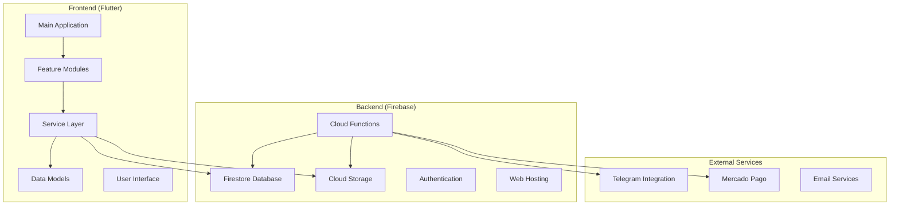
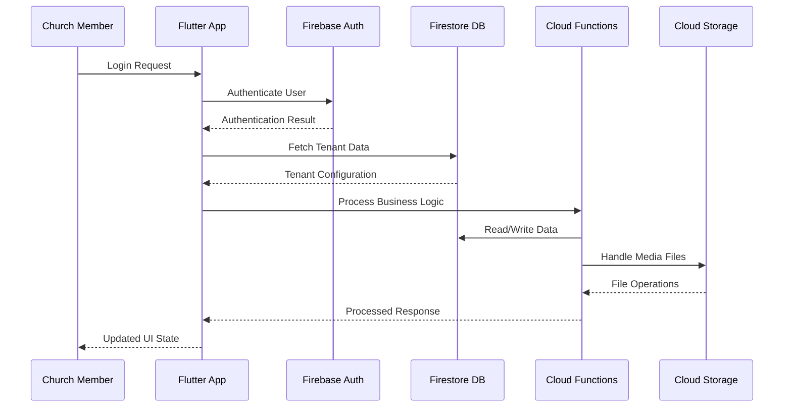
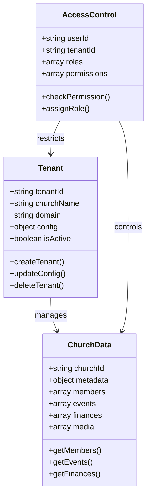
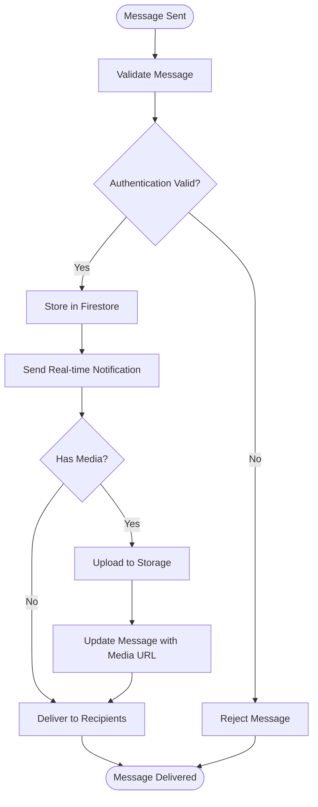
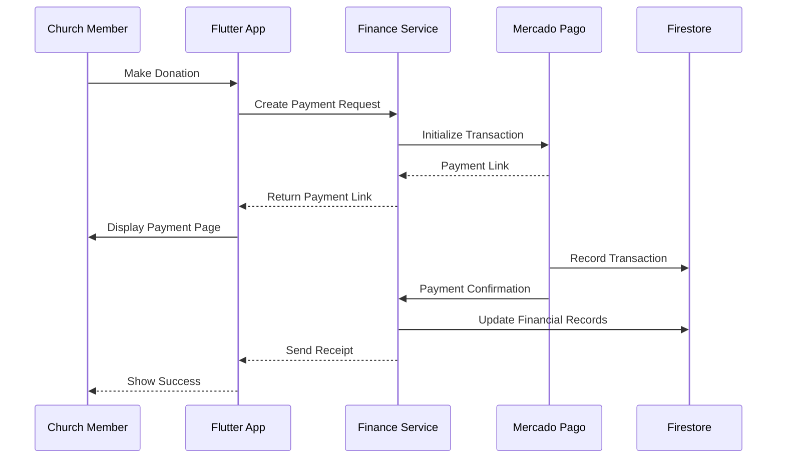
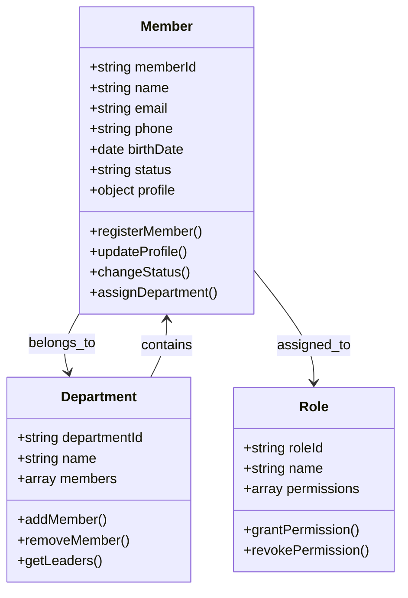
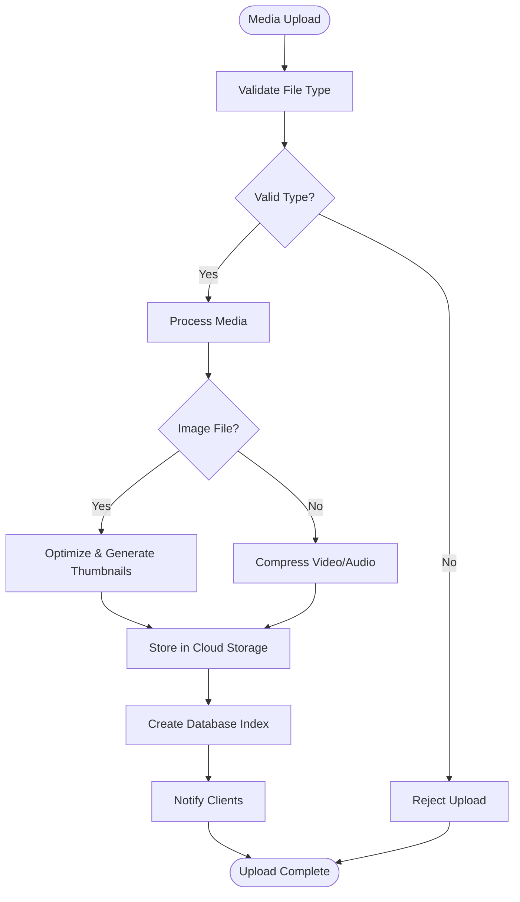
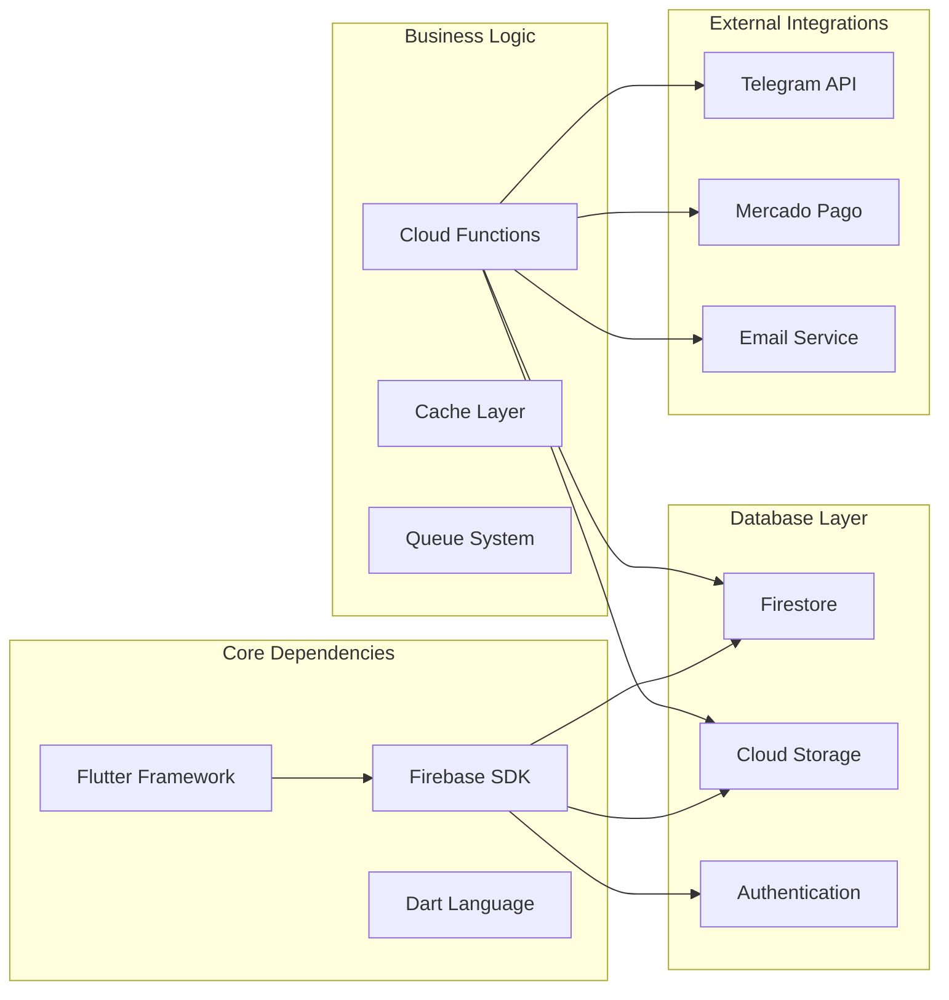

# Project Overview

<cite>
**Referenced Files in This Document**
- [README.md](file://flutter_app/README.md)
- [pubspec.yaml](file://flutter_app/pubspec.yaml)
- [main.dart](file://flutter_app/lib/main.dart)
- [firebase_options.dart](file://flutter_app/lib/firebase_options.dart)
- [firestore.rules](file://firestore.rules)
- [storage.rules](file://storage.rules)
- [functions/index.ts](file://functions/src/index.ts)
- [functions/churchTenantProvisioning.ts](file://functions/src/churchTenantProvisioning.ts)
- [functions/churchChatNotify.ts](file://functions/src/churchChatNotify.ts)
- [functions/financeVencimentoReminders.ts](file://functions/src/financeVencimentoReminders.ts)
- [functions/membersDirectoryCache.ts](file://functions/src/membersDirectoryCache.ts)
- [functions/processChurchStorageMedia.ts](file://functions/src/processChurchStorageMedia.ts)
- [functions/pushNovoConteudo.ts](file://functions/src/pushNovoConteudo.ts)
- [functions/panelFinanceSummary.ts](file://functions/src/panelFinanceSummary.ts)
- [functions/publicSignupEmail.ts](file://functions/src/publicSignupEmail.ts)
- [functions/masterPlatformAuth.ts](file://functions/src/masterPlatformAuth.ts)
- [functions/memberAccessPolicy.ts](file://functions/src/memberAccessPolicy.ts)
- [functions/churchFirestorePaths.ts](file://functions/src/churchFirestorePaths.ts)
- [functions/churchStorageStructure.ts](file://functions/src/churchStorageStructure.ts)
- [functions/tenantCallableResolve.ts](file://functions/src/tenantCallableResolve.ts)
- [functions/cleanupOrphanFiles.ts](file://functions/src/cleanupOrphanFiles.ts)
- [functions/storageDisplayUrls.ts](file://functions/src/storageDisplayUrls.ts)
- [functions/syncChurchClusterData.ts](file://functions/src/syncChurchClusterData.ts)
- [functions/panelMediaPrefetch.ts](file://functions/src/panelMediaPrefetch.ts)
- [functions/publicSiteMediaPrefetch.ts](file://functions/src/publicSiteMediaPrefetch.ts)
- [functions/panelDashboardCache.ts](file://functions/src/panelDashboardCache.ts)
- [functions/panelStatisticsCache.ts](file://functions/src/panelStatisticsCache.ts)
- [functions/panelPublicSiteCache.ts](file://functions/src/panelPublicSiteCache.ts)
- [functions/panelFinanceAccountsCache.ts](file://functions/src/panelFinanceAccountsCache.ts)
- [functions/eventoReminders.ts](file://functions/src/eventoReminders.ts)
- [functions/fornecedorAgendaReminders.ts](file://functions/src/fornecedorAgendaReminders.ts)
- [functions/receitasRecorrentesScheduled.ts](file://functions/src/receitasRecorrentesScheduled.ts)
- [functions/membroSessionSync.ts](file://functions/src/membroSessionSync.ts)
- [functions/memberNotificationEmail.ts](file://functions/src/memberNotificationEmail.ts)
- [functions/memberRegistrationNotify.ts](file://functions/src/memberRegistrationNotify.ts)
- [functions/gyMediaAttachments.ts](file://functions/src/gyMediaAttachments.ts)
- [functions/churchChatAdminPurge.ts](file://functions/src/churchChatAdminPurge.ts)
- [functions/churchChatDmThreadNormalize.ts](file://functions/src/churchChatDmThreadNormalize.ts)
- [functions/churchChatPeerProfileSync.ts](file://functions/src/churchChatPeerProfileSync.ts)
- [functions/churchChatRetention.ts](file://functions/src/churchChatRetention.ts)
- [functions/churchClusterAnchors.ts](file://functions/src/churchClusterAnchors.ts)
- [functions/churchMercadoPago.ts](file://functions/src/churchMercadoPago.ts)
- [functions/churchPdfGeneration.ts](file://functions/src/churchPdfGeneration.ts)
- [functions/churchPerformancePack.ts](file://functions/src/churchPerformancePack.ts)
- [functions/churchRootCountersMirror.ts](file://functions/src/churchRootCountersMirror.ts)
- [functions/churchTenantFields.ts](file://functions/src/churchTenantFields.ts)
- [functions/churchTenantFieldsBackfill.ts](file://functions/src/churchTenantFieldsBackfill.ts)
- [functions/churchWelcomeSeed.ts](file://functions/src/churchWelcomeSeed.ts)
- [functions/cleanseBpcCluster.ts](file://functions/src/consolidateBpcCluster.ts)
- [functions/forbiddenTestChurchIds.ts](file://functions/src/forbiddenTestChurchIds.ts)
- [functions/masterChurchesListCache.ts](file://functions/src/masterChurchesListCache.ts)
- [functions/masterDashboardCache.ts](file://functions/src/masterDashboardCache.ts)
- [functions/masterTenantLicense.ts](file://functions/src/masterTenantLicense.ts)
- [functions/migrateStorageConsolidated.ts](file://functions/src/migrateStorageConsolidated.ts)
- [functions/migrateTenantFirestoreCollections.ts](file://functions/src/migrateTenantFirestoreCollections.ts)
- [functions/notificationBranding.ts](file://functions/src/notificationBranding.ts)
- [functions/pastoralComms.ts](file://functions/src/pastoralComms.ts)
- [functions/processarCertificadosLote.ts](file://functions/src/processarCertificadosLote.ts)
- [functions/publicChurchSlugIndex.ts](file://functions/src/publicChurchSlugIndex.ts)
- [functions/purgeAnonymousAuthUsers.ts](file://functions/src/purgeAnonymousAuthUsers.ts)
- [functions/purgeStalePendingUploads.ts](file://functions/src/purgeStalePendingUploads.ts)
- [functions/reportsSnapshot.ts](file://functions/src/reportsSnapshot.ts)
- [functions/shareEvento.ts](file://functions/src/shareEvento.ts)
- [functions/storageCleanupOnFirestoreDelete.ts](file://functions/src/storageCleanupOnFirestoreDelete.ts)
- [functions/syncChurchMercadoPagoCluster.ts](file://functions/src/syncChurchMercadoPagoCluster.ts)
- [functions/tenantCallableResolve.ts](file://functions/src/tenantCallableResolve.ts)
</cite>

## Table of Contents
1. [Introduction](#introduction)
2. [Project Structure](#project-structure)
3. [Core Components](#core-components)
4. [Architecture Overview](#architecture-overview)
5. [Detailed Component Analysis](#detailed-component-analysis)
6. [Dependency Analysis](#dependency-analysis)
7. [Performance Considerations](#performance-considerations)
8. [Troubleshooting Guide](#troubleshooting-guide)
9. [Conclusion](#conclusion)

## Introduction
Gestão Yahweh Premium is a multi-platform church management system built with Flutter and Firebase, designed to serve both church administrators and members across mobile and web platforms. The application provides a comprehensive suite of tools for church administration, including multi-tenant architecture, real-time chat, financial management, member management, and media handling. With offline-first capabilities and robust cloud integration, the system ensures reliable operation even in low-connectivity environments typical of church communities.

The project's mission is to provide churches with modern, accessible administration tools that streamline operations while maintaining the personal touch essential to religious communities. Built on Flutter's cross-platform framework and Firebase's real-time infrastructure, the application delivers consistent experiences across Android, iOS, and web platforms.

Key features include:
- **Multi-tenant Architecture**: Each church operates as an isolated tenant with dedicated data storage and configuration
- **Real-time Chat System**: Instant messaging capabilities for church communications and community engagement
- **Financial Management**: Comprehensive donation tracking, recurring payments, and financial reporting
- **Member Management**: Complete member lifecycle management with roles, permissions, and directory services
- **Media Handling**: Efficient media upload, processing, and distribution for church content
- **Offline-first Design**: Local caching and synchronization for uninterrupted functionality

## Project Structure
The project follows a modular architecture with clear separation between frontend (Flutter), backend (Firebase Cloud Functions), and platform-specific configurations. The main application code resides in the `flutter_app` directory, while serverless functions are managed in the `functions` directory.

**Diagram sources**
- [main.dart:1-50](file://flutter_app/lib/main.dart#L1-L50)
- [functions/index.ts:1-100](file://functions/src/index.ts#L1-L100)

**Section sources**
- [README.md:1-100](file://flutter_app/README.md#L1-L100)
- [pubspec.yaml:1-200](file://flutter_app/pubspec.yaml#L1-L200)

## Core Components
The Gestão Yahweh Premium system is built around several core components that work together to provide comprehensive church management functionality:

### Multi-Tenant Architecture
Each church operates as an independent tenant with isolated data, configuration, and branding. The system supports multiple churches simultaneously while maintaining complete data segregation and custom branding per tenant.

### Real-time Communication
The integrated chat system enables instant messaging between church members, administrators, and departments. Features include group chats, direct messages, file sharing, and real-time notifications.

### Financial Management Module
Comprehensive financial tracking includes donation management, recurring payments through Mercado Pago integration, expense tracking, and detailed financial reporting with export capabilities.

### Member Management System
Complete member lifecycle management from registration to departure, including role-based access control, department assignments, attendance tracking, and communication preferences.

### Media Management
Efficient handling of images, videos, and documents with automatic optimization, thumbnail generation, and CDN distribution for optimal performance across all platforms.

**Section sources**
- [functions/churchTenantProvisioning.ts:1-150](file://functions/src/churchTenantProvisioning.ts#L1-L150)
- [functions/churchChatNotify.ts:1-100](file://functions/src/churchChatNotify.ts#L1-L100)
- [functions/financeVencimentoReminders.ts:1-80](file://functions/src/financeVencimentoReminders.ts#L1-L80)
- [functions/membersDirectoryCache.ts:1-120](file://functions/src/membersDirectoryCache.ts#L1-L120)
- [functions/processChurchStorageMedia.ts:1-100](file://functions/src/processChurchStorageMedia.ts#L1-L100)

## Architecture Overview
The system follows a modern microservices-inspired architecture using Firebase's serverless computing model. The Flutter frontend communicates with Firebase services through well-defined APIs, while Cloud Functions handle business logic, data processing, and external integrations.

**Diagram sources**
- [main.dart:1-100](file://flutter_app/lib/main.dart#L1-L100)
- [functions/index.ts:1-200](file://functions/src/index.ts#L1-L200)

## Detailed Component Analysis

### Multi-Tenant System
The multi-tenant architecture ensures complete data isolation between different churches while sharing the same application instance. Each tenant has its own database collections, storage buckets, and configuration settings.

**Diagram sources**
- [functions/churchTenantProvisioning.ts:1-200](file://functions/src/churchTenantProvisioning.ts#L1-L200)
- [functions/memberAccessPolicy.ts:1-150](file://functions/src/memberAccessPolicy.ts#L1-L150)

### Real-time Chat System
The chat system provides instant messaging capabilities with support for text messages, file attachments, and real-time synchronization across all connected clients.

**Diagram sources**
- [functions/churchChatNotify.ts:1-150](file://functions/src/churchChatNotify.ts#L1-L150)
- [functions/gyMediaAttachments.ts:1-100](file://functions/src/gyMediaAttachments.ts#L1-L100)

### Financial Management
The financial module handles donations, recurring payments, and financial reporting with integration to Mercado Pago for payment processing.

**Diagram sources**
- [functions/financeVencimentoReminders.ts:1-120](file://functions/src/financeVencimentoReminders.ts#L1-L120)
- [functions/churchMercadoPago.ts:1-200](file://functions/src/churchMercadoPago.ts#L1-L200)
- [functions/panelFinanceSummary.ts:1-150](file://functions/src/panelFinanceSummary.ts#L1-L150)

### Member Management
Comprehensive member management includes registration, profile management, role assignment, and communication preferences.

**Diagram sources**
- [functions/membersDirectoryCache.ts:1-200](file://functions/src/membersDirectoryCache.ts#L1-L200)
- [functions/memberRegistrationNotify.ts:1-100](file://functions/src/memberRegistrationNotify.ts#L1-L100)
- [functions/memberNotificationEmail.ts:1-80](file://functions/src/memberNotificationEmail.ts#L1-L80)

### Media Management System
Efficient media handling with automatic optimization, thumbnail generation, and CDN distribution for optimal performance.

**Diagram sources**
- [functions/processChurchStorageMedia.ts:1-150](file://functions/src/processChurchStorageMedia.ts#L1-L150)
- [functions/storageDisplayUrls.ts:1-100](file://functions/src/storageDisplayUrls.ts#L1-L100)
- [functions/cleanupOrphanFiles.ts:1-80](file://functions/src/cleanupOrphanFiles.ts#L1-L80)

## Dependency Analysis
The system maintains clear dependency relationships between components while ensuring loose coupling through well-defined interfaces and event-driven architecture.

**Diagram sources**
- [pubspec.yaml:1-300](file://flutter_app/pubspec.yaml#L1-L300)
- [functions/package.json:1-100](file://functions/package.json#L1-L100)

**Section sources**
- [functions/churchFirestorePaths.ts:1-100](file://functions/src/churchFirestorePaths.ts#L1-L100)
- [functions/churchStorageStructure.ts:1-100](file://functions/src/churchStorageStructure.ts#L1-L100)

## Performance Considerations
The application implements several performance optimization strategies including offline-first architecture, intelligent caching, lazy loading, and efficient data synchronization patterns.

Key performance features:
- **Offline-first Design**: Local data persistence with background synchronization
- **Intelligent Caching**: Multi-level caching strategy for frequently accessed data
- **Lazy Loading**: On-demand loading of heavy resources and features
- **Efficient Synchronization**: Delta updates and conflict resolution for real-time data
- **Resource Optimization**: Automatic image optimization and compression
- **Memory Management**: Proper resource cleanup and memory optimization

## Troubleshooting Guide
Common issues and their solutions:

### Authentication Issues
- Verify Firebase configuration files are properly deployed
- Check user permissions and role assignments
- Ensure proper tenant context is established

### Data Synchronization Problems
- Monitor Firestore rules for permission errors
- Check network connectivity and retry mechanisms
- Verify data consistency across cached and remote stores

### Media Upload Failures
- Validate file size limits and supported formats
- Check storage bucket permissions and CORS configuration
- Monitor upload progress and implement retry logic

### Performance Issues
- Analyze Firestore query performance and add appropriate indexes
- Monitor Cloud Function execution times and optimize slow operations
- Implement proper pagination and filtering for large datasets

**Section sources**
- [functions/purgeStalePendingUploads.ts:1-80](file://functions/src/purgeStalePendingUploads.ts#L1-L80)
- [functions/storageCleanupOnFirestoreDelete.ts:1-100](file://functions/src/storageCleanupOnFirestoreDelete.ts#L1-L100)

## Conclusion
Gestão Yahweh Premium represents a comprehensive solution for church management, combining modern technology with practical functionality tailored to religious organizations. The multi-platform approach ensures accessibility across devices, while the offline-first design guarantees reliability in various connectivity scenarios.

The system's architecture prioritizes scalability, security, and maintainability, making it suitable for churches of all sizes. With robust features covering administration, communication, finance, and member management, it provides everything needed for effective church operations in the digital age.

Future enhancements will focus on advanced analytics, improved automation, and expanded integration capabilities while maintaining the system's commitment to simplicity and reliability.