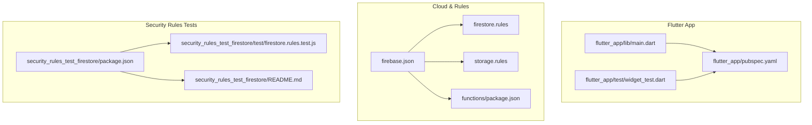
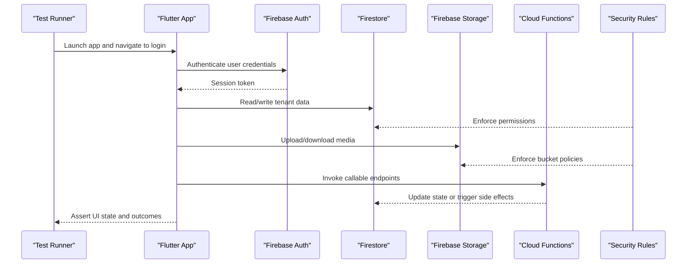
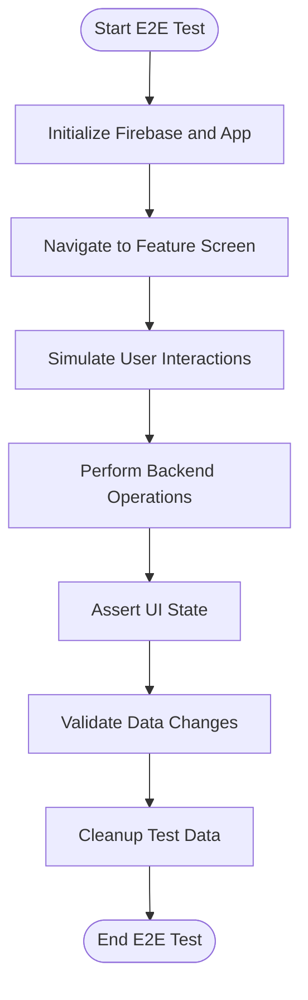
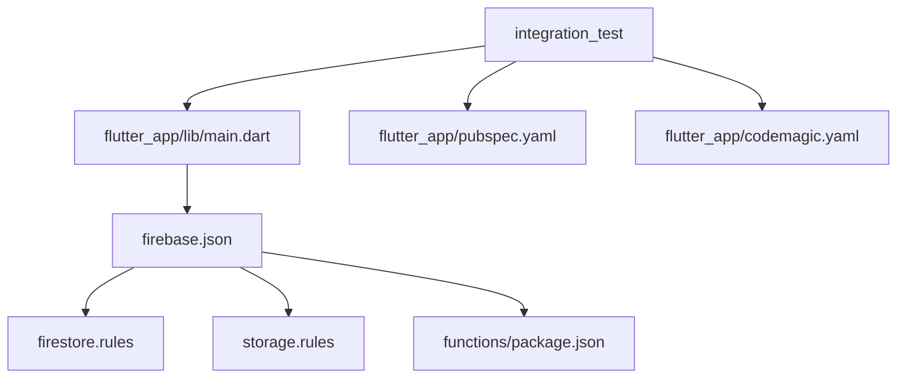

# End-to-End Testing

<cite>
**Referenced Files in This Document**
- [flutter_app/pubspec.yaml](file://flutter_app/pubspec.yaml)
- [flutter_app/lib/main.dart](file://flutter_app/lib/main.dart)
- [flutter_app/test/widget_test.dart](file://flutter_app/test/widget_test.dart)
- [flutter_app/codemagic.yaml](file://flutter_app/codemagic.yaml)
- [functions/package.json](file://functions/package.json)
- [security_rules_test_firestore/package.json](file://security_rules_test_firestore/package.json)
- [security_rules_test_firestore/README.md](file://security_rules_test_firestore/README.md)
- [security_rules_test_firestore/test/firestore.rules.test.js](file://security_rules_test_firestore/test/firestore.rules.test.js)
- [firebase.json](file://firebase.json)
- [firestore.rules](file://firestore.rules)
- [storage.rules](file://storage.rules)
</cite>

## Table of Contents
1. [Introduction](#introduction)
2. [Project Structure](#project-structure)
3. [Core Components](#core-components)
4. [Architecture Overview](#architecture-overview)
5. [Detailed Component Analysis](#detailed-component-analysis)
6. [Dependency Analysis](#dependency-analysis)
7. [Performance Considerations](#performance-considerations)
8. [Troubleshooting Guide](#troubleshooting-guide)
9. [Conclusion](#conclusion)
10. [Appendices](#appendices)

## Introduction
This document provides comprehensive end-to-end (E2E) testing guidance for the Gestão Yahweh Premium Flutter application. It covers strategies using the integration_test package, third-party tools, and best practices for automating user workflows across platforms (Android, iOS, Web). It also explains how to simulate real user interactions, test multi-platform applications, and integrate with Firebase services safely during testing. Examples include login flows, church administration tasks, financial operations, and communication features. The guide addresses environment setup, device emulation, cross-platform considerations, and data isolation strategies when using real Firebase instances.

## Project Structure
The Flutter app resides under flutter_app, with platform-specific directories for Android, iOS, Linux, macOS, Windows, and Web. Tests are located under flutter_app/test. Cloud functions and security rules live at the repository root and in the functions directory. A dedicated folder exists for Firestore security rules tests.

**Diagram sources**
- [flutter_app/lib/main.dart](file://flutter_app/lib/main.dart)
- [flutter_app/test/widget_test.dart](file://flutter_app/test/widget_test.dart)
- [flutter_app/pubspec.yaml](file://flutter_app/pubspec.yaml)
- [firebase.json](file://firebase.json)
- [firestore.rules](file://firestore.rules)
- [storage.rules](file://storage.rules)
- [functions/package.json](file://functions/package.json)
- [security_rules_test_firestore/package.json](file://security_rules_test_firestore/package.json)
- [security_rules_test_firestore/test/firestore.rules.test.js](file://security_rules_test_firestore/test/firestore.rules.test.js)
- [security_rules_test_firestore/README.md](file://security_rules_test_firestore/README.md)

**Section sources**
- [flutter_app/pubspec.yaml](file://flutter_app/pubspec.yaml)
- [flutter_app/lib/main.dart](file://flutter_app/lib/main.dart)
- [flutter_app/test/widget_test.dart](file://flutter_app/test/widget_test.dart)
- [firebase.json](file://firebase.json)
- [firestore.rules](file://firestore.rules)
- [storage.rules](file://storage.rules)
- [functions/package.json](file://functions/package.json)
- [security_rules_test_firestore/package.json](file://security_rules_test_firestore/package.json)
- [security_rules_test_firestore/README.md](file://security_rules_test_firestore/README.md)
- [security_rules_test_firestore/test/firestore.rules.test.js](file://security_rules_test_firestore/test/firestore.rules.test.js)

## Core Components
- Flutter app entry point: Initializes Firebase and app configuration before running the UI.
- Unit and widget tests: Located under flutter_app/test; serve as a foundation for higher-level E2E scenarios.
- Firebase configuration: firebase.json defines hosting, functions, and rules deployment targets.
- Security rules: firestore.rules and storage.rules enforce access control and data validation.
- Cloud Functions: Node-based backend logic under functions/package.json.
- Security rules tests: Dedicated package and scripts to validate Firestore rules behavior.

Key responsibilities:
- Ensure consistent initialization of Firebase across platforms.
- Provide stable test fixtures and isolated environments for E2E runs.
- Validate that UI flows interact correctly with backend services through secure boundaries.

**Section sources**
- [flutter_app/lib/main.dart](file://flutter_app/lib/main.dart)
- [flutter_app/test/widget_test.dart](file://flutter_app/test/widget_test.dart)
- [firebase.json](file://firebase.json)
- [firestore.rules](file://firestore.rules)
- [storage.rules](file://storage.rules)
- [functions/package.json](file://functions/package.json)
- [security_rules_test_firestore/package.json](file://security_rules_test_firestore/package.json)
- [security_rules_test_firestore/README.md](file://security_rules_test_firestore/README.md)

## Architecture Overview
The E2E testing architecture integrates Flutter UI automation with Firebase services and cloud functions. Tests run on emulators or real devices and exercise authentication, database reads/writes, storage operations, and messaging flows. Security rules act as the final gatekeeper for all data operations.

**Diagram sources**
- [flutter_app/lib/main.dart](file://flutter_app/lib/main.dart)
- [firebase.json](file://firebase.json)
- [firestore.rules](file://firestore.rules)
- [storage.rules](file://storage.rules)
- [functions/package.json](file://functions/package.json)

## Detailed Component Analysis

### E2E Strategy Using integration_test
- Use the integration_test package to write UI-level tests that drive the Flutter app like a real user.
- Target multiple platforms by configuring test runners for Android, iOS, and Web.
- Leverage finders and gestures to simulate taps, text input, scrolling, and navigation.
- Integrate with Firebase via the same initialization path used by the app to ensure realistic behavior.

Recommended workflow:
- Create a test file per feature (e.g., login, church admin, finance, communications).
- Seed necessary data via cloud functions or admin SDKs prior to running tests.
- Assert UI elements and backend state changes after each step.

Best practices:
- Keep tests deterministic by isolating tenants and users.
- Use timeouts and retries judiciously for network operations.
- Capture screenshots or logs on failure for debugging.

[No sources needed since this section provides general guidance]

### Automating User Workflows
Common E2E scenarios:
- Login flow: Enter email/password, handle errors, verify dashboard load.
- Church administration: Create/edit members, manage departments, publish announcements.
- Financial operations: Record transactions, reconcile accounts, generate reports.
- Communication features: Send messages, post updates, manage chat threads.

Automation tips:
- Use stable identifiers for UI elements (keys, labels).
- Wrap network calls with explicit waits or polling where necessary.
- Mock external dependencies only when absolutely required; prefer real service interactions for true E2E coverage.

[No sources needed since this section provides general guidance]

### Multi-Platform Testing Considerations
- Android: Configure emulator/device, ensure Google Play Services availability if required.
- iOS: Set up simulator or physical device; handle signing and entitlements for push notifications if tested.
- Web: Run against local dev server or hosted staging; verify CORS and service worker behavior.

Cross-platform pitfalls:
- Platform-specific UI differences require conditional selectors.
- Timeouts may vary due to platform performance; tune accordingly.
- Ensure Firebase configuration matches target platform (GoogleService-Info.plist for iOS, google-services.json for Android).

[No sources needed since this section provides general guidance]

### Simulating Real User Interactions
- Input fields: Type emails, passwords, search queries, and numeric values.
- Navigation: Tap buttons, back navigation, deep links.
- Media: Upload images/videos and assert thumbnails appear.
- Notifications: Trigger and acknowledge push notifications where applicable.

Validation techniques:
- Assert visible text and widget states.
- Verify Firestore documents created/updated.
- Check storage files exist and have correct metadata.

[No sources needed since this section provides general guidance]

### Testing with Real Firebase Instances and Data Isolation
- Use separate Firebase projects or distinct tenants for testing.
- Pre-seed test data via cloud functions or admin scripts.
- Apply strict Firestore and Storage rules to isolate test data from production.
- Purge test data after runs using cleanup functions.

Data isolation strategies:
- Prefix collections and paths with test IDs.
- Use role-based access to restrict test accounts.
- Employ scheduled functions to expire or archive test records.

[No sources needed since this section provides general guidance]

### Third-Party Tools and CI Integration
- Codemagic: Configure builds and test runs for Android/iOS/Web.
- GitHub Actions: Orchestrate Flutter tests and deployments.
- Local emulators: Use Firebase Emulator Suite for fast feedback loops.

CI pipeline highlights:
- Install Flutter and dependencies.
- Start emulators/simulators.
- Run integration tests and collect artifacts.
- Deploy rules/functions as needed for test environments.

**Section sources**
- [flutter_app/codemagic.yaml](file://flutter_app/codemagic.yaml)

### Example Scenarios

#### Login Flow E2E
Steps:
- Launch app and navigate to login screen.
- Enter valid credentials and submit.
- Assert successful navigation to dashboard.
- Handle invalid credentials and error messages.

Validation:
- Verify session token presence.
- Confirm user profile loaded.

[No sources needed since this section provides general guidance]

#### Church Administration Tasks
Steps:
- Create a new member record.
- Assign roles and departments.
- Publish an announcement.

Validation:
- Check Firestore entries for new member and announcement.
- Assert UI reflects updated lists.

[No sources needed since this section provides general guidance]

#### Financial Operations
Steps:
- Record income and expenses.
- Reconcile account balances.
- Generate summary report.

Validation:
- Verify transaction documents and totals.
- Confirm report widgets display correct figures.

[No sources needed since this section provides general guidance]

#### Communication Features
Steps:
- Send a message to a group.
- Post an update to the feed.
- Manage chat threads.

Validation:
- Assert message delivery and thread updates.
- Confirm feed posts appear.

[No sources needed since this section provides general guidance]

### Conceptual Overview

[No sources needed since this diagram shows conceptual workflow, not actual code structure]

## Dependency Analysis
Flutter tests depend on the app’s initialization and Firebase configuration. Security rules govern all data access, while cloud functions provide server-side logic. CI pipelines orchestrate test execution across platforms.

**Diagram sources**
- [flutter_app/lib/main.dart](file://flutter_app/lib/main.dart)
- [flutter_app/pubspec.yaml](file://flutter_app/pubspec.yaml)
- [flutter_app/codemagic.yaml](file://flutter_app/codemagic.yaml)
- [firebase.json](file://firebase.json)
- [firestore.rules](file://firestore.rules)
- [storage.rules](file://storage.rules)
- [functions/package.json](file://functions/package.json)

**Section sources**
- [flutter_app/pubspec.yaml](file://flutter_app/pubspec.yaml)
- [flutter_app/lib/main.dart](file://flutter_app/lib/main.dart)
- [flutter_app/codemagic.yaml](file://flutter_app/codemagic.yaml)
- [firebase.json](file://firebase.json)
- [firestore.rules](file://firestore.rules)
- [storage.rules](file://storage.rules)
- [functions/package.json](file://functions/package.json)

## Performance Considerations
- Minimize network calls in tests by pre-seeding data and using efficient queries.
- Avoid heavy animations or transitions during critical assertions.
- Use targeted selectors to reduce flakiness and improve speed.
- Parallelize independent tests where possible within CI constraints.

[No sources needed since this section provides general guidance]

## Troubleshooting Guide
Common issues and resolutions:
- Authentication failures: Verify credentials and rule permissions; check emulator vs. production configs.
- Network timeouts: Increase timeouts for slow networks; retry transient errors.
- Rule violations: Review firestore.rules and storage.rules for restrictive conditions.
- CI failures: Inspect logs; ensure emulators/simulators are properly configured.

Debugging utilities:
- Enable verbose logging in debug builds.
- Capture screenshots on assertion failures.
- Use Firebase console to inspect data and rule evaluations.

**Section sources**
- [security_rules_test_firestore/README.md](file://security_rules_test_firestore/README.md)
- [security_rules_test_firestore/test/firestore.rules.test.js](file://security_rules_test_firestore/test/firestore.rules.test.js)

## Conclusion
Effective E2E testing for Gestão Yahweh Premium requires a balanced approach combining Flutter UI automation, robust Firebase integration, and strict security rule enforcement. By following the strategies outlined here—data isolation, multi-platform support, and CI integration—you can build reliable tests that validate critical user workflows such as login, church administration, financial operations, and communications. Continuous refinement of selectors, timeouts, and test data management will ensure stability and confidence in releases.

[No sources needed since this section summarizes without analyzing specific files]

## Appendices

### Test Environment Setup Checklist
- Install Flutter SDK and platform toolchains.
- Configure Firebase project and download platform-specific config files.
- Set up emulators/simulators and CI agents.
- Prepare test accounts and seed data via cloud functions or admin scripts.
- Validate security rules locally using the provided test package.

[No sources needed since this section provides general guidance]

### Recommended Test File Organization
- Group tests by feature modules (auth, church, finance, comms).
- Maintain shared helpers for common actions and assertions.
- Keep fixtures and seed scripts alongside relevant tests.

[No sources needed since this section provides general guidance]