# Integration Testing

<cite>
**Referenced Files in This Document**
- [firebase.json](file://firebase.json)
- [firestore.rules](file://firestore.rules)
- [storage.rules](file://storage.rules)
- [functions/src/index.ts](file://functions/src/index.ts)
- [functions/package.json](file://functions/package.json)
- [security_rules_test_firestore/README.md](file://security_rules_test_firestore/README.md)
- [security_rules_test_firestore/test/firestore.rules.test.js](file://security_rules_test_firestore/test/firestore.rules.test.js)
- [flutter_app/pubspec.yaml](file://flutter_app/pubspec.yaml)
- [flutter_app/lib/firebase_options.dart](file://flutter_app/lib/firebase_options.dart)
- [flutter_app/android/app/google-services.json](file://flutter_app/android/app/google-services.json)
- [flutter_app/ios/Runner/GoogleService-Info.plist](file://flutter_app/ios/Runner/GoogleService-Info.plist)
- [scripts/deploy_firebase_rules.ps1](file://scripts/deploy_firebase_rules.ps1)
- [scripts/publish_firestore_rules_rest.cjs](file://scripts/publish_firestore_rules_rest.cjs)
- [scripts/apply_storage_cors.ps1](file://scripts/apply_storage_cors.ps1)
- [scripts/cors_storage_wide_open.json](file://scripts/cors_storage_wide_open.json)
</cite>

## Table of Contents
1. [Introduction](#introduction)
2. [Project Structure](#project-structure)
3. [Core Components](#core-components)
4. [Architecture Overview](#architecture-overview)
5. [Detailed Component Analysis](#detailed-component-analysis)
6. [Dependency Analysis](#dependency-analysis)
7. [Performance Considerations](#performance-considerations)
8. [Troubleshooting Guide](#troubleshooting-guide)
9. [Conclusion](#conclusion)
10. [Appendices](#appendices)

## Introduction
This document provides a comprehensive integration testing guide for the Gestão Yahweh Premium application, focusing on Firebase interactions, Cloud Functions, Firestore and Storage security rules, API endpoints, real-time synchronization, multi-tenant scenarios, authentication flows, chat functionality, media uploads, and background jobs. It explains how to set up test environments, mock Firebase services, and validate end-to-end behaviors across Flutter clients and serverless backends.

## Project Structure
The repository is organized into:
- Flutter app (multi-platform) with Firebase configuration files and tests
- Firebase project configuration and security rules at the root
- Cloud Functions source code under functions/src with TypeScript modules
- Security rules testing utilities under security_rules_test_firestore
- Deployment and automation scripts under scripts

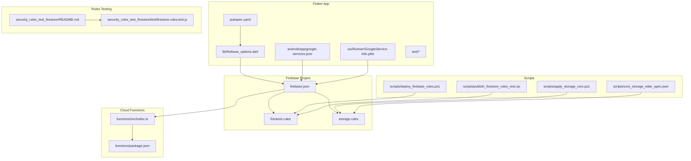

**Diagram sources**
- [firebase.json](file://firebase.json)
- [firestore.rules](file://firestore.rules)
- [storage.rules](file://storage.rules)
- [functions/src/index.ts](file://functions/src/index.ts)
- [functions/package.json](file://functions/package.json)
- [security_rules_test_firestore/README.md](file://security_rules_test_firestore/README.md)
- [security_rules_test_firestore/test/firestore.rules.test.js](file://security_rules_test_firestore/test/firestore.rules.test.js)
- [flutter_app/pubspec.yaml](file://flutter_app/pubspec.yaml)
- [flutter_app/lib/firebase_options.dart](file://flutter_app/lib/firebase_options.dart)
- [flutter_app/android/app/google-services.json](file://flutter_app/android/app/google-services.json)
- [flutter_app/ios/Runner/GoogleService-Info.plist](file://flutter_app/ios/Runner/GoogleService-Info.plist)
- [scripts/deploy_firebase_rules.ps1](file://scripts/deploy_firebase_rules.ps1)
- [scripts/publish_firestore_rules_rest.cjs](file://scripts/publish_firestore_rules_rest.cjs)
- [scripts/apply_storage_cors.ps1](file://scripts/apply_storage_cors.ps1)
- [scripts/cors_storage_wide_open.json](file://scripts/cors_storage_wide_open.json)

**Section sources**
- [firebase.json](file://firebase.json)
- [flutter_app/pubspec.yaml](file://flutter_app/pubspec.yaml)
- [flutter_app/lib/firebase_options.dart](file://flutter_app/lib/firebase_options.dart)
- [flutter_app/android/app/google-services.json](file://flutter_app/android/app/google-services.json)
- [flutter_app/ios/Runner/GoogleService-Info.plist](file://flutter_app/ios/Runner/GoogleService-Info.plist)

## Core Components
- Firebase configuration and environment alignment across platforms via firebase.json and platform-specific config files.
- Security rules for Firestore and Storage that enforce tenant isolation, role-based access, and data validation.
- Cloud Functions implementing business logic, triggers, scheduled jobs, and cross-service integrations.
- Rules testing harness using Firebase Test SDK for Firestore rules.
- Flutter app initialization and service wiring through firebase_options and pubspec dependencies.

Key responsibilities:
- Ensure consistent project IDs and service accounts across environments.
- Validate rules locally and in CI before deployment.
- Mock or isolate external services during function tests.
- Exercise real-time sync paths and error conditions.

**Section sources**
- [firebase.json](file://firebase.json)
- [firestore.rules](file://firestore.rules)
- [storage.rules](file://storage.rules)
- [functions/src/index.ts](file://functions/src/index.ts)
- [functions/package.json](file://functions/package.json)
- [security_rules_test_firestore/README.md](file://security_rules_test_firestore/README.md)
- [security_rules_test_firestore/test/firestore.rules.test.js](file://security_rules_test_firestore/test/firestore.rules.test.js)
- [flutter_app/lib/firebase_options.dart](file://flutter_app/lib/firebase_options.dart)
- [flutter_app/pubspec.yaml](file://flutter_app/pubspec.yaml)

## Architecture Overview
Integration testing spans client, backend, and storage layers. The following diagram maps the typical flow when exercising end-to-end features such as chat messages, media uploads, and background processing.

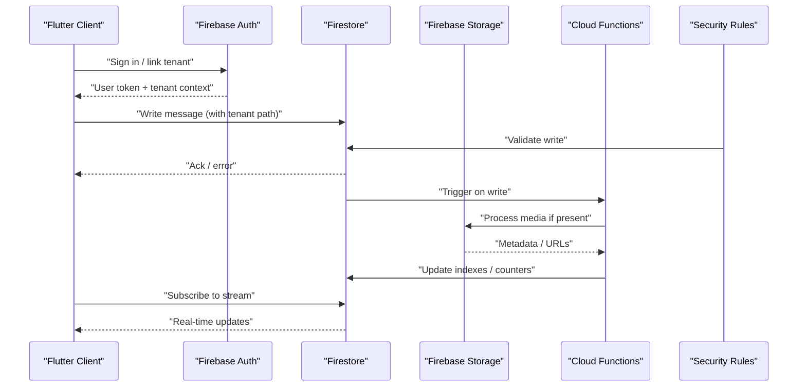

**Diagram sources**
- [firestore.rules](file://firestore.rules)
- [storage.rules](file://storage.rules)
- [functions/src/index.ts](file://functions/src/index.ts)

## Detailed Component Analysis

### Firestore Security Rules Testing
- Use the Firebase Test SDK to assert allow/deny behavior for tenant-scoped paths, role checks, and field validations.
- Create test fixtures representing different tenants, roles, and edge cases (anonymous users, missing fields).
- Run rule tests in CI to prevent regressions; deploy only after all tests pass.

Recommended practices:
- Isolate tests per tenant ID to avoid cross-tenant leakage.
- Assert both positive and negative cases for each rule branch.
- Include time-bound checks and rate-limiting assertions where applicable.

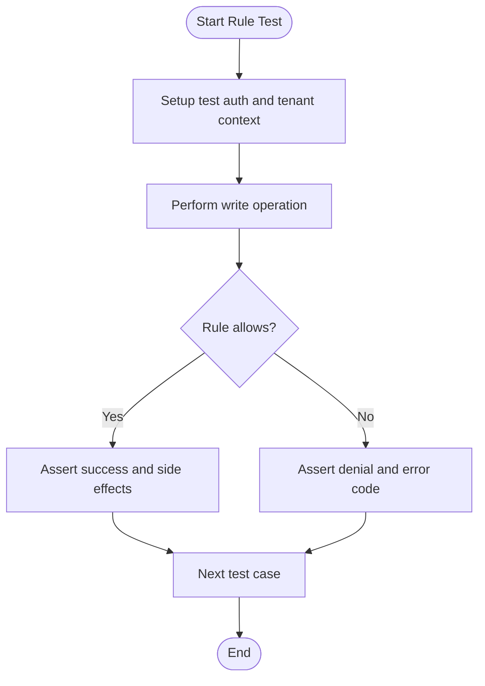

**Diagram sources**
- [security_rules_test_firestore/test/firestore.rules.test.js](file://security_rules_test_firestore/test/firestore.rules.test.js)
- [security_rules_test_firestore/README.md](file://security_rules_test_firestore/README.md)
- [firestore.rules](file://firestore.rules)

**Section sources**
- [security_rules_test_firestore/README.md](file://security_rules_test_firestore/README.md)
- [security_rules_test_firestore/test/firestore.rules.test.js](file://security_rules_test_firestore/test/firestore.rules.test.js)
- [firestore.rules](file://firestore.rules)

### Storage Rules Testing
- Validate upload permissions by tenant folder structure, file size limits, MIME types, and authenticated user roles.
- Use emulators to simulate uploads and verify CORS policies for web clients.
- Confirm cleanup rules trigger on deletions and orphaned file removal.

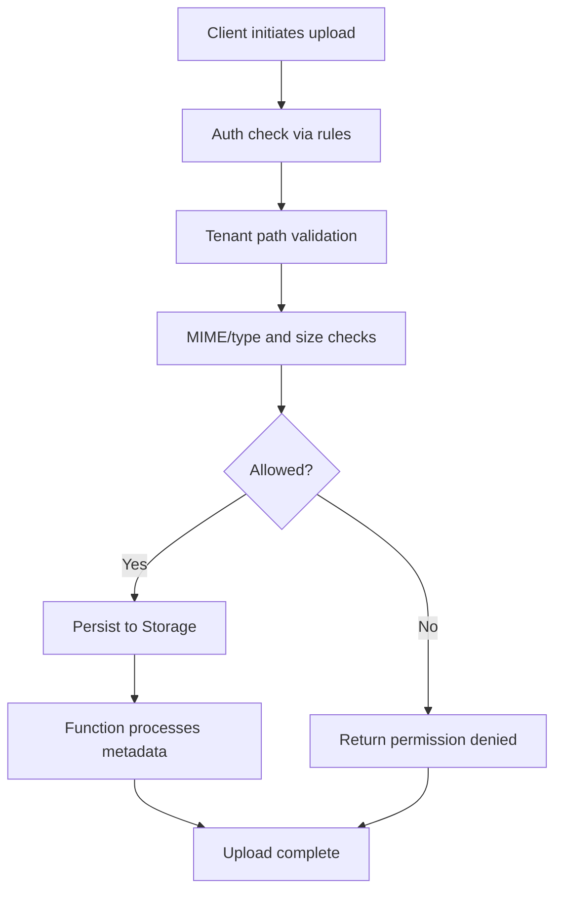

**Diagram sources**
- [storage.rules](file://storage.rules)
- [scripts/apply_storage_cors.ps1](file://scripts/apply_storage_cors.ps1)
- [scripts/cors_storage_wide_open.json](file://scripts/cors_storage_wide_open.json)

**Section sources**
- [storage.rules](file://storage.rules)
- [scripts/apply_storage_cors.ps1](file://scripts/apply_storage_cors.ps1)
- [scripts/cors_storage_wide_open.json](file://scripts/cors_storage_wide_open.json)

### Cloud Functions Integration Testing
- Identify key functions from index.ts and package.json to cover triggers, scheduled jobs, and callable endpoints.
- Use the Functions Emulator to invoke triggers with realistic payloads and assert database/storage changes.
- Mock external APIs and third-party services within function tests to ensure deterministic outcomes.

Common scenarios:
- Chat message normalization and notifications
- Media attachment processing and thumbnail generation
- Tenant provisioning and data consolidation
- Scheduled reminders and cache refreshes

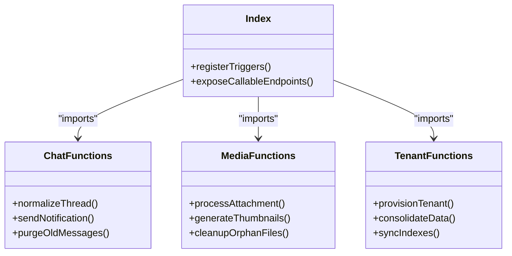

**Diagram sources**
- [functions/src/index.ts](file://functions/src/index.ts)
- [functions/package.json](file://functions/package.json)

**Section sources**
- [functions/src/index.ts](file://functions/src/index.ts)
- [functions/package.json](file://functions/package.json)

### Real-Time Data Synchronization Testing
- Subscribe to streams in Flutter and assert incremental updates, ordering, and conflict resolution.
- Simulate network drops and offline writes to verify reconciliation upon reconnection.
- Validate that cloud functions do not cause infinite update loops.

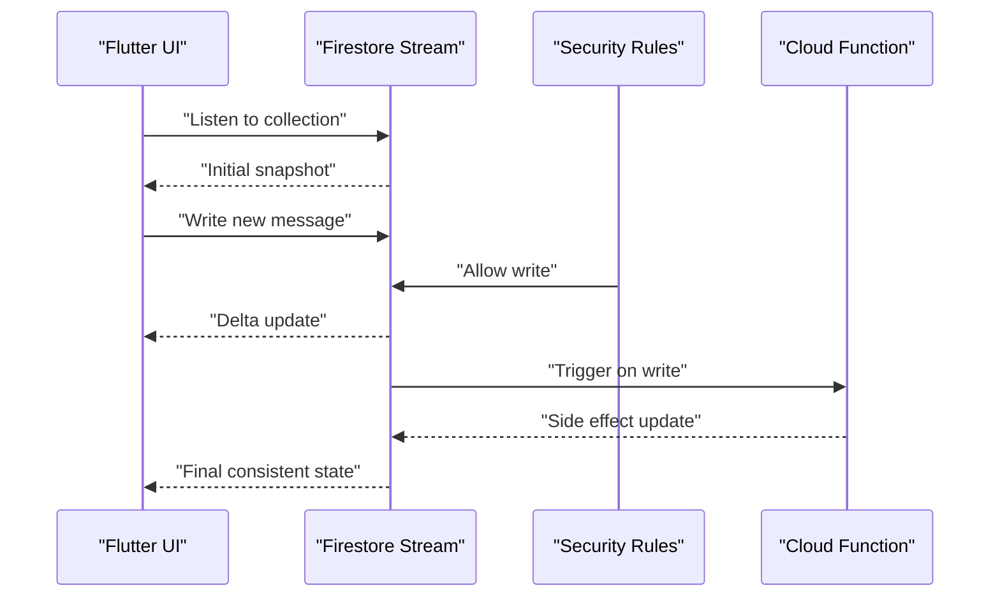

**Diagram sources**
- [firestore.rules](file://firestore.rules)
- [functions/src/index.ts](file://functions/src/index.ts)

**Section sources**
- [firestore.rules](file://firestore.rules)
- [functions/src/index.ts](file://functions/src/index.ts)

### Multi-Tenant Scenarios
- Ensure tenant isolation in Firestore paths and Storage buckets/folders.
- Validate that functions resolve tenant context correctly and do not leak data across tenants.
- Test provisioning workflows and tenant-specific configurations.

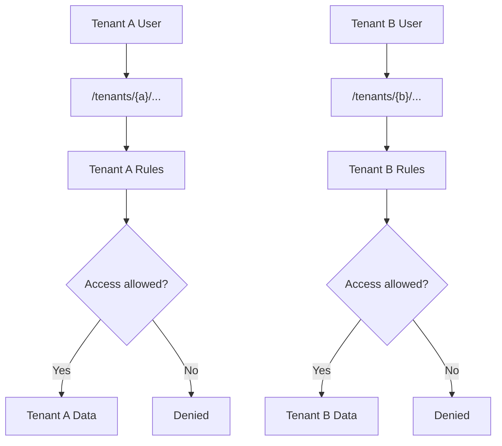

**Diagram sources**
- [firestore.rules](file://firestore.rules)
- [storage.rules](file://storage.rules)

**Section sources**
- [firestore.rules](file://firestore.rules)
- [storage.rules](file://storage.rules)

### Authentication Flows
- Cover sign-in, token refresh, and anonymous-to-authenticated transitions.
- Validate that tenant context is attached to requests and enforced by rules.
- Test error paths for invalid tokens and expired sessions.

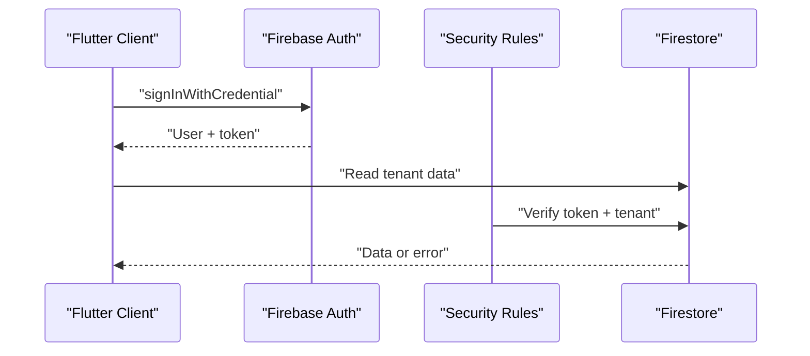

**Diagram sources**
- [firestore.rules](file://firestore.rules)

**Section sources**
- [firestore.rules](file://firestore.rules)

### Chat Functionality Testing
- Exercise message creation, thread normalization, and notification triggers.
- Validate media attachments are processed and thumbnails generated.
- Ensure retention policies purge old messages safely.

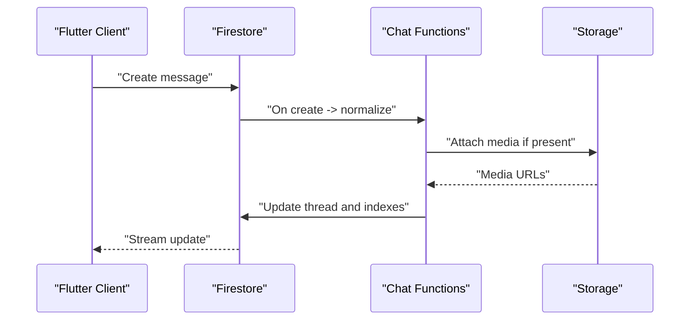

**Diagram sources**
- [functions/src/index.ts](file://functions/src/index.ts)
- [firestore.rules](file://firestore.rules)
- [storage.rules](file://storage.rules)

**Section sources**
- [functions/src/index.ts](file://functions/src/index.ts)
- [firestore.rules](file://firestore.rules)
- [storage.rules](file://storage.rules)

### Background Jobs Testing
- Use scheduled functions to exercise reminders, cache refreshes, and maintenance tasks.
- Verify idempotency and retry behavior.
- Assert that jobs respect tenant boundaries and quotas.

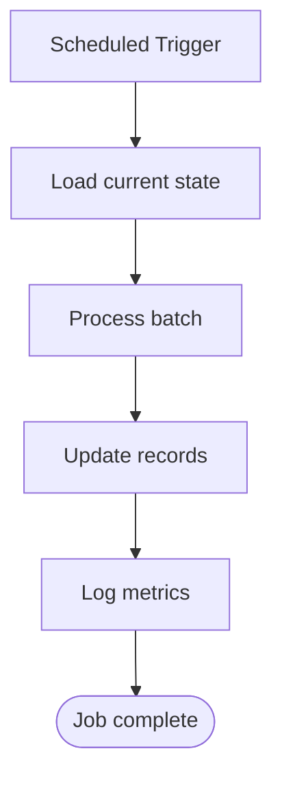

**Diagram sources**
- [functions/src/index.ts](file://functions/src/index.ts)

**Section sources**
- [functions/src/index.ts](file://functions/src/index.ts)

## Dependency Analysis
The integration surface includes Flutter app dependencies, Firebase configuration, and Cloud Functions modules. Ensuring alignment between these components is critical for reliable tests.

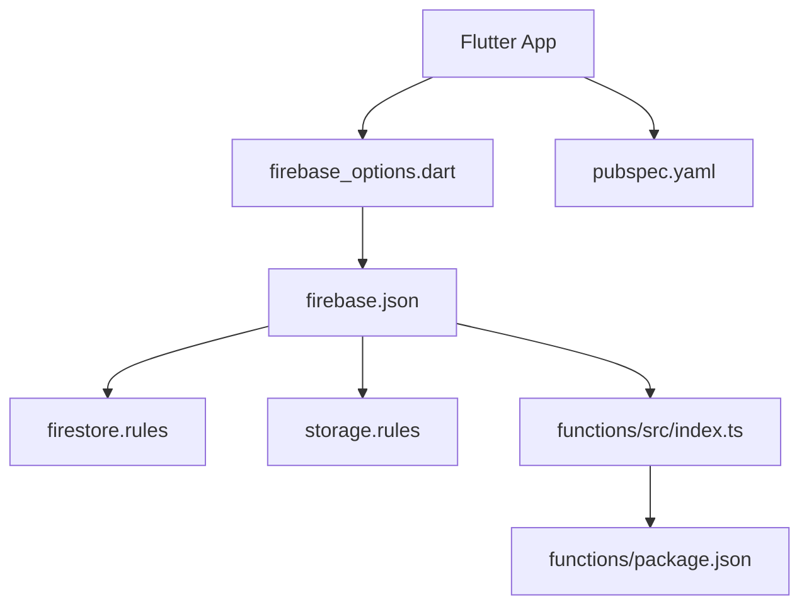

**Diagram sources**
- [flutter_app/lib/firebase_options.dart](file://flutter_app/lib/firebase_options.dart)
- [flutter_app/pubspec.yaml](file://flutter_app/pubspec.yaml)
- [firebase.json](file://firebase.json)
- [firestore.rules](file://firestore.rules)
- [storage.rules](file://storage.rules)
- [functions/src/index.ts](file://functions/src/index.ts)
- [functions/package.json](file://functions/package.json)

**Section sources**
- [flutter_app/lib/firebase_options.dart](file://flutter_app/lib/firebase_options.dart)
- [flutter_app/pubspec.yaml](file://flutter_app/pubspec.yaml)
- [firebase.json](file://firebase.json)
- [functions/package.json](file://functions/package.json)

## Performance Considerations
- Prefer emulator-based integration tests for speed and determinism; run against live services only for final validation.
- Batch writes and reads in tests to reduce overhead and mimic real-world patterns.
- Avoid heavy media operations in unit tests; use mocks or small test assets.
- Monitor function cold starts and optimize initialization paths.

[No sources needed since this section provides general guidance]

## Troubleshooting Guide
Common issues and resolutions:
- Rules deployment failures: Validate syntax and encoding; use preflight scripts and linting.
- Storage CORS errors: Apply correct CORS policy for web clients and verify bucket settings.
- Function invocation timeouts: Increase concurrency limits and optimize database queries.
- Tenant isolation violations: Audit path construction and rule conditions.

Operational references:
- Deploy rules via PowerShell script or REST publish utility.
- Apply Storage CORS configuration programmatically.

**Section sources**
- [scripts/deploy_firebase_rules.ps1](file://scripts/deploy_firebase_rules.ps1)
- [scripts/publish_firestore_rules_rest.cjs](file://scripts/publish_firestore_rules_rest.cjs)
- [scripts/apply_storage_cors.ps1](file://scripts/apply_storage_cors.ps1)

## Conclusion
A robust integration testing strategy for Gestão Yahweh Premium combines local emulators, targeted rule tests, and end-to-end flows across Flutter, Firestore, Storage, and Cloud Functions. By isolating tenants, mocking external services, and validating real-time synchronization, teams can confidently deploy changes while maintaining security and performance.

[No sources needed since this section summarizes without analyzing specific files]

## Appendices

### Environment Setup Checklist
- Align project IDs and credentials across flutter_app configs and firebase.json.
- Install and configure Firebase CLI and emulators.
- Prepare test service accounts and tenant fixtures.
- Ensure scripts for rules deployment and CORS are executable.

**Section sources**
- [flutter_app/android/app/google-services.json](file://flutter_app/android/app/google-services.json)
- [flutter_app/ios/Runner/GoogleService-Info.plist](file://flutter_app/ios/Runner/GoogleService-Info.plist)
- [firebase.json](file://firebase.json)
- [scripts/deploy_firebase_rules.ps1](file://scripts/deploy_firebase_rules.ps1)
- [scripts/apply_storage_cors.ps1](file://scripts/apply_storage_cors.ps1)