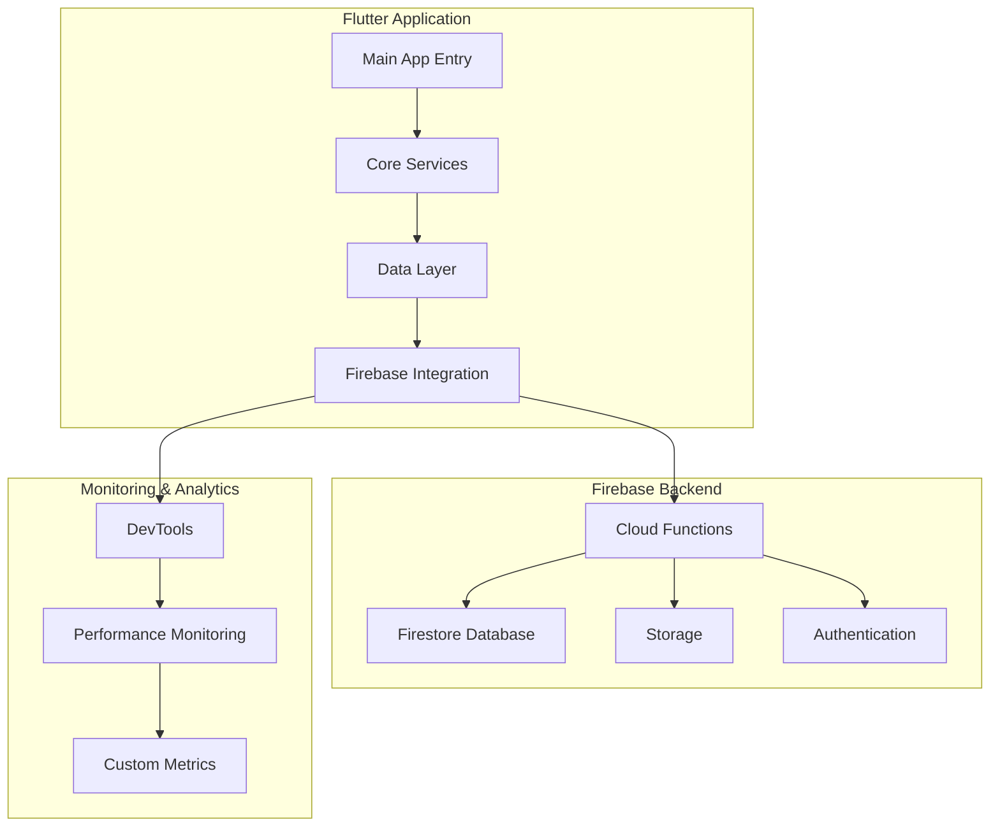
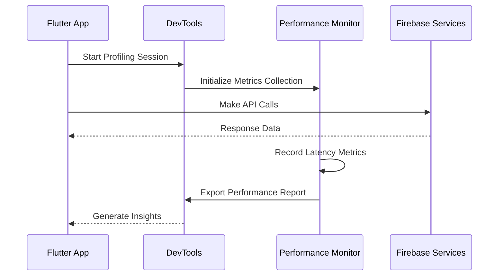
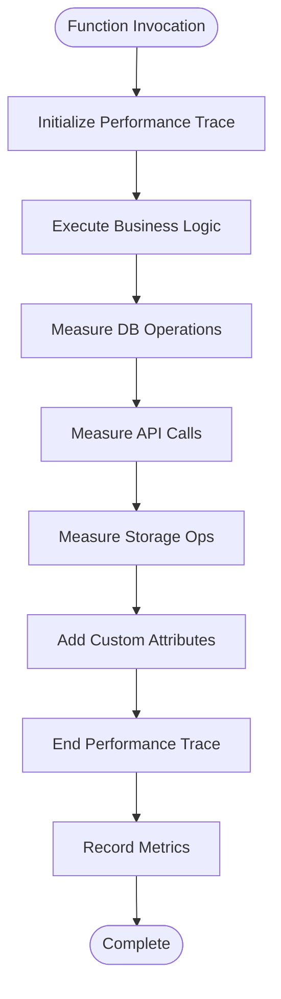
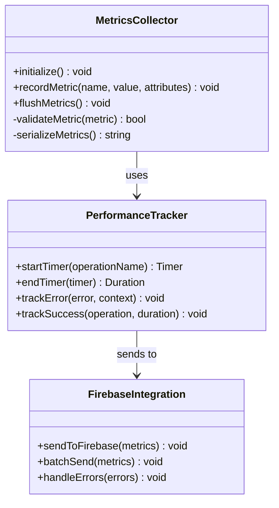
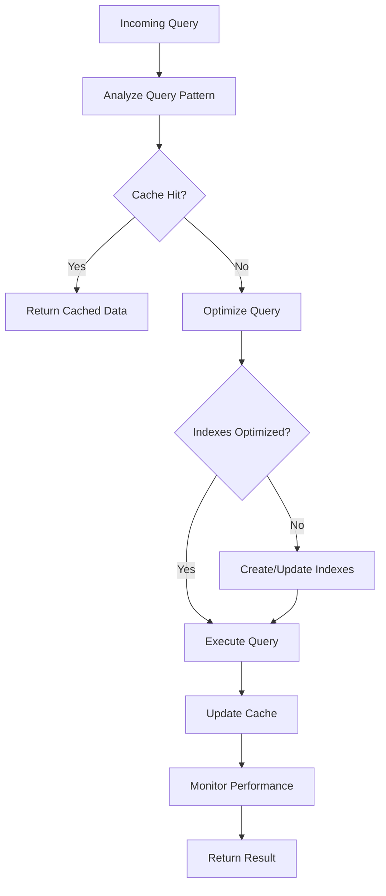
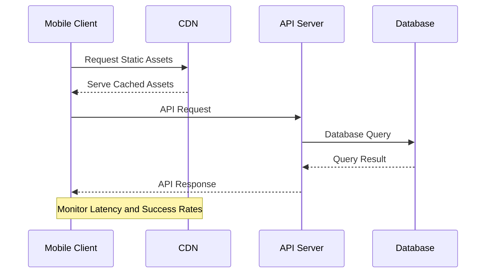
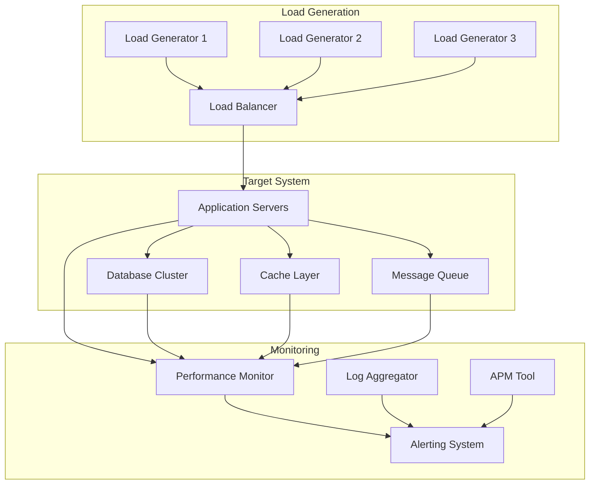
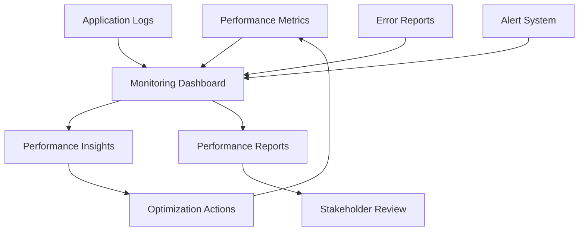

# Performance & Load Testing

<cite>
**Referenced Files in This Document**
- [main.dart](file://flutter_app/lib/main.dart)
- [firebase_options.dart](file://flutter_app/firebase_options.dart)
- [pubspec.yaml](file://flutter_app/pubspec.yaml)
- [firebase.json](file://firebase.json)
- [package.json](file://functions/package.json)
- [index.ts](file://functions/src/index.ts)
- [firestore.rules](file://firestore.rules)
- [storage.rules](file://storage.rules)
- [devtools_options.yaml](file://flutter_app/devtools_options.yaml)
- [ARCHITECTURE_PERFORMANCE_MULTI_PLATFORM.md](file://docs/ARCHITECTURE_PERFORMANCE_MULTI_PLATFORM.md)
- [PADRONIZACAO_PERFORMANCE_CONTROLE_TOTAL.md](file://docs/PADRONIZACAO_PERFORMANCE_CONTROLE_TOTAL.md)
- [PERFORMANCE_REPORT.md](file://PERFORMANCE_REPORT.md)
</cite>

## Table of Contents
1. [Introduction](#introduction)
2. [Project Structure Overview](#project-structure-overview)
3. [Performance Profiling Techniques](#performance-profiling-techniques)
4. [Firebase Performance Monitoring](#firebase-performance-monitoring)
5. [Custom Metrics Collection](#custom-metrics-collection)
6. [Load Testing Strategies](#load-testing-strategies)
7. [Database Performance Optimization](#database-performance-optimization)
8. [Network Performance Testing](#network-performance-testing)
9. [Memory Usage Analysis](#memory-usage-analysis)
10. [UI Responsiveness Testing](#ui-responsiveness-testing)
11. [Stress Testing for High Concurrency](#stress-testing-for-high-concurrency)
12. [CDN Performance Evaluation](#cdn-performance-evaluation)
13. [Production Monitoring](#production-monitoring)
14. [Troubleshooting Guide](#troubleshooting-guide)
15. [Conclusion](#conclusion)

## Introduction

The Gestão Yahweh Premium application is a comprehensive Flutter-based mobile and web application built with Firebase as its backend infrastructure. This document provides detailed guidance on performance profiling, load testing, and optimization strategies specifically tailored for this multi-platform application architecture.

The application leverages modern Flutter development practices with Firebase services including Firestore, Cloud Functions, Storage, and Authentication. Performance monitoring is integrated throughout the application stack to ensure optimal user experience across all supported platforms (Android, iOS, Web).

## Project Structure Overview

The application follows a modular architecture with clear separation of concerns:



**Diagram sources**
- [main.dart:1-50](file://flutter_app/lib/main.dart#L1-L50)
- [firebase_options.dart:1-30](file://flutter_app/firebase_options.dart#L1-L30)

**Section sources**
- [ARCHITECTURE_PERFORMANCE_MULTI_PLATFORM.md](file://docs/ARCHITECTURE_PERFORMANCE_MULTI_PLATFORM.md)
- [PADRONIZACAO_PERFORMANCE_CONTROLE_TOTAL.md](file://docs/PADRONIZACAO_PERFORMANCE_CONTROLE_TOTAL.md)

## Performance Profiling Techniques

### Flutter DevTools Integration

The application utilizes Flutter DevTools for comprehensive performance analysis:

#### CPU Profiling
- **Timeline Recording**: Capture frame rendering, garbage collection, and task execution
- **Widget Inspector**: Analyze widget tree complexity and rebuild patterns
- **Memory Profiler**: Track memory allocation and identify leaks

#### Network Profiling
- **HTTP Request Monitoring**: Track API calls, response times, and data transfer sizes
- **WebSocket Connection Analysis**: Monitor real-time communication performance
- **Cache Hit/Miss Ratios**: Evaluate caching effectiveness

#### Memory Analysis
- **Heap Snapshots**: Identify memory growth patterns and retention issues
- **Allocation Tracking**: Monitor object creation frequency and lifecycle
- **Native Memory**: Profile native code memory usage (Android/iOS specific)

### Performance Measurement Framework



**Diagram sources**
- [devtools_options.yaml:1-20](file://flutter_app/devtools_options.yaml#L1-L20)

**Section sources**
- [PERFORMANCE_REPORT.md](file://PERFORMANCE_REPORT.md)

## Firebase Performance Monitoring

### Firebase Performance SDK Integration

The application integrates Firebase Performance Monitoring for comprehensive backend performance tracking:

#### Key Metrics Tracked
- **Application Startup Time**: Cold and warm start measurements
- **Network Request Performance**: HTTP request latency and success rates
- **Database Operations**: Firestore query performance and cache hit ratios
- **Cloud Function Execution**: Function invocation duration and error rates
- **Storage Operations**: Upload/download speeds and failure rates

#### Custom Trace Implementation



**Diagram sources**
- [index.ts:1-100](file://functions/src/index.ts#L1-L100)

### Performance Monitoring Configuration

#### Android Configuration
- Enable performance monitoring in build configuration
- Configure minimum trace duration thresholds
- Set up custom attribute tracking for business metrics

#### iOS Configuration
- Integrate Firebase Performance framework
- Configure background task monitoring
- Set up crash reporting integration

#### Web Configuration
- Implement browser performance APIs
- Track network requests using Fetch API
- Monitor page load performance

**Section sources**
- [firebase_options.dart:1-50](file://flutter_app/firebase_options.dart#L1-L50)
- [firebase.json:1-50](file://firebase.json#L1-L50)

## Custom Metrics Collection

### Business Metrics Implementation

The application implements custom metrics collection for key business operations:

#### User Engagement Metrics
- Screen navigation timing
- Feature adoption rates
- User session duration
- Error occurrence patterns

#### Data Operation Metrics
- Database query performance by collection
- Cache hit/miss ratios per endpoint
- API call success rates by service
- Storage operation efficiency

#### System Health Metrics
- Memory usage trends
- CPU utilization patterns
- Network connectivity status
- Battery impact assessment

### Metrics Collection Architecture



**Diagram sources**
- [pubspec.yaml:1-100](file://flutter_app/pubspec.yaml#L1-L100)

**Section sources**
- [PADRONIZACAO_PERFORMANCE_CONTROLE_TOTAL.md](file://docs/PADRONIZACAO_PERFORMANCE_CONTROLE_TOTAL.md)

## Load Testing Strategies

### Firebase Services Load Testing

#### Firestore Load Testing
- **Query Pattern Simulation**: Test complex queries under load
- **Write Operation Stress**: Simulate high-frequency write scenarios
- **Real-time Listener Testing**: Validate WebSocket connection handling
- **Index Performance**: Measure query performance with different indexes

#### Cloud Functions Load Testing
- **Concurrent Execution Testing**: Validate function scaling behavior
- **Timeout Handling**: Test function timeout scenarios
- **Error Rate Management**: Verify error handling under load
- **Resource Utilization**: Monitor CPU and memory usage during peak loads

#### Storage Load Testing
- **Upload Throughput**: Measure concurrent upload performance
- **Download Bandwidth**: Test download speeds under load
- **Metadata Operations**: Validate metadata update performance
- **Large File Handling**: Test large file upload/download scenarios

### Load Testing Tools and Setup

#### Locust for Cloud Functions
```python
# Example load test structure
from locust import HttpUser, task, between

class FirebaseLoadTest(HttpUser):
    wait_time = between(1, 3)
    
    @task
    def test_firestore_query(self):
        self.client.get("/api/firestore/query")
        
    @task
    def test_cloud_function(self):
        self.client.post("/api/function/call")
```

#### k6 for API Testing
```javascript
// Example k6 script
import http from 'k6/http';
import { check, sleep } from 'k6';

export const options = {
  vus: 50,
  duration: '5m',
};

export default function () {
  let res = http.get('https://api.yourapp.com/data');
  check(res, { 'status is 200': (r) => r.status === 200 });
  sleep(1);
}
```

**Section sources**
- [package.json:1-50](file://functions/package.json#L1-L50)

## Database Performance Optimization

### Firestore Query Optimization

#### Index Strategy
- **Composite Indexes**: Create composite indexes for complex queries
- **Array Indexes**: Optimize array field queries
- **Geographic Queries**: Use geo-point indexing for location-based searches
- **Timestamp Indexes**: Optimize time-range queries

#### Query Patterns
- **Pagination Implementation**: Efficient cursor-based pagination
- **Field Selection**: Select only required fields
- **Batch Operations**: Use batch writes for multiple updates
- **Transaction Optimization**: Minimize transaction scope and duration

#### Caching Strategies
- **Client-side Caching**: Implement intelligent caching layers
- **Firestore Offline Persistence**: Configure offline data persistence
- **Cache Invalidation**: Implement proper cache invalidation policies
- **Cache Warming**: Pre-warm frequently accessed data

### Database Performance Monitoring



**Section sources**
- [firestore.rules:1-100](file://firestore.rules#L1-L100)

## Network Performance Testing

### Network Optimization Strategies

#### HTTP/2 and HTTP/3 Support
- Enable HTTP/2 multiplexing for better performance
- Implement HTTP/3 support for improved reliability
- Configure connection pooling and keep-alive settings
- Optimize TLS handshake performance

#### Content Delivery Network (CDN)
- Configure CDN for static assets
- Implement cache headers for optimal caching
- Use edge caching for frequently accessed data
- Monitor CDN performance and cache hit ratios

#### Network Request Optimization
- Implement request deduplication
- Use efficient serialization formats (JSON vs Protocol Buffers)
- Implement request batching where possible
- Optimize payload sizes through compression

### Network Performance Monitoring



**Section sources**
- [firebase.json:1-100](file://firebase.json#L1-L100)

## Memory Usage Analysis

### Memory Profiling Techniques

#### Flutter Memory Profiling
- **Heap Snapshot Analysis**: Identify memory leaks and excessive allocations
- **Object Allocation Tracking**: Monitor object creation patterns
- **Garbage Collection Impact**: Analyze GC pause times and frequency
- **Native Memory Usage**: Profile native code memory consumption

#### Platform-Specific Considerations
- **Android Memory Management**: Monitor Java heap and native memory
- **iOS Memory Management**: Track retain cycles and memory pressure
- **Web Memory Management**: Monitor JavaScript heap and DOM memory

### Memory Optimization Strategies

#### Code-Level Optimizations
- Implement proper resource disposal patterns
- Use weak references to prevent memory leaks
- Optimize image loading and caching strategies
- Minimize widget tree complexity

#### Data Structure Optimization
- Choose appropriate data structures for use cases
- Implement lazy loading for large datasets
- Use streaming for large data processing
- Optimize JSON serialization/deserialization

**Section sources**
- [PERFORMANCE_REPORT.md](file://PERFORMANCE_REPORT.md)

## UI Responsiveness Testing

### Frame Rendering Analysis

#### Flutter Performance Metrics
- **Frame Build Time**: Monitor widget build performance
- **Rasterizer Time**: Track GPU rendering performance
- **Platform Thread Time**: Measure platform method execution
- **Jank Detection**: Identify frames that exceed 16ms target

#### Widget Performance Optimization
- **State Management**: Optimize state updates and rebuilds
- **List Performance**: Implement efficient list rendering
- **Image Loading**: Use proper image caching and resizing
- **Animation Performance**: Optimize animation smoothness

### UI Responsiveness Testing Tools

#### Automated Testing
- **Widget Unit Tests**: Test widget performance characteristics
- **Integration Tests**: Simulate user interactions
- **Performance Regression Tests**: Detect performance regressions
- **Accessibility Testing**: Ensure responsive UI for all users

#### Manual Testing Procedures
- **Device Matrix Testing**: Test across different device capabilities
- **Network Condition Testing**: Simulate various network conditions
- **Battery Impact Testing**: Measure battery consumption impact
- **Thermal Throttling**: Test performance under thermal constraints

**Section sources**
- [ARCHITECTURE_PERFORMANCE_MULTI_PLATFORM.md](file://docs/ARCHITECTURE_PERFORMANCE_MULTI_PLATFORM.md)

## Stress Testing for High Concurrency

### Concurrent User Simulation

#### Load Generation Strategies
- **Virtual User Modeling**: Create realistic user behavior patterns
- **Geographic Distribution**: Simulate users from different regions
- **Device Diversity**: Test across different device types and capabilities
- **Network Variability**: Simulate various network conditions

#### Concurrency Testing Scenarios
- **Peak Load Simulation**: Test application behavior during peak usage
- **Sudden Traffic Spikes**: Validate auto-scaling capabilities
- **Resource Exhaustion**: Test system limits and graceful degradation
- **Recovery Testing**: Validate system recovery after stress events

### Stress Testing Infrastructure



**Section sources**
- [PERFORMANCE_REPORT.md](file://PERFORMANCE_REPORT.md)

## CDN Performance Evaluation

### CDN Configuration and Testing

#### CDN Strategy Implementation
- **Static Asset Caching**: Configure optimal cache policies
- **Dynamic Content Caching**: Implement smart caching for dynamic content
- **Edge Computing**: Leverage edge functions for reduced latency
- **Geo-routing**: Route requests to optimal edge locations

#### CDN Performance Metrics
- **Cache Hit Ratio**: Monitor cache effectiveness
- **Latency Reduction**: Measure latency improvements
- **Bandwidth Savings**: Track bandwidth optimization
- **Error Rates**: Monitor CDN-specific errors

### CDN Testing Methodologies

#### Performance Benchmarking
- **Global Latency Testing**: Measure performance across regions
- **Cache Warm-up Testing**: Validate cache pre-warming strategies
- **Failover Testing**: Test CDN failover mechanisms
- **Capacity Planning**: Determine CDN capacity requirements

**Section sources**
- [firebase.json:1-100](file://firebase.json#L1-L100)

## Production Monitoring

### Production Performance Monitoring

#### Real-time Monitoring Setup
- **Application Performance Monitoring (APM)**: Implement comprehensive APM
- **Error Tracking**: Set up automated error detection and alerting
- **Business Metrics**: Track key business performance indicators
- **Infrastructure Monitoring**: Monitor server and database performance

#### Alerting and Notification
- **Threshold-based Alerts**: Configure alerts for performance thresholds
- **Anomaly Detection**: Implement AI-powered anomaly detection
- **Escalation Policies**: Define alert escalation procedures
- **On-call Rotation**: Establish on-call rotation for critical alerts

### Production Monitoring Dashboard



**Section sources**
- [PERFORMANCE_REPORT.md](file://PERFORMANCE_REPORT.md)

## Troubleshooting Guide

### Common Performance Issues

#### Flutter-Specific Issues
- **Widget Rebuild Problems**: Identify unnecessary widget rebuilds
- **Memory Leaks**: Detect and fix memory leak patterns
- **Image Loading Issues**: Optimize image loading and caching
- **Animation Jank**: Resolve animation performance problems

#### Firebase-Specific Issues
- **Firestore Query Performance**: Optimize slow queries and indexes
- **Cloud Function Timeouts**: Address function timeout issues
- **Storage Upload Failures**: Debug storage upload problems
- **Authentication Delays**: Optimize authentication flow performance

#### Network Issues
- **Connection Timeouts**: Resolve network connectivity issues
- **SSL/TLS Problems**: Fix certificate and encryption issues
- **DNS Resolution**: Optimize DNS lookup performance
- **Proxy Configuration**: Configure proxy settings correctly

### Debugging Tools and Techniques

#### Development Tools
- **Flutter DevTools**: Comprehensive debugging and profiling
- **Firebase Console**: Monitor Firebase service performance
- **Browser Developer Tools**: Debug web-specific issues
- **Mobile Device Debugging**: Debug mobile-specific problems

#### Production Debugging
- **Log Analysis**: Analyze production logs for performance issues
- **Error Tracking**: Investigate reported errors and crashes
- **Performance Regression**: Identify recent performance changes
- **User Impact Assessment**: Assess performance impact on users

**Section sources**
- [PERFORMANCE_REPORT.md](file://PERFORMANCE_REPORT.md)

## Conclusion

The Gestão Yahweh Premium application requires a comprehensive approach to performance monitoring and load testing to ensure optimal user experience across all platforms. By implementing the strategies outlined in this document, developers can:

- **Proactively identify performance issues** before they impact users
- **Optimize application performance** through data-driven insights
- **Ensure scalability** under varying load conditions
- **Maintain high availability** through robust monitoring and alerting
- **Deliver consistent performance** across different devices and network conditions

The combination of Flutter DevTools, Firebase Performance Monitoring, and custom metrics collection provides a complete performance monitoring solution. Regular load testing and stress testing ensure the application can handle expected traffic patterns while maintaining acceptable performance levels.

Continuous monitoring and optimization should be an integral part of the development lifecycle, with performance metrics tracked alongside functional requirements to ensure the application maintains high performance standards as it evolves.