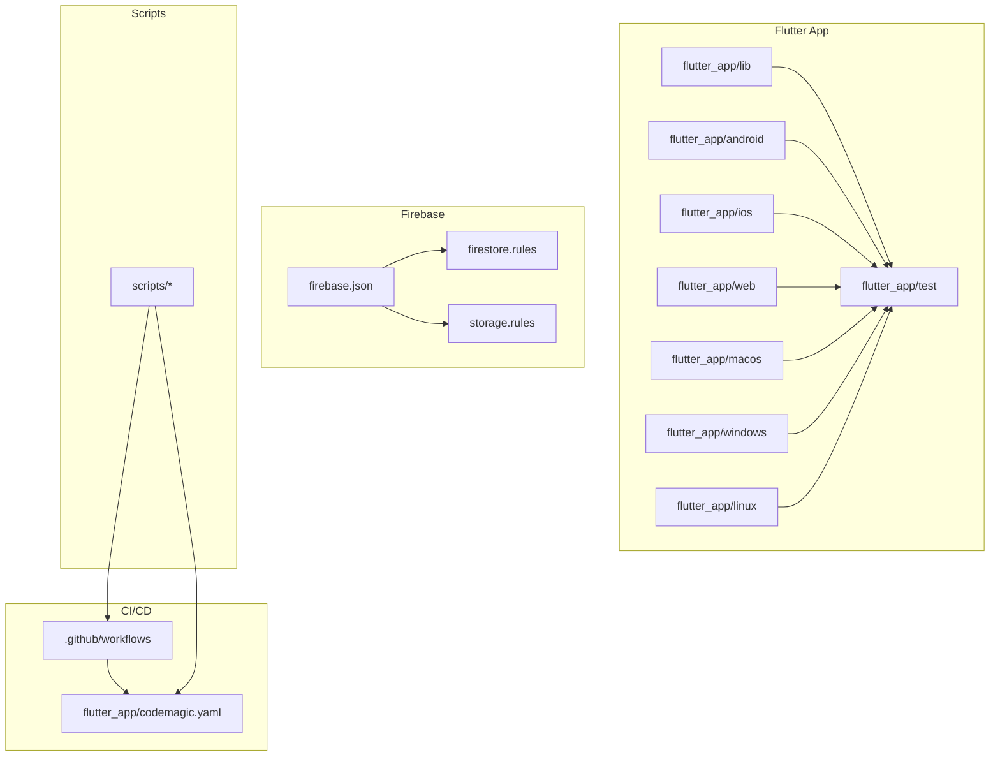
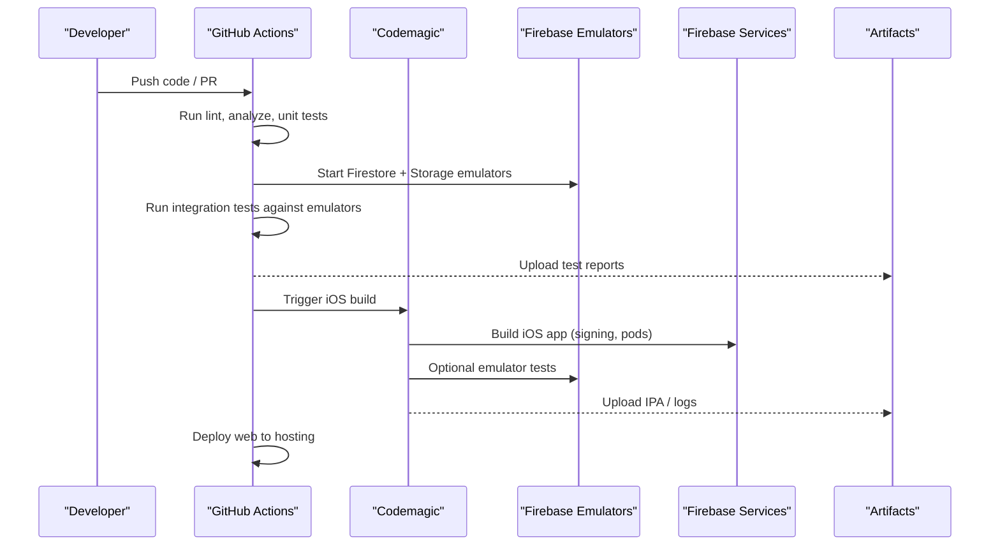
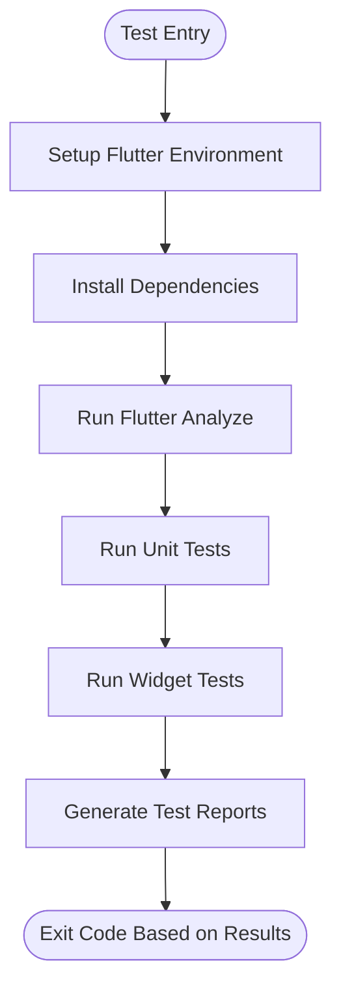
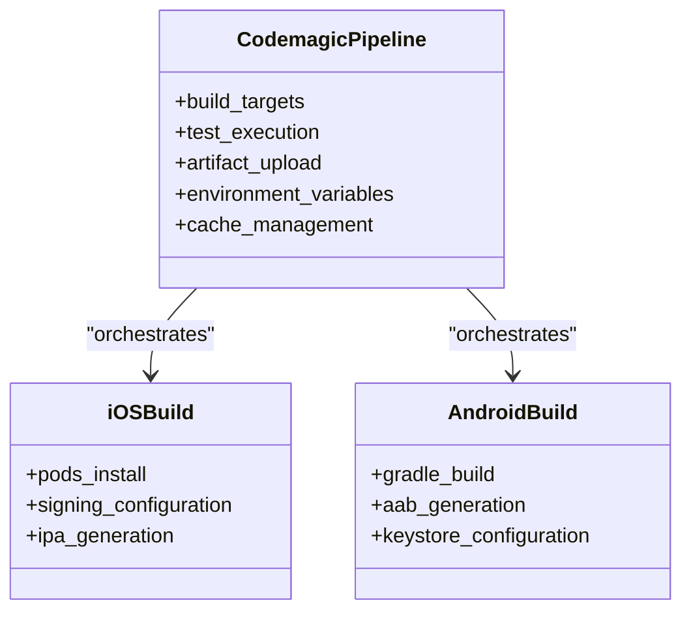
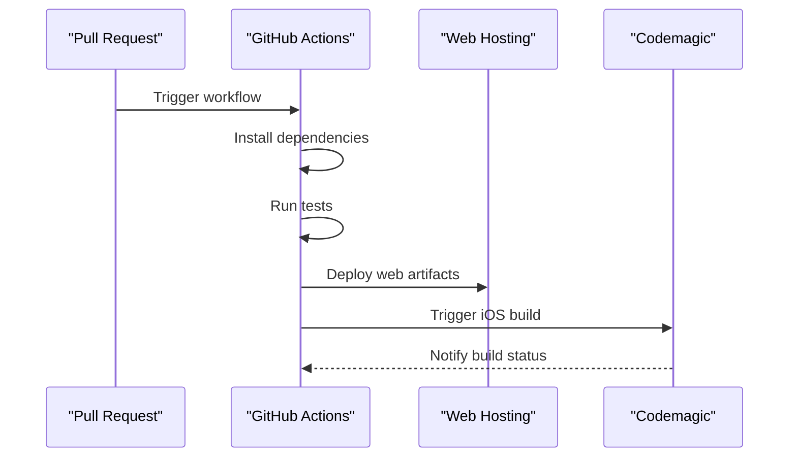
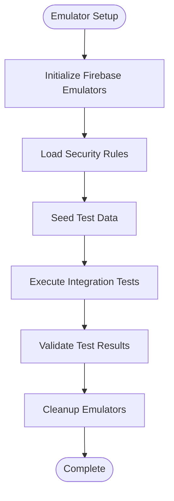
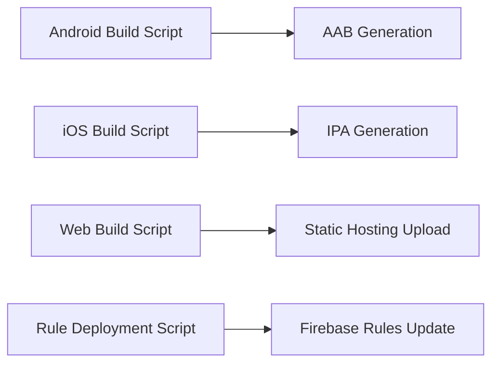
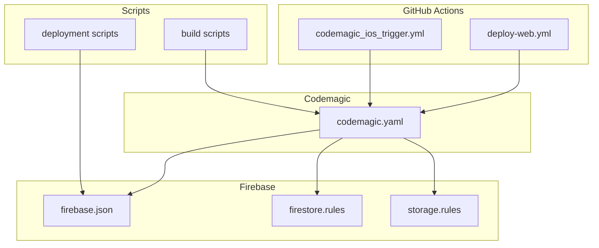

# Test Automation & CI Integration

<cite>
**Referenced Files in This Document**
- [codemagic.yaml](file://flutter_app/codemagic.yaml)
- [deploy-web.yml](file://.github/workflows/deploy-web.yml)
- [codemagic_ios_trigger.yml](file://.github/workflows/codemagic_ios_trigger.yml)
- [firebase.json](file://flutter_app/firebase.json)
- [firestore.rules](file://firestore.rules)
- [storage.rules](file://storage.rules)
- [pubspec.yaml](file://flutter_app/pubspec.yaml)
- [widget_test.dart](file:///flutter_app/test/widget_test.dart)
- [qa_assurance_runner_test.dart](file://flutter_app/test/qa_assurance_runner_test.dart)
- [build_android_aab.ps1](file://scripts/build_android_aab.ps1)
- [build_e_deploy_web.ps1](file://scripts/build_e_deploy_web.ps1)
- [build_ios_ipa_macos.sh](file://scripts/build_ios_ipa_macos.sh)
- [deploy_firebase_rules.ps1](file://scripts/deploy_firebase_rules.ps1)
- [apply_storage_cors.ps1](file://scripts/apply_storage_cors.ps1)
- [ensure_google_cloud_auth.ps1](file://scripts/ensure_google_cloud_auth.ps1)
- [publish_firestore_rules_rest.cjs](file://scripts/publish_firestore_rules_rest.cjs)
- [firebase_rules_gcp_publish.cjs](file://scripts/firebase_rules_gcp_publish.cjs)
- [security rules test package.json](file://security_rules_test_firestore/package.json)
- [firestore.rules.test.js](file://security_rules_test_firestore/test/firestore.rules.test.js)
</cite>

## Table of Contents
1. [Introduction](#introduction)
2. [Project Structure](#project-structure)
3. [Core Components](#core-components)
4. [Architecture Overview](#architecture-overview)
5. [Detailed Component Analysis](#detailed-component-analysis)
6. [Dependency Analysis](#dependency-analysis)
7. [Performance Considerations](#performance-considerations)
8. [Troubleshooting Guide](#troubleshooting-guide)
9. [Conclusion](#conclusion)
10. [Appendices](#appendices)

## Introduction
This document provides comprehensive guidance for test automation and continuous integration (CI) for the Gestão Yahweh Premium application. It covers:
- Automated test execution pipelines using Codemagic and GitHub Actions
- Configuring test runners, parallel execution, and result reporting
- Setting up test environments, managing test data, and integrating with Firebase emulators
- Mobile-specific testing on iOS and Android, web testing across browsers, and desktop platform testing
- Flakiness detection, performance regression testing, and automated quality gates

The goal is to ensure reliable builds, fast feedback loops, and consistent quality across all platforms.

## Project Structure
The repository includes:
- Flutter app under flutter_app with tests under flutter_app/test
- CI workflows under .github/workflows for GitHub Actions
- Codemagic configuration under flutter_app/codemagic.yaml
- Firebase configuration and rules at the project root and within flutter_app
- Scripts for building and deploying across platforms under scripts

**Diagram sources**
- [firebase.json](file://flutter_app/firebase.json)
- [firestore.rules](file://firestore.rules)
- [storage.rules](file://storage.rules)
- [codemagic.yaml](file://flutter_app/codemagic.yaml)
- [deploy-web.yml](file://.github/workflows/deploy-web.yml)
- [codemagic_ios_trigger.yml](file://.github/workflows/codemagic_ios_trigger.yml)

**Section sources**
- [firebase.json](file://flutter_app/firebase.json)
- [firestore.rules](file://firestore.rules)
- [storage.rules](file://storage.rules)
- [codemagic.yaml](file://flutter_app/codemagic.yaml)
- [deploy-web.yml](file://.github/workflows/deploy-web.yml)
- [codemagic_ios_trigger.yml](file://.github/workflows/codemagic_ios_trigger.yml)

## Core Components
Key components for test automation and CI:
- Flutter unit/widget tests located in flutter_app/test
- Codemagic pipeline configuration for mobile builds and tests
- GitHub Actions workflows for web deployment and iOS triggers
- Firebase configuration and security rules for emulator-based testing
- Build and deploy scripts for cross-platform artifacts

**Section sources**
- [widget_test.dart](file://flutter_app/test/widget_test.dart)
- [qa_assurance_runner_test.dart](file://flutter_app/test/qa_assurance_runner_test.dart)
- [codemagic.yaml](file://flutter_app/codemagic.yaml)
- [deploy-web.yml](file://.github/workflows/deploy-web.yml)
- [codemagic_ios_trigger.yml](file://.github/workflows/codemagic_ios_trigger.yml)
- [firebase.json](file://flutter_app/firebase.json)
- [firestore.rules](file://firestore.rules)
- [storage.rules](file://storage.rules)

## Architecture Overview
The CI/CD architecture integrates multiple tools:
- GitHub Actions orchestrates web deployments and triggers Codemagic for iOS builds
- Codemagic handles mobile builds, signing, and test execution
- Firebase Emulators provide local backend services for integration tests
- Scripts automate environment setup, rule publishing, and artifact generation

**Diagram sources**
- [deploy-web.yml](file://.github/workflows/deploy-web.yml)
- [codemagic_ios_trigger.yml](file://.github/workflows/codemagic_ios_trigger.yml)
- [codemagic.yaml](file://flutter_app/codemagic.yaml)
- [firebase.json](file://flutter_app/firebase.json)

## Detailed Component Analysis

### Flutter Tests and Test Runner
- Unit and widget tests are defined under flutter_app/test
- The QA assurance runner test demonstrates a structured approach to running and reporting tests
- Use flutter test with flags for parallel execution and report formats suitable for CI

**Section sources**
- [widget_test.dart](file://flutter_app/test/widget_test.dart)
- [qa_assurance_runner_test.dart](file://flutter_app/test/qa_assurance_runner_test.dart)
- [pubspec.yaml](file://flutter_app/pubspec.yaml)

### Codemagic Pipeline Configuration
- codemagic.yaml defines build targets, test execution, and artifact uploads
- Supports iOS and Android builds with signing and dependency management
- Integrates with Firebase for hosting and storage rules deployment

**Diagram sources**
- [codemagic.yaml](file://flutter_app/codemagic.yaml)

**Section sources**
- [codemagic.yaml](file://flutter_app/codemagic.yaml)

### GitHub Actions Workflows
- deploy-web.yml automates web deployment including build, test, and hosting upload
- codemagic_ios_trigger.yml triggers iOS builds in Codemagic from GitHub Actions

**Diagram sources**
- [deploy-web.yml](file://.github/workflows/deploy-web.yml)
- [codemagic_ios_trigger.yml](file://.github/workflows/codemagic_ios_trigger.yml)

**Section sources**
- [deploy-web.yml](file://.github/workflows/deploy-web.yml)
- [codemagic_ios_trigger.yml](file://.github/workflows/codemagic_ios_trigger.yml)

### Firebase Emulators and Security Rules Testing
- firebase.json configures emulator suite for Firestore and Storage
- Security rules are validated using dedicated test suites
- Emulators enable isolated testing without affecting production data

**Diagram sources**
- [firebase.json](file://flutter_app/firebase.json)
- [firestore.rules](file://firestore.rules)
- [storage.rules](file://storage.rules)
- [firestore.rules.test.js](file://security_rules_test_firestore/test/firestore.rules.test.js)

**Section sources**
- [firebase.json](file://flutter_app/firebase.json)
- [firestore.rules](file://firestore.rules)
- [storage.rules](file://storage.rules)
- [firestore.rules.test.js](file://security_rules_test_firestore/test/firestore.rules.test.js)

### Cross-Platform Build Scripts
- Scripts automate building and deploying artifacts for Android, iOS, and web
- Ensure consistent build processes across development and CI environments

**Diagram sources**
- [build_android_aab.ps1](file://scripts/build_android_aab.ps1)
- [build_ios_ipa_macos.sh](file://scripts/build_ios_ipa_macos.sh)
- [build_e_deploy_web.ps1](file://scripts/build_e_deploy_web.ps1)
- [deploy_firebase_rules.ps1](file://scripts/deploy_firebase_rules.ps1)

**Section sources**
- [build_android_aab.ps1](file://scripts/build_android_aab.ps1)
- [build_ios_ipa_macos.sh](file://scripts/build_ios_ipa_macos.sh)
- [build_e_deploy_web.ps1](file://scripts/build_e_deploy_web.ps1)
- [deploy_firebase_rules.ps1](file://scripts/deploy_firebase_rules.ps1)

## Dependency Analysis
The CI/CD system has clear dependencies between components:
- GitHub Actions depends on Flutter toolchain and Firebase CLI
- Codemagic depends on Apple certificates and Android keystore
- Scripts depend on proper environment variables and authentication

**Diagram sources**
- [deploy-web.yml](file://.github/workflows/deploy-web.yml)
- [codemagic_ios_trigger.yml](file://.github/workflows/codemagic_ios_trigger.yml)
- [codemagic.yaml](file://flutter_app/codemagic.yaml)
- [firebase.json](file://flutter_app/firebase.json)
- [firestore.rules](file://firestore.rules)
- [storage.rules](file://storage.rules)

**Section sources**
- [deploy-web.yml](file://.github/workflows/deploy-web.yml)
- [codemagic_ios_trigger.yml](file://.github/workflows/codemagic_ios_trigger.yml)
- [codemagic.yaml](file://flutter_app/codemagic.yaml)
- [firebase.json](file://flutter_app/firebase.json)
- [firestore.rules](file://firestore.rules)
- [storage.rules](file://storage.rules)

## Performance Considerations
- Use parallel test execution to reduce CI time
- Cache dependencies and build artifacts between runs
- Implement incremental builds where possible
- Monitor test flakiness and optimize unstable tests
- Set performance budgets and regression thresholds

[No sources needed since this section provides general guidance]

## Troubleshooting Guide
Common issues and solutions:
- Authentication failures: Verify service account keys and permissions
- Certificate problems: Ensure proper provisioning profiles and signing configurations
- Emulator connectivity: Check network settings and firewall rules
- Test timeouts: Increase timeouts for slow operations or optimize test data

**Section sources**
- [ensure_google_cloud_auth.ps1](file://scripts/ensure_google_cloud_auth.ps1)
- [apply_storage_cors.ps1](file://scripts/apply_storage_cors.ps1)
- [publish_firestore_rules_rest.cjs](file://scripts/publish_firestore_rules_rest.cjs)
- [firebase_rules_gcp_publish.cjs](file://scripts/firebase_rules_gcp_publish.cjs)

## Conclusion
This documentation outlines a robust test automation and CI strategy for the Gestão Yahweh Premium application. By leveraging Codemagic and GitHub Actions, integrating Firebase emulators, and implementing comprehensive testing across platforms, teams can maintain high quality and reliability. The provided diagrams and references serve as a foundation for extending and customizing the automation pipeline.

[No sources needed since this section summarizes without analyzing specific files]

## Appendices

### Test Execution Commands
- Flutter unit tests: flutter test --reporter=expanded
- Parallel execution: flutter test -j 4
- Coverage reporting: flutter test --coverage
- Web testing: flutter test --platform chrome

### Environment Variables
- Firebase credentials and service account keys
- Apple developer credentials and provisioning profiles
- Android keystore information
- Platform-specific secrets and API keys

### Quality Gates
- Static analysis failures block merges
- Test coverage thresholds must be met
- Performance benchmarks must pass
- Security rules validation required

[No sources needed since this section provides general guidance]