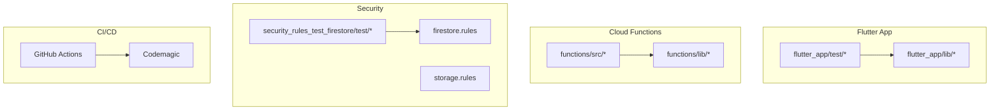
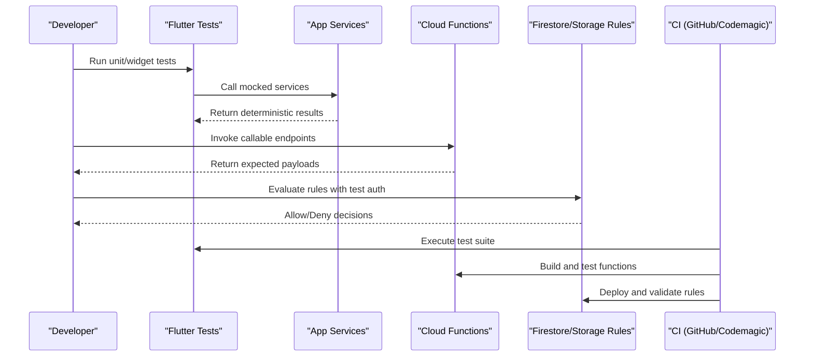
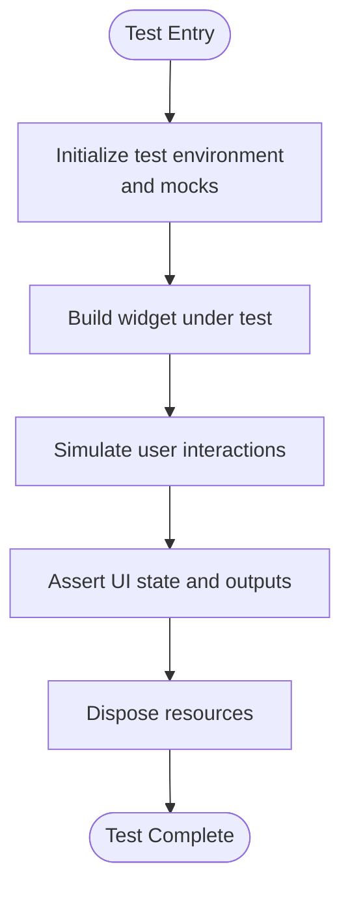
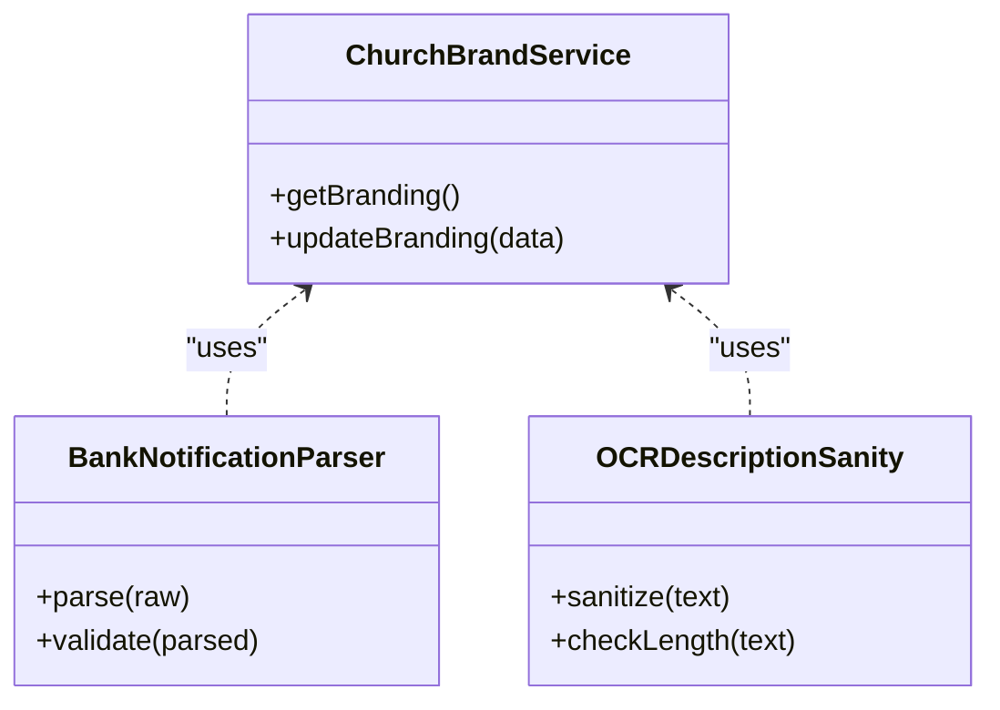
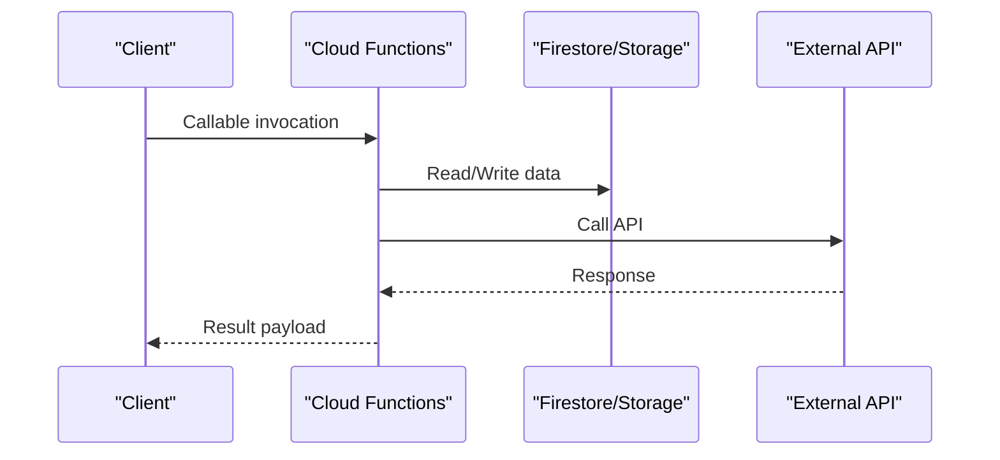
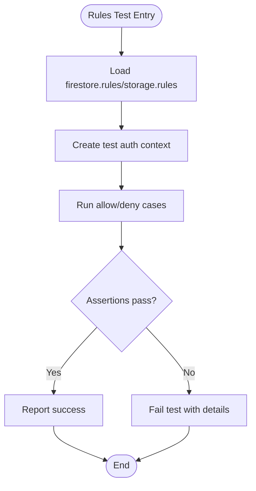
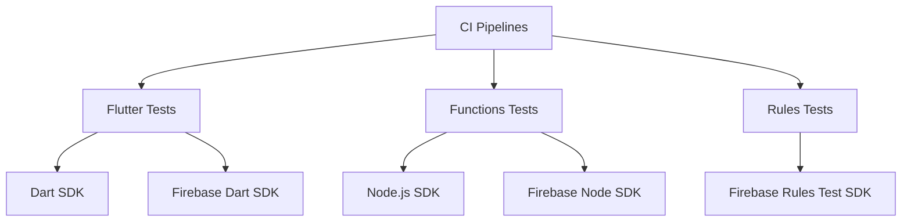

# Testing & Quality Assurance

<cite>
**Referenced Files in This Document**
- [flutter_app/test/widget_test.dart](file://flutter_app/test/widget_test.dart)
- [flutter_app/test/qa_assurance_runner_test.dart](file://flutter_app/test/qa_assurance_runner_test.dart)
- [flutter_app/test/theme_premium_widgets_test.dart](file://flutter_app/test/theme_premium_widgets_test.dart)
- [flutter_app/test/skeleton_loader_test.dart](file://flutter_app/test/skeleton_loader_test.dart)
- [flutter_app/test/bank_notification_parser_pipe_test.dart](file://flutter_app/test/bank_notification_parser_pipe_test.dart)
- [flutter_app/test/ocr_description_sanity_test.dart](file://flutter_app/test/ocr_description_sanity_test.dart)
- [flutter_app/test/church_brand_service_test.dart](file://flutter_app/test/church_brand_service_test.dart)
- [flutter_app/test/smart_input_live_mask_test.dart](file://flutter_app/test/smart_input_live_mask_test.dart)
- [functions/src/index.ts](file://functions/src/index.ts)
- [functions/package.json](file://functions/package.json)
- [security_rules_test_firestore/test/firestore.rules.test.js](file://security_rules_test_firestore/test/firestore.rules.test.js)
- [security_rules_test_firestore/package.json](file://security_rules_test_firestore/package.json)
- [firestore.rules](file://firestore.rules)
- [storage.rules](file://storage.rules)
- [firebase.json](file://firebase.json)
- [codemagic.yaml](file://codemagic.yaml)
- [.github/workflows/deploy-web.yml](file://.github/workflows/deploy-web.yml)
</cite>

## Table of Contents
1. [Introduction](#introduction)
2. [Project Structure](#project-structure)
3. [Core Components](#core-components)
4. [Architecture Overview](#architecture-overview)
5. [Detailed Component Analysis](#detailed-component-analysis)
6. [Dependency Analysis](#dependency-analysis)
7. [Performance Considerations](#performance-considerations)
8. [Troubleshooting Guide](#troubleshooting-guide)
9. [Conclusion](#conclusion)
10. [Appendices](#appendices)

## Introduction
This document provides comprehensive testing and quality assurance guidance for the Gestão Yahweh Premium application. It covers unit, integration, and end-to-end testing strategies across Flutter widgets, Firebase interactions, and Cloud Functions. It also explains test automation, mocking strategies, test data management, performance and security testing, and continuous integration practices. The goal is to help developers write reliable tests, run suites efficiently, and analyze results effectively.

## Project Structure
The repository includes:
- A Flutter app under flutter_app with a dedicated test directory containing widget and service tests.
- Cloud Functions under functions with TypeScript sources and a compiled JavaScript output.
- Firestore and Storage rules at the repository root for security validation.
- A dedicated folder for Firestore Rules tests using the Firebase Test SDK.
- CI configuration files for web deployment and Codemagic orchestration.

**Diagram sources**
- [flutter_app/test/widget_test.dart](file://flutter_app/test/widget_test.dart)
- [functions/src/index.ts](file://functions/src/index.ts)
- [security_rules_test_firestore/test/firestore.rules.test.js](file://security_rules_test_firestore/test/firestore.rules.test.js)
- [firestore.rules](file://firestore.rules)
- [storage.rules](file://storage.rules)
- [.github/workflows/deploy-web.yml](file://.github/workflows/deploy-web.yml)
- [codemagic.yaml](file://codemagic.yaml)

**Section sources**
- [flutter_app/test/widget_test.dart](file://flutter_app/test/widget_test.dart)
- [functions/src/index.ts](file://functions/src/index.ts)
- [security_rules_test_firestore/test/firestore.rules.test.js](file://security_rules_test_firestore/test/firestore.rules.test.js)
- [firestore.rules](file://firestore.rules)
- [storage.rules](file://storage.rules)
- [firebase.json](file://firebase.json)
- [codemagic.yaml](file://codemagic.yaml)
- [.github/workflows/deploy-web.yml](file://.github/workflows/deploy-web.yml)

## Core Components
Testing spans three primary areas:
- Flutter unit and widget tests: Validate UI behavior, business logic, and services.
- Cloud Functions tests: Validate server-side logic and integrations.
- Security rules tests: Validate Firestore and Storage access policies.

Key test files:
- Widget and UI tests: [flutter_app/test/widget_test.dart](file://flutter_app/test/widget_test.dart), [flutter_app/test/theme_premium_widgets_test.dart](file://flutter_app/test/theme_premium_widgets_test.dart), [flutter_app/test/skeleton_loader_test.dart](file://flutter_app/test/skeleton_loader_test.dart).
- Service and utility tests: [flutter_app/test/church_brand_service_test.dart](file://flutter_app/test/church_brand_service_test.dart), [flutter_app/test/bank_notification_parser_pipe_test.dart](file://flutter_app/test/bank_notification_parser_pipe_test.dart), [flutter_app/test/ocr_description_sanity_test.dart](file://flutter_app/test/ocr_description_sanity_test.dart), [flutter_app/test/smart_input_live_mask_test.dart](file://flutter_app/test/smart_input_live_mask_test.dart).
- QA runner: [flutter_app/test/qa_assurance_runner_test.dart](file://flutter_app/test/qa_assurance_runner_test.dart).
- Cloud Functions entrypoint: [functions/src/index.ts](file://functions/src/index.ts).
- Firestore Rules tests: [security_rules_test_firestore/test/firestore.rules.test.js](file://security_rules_test_firestore/test/firestore.rules.test.js).

**Section sources**
- [flutter_app/test/widget_test.dart](file://flutter_app/test/widget_test.dart)
- [flutter_app/test/theme_premium_widgets_test.dart](file://flutter_app/test/theme_premium_widgets_test.dart)
- [flutter_app/test/skeleton_loader_test.dart](file://flutter_app/test/skeleton_loader_test.dart)
- [flutter_app/test/church_brand_service_test.dart](file://flutter_app/test/church_brand_service_test.dart)
- [flutter_app/test/bank_notification_parser_pipe_test.dart](file://flutter_app/test/bank_notification_parser_pipe_test.dart)
- [flutter_app/test/ocr_description_sanity_test.dart](file://flutter_app/test/ocr_description_sanity_test.dart)
- [flutter_app/test/smart_input_live_mask_test.dart](file://flutter_app/test/smart_input_live_mask_test.dart)
- [flutter_app/test/qa_assurance_runner_test.dart](file://flutter_app/test/qa_assurance_runner_test.dart)
- [functions/src/index.ts](file://functions/src/index.ts)
- [security_rules_test_firestore/test/firestore.rules.test.js](file://security_rules_test_firestore/test/firestore.rules.test.js)

## Architecture Overview
The testing architecture integrates Flutter tests, Cloud Functions, and security rules into a cohesive pipeline:
- Flutter tests exercise UI components and services in isolation or with mocked dependencies.
- Cloud Functions are tested via their entrypoint and associated modules.
- Security rules are validated using the Firebase Test SDK against live rule evaluation.
- CI orchestrates test execution and deployments.

**Diagram sources**
- [flutter_app/test/widget_test.dart](file://flutter_app/test/widget_test.dart)
- [functions/src/index.ts](file://functions/src/index.ts)
- [security_rules_test_firestore/test/firestore.rules.test.js](file://security_rules_test_firestore/test/firestore.rules.test.js)
- [firestore.rules](file://firestore.rules)
- [storage.rules](file://storage.rules)
- [codemagic.yaml](file://codemagic.yaml)
- [.github/workflows/deploy-web.yml](file://.github/workflows/deploy-web.yml)

## Detailed Component Analysis

### Flutter Unit and Widget Testing
- Frameworks: Use Flutter’s built-in testing utilities for widget and unit tests.
- Strategy:
  - Isolate UI rendering with widget tests; assert tree structure and user interactions.
  - Mock external dependencies (Firebase, network, storage) to ensure deterministic outcomes.
  - Leverage golden tests for visual regression where applicable.
- Examples:
  - Widget lifecycle and interaction assertions: [flutter_app/test/widget_test.dart](file://flutter_app/test/widget_test.dart)
  - Theme-specific widget behavior: [flutter_app/test/theme_premium_widgets_test.dart](file://flutter_app/test/theme_premium_widgets_test.dart)
  - Skeleton loader state transitions: [flutter_app/test/skeleton_loader_test.dart](file://flutter_app/test/skeleton_loader_test.dart)
  - Smart input masking logic: [flutter_app/test/smart_input_live_mask_test.dart](file://flutter_app/test/smart_input_live_mask_test.dart)

[No sources needed since this diagram shows conceptual workflow, not actual code structure]

**Section sources**
- [flutter_app/test/widget_test.dart](file://flutter_app/test/widget_test.dart)
- [flutter_app/test/theme_premium_widgets_test.dart](file://flutter_app/test/theme_premium_widgets_test.dart)
- [flutter_app/test/skeleton_loader_test.dart](file://flutter_app/test/skeleton_loader_test.dart)
- [flutter_app/test/smart_input_live_mask_test.dart](file://flutter_app/test/smart_input_live_mask_test.dart)

### Service and Utility Testing
- Focus areas:
  - Branding service behavior: [flutter_app/test/church_brand_service_test.dart](file://flutter_app/test/church_brand_service_test.dart)
  - Bank notification parsing pipeline: [flutter_app/test/bank_notification_parser_pipe_test.dart](file://flutter_app/test/bank_notification_parser_pipe_test.dart)
  - OCR description sanity checks: [flutter_app/test/ocr_description_sanity_test.dart](file://flutter_app/test/ocr_description_sanity_test.dart)
- Strategy:
  - Provide deterministic inputs and verify outputs.
  - Mock I/O operations (network, file system) to avoid flakiness.
  - Validate edge cases and error paths explicitly.

**Diagram sources**
- [flutter_app/test/church_brand_service_test.dart](file://flutter_app/test/church_brand_service_test.dart)
- [flutter_app/test/bank_notification_parser_pipe_test.dart](file://flutter_app/test/bank_notification_parser_pipe_test.dart)
- [flutter_app/test/ocr_description_sanity_test.dart](file://flutter_app/test/ocr_description_sanity_test.dart)

**Section sources**
- [flutter_app/test/church_brand_service_test.dart](file://flutter_app/test/church_brand_service_test.dart)
- [flutter_app/test/bank_notification_parser_pipe_test.dart](file://flutter_app/test/bank_notification_parser_pipe_test.dart)
- [flutter_app/test/ocr_description_sanity_test.dart](file://flutter_app/test/ocr_description_sanity_test.dart)

### QA Runner Integration
- Purpose: Centralized execution of QA tasks and test suites within the Flutter context.
- Usage: See [flutter_app/test/qa_assurance_runner_test.dart](file://flutter_app/test/qa_assurance_runner_test.dart) for patterns on orchestrating multiple tests and reporting results.

**Section sources**
- [flutter_app/test/qa_assurance_runner_test.dart](file://flutter_app/test/qa_assurance_runner_test.dart)

### Cloud Functions Testing
- Entrypoint and modules:
  - Main entrypoint: [functions/src/index.ts](file://functions/src/index.ts)
  - Dependencies and scripts: [functions/package.json](file://functions/package.json)
- Strategy:
  - Write unit tests for individual functions and helpers.
  - Use emulators for local integration testing when interacting with Firestore/Storage.
  - Mock external APIs and third-party services to isolate function logic.

**Diagram sources**
- [functions/src/index.ts](file://functions/src/index.ts)
- [functions/package.json](file://functions/package.json)

**Section sources**
- [functions/src/index.ts](file://functions/src/index.ts)
- [functions/package.json](file://functions/package.json)

### Firestore and Storage Rules Testing
- Tools: Firebase Test SDK for Rules.
- Configuration:
  - Rules files: [firestore.rules](file://firestore.rules), [storage.rules](file://storage.rules)
  - Test harness: [security_rules_test_firestore/test/firestore.rules.test.js](file://security_rules_test_firestore/test/firestore.rules.test.js)
  - Package setup: [security_rules_test_firestore/package.json](file://security_rules_test_firestore/package.json)
- Strategy:
  - Define test cases covering allowed/denied scenarios.
  - Simulate authenticated contexts and tenant boundaries.
  - Validate path-level permissions and field-level restrictions.

**Diagram sources**
- [firestore.rules](file://firestore.rules)
- [storage.rules](file://storage.rules)
- [security_rules_test_firestore/test/firestore.rules.test.js](file://security_rules_test_firestore/test/firestore.rules.test.js)
- [security_rules_test_firestore/package.json](file://security_rules_test_firestore/package.json)

**Section sources**
- [firestore.rules](file://firestore.rules)
- [storage.rules](file://storage.rules)
- [security_rules_test_firestore/test/firestore.rules.test.js](file://security_rules_test_firestore/test/firestore.rules.test.js)
- [security_rules_test_firestore/package.json](file://security_rules_test_firestore/package.json)

### Firebase Configuration and Emulation
- Firebase project configuration: [firebase.json](file://firebase.json)
- Emulator usage:
  - Local development: Run emulators for Firestore, Storage, and Functions to simulate production behavior.
  - Integrate emulator tests with Flutter and Functions test suites.

**Section sources**
- [firebase.json](file://firebase.json)

## Dependency Analysis
Testing dependencies span Flutter packages, Firebase tools, and CI configurations:
- Flutter tests rely on Dart testing frameworks and mock libraries.
- Cloud Functions tests depend on Node.js tooling and Firebase SDKs.
- Rules tests use the Firebase Test SDK for Rules.
- CI pipelines coordinate builds, tests, and deployments.

**Diagram sources**
- [flutter_app/test/widget_test.dart](file://flutter_app/test/widget_test.dart)
- [functions/package.json](file://functions/package.json)
- [security_rules_test_firestore/package.json](file://security_rules_test_firestore/package.json)
- [codemagic.yaml](file://codemagic.yaml)
- [.github/workflows/deploy-web.yml](file://.github/workflows/deploy-web.yml)

**Section sources**
- [functions/package.json](file://functions/package.json)
- [security_rules_test_firestore/package.json](file://security_rules_test_firestore/package.json)
- [codemagic.yaml](file://codemagic.yaml)
- [.github/workflows/deploy-web.yml](file://.github/workflows/deploy-web.yml)

## Performance Considerations
- Flutter:
  - Use repainting boundary tests to detect unnecessary rebuilds.
  - Profile memory and CPU during widget tests where applicable.
- Cloud Functions:
  - Optimize cold starts by minimizing dependencies and lazy loading.
  - Benchmark database queries and external API calls.
- Rules:
  - Keep rules concise and indexed to reduce evaluation overhead.
  - Validate query constraints in tests to prevent expensive scans.

[No sources needed since this section provides general guidance]

## Troubleshooting Guide
Common issues and resolutions:
- Flutter tests failing due to missing assets or fonts: Ensure assets are included in test environments.
- Cloud Functions emulator connectivity errors: Verify emulator ports and authentication settings.
- Rules tests timing out: Simplify rule expressions and add appropriate indexes.
- CI test failures: Check environment variables and secrets; review logs for dependency resolution issues.

**Section sources**
- [flutter_app/test/widget_test.dart](file://flutter_app/test/widget_test.dart)
- [functions/src/index.ts](file://functions/src/index.ts)
- [security_rules_test_firestore/test/firestore.rules.test.js](file://security_rules_test_firestore/test/firestore.rules.test.js)

## Conclusion
A robust testing strategy for Gestão Yahweh Premium combines Flutter unit/widget tests, Cloud Functions validation, and security rules verification. By leveraging emulators, mocks, and CI pipelines, teams can maintain high code quality, accelerate releases, and ensure secure, performant experiences across platforms.

[No sources needed since this section summarizes without analyzing specific files]

## Appendices

### Running Test Suites
- Flutter tests:
  - Execute all tests: flutter test
  - Run specific test files: flutter test path/to/test.dart
- Cloud Functions:
  - Install dependencies: cd functions && npm install
  - Run tests: npm test (if configured)
- Rules tests:
  - Navigate to security_rules_test_firestore and run tests per package configuration.

**Section sources**
- [flutter_app/test/widget_test.dart](file://flutter_app/test/widget_test.dart)
- [functions/package.json](file://functions/package.json)
- [security_rules_test_firestore/package.json](file://security_rules_test_firestore/package.json)

### Continuous Integration
- GitHub Actions: Web deployment workflow: [.github/workflows/deploy-web.yml](file://.github/workflows/deploy-web.yml)
- Codemagic: Orchestration and build triggers: [codemagic.yaml](file://codemagic.yaml)

**Section sources**
- [.github/workflows/deploy-web.yml](file://.github/workflows/deploy-web.yml)
- [codemagic.yaml](file://codemagic.yaml)