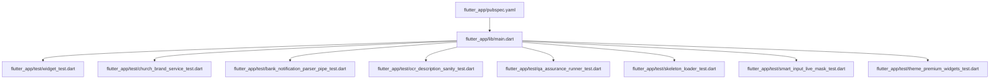
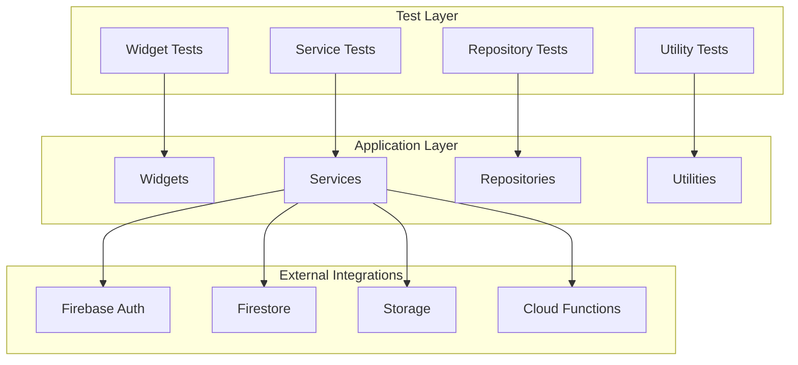
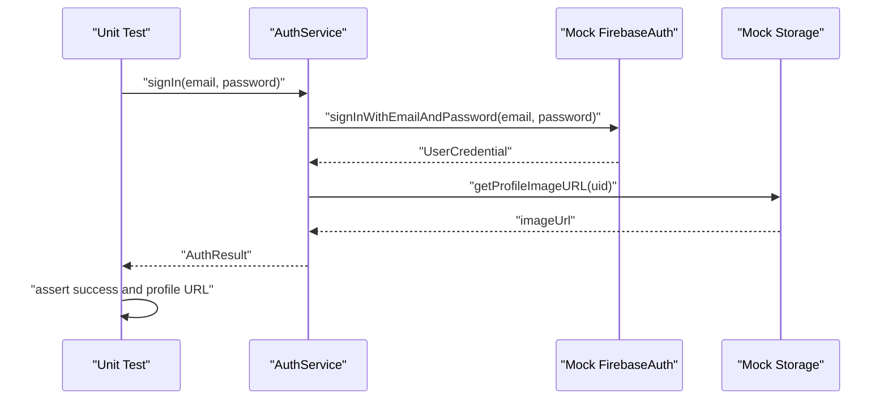
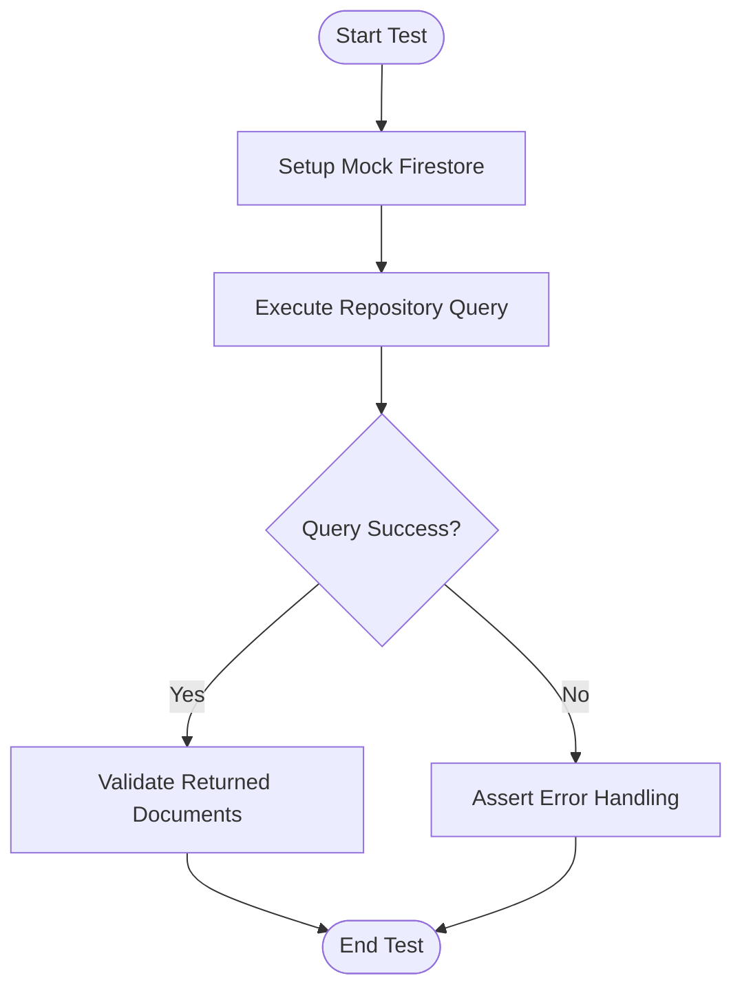

# Unit Testing & Mocking

<cite>
**Referenced Files in This Document**
- [pubspec.yaml](file://flutter_app/pubspec.yaml)
- [main.dart](file://flutter_app/lib/main.dart)
- [widget_test.dart](file://flutter_app/test/widget_test.dart)
- [church_brand_service_test.dart](file://flutter_app/test/church_brand_service_test.dart)
- [bank_notification_parser_pipe_test.dart](file://flutter_app/test/bank_notification_parser_pipe_test.dart)
- [ocr_description_sanity_test.dart](file://flutter_app/test/ocr_description_sanity_test.dart)
- [qa_assurance_runner_test.dart](file://flutter_app/test/qa_assurance_runner_test.dart)
- [skeleton_loader_test.dart](file://flutter_app/test/skeleton_loader_test.dart)
- [smart_input_live_mask_test.dart](file://flutter_app/test/smart_input_live_mask_test.dart)
- [theme_premium_widgets_test.dart](file://flutter_app/test/theme_premium_widgets_test.dart)
</cite>

## Table of Contents
1. [Introduction](#introduction)
2. [Project Structure](#project-structure)
3. [Core Components](#core-components)
4. [Architecture Overview](#architecture-overview)
5. [Detailed Component Analysis](#detailed-component-analysis)
6. [Dependency Analysis](#dependency-analysis)
7. [Performance Considerations](#performance-considerations)
8. [Troubleshooting Guide](#troubleshooting-guide)
9. [Conclusion](#conclusion)
10. [Appendices](#appendices)

## Introduction
This document provides comprehensive unit testing guidance for the Gestão Yahweh Premium Flutter application. It focuses on using Flutter’s built-in testing framework, mocking external dependencies such as Firebase services, and validating business logic across widgets, services, repositories, and utilities. It also covers test data management, assertion patterns, isolation techniques, asynchronous operations, error handling, and edge cases. The content is tailored to the existing test suite and project structure within the Flutter app directory.

## Project Structure
The Flutter application resides under flutter_app. Tests are located under flutter_app/test and follow standard Flutter conventions. The main entry point is flutter_app/lib/main.dart. Dependencies and dev dependencies (including testing packages) are declared in flutter_app/pubspec.yaml. Existing tests demonstrate widget testing, service testing, utility testing, and QA automation patterns.

**Diagram sources**
- [main.dart](file://flutter_app/lib/main.dart)
- [pubspec.yaml](file://flutter_app/pubspec.yaml)
- [widget_test.dart](file://flutter_app/test/widget_test.dart)
- [church_brand_service_test.dart](file://flutter_app/test/church_brand_service_test.dart)
- [bank_notification_parser_pipe_test_test.dart](file://flutter_app/test/bank_notification_parser_pipe_test.dart)
- [ocr_description_sanity_test.dart](file://flutter_app/test/ocr_description_sanity_test.dart)
- [qa_assurance_runner_test.dart](file://flutter_app/test/qa_assurance_runner_test.dart)
- [skeleton_loader_test.dart](file://flutter_app/test/skeleton_loader_test.dart)
- [smart_input_live_mask_test.dart](file://flutter_app/test/smart_input_live_mask_test.dart)
- [theme_premium_widgets_test.dart](file://flutter_app/test/theme_premium_widgets_test.dart)

**Section sources**
- [pubspec.yaml](file://flutter_app/pubspec.yaml)
- [main.dart](file://flutter_app/lib/main.dart)

## Core Components
This section outlines the core components relevant to unit testing:
- Widgets: UI components tested with Flutter’s widget testing framework.
- Services: Business logic and integration points (e.g., brand services).
- Repositories: Data access abstractions that should be isolated via mocks or in-memory implementations.
- Utilities: Pure functions and helpers validated through deterministic assertions.

Existing tests cover:
- Widget rendering and interactions.
- Service behavior with controlled inputs and outputs.
- Parsing pipelines and OCR sanity checks.
- QA runner orchestration.
- Skeleton loaders and input masking utilities.
- Theme-driven premium widgets.

**Section sources**
- [widget_test.dart](file://flutter_app/test/widget_test.dart)
- [church_brand_service_test.dart](file://flutter_app/test/church_brand_service_test.dart)
- [bank_notification_parser_pipe_test.dart](file://flutter_app/test/bank_notification_parser_pipe_test.dart)
- [ocr_description_sanity_test.dart](file://flutter_app/test/ocr_description_sanity_test.dart)
- [qa_assurance_runner_test.dart](file://flutter_app/test/qa_assurance_runner_test.dart)
- [skeleton_loader_test.dart](file://flutter_app/test/skeleton_loader_test.dart)
- [smart_input_live_mask_test.dart](file://flutter_app/test/smart_input_live_mask_test.dart)
- [theme_premium_widgets_test.dart](file://flutter_app/test/theme_premium_widgets_test.dart)

## Architecture Overview
The testing architecture follows a layered approach:
- Test layer: Unit and widget tests under flutter_app/test.
- Application layer: Dart code under flutter_app/lib.
- External integrations: Firebase services abstracted behind interfaces or dependency injection where applicable.

Key principles:
- Isolate units under test by replacing real dependencies with mocks or test doubles.
- Use deterministic test data to ensure stable outcomes.
- Validate async flows with proper awaiting and timeouts.
- Assert both success and failure paths.

[No sources needed since this diagram shows conceptual workflow, not actual code structure]

## Detailed Component Analysis

### Widget Testing Strategy
- Use Flutter’s widget testing framework to build and pump widgets into a test environment.
- Simulate user interactions (taps, text input) and verify UI state changes.
- Ensure theme and localization are properly set up in tests.
- For complex screens, isolate sub-widgets and assert their behavior independently.

Best practices:
- Keep tests focused on one widget or small component group.
- Provide minimal required state and mock external calls.
- Use finders to locate widgets and verify properties or child widgets.

Example references:
- [widget_test.dart](file://flutter_app/test/widget_test.dart)

**Section sources**
- [widget_test.dart](file://flutter_app/test/widget_test.dart)

### Service Testing Strategy
- Focus on business logic encapsulated in services (e.g., church brand service).
- Replace external dependencies with mocks or stubs.
- Validate method calls, returned values, and side effects.
- Cover error scenarios and edge cases explicitly.

Example references:
- [church_brand_service_test.dart](file://flutter_app/test/church_brand_service_test.dart)

**Section sources**
- [church_brand_service_test.dart](file://flutter_app/test/church_brand_service_test.dart)

### Repository Testing Strategy
- Abstract repository methods behind interfaces to enable mocking.
- Use in-memory implementations or fake repositories for pure data tests.
- Validate CRUD operations, query transformations, and caching behaviors.
- Ensure network errors and timeouts are handled gracefully.

Guidance:
- Do not call real Firestore or Storage in unit tests; use mocks.
- Verify that repositories translate domain models correctly.

[No sources needed since this section provides general guidance]

### Utility Testing Strategy
- Write deterministic tests for pure functions and helpers.
- Validate parsing pipelines, formatting, and validation logic.
- Use parameterized tests to cover multiple inputs efficiently.

Examples:
- Bank notification parser pipeline tests.
- OCR description sanity checks.
- Smart input live mask tests.

References:
- [bank_notification_parser_pipe_test.dart](file://flutter_app/test/bank_notification_parser_pipe_test.dart)
- [ocr_description_sanity_test.dart](file://flutter_app/test/ocr_description_sanity_test.dart)
- [smart_input_live_mask_test.dart](file://flutter_app/test/smart_input_live_mask_test.dart)

**Section sources**
- [bank_notification_parser_pipe_test.dart](file://flutter_app/test/bank_notification_parser_pipe_test.dart)
- [ocr_description_sanity_test.dart](file://flutter_app/test/ocr_description_sanity_test.dart)
- [smart_input_live_mask_test.dart](file://flutter_app/test/smart_input_live_mask_test.dart)

### Async Operations and Error Handling
- Use await and expectAsync to handle asynchronous code.
- Set appropriate timeouts for long-running operations.
- Assert both successful results and thrown exceptions.
- Mock network failures and validate fallback behavior.

Guidance:
- Prefer deterministic mocks over flaky network calls.
- Use StreamController to simulate streams from Firebase services.

[No sources needed since this section provides general guidance]

### Test Data Management
- Centralize test fixtures in a dedicated folder or file.
- Use factory functions to generate consistent test objects.
- Avoid hardcoding large payloads; prefer minimal, representative data.

[No sources needed since this section provides general guidance]

### Mocking Firebase Services
- Wrap Firebase clients behind interfaces to allow substitution with test doubles.
- Mock FirebaseAuth, FirebaseFirestore, FirebaseStorage, and Cloud Functions.
- Use package-specific mocking strategies (e.g., Mockito, Mocktail) compatible with Flutter.

Guidance:
- Ensure mocks return realistic responses and errors.
- Validate that services handle auth states and permission errors.

[No sources needed since this section provides general guidance]

### QA Automation Runner
- Leverage the QA assurance runner to execute test suites programmatically.
- Integrate with CI/CD pipelines for automated validation.

Reference:
- [qa_assurance_runner_test.dart](file://flutter_app/test/qa_assurance_runner_test.dart)

**Section sources**
- [qa_assurance_runner_test.dart](file://flutter_app/test/qa_assurance_runner_test.dart)

### Skeleton Loader Testing
- Validate skeleton placeholders render during loading states.
- Assert transitions from skeleton to actual content upon data availability.

Reference:
- [skeleton_loader_test.dart](file://flutter_app/test/skeleton_loader_test.dart)

**Section sources**
- [skeleton_loader_test.dart](file://flutter_app/test/skeleton_loader_test.dart)

### Theme and Premium Widgets Testing
- Verify theme-dependent styling and premium features render correctly.
- Ensure conditional UI elements respond to feature flags or user roles.

Reference:
- [theme_premium_widgets_test.dart](file://flutter_app/test/theme_premium_widgets_test.dart)

**Section sources**
- [theme_premium_widgets_test.dart](file://flutter_app/test/theme_premium_widgets_test.dart)

## Dependency Analysis
Testing dependencies are declared in pubspec.yaml. Key testing packages typically include:
- flutter_test for widget and unit testing.
- Mockito or Mocktail for mocking.
- Fake implementations for repositories and services.
- Integration test packages if needed.

Ensure dev dependencies align with the testing strategy and avoid pulling heavy runtime libraries into tests.

**Section sources**
- [pubspec.yaml](file://flutter_app/pubspec.yaml)

## Performance Considerations
- Keep tests fast and deterministic; avoid heavy initialization.
- Use setUp and tearDown to manage shared state efficiently.
- Parallelize independent tests where possible.
- Minimize image and asset loads in tests; use lightweight alternatives.

[No sources needed since this section provides general guidance]

## Troubleshooting Guide
Common issues and resolutions:
- Flaky tests due to timing: Use explicit waits and avoid relying on timers.
- Mock misconfiguration: Verify method signatures and return types match expectations.
- State leakage between tests: Reset global state and clear caches in setUp/tearDown.
- Firebase-related failures: Ensure mocks cover all branches including errors and permissions.

Debugging tips:
- Print logs selectively in tests.
- Use golden tests sparingly and only for critical UI snapshots.
- Run individual tests to isolate failures.

[No sources needed since this section provides general guidance]

## Conclusion
Effective unit testing for the Gestão Yahweh Premium Flutter application hinges on isolating units, mocking external dependencies, and validating both success and error paths. By following the strategies outlined here—covering widgets, services, repositories, utilities, async operations, and Firebase mocking—you can maintain a robust, reliable test suite that supports continuous delivery and high-quality releases.

[No sources needed since this section summarizes without analyzing specific files]

## Appendices

### Appendix A: Example Test Flow for Firebase Authentication

[No sources needed since this diagram shows conceptual workflow, not actual code structure]

### Appendix B: Firestore Query Testing Pattern

[No sources needed since this diagram shows conceptual workflow, not actual code structure]