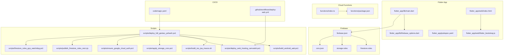
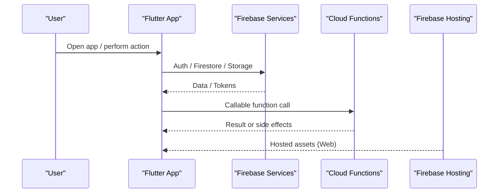
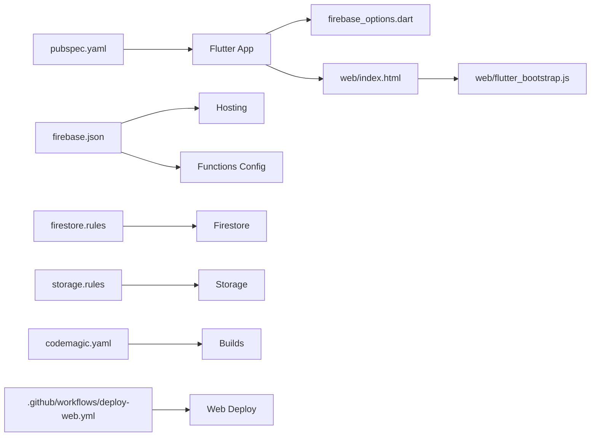

# Common Issues & Solutions

<cite>
**Referenced Files in This Document**
- [README.md](file://README.md)
- [firebase.json](file://firebase.json)
- [firestore.rules](file://firestore.rules)
- [storage.rules](file://storage.rules)
- [pubspec.yaml](file://flutter_app/pubspec.yaml)
- [main.dart](file://flutter_app/lib/main.dart)
- [firebase_options.dart](file://flutter_app/lib/firebase_options.dart)
- [android/build.gradle.kts](file://flutter_app/android/build.gradle.kts)
- [android/app/build.gradle.kts](file://flutter_app/android/app/build.gradle.kts)
- [android/gradle.properties](file://flutter_app/android/gradle.properties)
- [ios/Podfile](file://flutter_app/ios/Podfile)
- [ios/Runner/Info.plist](file://flutter_app/ios/Runner/Info.plist)
- [functions/package.json](file://functions/package.json)
- [functions/index.ts](file://functions/index.ts)
- [scripts/deploy_full_gestao_yahweh.ps1](file://scripts/deploy_full_gestao_yahweh.ps1)
- [scripts/build_android_aab.ps1](file://scripts/build_android_aab.ps1)
- [scripts/build_ios_ipa_macos.sh](file://scripts/build_ios_ipa_macos.sh)
- [scripts/deploy_web_hosting_canvaskit.ps1](file://scripts/deploy_web_hosting_canvaskit.ps1)
- [scripts/apply_storage_cors.ps1](file://scripts/apply_storage_cors.ps1)
- [scripts/ensure_google_cloud_auth.ps1](file://scripts/ensure_google_cloud_auth.ps1)
- [scripts/publish_firestore_rules_rest.cjs](file://scripts/publish_firestore_rules_rest.cjs)
- [scripts/firestore_rules_gcp_watchdog.ps1](file://scripts/firestore_rules_gcp_watchdog.ps1)
- [scripts/cors_storage_wide_open.json](file://scripts/cors_storage_wide_open.json)
- [scripts/storage-cors.json](file://scripts/storage-cors.json)
- [cors.json](file://cors.json)
- [web/index.html](file://flutter_app/web/index.html)
- [web/flutter_bootstrap.js](file://flutter_app/web/flutter_bootstrap.js)
- [web/manifest.json](file://flutter_app/web/manifest.json)
- [web/firebase-messaging-sw.js](file://flutter_app/web/firebase-messaging-sw.js)
- [codemagic.yaml](file://codemagic.yaml)
- [.github/workflows/deploy-web.yml](file://.github/workflows/deploy-web.yml)
</cite>

## Table of Contents
1. [Introduction](#introduction)
2. [Project Structure](#project-structure)
3. [Core Components](#core-components)
4. [Architecture Overview](#architecture-overview)
5. [Detailed Component Analysis](#detailed-component-analysis)
6. [Dependency Analysis](#dependency-analysis)
7. [Performance Considerations](#performance-considerations)
8. [Troubleshooting Guide](#troubleshooting-guide)
9. [Conclusion](#conclusion)
10. [Appendices](#appendices)

## Introduction
This document consolidates common issues and their solutions for the Gestão Yahweh Premium application across Flutter (Android, iOS, Web, Desktop), Firebase integration, Cloud Functions deployment, and build pipelines. It provides step-by-step resolution guides with error symptoms, diagnostic commands, platform-specific notes, and references to configuration files and scripts used by the project.

## Project Structure
The repository is a multi-platform Flutter app with:
- Flutter application under flutter_app/
- Firebase configuration and rules at the root
- Cloud Functions source under functions/
- CI/CD via Codemagic and GitHub Actions
- Automation scripts under scripts/

**Diagram sources**
- [main.dart](file://flutter_app/lib/main.dart)
- [firebase_options.dart](file://flutter_app/lib/firebase_options.dart)
- [pubspec.yaml](file://flutter_app/pubspec.yaml)
- [web/index.html](file://flutter_app/web/index.html)
- [web/flutter_bootstrap.js](file://flutter_app/web/flutter_bootstrap.js)
- [firebase.json](file://firebase.json)
- [firestore.rules](file://firestore.rules)
- [storage.rules](file://storage.rules)
- [cors.json](file://cors.json)
- [functions/index.ts](file://functions/index.ts)
- [functions/package.json](file://functions/package.json)
- [codemagic.yaml](file://codemagic.yaml)
- [.github/workflows/deploy-web.yml](file://.github/workflows/deploy-web.yml)
- [scripts/deploy_full_gestao_yahweh.ps1](file://scripts/deploy_full_gestao_yahweh.ps1)
- [scripts/build_android_aab.ps1](file://scripts/build_android_aab.ps1)
- [scripts/build_ios_ipa_macos.sh](file://scripts/build_ios_ipa_macos.sh)
- [scripts/deploy_web_hosting_canvaskit.ps1](file://scripts/deploy_web_hosting_canvaskit.ps1)
- [scripts/apply_storage_cors.ps1](file://scripts/apply_storage_cors.ps1)
- [scripts/ensure_google_cloud_auth.ps1](file://scripts/ensure_google_cloud_auth.ps1)
- [scripts/publish_firestore_rules_rest.cjs](file://scripts/publish_firestore_rules_rest.cjs)
- [scripts/firestore_rules_gcp_watchdog.ps1](file://scripts/firestore_rules_gcp_watchdog.ps1)

**Section sources**
- [README.md](file://README.md)
- [firebase.json](file://firebase.json)
- [pubspec.yaml](file://flutter_app/pubspec.yaml)
- [codemagic.yaml](file://codemagic.yaml)

## Core Components
- Flutter entrypoint and initialization: main.dart initializes the app and loads environment options.
- Firebase options: firebase_options.dart configures Firebase services per platform.
- Dependencies: pubspec.yaml lists Flutter plugins and dependencies.
- Web bootstrap: web/index.html and web/flutter_bootstrap.js configure the web runtime.
- Firebase hosting and functions: firebase.json defines hosting, functions, and storage settings.
- Security rules: firestore.rules and storage.rules enforce access control.
- Cloud Functions: functions/index.ts aggregates callable and background functions.
- CI/CD: codemagic.yaml orchestrates builds; GitHub Actions deploy web.

Key responsibilities:
- Platform setup and feature flags are driven by Dart code and Firebase options.
- Storage CORS and hosting behavior are controlled by JSON configs and rules.
- Deployment automation is centralized in PowerShell and shell scripts.

**Section sources**
- [main.dart](file://flutter_app/lib/main.dart)
- [firebase_options.dart](file://flutter_app/lib/firebase_options.dart)
- [pubspec.yaml](file://flutter_app/pubspec.yaml)
- [web/index.html](file://flutter_app/web/index.html)
- [web/flutter_bootstrap.js](file://flutter_app/web/flutter_bootstrap.js)
- [firebase.json](file://firebase.json)
- [firestore.rules](file://firestore.rules)
- [storage.rules](file://storage.rules)
- [functions/index.ts](file://functions/index.ts)
- [functions/package.json](file://functions/package.json)

## Architecture Overview
The app follows an offline-first, Firebase-backed architecture:
- Flutter UI calls services that interact with Firestore and Storage.
- Cloud Functions handle server-side logic, notifications, and data synchronization.
- Hosting serves the web app and static assets.
- CI/CD automates builds and deployments across platforms.

**Diagram sources**
- [main.dart](file://flutter_app/lib/main.dart)
- [firebase_options.dart](file://flutter_app/lib/firebase_options.dart)
- [firebase.json](file://firebase.json)
- [functions/index.ts](file://functions/index.ts)

## Detailed Component Analysis

### Authentication Failures
Symptoms:
- Login loops or immediate sign-out on Android/iOS/Web.
- Error messages related to invalid API key, missing SHA-1/SHA-256, or provider configuration.

Common causes and resolutions:
- Missing or mismatched Firebase credentials:
  - Ensure android/google-services.json and ios/GoogleService-Info.plist match the Firebase project.
  - Verify SHA-1/SHA-256 registered for Google Sign-In on Android.
- Web OAuth misconfiguration:
  - Check authorized domains and JavaScript origins in Firebase console.
  - Confirm web manifest and index.html configurations.
- Environment variables not set:
  - For CI/CD, ensure secrets for Firebase CLI and service accounts are configured.

Diagnostics:
- On Android: verify google-services.json presence and SHA fingerprints.
- On iOS: confirm GoogleService-Info.plist and bundle identifier alignment.
- On Web: open browser dev tools and check network requests to Firebase endpoints.

Resolution steps:
- Re-sync Firebase configuration files using the Firebase CLI.
- Update authorized domains and origins.
- Rebuild the app after credential updates.

**Section sources**
- [firebase_options.dart](file://flutter_app/lib/firebase_options.dart)
- [android/app/build.gradle.kts](file://flutter_app/android/app/build.gradle.kts)
- [ios/Runner/Info.plist](file://flutter_app/ios/Runner/Info.plist)
- [web/index.html](file://flutter_app/web/index.html)
- [web/manifest.json](file://flutter_app/web/manifest.json)

### Database Connection Issues (Firestore)
Symptoms:
- Timeouts or permission denied errors when reading/writing documents.
- Inconsistent data sync across devices.

Common causes and resolutions:
- Incorrect Firestore rules:
  - Validate rules syntax and tenant scoping.
  - Use the provided watchdog script to monitor rule changes.
- Network restrictions:
  - Ensure proper CORS and allowed domains.
  - Check proxy/firewall settings in enterprise environments.

Diagnostics:
- Use the Firestore emulator locally to test rules.
- Inspect logs in Firebase Console > Firestore > Indexes and Rules.

Resolution steps:
- Apply updated rules via the publish script.
- Add required indexes if prompted by errors.
- Temporarily relax rules for debugging, then tighten them.

**Section sources**
- [firestore.rules](file://firestore.rules)
- [scripts/publish_firestore_rules_rest.cjs](file://scripts/publish_firestore_rules_rest.cjs)
- [scripts/firestore_rules_gcp_watchdog.ps1](file://scripts/firestore_rules_gcp_watchdog.ps1)

### Storage Access Problems
Symptoms:
- Upload failures with 403 Forbidden or CORS errors.
- Images/media not loading on Web.

Common causes and resolutions:
- Missing or incorrect CORS configuration:
  - Apply the storage CORS JSON via the apply script.
- Storage rules too restrictive:
  - Adjust paths and permissions for tenants and users.
- Web asset caching:
  - Clear cache or force reload when updating assets.

Diagnostics:
- Check browser console for CORS errors.
- Review Storage rules and bucket policies.

Resolution steps:
- Run the CORS apply script with correct project ID.
- Update storage.rules to allow intended operations.
- Invalidate CDN cache if necessary.

**Section sources**
- [storage.rules](file://storage.rules)
- [scripts/apply_storage_cors.ps1](file://scripts/apply_storage_cors.ps1)
- [scripts/cors_storage_wide_open.json](file://scripts/cors_storage_wide_open.json)
- [scripts/storage-cors.json](file://scripts/storage-cors.json)
- [cors.json](file://cors.json)

### Firebase Integration Problems
Symptoms:
- Functions fail to invoke or return errors.
- Hosting does not serve expected assets.

Common causes and resolutions:
- Functions compilation or dependency issues:
  - Ensure Node version matches requirements.
  - Reinstall dependencies and rebuild functions.
- Hosting configuration mismatches:
  - Verify rewrites and redirects in firebase.json.
  - Ensure public directory contains built assets.

Diagnostics:
- Use Firebase CLI to emulate functions and hosting locally.
- Check function logs in Firebase Console.

Resolution steps:
- Fix TypeScript/JavaScript errors in functions/src.
- Rebuild and redeploy functions and hosting.

**Section sources**
- [functions/package.json](file://functions/package.json)
- [functions/index.ts](file://functions/index.ts)
- [firebase.json](file://firebase.json)

### Flutter Build Errors
Symptoms:
- Android AAB build fails due to Gradle or signing issues.
- iOS IPA build fails due to CocoaPods or provisioning profiles.
- Web build fails due to CanvasKit or asset issues.

Common causes and resolutions:
- Android:
  - JDK version mismatch or missing keystore properties.
  - Resolve by aligning Gradle wrapper and JDK versions.
- iOS:
  - Missing or expired provisioning profiles.
  - Ensure Podfile targets and deployment settings.
- Web:
  - CanvasKit download failures or missing assets.
  - Use the provided web hosting script to build and deploy.

Diagnostics:
- Run local builds with verbose logging.
- Check Codemagic build logs for platform-specific errors.

Resolution steps:
- Update gradle.properties and signing configs.
- Reinstall pods and refresh iOS signing.
- Rebuild web assets and verify hosting configuration.

**Section sources**
- [scripts/build_android_aab.ps1](file://scripts/build_android_aab.ps1)
- [scripts/build_ios_ipa_macos.sh](file://scripts/build_ios_ipa_macos.sh)
- [scripts/deploy_web_hosting_canvaskit.ps1](file://scripts/deploy_web_hosting_canvaskit.ps1)
- [android/gradle.properties](file://flutter_app/android/gradle.properties)
- [android/build.gradle.kts](file://flutter_app/android/build.gradle.kts)
- [ios/Podfile](file://flutter_app/ios/Podfile)

### Cloud Functions Deployment Issues
Symptoms:
- Deploy hangs or fails with authentication errors.
- Functions not visible in Firebase Console.

Common causes and resolutions:
- Missing or expired Google Cloud credentials.
- Incorrect project selection in Firebase CLI.

Diagnostics:
- Verify gcloud auth status and default project.
- Check function logs post-deployment.

Resolution steps:
- Re-authenticate with Google Cloud SDK.
- Redeploy functions using the full deployment script.

**Section sources**
- [scripts/ensure_google_cloud_auth.ps1](file://scripts/ensure_google_cloud_auth.ps1)
- [scripts/deploy_full_gestao_yahweh.ps1](file://scripts/deploy_full_gestao_yahweh.ps1)
- [functions/package.json](file://functions/package.json)

### CI/CD Pipeline Failures
Symptoms:
- Codemagic builds fail during iOS signing or Android packaging.
- GitHub Actions web deployment fails.

Common causes and resolutions:
- Missing secrets or environment variables.
- Misconfigured workflows or scripts.

Diagnostics:
- Inspect Codemagic build logs and artifacts.
- Review GitHub Actions workflow runs.

Resolution steps:
- Update secrets in Codemagic/GitHub settings.
- Fix workflow YAML and script permissions.

**Section sources**
- [codemagic.yaml](file://codemagic.yaml)
- [.github/workflows/deploy-web.yml](file://.github/workflows/deploy-web.yml)

## Dependency Analysis
Key dependencies and relationships:
- Flutter app depends on Firebase packages defined in pubspec.yaml.
- Web bootstrap relies on flutter_bootstrap.js and index.html.
- Firebase hosting and functions are configured via firebase.json.
- CI/CD orchestrates builds and deployments through codemagic.yaml and GitHub Actions.

**Diagram sources**
- [pubspec.yaml](file://flutter_app/pubspec.yaml)
- [firebase_options.dart](file://flutter_app/lib/firebase_options.dart)
- [web/index.html](file://flutter_app/web/index.html)
- [web/flutter_bootstrap.js](file://flutter_app/web/flutter_bootstrap.js)
- [firebase.json](file://firebase.json)
- [firestore.rules](file://firestore.rules)
- [storage.rules](file://storage.rules)
- [codemagic.yaml](file://codemagic.yaml)
- [.github/workflows/deploy-web.yml](file://.github/workflows/deploy-web.yml)

**Section sources**
- [pubspec.yaml](file://flutter_app/pubspec.yaml)
- [firebase.json](file://firebase.json)
- [codemagic.yaml](file://codemagic.yaml)

## Performance Considerations
- Prefer offline-first patterns and local caching where appropriate.
- Optimize Firestore queries with proper indexes.
- Minimize payload sizes for Storage uploads and downloads.
- Use lazy loading for heavy assets on Web.

[No sources needed since this section provides general guidance]

## Troubleshooting Guide

### Authentication Failures
- Symptoms: Immediate sign-out, login loops, provider errors.
- Diagnostics:
  - Verify SHA-1/SHA-256 on Android.
  - Check authorized domains and origins on Web.
- Resolution:
  - Re-sync Firebase configs.
  - Update OAuth settings.

**Section sources**
- [firebase_options.dart](file://flutter_app/lib/firebase_options.dart)
- [android/app/build.gradle.kts](file://flutter_app/android/app/build.gradle.kts)
- [ios/Runner/Info.plist](file://flutter_app/ios/Runner/Info.plist)
- [web/index.html](file://flutter_app/web/index.html)

### Database Connection Issues
- Symptoms: Permission denied, timeouts, inconsistent sync.
- Diagnostics:
  - Test rules locally with emulator.
  - Review indexes and rules.
- Resolution:
  - Apply updated rules via scripts.
  - Add missing indexes.

**Section sources**
- [firestore.rules](file://firestore.rules)
- [scripts/publish_firestore_rules_rest.cjs](file://scripts/publish_firestore_rules_rest.cjs)
- [scripts/firestore_rules_gcp_watchdog.ps1](file://scripts/firestore_rules_gcp_watchdog.ps1)

### Storage Access Problems
- Symptoms: Upload failures, CORS errors, media not loading.
- Diagnostics:
  - Inspect browser console for CORS.
  - Validate storage rules.
- Resolution:
  - Apply CORS JSON via script.
  - Adjust storage.rules.

**Section sources**
- [storage.rules](file://storage.rules)
- [scripts/apply_storage_cors.ps1](file://scripts/apply_storage_cors.ps1)
- [scripts/cors_storage_wide_open.json](file://scripts/cors_storage_wide_open.json)
- [scripts/storage-cors.json](file://scripts/storage-cors.json)
- [cors.json](file://cors.json)

### Firebase Integration Problems
- Symptoms: Function invocation errors, hosting issues.
- Diagnostics:
  - Emulate functions and hosting locally.
  - Check function logs.
- Resolution:
  - Fix TypeScript/JS errors.
  - Rebuild and redeploy.

**Section sources**
- [functions/package.json](file://functions/package.json)
- [functions/index.ts](file://functions/index.ts)
- [firebase.json](file://firebase.json)

### Flutter Build Errors
- Symptoms: AAB/IPA/Web build failures.
- Diagnostics:
  - Run local builds with verbose logging.
  - Inspect CI logs.
- Resolution:
  - Align Gradle/JDK versions.
  - Refresh iOS signing and pods.
  - Rebuild web assets.

**Section sources**
- [scripts/build_android_aab.ps1](file://scripts/build_android_aab.ps1)
- [scripts/build_ios_ipa_macos.sh](file://scripts/build_ios_ipa_macos.sh)
- [scripts/deploy_web_hosting_canvaskit.ps1](file://scripts/deploy_web_hosting_canvaskit.ps1)
- [android/gradle.properties](file://flutter_app/android/gradle.properties)
- [android/build.gradle.kts](file://flutter_app/android/build.gradle.kts)
- [ios/Podfile](file://flutter_app/ios/Podfile)

### Cloud Functions Deployment Issues
- Symptoms: Deploy hangs, authentication errors.
- Diagnostics:
  - Verify gcloud auth and project.
  - Check function logs.
- Resolution:
  - Re-authenticate and redeploy.

**Section sources**
- [scripts/ensure_google_cloud_auth.ps1](file://scripts/ensure_google_cloud_auth.ps1)
- [scripts/deploy_full_gestao_yahweh.ps1](file://scripts/deploy_full_gestao_yahweh.ps1)
- [functions/package.json](file://functions/package.json)

### CI/CD Pipeline Failures
- Symptoms: Codemagic/GitHub Actions failures.
- Diagnostics:
  - Inspect build logs and artifacts.
  - Review workflow runs.
- Resolution:
  - Update secrets and environment variables.
  - Fix workflow YAML and scripts.

**Section sources**
- [codemagic.yaml](file://codemagic.yaml)
- [.github/workflows/deploy-web.yml](file://.github/workflows/deploy-web.yml)

## Conclusion
This guide consolidates frequent issues and actionable resolutions for the Gestão Yahweh Premium application. By following the diagnostics and steps outlined, teams can quickly resolve authentication, database, storage, build, and deployment problems across platforms. The referenced scripts and configuration files provide reliable mechanisms for applying fixes and maintaining consistency in production environments.

[No sources needed since this section summarizes without analyzing specific files]

## Appendices

### Quick Reference: Key Scripts and Commands
- Full deployment: scripts/deploy_full_gestao_yahweh.ps1
- Android AAB build: scripts/build_android_aab.ps1
- iOS IPA build: scripts/build_ios_ipa_macos.sh
- Web hosting deploy: scripts/deploy_web_hosting_canvaskit.ps1
- Apply storage CORS: scripts/apply_storage_cors.ps1
- Ensure GCP auth: scripts/ensure_google_cloud_auth.ps1
- Publish Firestore rules: scripts/publish_firestore_rules_rest.cjs
- Watchdog for rules: scripts/firestore_rules_gcp_watchdog.ps1

**Section sources**
- [scripts/deploy_full_gestao_yahweh.ps1](file://scripts/deploy_full_gestao_yahweh.ps1)
- [scripts/build_android_aab.ps1](file://scripts/build_android_aab.ps1)
- [scripts/build_ios_ipa_macos.sh](file://scripts/build_ios_ipa_macos.sh)
- [scripts/deploy_web_hosting_canvaskit.ps1](file://scripts/deploy_web_hosting_canvaskit.ps1)
- [scripts/apply_storage_cors.ps1](file://scripts/apply_storage_cors.ps1)
- [scripts/ensure_google_cloud_auth.ps1](file://scripts/ensure_google_cloud_auth.ps1)
- [scripts/publish_firestore_rules_rest.cjs](file://scripts/publish_firestore_rules_rest.cjs)
- [scripts/firestore_rules_gcp_watchdog.ps1](file://scripts/firestore_rules_gcp_watchdog.ps1)