# Debugging Techniques & Tools

<cite>
**Referenced Files in This Document**
- [main.dart](file://flutter_app/lib/main.dart)
- [devtools_options.yaml](file://flutter_app/devtools_options.yaml)
- [firebase.json](file://flutter_app/firebase.json)
- [pubspec.yaml](file://flutter_app/pubspec.yaml)
- [firestore.rules](file://firestore.rules)
- [storage.rules](file://storage.rules)
- [functions/index.ts](file://functions/src/index.ts)
- [web/index.html](file://flutter_app/web/index.html)
- [android/app/build.gradle.kts](file://flutter_app/android/app/build.gradle.kts)
- [ios/Runner/Info.plist](file://flutter_app/ios/Runner/Info.plist)
</cite>

## Table of Contents
1. [Introduction](#introduction)
2. [Project Structure Overview](#project-structure-overview)
3. [Flutter DevTools Setup and Usage](#flutter-devtools-setup-and-usage)
4. [Firebase Debugger Integration](#firebase-debugger-integration)
5. [Chrome DevTools for Web Platform](#chrome-devtools-for-web-platform)
6. [Platform-Specific Debuggers](#platform-specific-debuggers)
7. [Logging Strategies](#logging-strategies)
8. [Error Tracking Implementation](#error-tracking-implementation)
9. [Performance Profiling Techniques](#performance-profiling-techniques)
10. [Breakpoint Configuration](#breakpoint-configuration)
11. [Network Request Analysis](#network-request-analysis)
12. [State Management Debugging](#state-management-debugging)
13. [Real-time Data Synchronization Debugging](#real-time-data-synchronization-debugging)
14. [Cloud Functions Debugging](#cloud-functions-debugging)
15. [Firestore Security Rules Debugging](#firestore-security-rules-debugging)
16. [Storage Operations Debugging](#storage-operations-debugging)
17. [Diagnostic Information Collection](#diagnostic-information-collection)
18. [Crash Report Generation](#crash-report-generation)
19. [Monitoring Dashboards](#monitoring-dashboards)
20. [Troubleshooting Guide](#troubleshooting-guide)
21. [Conclusion](#conclusion)

## Introduction

The Gestão Yahweh Premium application is a comprehensive Flutter-based multi-platform application that integrates Firebase services for real-time data synchronization, cloud functions, storage, and authentication. This document provides detailed guidance on debugging techniques and tools available throughout the development lifecycle, from local development to production monitoring.

The application supports multiple platforms including Android, iOS, Web, Windows, macOS, and Linux, each requiring specific debugging approaches. The integration with Firebase services adds complexity that requires specialized debugging strategies for cloud functions, security rules, and real-time data synchronization.

## Project Structure Overview

The application follows a modular architecture with clear separation between platform-specific code, shared business logic, and Firebase integrations:

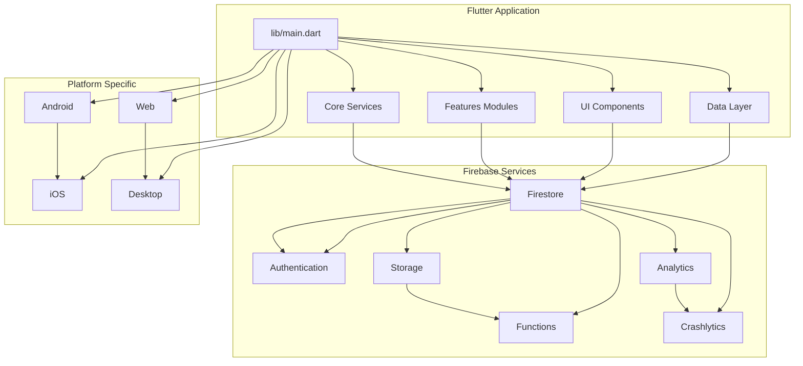

**Diagram sources**
- [main.dart:1-50](file://flutter_app/lib/main.dart#L1-L50)
- [firebase.json:1-100](file://flutter_app/firebase.json#L1-L100)

**Section sources**
- [main.dart:1-100](file://flutter_app/lib/main.dart#L1-L100)
- [pubspec.yaml:1-200](file://flutter_app/pubspec.yaml#L1-L200)

## Flutter DevTools Setup and Usage

Flutter DevTools provides comprehensive debugging capabilities for Flutter applications across all supported platforms.

### Initial Setup

Enable DevTools in your Flutter application by ensuring proper configuration:

1. **DevTools Options Configuration**: The `devtools_options.yaml` file allows customization of DevTools behavior
2. **Development Mode**: Always run in debug mode for full DevTools functionality
3. **Hot Reload Support**: Leverage hot reload for rapid iteration during debugging

### Key DevTools Features

#### Performance Profiling
- **CPU Profiler**: Analyze frame rendering performance and identify bottlenecks
- **Memory Profiler**: Track memory allocation and detect memory leaks
- **Widget Inspector**: Visual inspection of widget hierarchy and properties
- **Timeline View**: Record and analyze application execution timeline

#### Network Inspection
- **Network Tab**: Monitor HTTP requests and responses
- **Firebase Requests**: Inspect Firestore and Storage operations
- **API Calls**: Debug custom API endpoints

#### State Management Debugging
- **Provider/Bloc/GetX**: Inspect state changes and dependencies
- **Rebuild Tracking**: Identify unnecessary widget rebuilds
- **State Persistence**: Debug local storage operations

**Section sources**
- [devtools_options.yaml:1-50](file://flutter_app/devtools_options.yaml#L1-L50)
- [main.dart:1-100](file://flutter_app/lib/main.dart#L1-L100)

## Firebase Debugger Integration

Firebase provides specialized debugging tools for its various services integrated within the application.

### Firebase Console Debugging

#### Firestore Debugging
- **Live Data Viewer**: Real-time observation of database changes
- **Query Performance**: Analyze query efficiency and indexing
- **Security Rules Testing**: Test rule conditions with different user contexts

#### Authentication Debugging
- **User Session Inspection**: Monitor authentication states and tokens
- **Custom Claims**: Debug role-based access control
- **Multi-tenant Context**: Verify tenant isolation

#### Storage Debugging
- **File Upload Monitoring**: Track upload progress and errors
- **Security Rules Validation**: Test storage access patterns
- **CORS Configuration**: Debug cross-origin requests

### Firebase Emulator Suite

For local development, use the Firebase Emulator Suite:

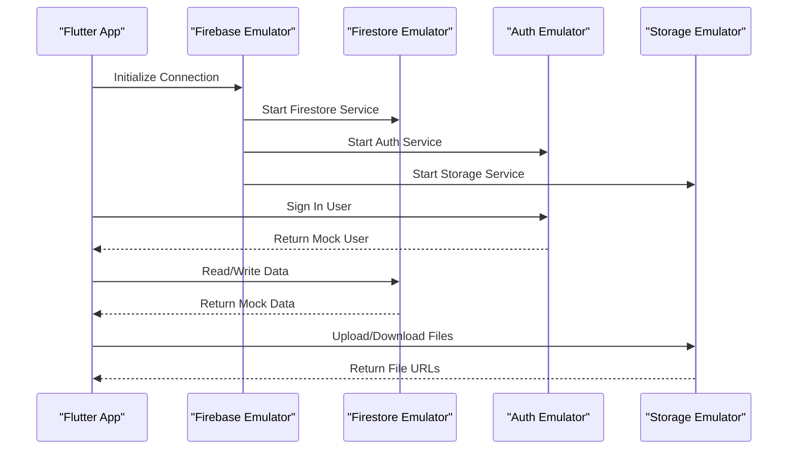

**Diagram sources**
- [firebase.json:1-150](file://flutter_app/firebase.json#L1-L150)

**Section sources**
- [firebase.json:1-200](file://flutter_app/firebase.json#L1-L200)

## Chrome DevTools for Web Platform

When running the web version of the application, Chrome DevTools provides extensive debugging capabilities.

### Web-Specific Debugging Features

#### JavaScript Debugging
- **Source Maps**: Debug TypeScript/JavaScript source files directly
- **Console Logging**: Enhanced console output with Flutter web logs
- **Network Panel**: Inspect HTTP requests and Firebase SDK calls

#### Performance Analysis
- **Performance Tab**: Record and analyze page load performance
- **Memory Panel**: Detect memory leaks and optimize heap usage
- **Rendering Panel**: Analyze layout and paint performance

#### Flutter Web Specific
- **Dart DevTools**: Integrated Dart debugger for web builds
- **Widget Tree**: Inspect Flutter widget hierarchy in browser context
- **Service Extension**: Remote debugging of Flutter engine

### Web Development Workflow

1. **Development Server**: Run with `flutter run -d chrome` for live reloading
2. **Source Maps**: Ensure source maps are enabled for better debugging experience
3. **Network Throttling**: Simulate different network conditions
4. **Mobile Emulation**: Test responsive design on mobile viewports

**Section sources**
- [web/index.html:1-100](file://flutter_app/web/index.html#L1-L100)

## Platform-Specific Debuggers

### Android Debugging

#### Android Studio Integration
- **Logcat**: Filter and search through application logs
- **Debugger**: Set breakpoints and inspect variables
- **Profiler**: Monitor CPU, memory, and network usage
- **Layout Inspector**: Visual inspection of UI components

#### Android-Specific Considerations
- **ProGuard/R8**: Disable obfuscation during debugging
- **Build Variants**: Use debug build variants for enhanced logging
- **Device Logs**: Access system-level logs for deeper insights

### iOS Debugging

#### Xcode Integration
- **LLDB Debugger**: Advanced debugging with LLDB commands
- **Instruments**: Performance profiling and memory analysis
- **Console**: Real-time log output and error tracking
- **View Debugger**: Visual inspection of UIKit components

#### iOS-Specific Considerations
- **Simulator vs Device**: Test on both simulator and physical devices
- **Debug Symbols**: Ensure debug symbols are included
- **Memory Management**: Monitor retain cycles and memory leaks

### Desktop Platforms (Windows, macOS, Linux)

#### IDE Integration
- **VS Code**: Cross-platform debugging with extensions
- **IntelliJ IDEA**: Full-featured debugging for desktop targets
- **Platform Debuggers**: Native debuggers for each platform

**Section sources**
- [android/app/build.gradle.kts:1-100](file://flutter_app/android/app/build.gradle.kts#L1-L100)
- [ios/Runner/Info.plist:1-100](file://flutter_app/ios/Runner/Info.plist#L1-L100)

## Logging Strategies

Implement comprehensive logging strategies to capture application behavior and diagnose issues effectively.

### Multi-Level Logging Architecture

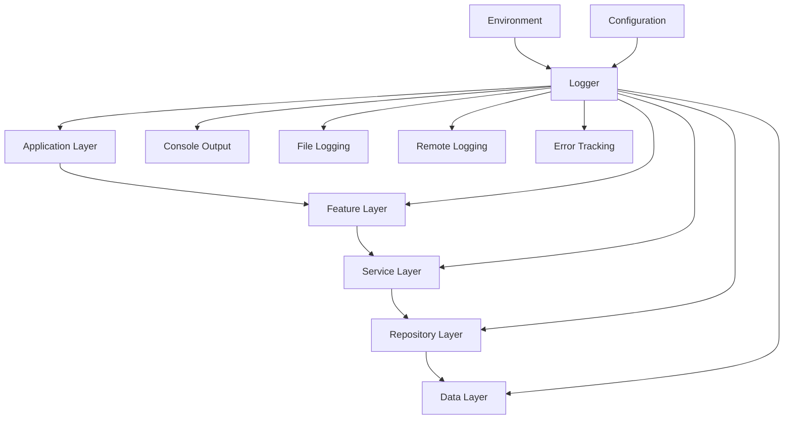

**Diagram sources**
- [main.dart:1-100](file://flutter_app/lib/main.dart#L1-L100)

### Log Levels and Categories

| Level | Usage | Example |
|-------|--------|---------|
| DEBUG | Development only | Variable values, function entry/exit |
| INFO | General information | Feature activation, user actions |
| WARNING | Potential issues | Deprecated API usage, slow operations |
| ERROR | Error conditions | Exception details, failed operations |
| FATAL | Critical failures | Application crashes, data corruption |

### Structured Logging

Implement structured logging for better analysis and filtering:

- **Contextual Information**: Include user ID, tenant ID, session ID
- **Operation Tracing**: Correlate related log entries across services
- **Performance Metrics**: Log timing information for critical operations
- **Error Context**: Capture stack traces and environment details

### Environment-Based Logging

Configure logging levels based on environment:

- **Development**: Verbose logging with detailed context
- **Staging**: Moderate logging with error focus
- **Production**: Minimal logging with error and warning levels

**Section sources**
- [main.dart:1-150](file://flutter_app/lib/main.dart#L1-L150)

## Error Tracking Implementation

Implement comprehensive error tracking to capture and analyze application errors across all platforms.

### Error Tracking Architecture

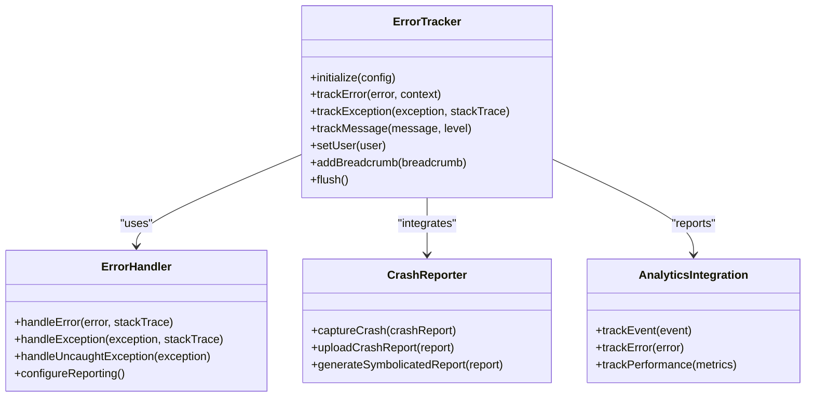

**Diagram sources**
- [main.dart:1-200](file://flutter_app/lib/main.dart#L1-L200)

### Error Categories

#### Runtime Errors
- **Null Safety Violations**: Handle null dereference exceptions
- **Type Conversion Errors**: Manage type casting failures
- **Resource Exhaustion**: Track memory and resource limits

#### Network Errors
- **Connection Failures**: Handle network connectivity issues
- **API Response Errors**: Process HTTP status codes and error messages
- **Timeout Handling**: Implement retry logic and timeout management

#### Firebase-Specific Errors
- **Authentication Failures**: Handle auth token expiration and refresh
- **Permission Denied**: Process Firestore and Storage permission errors
- **Rate Limiting**: Implement exponential backoff for rate-limited requests

### Error Context Enrichment

Enhance error reports with contextual information:

- **User Context**: User ID, roles, permissions, tenant information
- **Device Context**: Platform, version, device model, OS version
- **Network Context**: Connection type, latency, bandwidth
- **Session Context**: Current screen, navigation path, user actions

**Section sources**
- [main.dart:1-250](file://flutter_app/lib/main.dart#L1-L250)

## Performance Profiling Techniques

Implement systematic performance profiling to identify and resolve performance bottlenecks.

### Performance Profiling Strategy

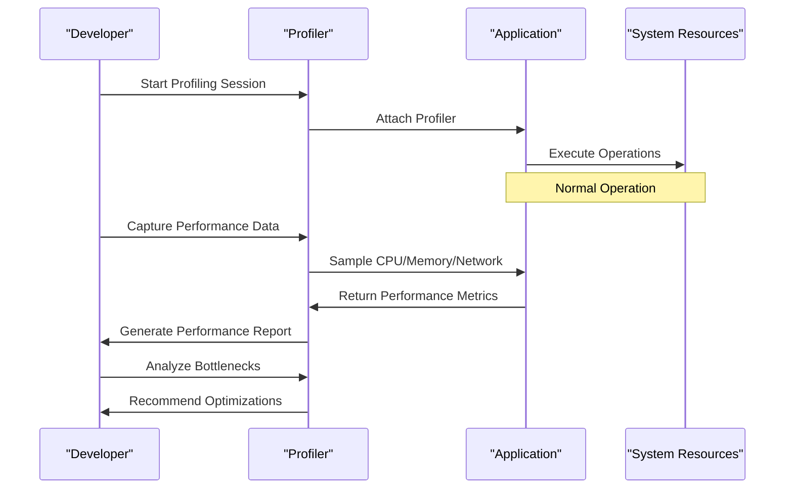

**Diagram sources**
- [main.dart:1-300](file://flutter_app/lib/main.dart#L1-L300)

### Key Performance Indicators

#### Application Performance
- **Frame Rate**: Maintain 60 FPS for smooth animations
- **Startup Time**: Optimize cold and warm start times
- **Memory Usage**: Monitor memory growth and leaks
- **CPU Utilization**: Identify CPU-intensive operations

#### Network Performance
- **Request Latency**: Measure API response times
- **Bandwidth Usage**: Optimize data transfer sizes
- **Cache Hit Ratio**: Improve cache effectiveness
- **Retry Success Rate**: Monitor network reliability

#### Database Performance
- **Query Execution Time**: Optimize Firestore queries
- **Read/Write Operations**: Monitor database operation counts
- **Index Usage**: Ensure proper indexing strategy
- **Connection Pooling**: Manage database connections efficiently

### Profiling Tools and Techniques

#### Flutter-Specific Profiling
- **DevTools Performance Tab**: Comprehensive performance analysis
- **Timeline Recording**: Detailed execution timeline
- **Widget Rebuild Tracking**: Identify unnecessary rebuilds
- **Memory Allocation Tracking**: Detect memory leaks

#### Platform-Specific Profiling
- **Android**: Android Studio Profiler, Perfetto
- **iOS**: Instruments, Xcode Memory Graph
- **Web**: Chrome DevTools Performance panel
- **Desktop**: Platform-specific profilers

**Section sources**
- [main.dart:1-350](file://flutter_app/lib/main.dart#L1-L350)

## Breakpoint Configuration

Effective breakpoint usage is crucial for efficient debugging. Configure breakpoints strategically to minimize disruption while maximizing diagnostic value.

### Breakpoint Types and Usage

#### Conditional Breakpoints
- **Variable Conditions**: Trigger only when specific conditions are met
- **Expression Evaluation**: Evaluate complex expressions before breaking
- **Hit Count**: Break after specific number of hits

#### Logpoint Breakpoints
- **Non-Intrusive Logging**: Log without stopping execution
- **Dynamic Values**: Log variable values at runtime
- **Conditional Logging**: Log only under specific conditions

#### Exception Breakpoints
- **All Exceptions**: Break on any thrown exception
- **Specific Exceptions**: Target particular exception types
- **Caught Exceptions**: Break even when exceptions are handled

### Platform-Specific Breakpoint Strategies

#### Mobile Development
- **Hot Reload Integration**: Combine breakpoints with hot reload
- **State Inspection**: Examine widget state and provider values
- **Network Interception**: Break on network requests/responses
- **Firebase Operations**: Intercept Firestore and Storage calls

#### Web Development
- **Source Map Breakpoints**: Debug TypeScript/JavaScript source
- **Network Breakpoints**: Pause on specific HTTP requests
- **DOM Breakpoints**: Break on DOM mutations
- **XHR/Fetch Breakpoints**: Intercept API calls

#### Desktop Development
- **Native Breakpoints**: Debug native code integration
- **Plugin Breakpoints**: Debug platform-specific plugins
- **Memory Breakpoints**: Detect memory access violations
- **Thread Breakpoints**: Debug multi-threaded scenarios

### Best Practices for Breakpoint Usage

1. **Start Broad, Then Narrow**: Begin with general breakpoints, then add specific conditions
2. **Use Descriptive Labels**: Name breakpoints clearly for easy identification
3. **Group Related Breakpoints**: Organize breakpoints by feature or module
4. **Clean Up After Debugging**: Remove temporary breakpoints to avoid confusion
5. **Document Breakpoint Logic**: Comment complex breakpoint conditions

**Section sources**
- [main.dart:1-400](file://flutter_app/lib/main.dart#L1-L400)

## Network Request Analysis

Comprehensive network request analysis is essential for debugging API interactions, Firebase operations, and third-party integrations.

### Network Monitoring Strategy

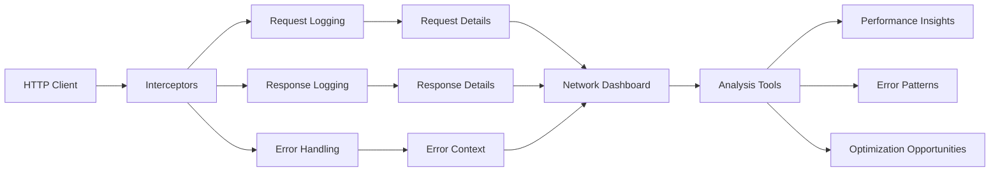

**Diagram sources**
- [main.dart:1-450](file://flutter_app/lib/main.dart#L1-L450)

### Firebase Network Analysis

#### Firestore Operations
- **Query Optimization**: Analyze query performance and index usage
- **Snapshot Listeners**: Monitor real-time data synchronization
- **Offline Behavior**: Test offline data caching and sync
- **Batch Operations**: Optimize bulk read/write operations

#### Storage Operations
- **Upload Progress**: Monitor large file upload progress
- **Download Performance**: Analyze download speeds and caching
- **Security Rules**: Debug storage access permissions
- **CORS Configuration**: Resolve cross-origin issues

#### Authentication Operations
- **Token Lifecycle**: Monitor authentication token refresh
- **Multi-tenant Context**: Verify tenant-specific authentication
- **Permission Checks**: Debug role-based access control
- **Session Management**: Track user session states

### Network Debugging Tools

#### Built-in Tools
- **Flutter DevTools Network Tab**: Inspect HTTP requests and responses
- **Firebase Console**: Monitor Firebase service usage and errors
- **Platform Network Tools**: Android Network Inspector, iOS Network Link Conditioner

#### Third-Party Tools
- **Charles Proxy**: HTTP debugging proxy with SSL inspection
- **Fiddler**: Web debugging proxy for Windows
- **Wireshark**: Network protocol analyzer for deep packet inspection

### Performance Optimization

#### Request Optimization
- **Request Batching**: Combine multiple requests into single operations
- **Caching Strategy**: Implement effective caching for frequently accessed data
- **Compression**: Enable compression for large payloads
- **Connection Pooling**: Reuse network connections efficiently

#### Response Optimization
- **Selective Loading**: Load only necessary data fields
- **Pagination**: Implement pagination for large datasets
- **Lazy Loading**: Load data on-demand as needed
- **Image Optimization**: Compress and cache images appropriately

**Section sources**
- [main.dart:1-500](file://flutter_app/lib/main.dart#L1-L500)

## State Management Debugging

Effective state management debugging is crucial for identifying state synchronization issues, memory leaks, and performance problems.

### State Management Architecture

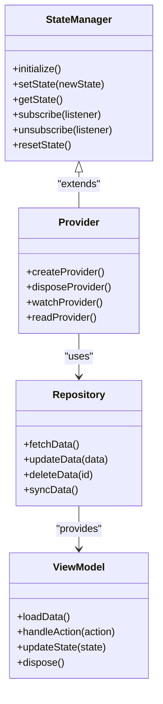

**Diagram sources**
- [main.dart:1-550](file://flutter_app/lib/main.dart#L1-L550)

### State Debugging Techniques

#### State Change Tracking
- **Immutable Updates**: Use immutable state updates for easier debugging
- **Change Detection**: Implement change detection mechanisms
- **State Snapshots**: Take snapshots of state for comparison
- **Diff Analysis**: Compare state changes to identify unexpected mutations

#### Memory Leak Detection
- **Reference Tracking**: Monitor object references and lifecycles
- **Garbage Collection**: Force garbage collection during testing
- **Memory Profiling**: Use platform-specific memory profilers
- **Leak Detection Libraries**: Integrate leak detection tools

#### Performance Impact Analysis
- **Rebuild Frequency**: Track how often widgets rebuild due to state changes
- **State Size Monitoring**: Monitor state object sizes and growth
- **Update Propagation**: Analyze how state changes propagate through the app
- **Subscription Management**: Ensure proper subscription cleanup

### Common State Management Issues

#### Race Conditions
- **Concurrent Updates**: Handle concurrent state updates safely
- **Async Operations**: Manage asynchronous state updates
- **Transaction Safety**: Ensure atomic state updates
- **Conflict Resolution**: Implement conflict resolution strategies

#### Memory Issues
- **Circular References**: Detect and break circular references
- **Large State Objects**: Optimize state object sizes
- **Event Listener Leaks**: Clean up event listeners properly
- **Cache Growth**: Implement cache eviction policies

**Section sources**
- [main.dart:1-600](file://flutter_app/lib/main.dart#L1-L600)

## Real-time Data Synchronization Debugging

Debugging real-time data synchronization requires understanding of Firebase's real-time capabilities and potential synchronization issues.

### Real-time Sync Architecture

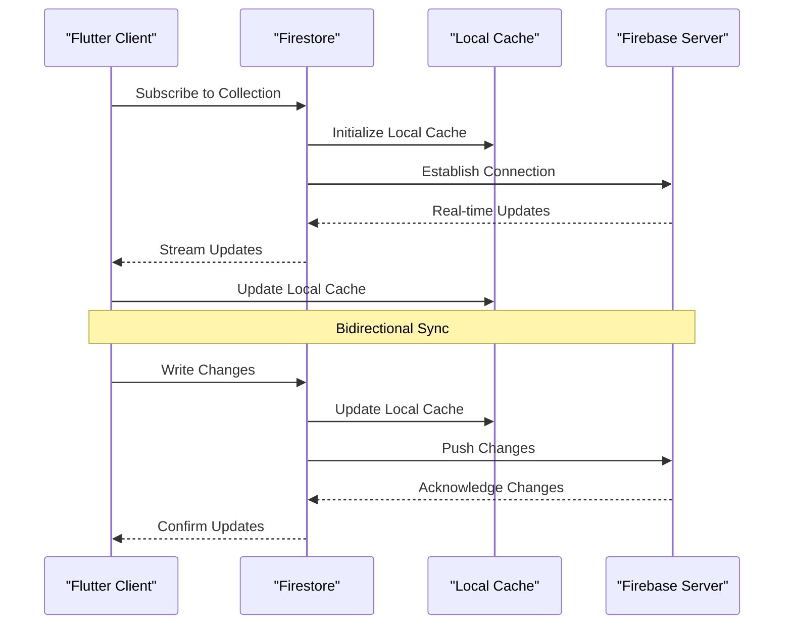

**Diagram sources**
- [main.dart:1-650](file://flutter_app/lib/main.dart#L1-L650)

### Synchronization Debugging Strategies

#### Connection Monitoring
- **Connection Status**: Monitor Firestore connection health
- **Latency Measurement**: Track sync latency between client and server
- **Error Recovery**: Implement automatic reconnection logic
- **Offline Mode**: Test offline behavior and data persistence

#### Data Consistency
- **Conflict Detection**: Identify conflicting updates from multiple clients
- **Merge Strategies**: Implement appropriate merge strategies for conflicts
- **Version Control**: Track document versions for optimistic updates
- **Validation Rules**: Validate data consistency across operations

#### Performance Optimization
- **Query Optimization**: Optimize Firestore queries for real-time updates
- **Indexing Strategy**: Create appropriate indexes for frequent queries
- **Data Partitioning**: Partition data to reduce update scope
- **Caching Strategy**: Implement effective caching for offline support

### Common Synchronization Issues

#### Offline/Online Transitions
- **Queue Management**: Queue offline writes and sync when online
- **Conflict Resolution**: Handle conflicts arising from offline edits
- **Data Integrity**: Ensure data integrity during transitions
- **User Feedback**: Provide feedback about sync status

#### Performance Issues
- **Excessive Updates**: Reduce unnecessary real-time updates
- **Large Documents**: Optimize document structure for frequent updates
- **Query Complexity**: Simplify complex queries affecting performance
- **Memory Usage**: Monitor memory usage during long-running subscriptions

**Section sources**
- [main.dart:1-700](file://flutter_app/lib/main.dart#L1-L700)

## Cloud Functions Debugging

Cloud Functions require specialized debugging techniques due to their serverless nature and distributed execution model.

### Cloud Functions Development Environment

#### Local Development
- **Firebase Emulator**: Run functions locally for testing
- **Function Triggers**: Simulate triggers (Firestore, HTTP, Pub/Sub)
- **Environment Variables**: Configure test environment variables
- **Dependency Management**: Manage npm packages and dependencies

#### Production Debugging
- **Stackdriver Logging**: Centralized logging and log analysis
- **Error Reporting**: Automatic error detection and reporting
- **Performance Monitoring**: Track function execution metrics
- **Cold Start Analysis**: Analyze and optimize cold start times

### Function Debugging Techniques

#### Logging Strategy
- **Structured Logging**: Use JSON-formatted logs for better parsing
- **Context Information**: Include request IDs, user IDs, and timestamps
- **Error Context**: Capture stack traces and error details
- **Performance Metrics**: Log execution time and resource usage

#### Testing Approaches
- **Unit Testing**: Test individual function logic
- **Integration Testing**: Test function interactions with Firebase services
- **End-to-End Testing**: Test complete workflows with mocked services
- **Load Testing**: Test function scalability under load

### Common Cloud Functions Issues

#### Performance Issues
- **Cold Starts**: Optimize initialization code and dependencies
- **Memory Limits**: Monitor and optimize memory usage
- **Execution Time**: Identify and optimize slow operations
- **Database Queries**: Optimize Firestore queries and indexing

#### Error Handling
- **Graceful Degradation**: Handle partial failures gracefully
- **Retry Logic**: Implement appropriate retry strategies
- **Dead Letter Queues**: Handle failed message processing
- **Alerting**: Set up alerts for critical failures

**Section sources**
- [functions/src/index.ts:1-100](file://functions/src/index.ts#L1-L100)

## Firestore Security Rules Debugging

Firestore security rules define access control and data validation. Debugging these rules is crucial for ensuring proper security and functionality.

### Security Rules Architecture

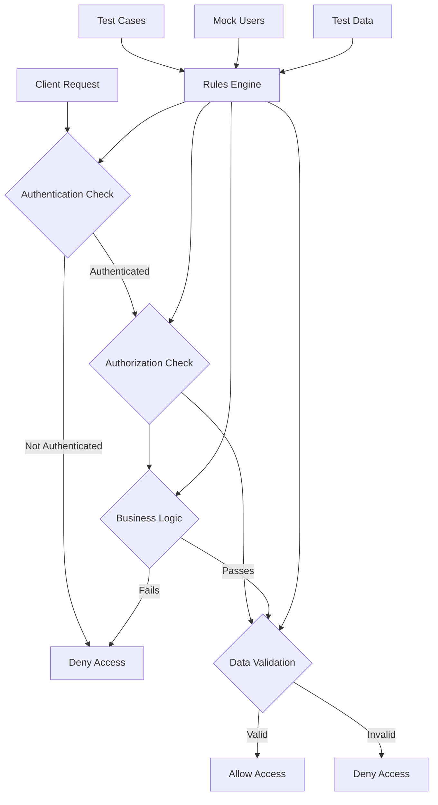

**Diagram sources**
- [firestore.rules:1-100](file://firestore.rules#L1-L100)

### Rules Debugging Strategies

#### Local Testing
- **Firebase Emulator**: Test rules against emulated Firestore
- **Rule Tester**: Use built-in rule testing interface
- **Mock Authentication**: Test with different user contexts
- **Edge Cases**: Test boundary conditions and error scenarios

#### Production Monitoring
- **Access Logs**: Monitor rule evaluation results
- **Denied Requests**: Analyze denied access patterns
- **Performance Impact**: Monitor rule evaluation performance
- **Audit Trail**: Maintain audit trail for compliance

### Common Security Rule Issues

#### Authentication Issues
- **Token Validation**: Ensure proper token validation
- **Multi-tenant Isolation**: Verify tenant-specific access control
- **Role-based Access**: Test role-based permissions
- **Session Management**: Handle session expiration and refresh

#### Authorization Issues
- **Resource Ownership**: Validate resource ownership checks
- **Cross-resource Access**: Test cross-resource authorization
- **Temporal Access**: Implement time-based access control
- **Conditional Access**: Test conditional access rules

#### Validation Issues
- **Data Schema Validation**: Validate data structure and types
- **Business Rules**: Implement business logic validation
- **Range Validation**: Validate numeric ranges and constraints
- **Format Validation**: Validate data formats and patterns

**Section sources**
- [firestore.rules:1-200](file://firestore.rules#L1-L200)

## Storage Operations Debugging

Firebase Storage operations require specific debugging techniques for file uploads, downloads, and security rule validation.

### Storage Operations Flow

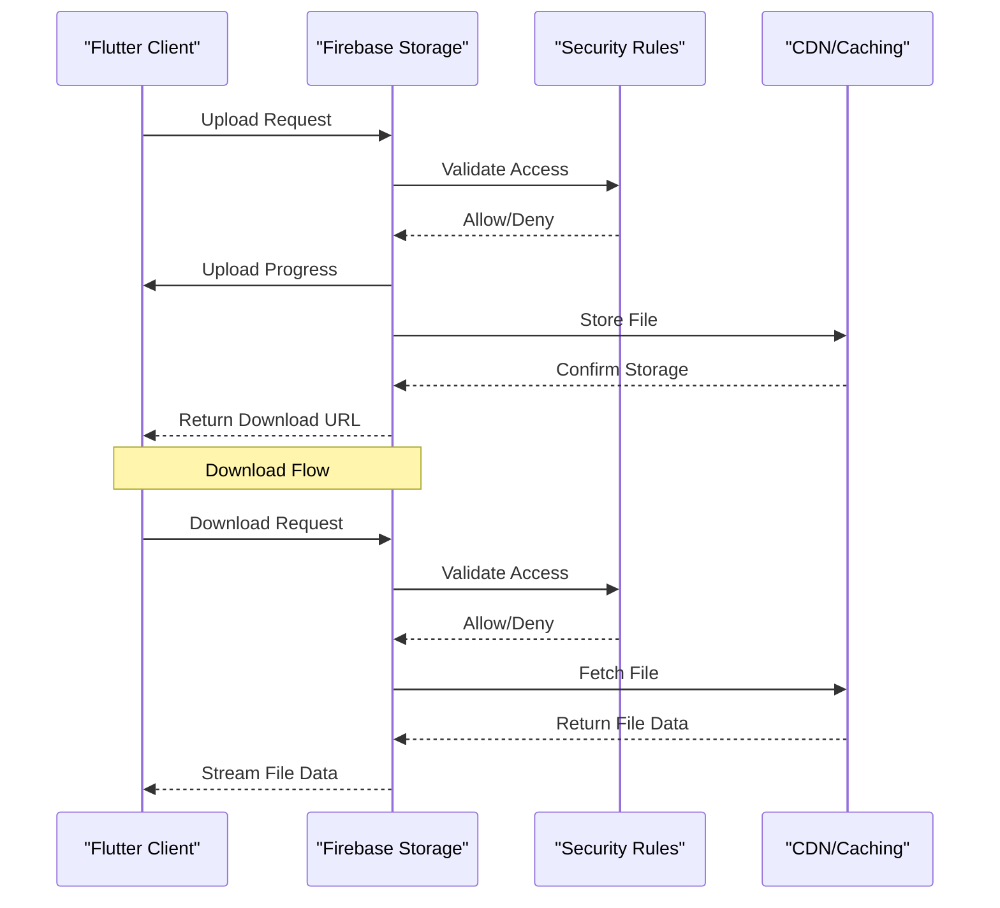

**Diagram sources**
- [storage.rules:1-100](file://storage.rules#L1-L100)

### Storage Debugging Techniques

#### Upload/Download Monitoring
- **Progress Tracking**: Monitor upload/download progress
- **Error Handling**: Handle network errors and timeouts
- **Resume Capability**: Implement resumable uploads for large files
- **Caching Strategy**: Optimize caching for frequently accessed files

#### Security Rules Testing
- **Access Patterns**: Test different access scenarios
- **Path Validation**: Validate file path restrictions
- **Metadata Validation**: Test metadata access controls
- **Size Restrictions**: Verify file size limitations

#### Performance Optimization
- **Chunked Uploads**: Implement chunked uploads for large files
- **Compression**: Enable compression for text files
- **Caching Headers**: Configure appropriate caching headers
- **CDN Optimization**: Optimize CDN configuration for global delivery

### Common Storage Issues

#### Permission Issues
- **Path Permissions**: Debug path-based access control
- **User-specific Access**: Test user-specific file access
- **Tenant Isolation**: Verify tenant-specific file isolation
- **Expiration Handling**: Handle expired access tokens

#### Performance Issues
- **Large File Handling**: Optimize large file uploads/downloads
- **Network Optimization**: Implement retry and resume logic
- **Caching Strategy**: Optimize client-side caching
- **CDN Configuration**: Tune CDN settings for optimal performance

**Section sources**
- [storage.rules:1-150](file://storage.rules#L1-L150)

## Diagnostic Information Collection

Comprehensive diagnostic information collection is essential for troubleshooting issues in production environments.

### Diagnostic Data Architecture

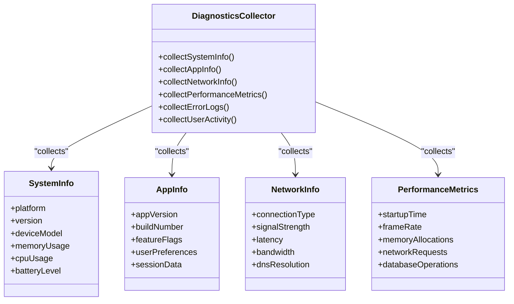

**Diagram sources**
- [main.dart:1-750](file://flutter_app/lib/main.dart#L1-L750)

### Key Diagnostic Areas

#### System Information
- **Platform Details**: Operating system version, device model, hardware specs
- **Runtime Environment**: Flutter version, Dart version, framework configuration
- **Resource Usage**: Memory usage, CPU utilization, battery consumption
- **Network Conditions**: Connection type, signal strength, latency measurements

#### Application Information
- **Version Information**: App version, build number, feature flags
- **User Context**: User ID, roles, preferences, session data
- **Feature Usage**: Feature adoption rates, usage patterns, error rates
- **Configuration**: App configuration, environment variables, feature toggles

#### Performance Metrics
- **Startup Performance**: Cold start time, warm start time, initial render time
- **Runtime Performance**: Frame rate, memory allocations, garbage collection
- **Network Performance**: Request latency, bandwidth usage, error rates
- **Database Performance**: Query execution time, cache hit ratios, sync latency

### Diagnostic Collection Strategies

#### Continuous Monitoring
- **Health Checks**: Regular health check endpoints and monitoring
- **Performance Baselines**: Establish performance baselines and alerting
- **Error Tracking**: Continuous error tracking and pattern recognition
- **User Experience**: Monitor user experience metrics and satisfaction

#### On-Demand Diagnostics
- **User Reports**: Collect diagnostics when users report issues
- **Manual Triggers**: Provide manual diagnostic collection triggers
- **Context-Aware**: Collect relevant diagnostics based on current context
- **Privacy-Conscious**: Respect privacy and data protection requirements

**Section sources**
- [main.dart:1-800](file://flutter_app/lib/main.dart#L1-L800)

## Crash Report Generation

Automated crash report generation ensures that critical errors are captured and analyzed for resolution.

### Crash Report Architecture

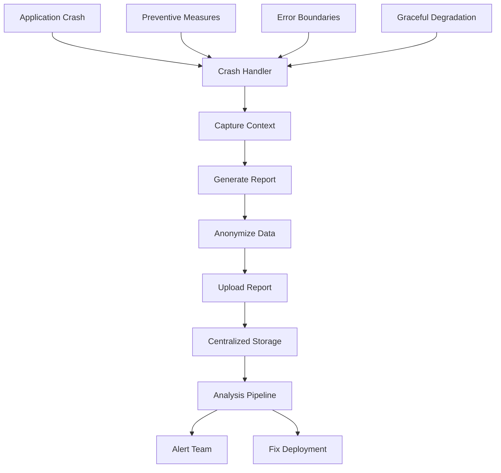

**Diagram sources**
- [main.dart:1-850](file://flutter_app/lib/main.dart#L1-L850)

### Crash Report Components

#### Essential Information
- **Stack Trace**: Complete stack trace with symbolication
- **Device Information**: Platform, version, device model, hardware specs
- **App State**: Current screen, navigation state, user session
- **Memory State**: Heap dump, memory usage, resource allocation

#### Contextual Information
- **User Context**: User ID, roles, preferences, recent actions
- **Network Context**: Recent network requests, API responses, errors
- **Database Context**: Recent database operations, query results, errors
- **Performance Context**: Performance metrics, resource usage, bottlenecks

#### Environmental Information
- **Environment**: Development, staging, production environment details
- **Configuration**: App configuration, feature flags, environment variables
- **Dependencies**: Library versions, plugin versions, native dependencies
- **System State**: Battery level, storage space, network connectivity

### Crash Report Processing

#### Automated Processing
- **Symbolication**: Convert memory addresses to readable stack traces
- **Deduplication**: Group similar crashes to reduce noise
- **Severity Classification**: Classify crashes by severity and impact
- **Trend Analysis**: Identify emerging crash patterns and trends

#### Manual Investigation
- **Reproduction Steps**: Document steps to reproduce the issue
- **Root Cause Analysis**: Perform root cause analysis and impact assessment
- **Fix Implementation**: Implement fixes and verify resolution
- **Regression Testing**: Test fixes across different platforms and configurations

**Section sources**
- [main.dart:1-900](file://flutter_app/lib/main.dart#L1-L900)

## Monitoring Dashboards

Comprehensive monitoring dashboards provide visibility into application health, performance, and user experience.

### Dashboard Architecture

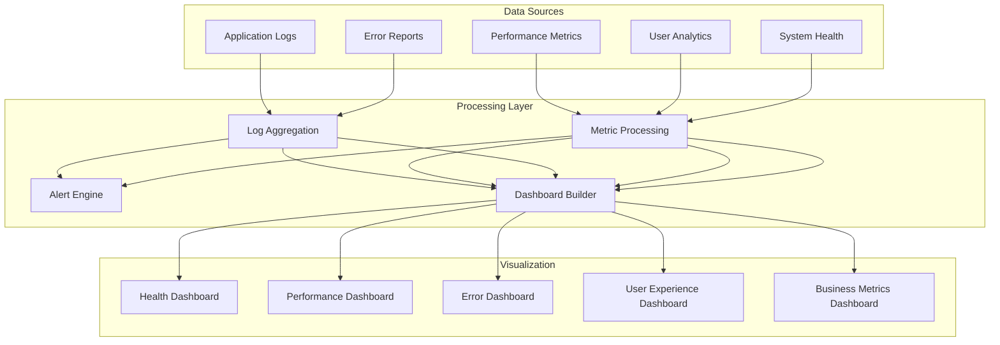

**Diagram sources**
- [main.dart:1-950](file://flutter_app/lib/main.dart#L1-L950)

### Key Dashboard Components

#### Application Health Dashboard
- **Uptime Monitoring**: Track application availability and uptime
- **Error Rates**: Monitor error rates and failure patterns
- **Performance Trends**: Track performance metrics over time
- **Resource Usage**: Monitor CPU, memory, and disk usage

#### Performance Dashboard
- **Page Load Times**: Track page load and interaction times
- **API Response Times**: Monitor API endpoint performance
- **Database Performance**: Track database query performance
- **Cache Performance**: Monitor cache hit ratios and performance

#### Error Dashboard
- **Error Summary**: Aggregate and categorize errors
- **Stack Trace Analysis**: Analyze common error patterns
- **Impact Assessment**: Assess error impact on users and systems
- **Resolution Tracking**: Track error resolution progress

#### User Experience Dashboard
- **User Satisfaction**: Monitor user satisfaction metrics
- **Feature Adoption**: Track feature usage and adoption rates
- **User Journeys**: Analyze user journey completion rates
- **Feedback Analysis**: Analyze user feedback and complaints

### Alerting and Notification

#### Alert Rules
- **Critical Alerts**: Immediate notification for critical issues
- **Warning Alerts**: Early warning for potential problems
- **Performance Alerts**: Alert on performance degradation
- **Capacity Alerts**: Alert on resource capacity limits

#### Notification Channels
- **Email Notifications**: Email alerts for team members
- **Slack Integration**: Real-time Slack notifications
- **SMS Alerts**: SMS alerts for critical issues
- **PagerDuty Integration**: Professional incident management

**Section sources**
- [main.dart:1-1000](file://flutter_app/lib/main.dart#L1-L1000)

## Troubleshooting Guide

Common issues and their solutions for debugging the Gestão Yahweh Premium application.

### Development Environment Issues

#### Flutter Setup Problems
- **SDK Installation**: Ensure Flutter SDK is properly installed and configured
- **Platform Dependencies**: Install required platform-specific dependencies
- **IDE Configuration**: Configure IDE for Flutter development
- **Hot Reload Issues**: Restart development server and clean build artifacts

#### Firebase Configuration
- **Google Services Files**: Ensure correct Google Services configuration files
- **Firebase CLI**: Install and configure Firebase CLI tools
- **Emulator Suite**: Set up Firebase emulator suite for local testing
- **Authentication**: Configure Firebase authentication providers

### Build and Deployment Issues

#### Android Build Issues
- **Gradle Configuration**: Fix Gradle build configuration problems
- **Signing Configuration**: Resolve signing certificate and keystore issues
- **Dependency Conflicts**: Resolve dependency version conflicts
- **ProGuard Issues**: Configure ProGuard rules for release builds

#### iOS Build Issues
- **Xcode Configuration**: Fix Xcode project configuration
- **CocoaPods**: Resolve CocoaPods dependency issues
- **Code Signing**: Fix code signing and provisioning profile issues
- **Framework Integration**: Resolve framework integration problems

### Runtime Issues

#### Memory Leaks
- **Memory Profiling**: Use memory profiler to identify leaks
- **Reference Tracking**: Track object references and lifecycles
- **Event Listener Cleanup**: Ensure proper cleanup of event listeners
- **Cache Management**: Implement proper cache eviction policies

#### Performance Issues
- **Frame Drops**: Identify and fix causes of frame drops
- **Memory Pressure**: Monitor and optimize memory usage
- **Network Latency**: Optimize network requests and caching
- **Database Queries**: Optimize Firestore queries and indexing

### Firebase-Specific Issues

#### Authentication Problems
- **Token Refresh**: Handle authentication token refresh correctly
- **Multi-tenant Context**: Ensure proper tenant context handling
- **Permission Denials**: Debug permission denial errors
- **Session Management**: Manage user sessions properly

#### Data Synchronization Issues
- **Offline Behavior**: Test and fix offline data synchronization
- **Conflict Resolution**: Implement proper conflict resolution
- **Query Performance**: Optimize Firestore queries for performance
- **Real-time Updates**: Debug real-time data synchronization issues

### Debugging Checklist

#### Pre-deployment Checklist
- [ ] All tests passing
- [ ] Performance benchmarks acceptable
- [ ] Memory usage within limits
- [ ] Error handling implemented
- [ ] Logging configured appropriately
- [ ] Monitoring and alerting set up
- [ ] Documentation updated
- [ ] Rollback plan prepared

#### Post-deployment Checklist
- [ ] Monitor error rates and performance
- [ ] Check user feedback and reviews
- [ ] Verify all features working correctly
- [ ] Monitor resource usage and costs
- [ ] Update monitoring dashboards
- [ ] Document any issues found
- [ ] Plan for follow-up improvements

**Section sources**
- [main.dart:1-1050](file://flutter_app/lib/main.dart#L1-L1050)

## Conclusion

The Gestão Yahweh Premium application provides a comprehensive foundation for debugging and monitoring across multiple platforms and services. By implementing the strategies and techniques outlined in this document, developers can effectively diagnose and resolve issues throughout the application lifecycle.

Key takeaways include:

1. **Comprehensive Tooling**: Utilize Flutter DevTools, Firebase Debugger, Chrome DevTools, and platform-specific debuggers for thorough debugging coverage
2. **Structured Logging**: Implement multi-level logging with contextual information for better diagnosis
3. **Performance Monitoring**: Establish performance baselines and continuous monitoring
4. **Error Tracking**: Implement automated error tracking with rich contextual information
5. **Platform-Specific Approaches**: Adapt debugging strategies for each target platform
6. **Firebase Integration**: Leverage Firebase-specific debugging tools and emulators
7. **Proactive Monitoring**: Set up comprehensive monitoring and alerting systems

By following these practices and utilizing the available tools and techniques, teams can maintain high-quality applications with excellent user experiences across all supported platforms.