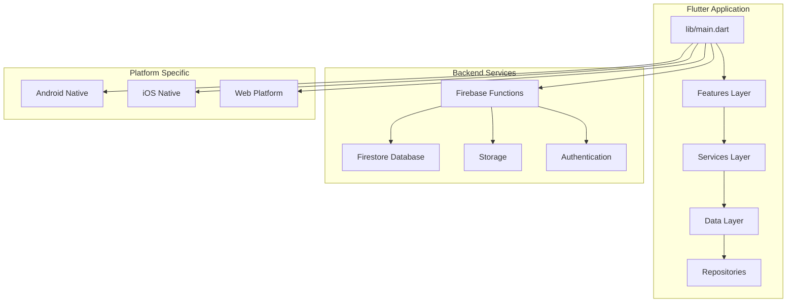
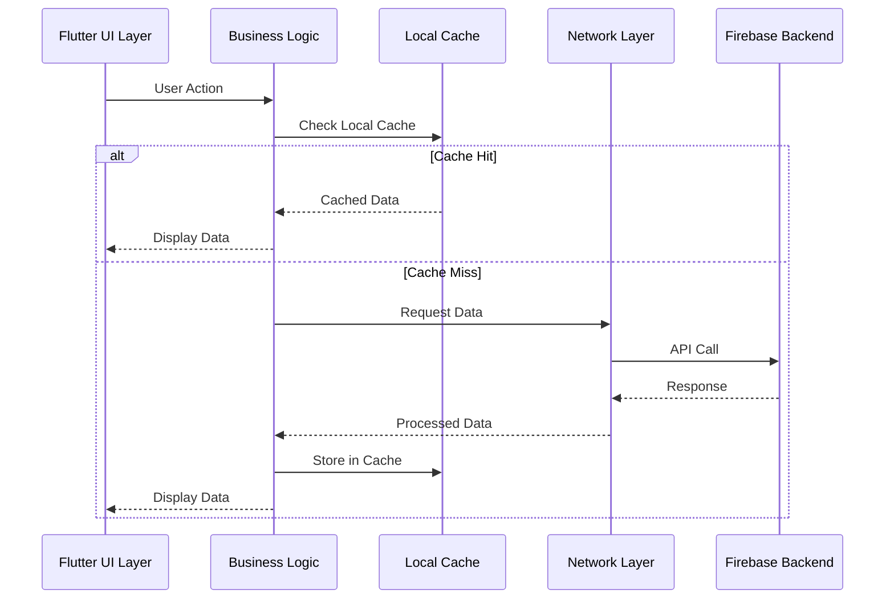
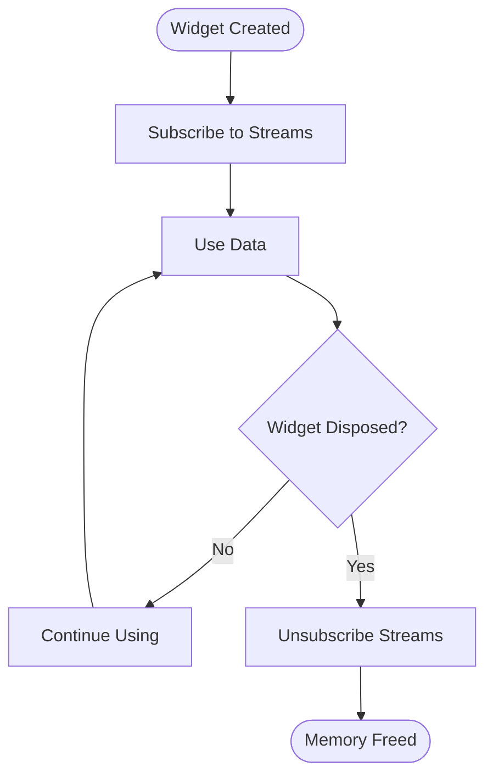

# Performance Troubleshooting

<cite>
**Referenced Files in This Document**
- [main.dart](file://flutter_app/lib/main.dart)
- [pubspec.yaml](file://flutter_app/pubspec.yaml)
- [firebase.json](file://flutter_app/firebase.json)
- [firestore.rules](file://firestore.rules)
- [storage.rules](file://storage.rules)
- [functions/index.js](file://functions/index.js)
- [ARCHITECTURE_PERFORMANCE_MULTI_PLATFORM.md](file://docs/ARCHITECTURE_PERFORMANCE_MULTI_PLATFORM.md)
- [PADRONIZACAO_PERFORMANCE_CONTROLE_TOTAL.md](file://docs/PADRONIZACAO_PERFORMANCE_CONTROLE_TOTAL.md)
- [FIREBASE_OBSERVABILITY.md](file://docs/FIREBASE_OBSERVABILITY.md)
- [instant-media-performance.md](file://docs/instant-media-performance.md)
- [ANALISE_PROJETO.md](file://flutter_app/ANALISE_PROJETO.md)
</cite>

## Table of Contents
1. [Introduction](#introduction)
2. [Project Structure Overview](#project-structure-overview)
3. [Core Performance Components](#core-performance-components)
4. [Architecture Overview](#architecture-overview)
5. [Memory Leak Detection and Analysis](#memory-leak-detection-and-analysis)
6. [CPU Usage Analysis and Optimization](#cpu-usage-analysis-and-optimization)
7. [Network Performance Optimization](#network-performance-optimization)
8. [Flutter UI Rendering Bottlenecks](#flutter-ui-rendering-bottlenecks)
9. [Database Query Optimization](#database-query-optimization)
10. [File I/O Operations Optimization](#file-io-operations-optimization)
11. [Firebase Query Optimization](#firebase-query-optimization)
12. [Caching Strategies](#caching-strategies)
13. [Background Task Performance](#background-task-performance)
14. [Performance Monitoring Tools](#performance-monitoring-tools)
15. [Bundle Size Optimization](#bundle-size-optimization)
16. [Troubleshooting Guide](#troubleshooting-guide)
17. [Conclusion](#conclusion)

## Introduction

This comprehensive performance troubleshooting guide for the Gestão Yahweh Premium application focuses on identifying and resolving performance bottlenecks across memory management, CPU usage, network operations, and UI rendering. The application is a Flutter-based multi-platform solution with extensive Firebase integration, requiring systematic approaches to performance optimization and monitoring.

The guide covers essential performance analysis techniques including memory leak detection, CPU profiling, network optimization, database query tuning, and bundle size reduction strategies specific to Flutter applications with Firebase backend services.

## Project Structure Overview

The Gestão Yahweh Premium application follows a modular Flutter architecture with clear separation between presentation, business logic, and data layers. The project structure includes:

**Diagram sources**
- [main.dart](file://flutter_app/lib/main.dart)
- [functions/index.js](file://functions/index.js)

**Section sources**
- [ANALISE_PROJETO.md](file://flutter_app/ANALISE_PROJETO.md)

## Core Performance Components

The application's performance-critical components include:

### Memory Management Layer
- Widget lifecycle management
- Stream subscription handling
- Image caching and disposal
- Database connection pooling

### Network Optimization Layer
- Firebase Realtime Database listeners
- Cloud Storage media handling
- HTTP request batching
- Connection reuse strategies

### Data Processing Layer
- Firestore query optimization
- Local database synchronization
- Background task scheduling
- Cache invalidation policies

**Section sources**
- [ARCHITECTURE_PERFORMANCE_MULTI_PLATFORM.md](file://docs/ARCHITECTURE_PERFORMANCE_MULTI_PLATFORM.md)
- [PADRONIZACAO_PERFORMANCE_CONTROLE_TOTAL.md](file://docs/PADRONIZACAO_PERFORMANCE_CONTROLE_TOTAL.md)

## Architecture Overview

The performance architecture follows a layered approach with clear separation of concerns:

**Diagram sources**
- [main.dart](file://flutter_app/lib/main.dart)
- [functions/index.js](file://functions/index.js)

## Memory Leak Detection and Analysis

### Common Memory Leak Patterns in Flutter

#### Stream Subscription Leaks
Monitor unsubscription patterns in widget disposal:

#### Image Resource Management
Implement proper image disposal strategies:

- Use `ImageProvider` with appropriate cache configurations
- Implement custom image decoders for large assets
- Monitor memory usage during image loading
- Clear image caches when not needed

#### Database Connection Leaks
Ensure proper cleanup of Firebase connections:

- Close Firestore instances when no longer needed
- Handle reconnection scenarios gracefully
- Monitor active listener counts
- Implement connection pooling where appropriate

### Memory Profiling Techniques

#### Flutter DevTools Memory Analysis
1. Enable memory profiling in debug builds
2. Take heap snapshots at different app states
3. Analyze object retention graphs
4. Identify unreachable objects still referenced

#### Android/iOS Memory Profilers
- Use Android Studio Memory Profiler
- Monitor iOS Instruments Allocation Tracker
- Track native memory usage
- Analyze memory dumps for leaks

**Section sources**
- [FIREBASE_OBSERVABILITY.md](file://docs/FIREBASE_OBSERVABILITY.md)

## CPU Usage Analysis and Optimization

### CPU-Intensive Operations Identification

#### Heavy Computation Tasks
Identify and optimize CPU-heavy operations:

- Complex calculations in UI thread
- Large list processing without virtualization
- Image manipulation operations
- JSON parsing of large datasets

#### Animation Performance
Optimize animation performance:

- Use `RepaintBoundary` widgets strategically
- Minimize rebuilds with `const` constructors
- Implement efficient state management
- Profile animation frame rates

### CPU Profiling Methods

#### Flutter Performance Overlay
Enable performance overlay to identify:

- Build phase duration
- Layout phase bottlenecks
- Raster phase issues
- GPU vs CPU rendering

#### System-Level Profiling
- Use Android Studio CPU Profiler
- Monitor iOS Activity Monitor
- Track background process CPU usage
- Analyze thermal throttling impact

**Section sources**
- [instant-media-performance.md](file://docs/instant-media-performance.md)

## Network Performance Optimization

### Firebase Network Optimization

#### Query Optimization
Optimize Firestore queries for better performance:

- Use compound indexes effectively
- Limit query result sets with pagination
- Implement selective field retrieval
- Cache frequently accessed data

#### Connection Management
Manage Firebase connections efficiently:

- Reuse existing connections
- Implement exponential backoff
- Handle network failures gracefully
- Monitor connection pool usage

### Network Monitoring and Analysis

#### Request/Response Analysis
Track network performance metrics:

- Measure request latency
- Monitor response sizes
- Analyze retry patterns
- Track error rates

#### Bandwidth Optimization
Reduce network bandwidth usage:

- Implement data compression
- Use efficient serialization formats
- Cache responses appropriately
- Optimize payload structures

**Section sources**
- [PADRONIZACAO_PERFORMANCE_CONTROLE_TOTAL.md](file://docs/PADRONIZACAO_PERFORMANCE_CONTROLE_TOTAL.md)

## Flutter UI Rendering Bottlenecks

### Widget Tree Optimization

#### Efficient State Management
Optimize widget rebuilds:

- Use `ValueListenableBuilder` for reactive updates
- Implement `shouldRebuild` in custom widgets
- Separate stateful and stateless widgets
- Use provider or riverpod for efficient state sharing

#### List Performance
Handle large lists efficiently:

- Use `ListView.builder` for dynamic content
- Implement item recycling properly
- Avoid heavy computations in build methods
- Use `const` constructors where possible

### Rendering Pipeline Optimization

#### Paint Phase Optimization
Minimize paint operations:

- Use `CustomPainter` for complex graphics
- Implement `shouldRepaint` correctly
- Avoid unnecessary widget rebuilds
- Use `RepaintBoundary` strategically

#### Layout Phase Optimization
Optimize layout calculations:

- Minimize nested layouts
- Use appropriate sizing constraints
- Avoid expensive layout operations
- Cache layout results when possible

**Section sources**
- [ARCHITECTURE_PERFORMANCE_MULTI_PLATFORM.md](file://docs/ARCHITECTURE_PERFORMANCE_MULTI_PLATFORM.md)

## Database Query Optimization

### Firestore Query Best Practices

#### Index Optimization
Create and manage Firestore indexes:

- Define composite indexes for complex queries
- Monitor index usage and costs
- Remove unused indexes
- Use single-field indexes when possible

#### Query Pattern Optimization
Optimize query patterns:

- Use `where` clauses effectively
- Implement pagination for large datasets
- Avoid deep nesting in queries
- Use collection group queries judiciously

### Local Database Optimization

#### SQLite/Isar Configuration
Optimize local database performance:

- Configure appropriate cache sizes
- Use transactions for bulk operations
- Implement proper indexing strategies
- Clean up unused data regularly

#### Synchronization Strategy
Optimize data synchronization:

- Implement delta sync where possible
- Handle conflict resolution efficiently
- Batch updates when possible
- Monitor sync performance metrics

**Section sources**
- [FIREBASE_OBSERVABILITY.md](file://docs/FIREBASE_OBSERVABILITY.md)

## File I/O Operations Optimization

### File Access Patterns

#### Asynchronous File Operations
Implement efficient file I/O:

- Use async/await for file operations
- Implement proper error handling
- Cache file metadata when appropriate
- Use streaming for large files

#### Memory-Mapped Files
For large file access:

- Use memory-mapped files for random access
- Implement proper resource cleanup
- Monitor memory usage during file operations
- Consider chunked reading for large files

### Storage Optimization

#### Cloud Storage Optimization
Optimize cloud storage operations:

- Use appropriate upload/download strategies
- Implement resumable uploads
- Cache frequently accessed files
- Monitor storage costs and performance

#### Local Cache Management
Implement effective local caching:

- Use appropriate cache eviction policies
- Monitor cache hit rates
- Implement cache warming strategies
- Clean up stale cache entries

**Section sources**
- [instant-media-performance.md](file://docs/instant-media-performance.md)

## Firebase Query Optimization

### Query Performance Tuning

#### Compound Indexes
Create optimal indexes for queries:

- Analyze query patterns
- Create composite indexes for frequent queries
- Monitor index usage and costs
- Remove redundant indexes

#### Query Optimization Techniques
Optimize query execution:

- Use field selection to reduce data transfer
- Implement pagination for large result sets
- Use server-side filtering when possible
- Cache query results appropriately

### Real-time Data Optimization

#### Listener Management
Optimize real-time listeners:

- Unsubscribe from unused listeners
- Implement listener pooling
- Handle connection drops gracefully
- Monitor listener count and memory usage

#### Data Transformation
Optimize data transformation:

- Transform data on the server when possible
- Use efficient client-side transformations
- Cache transformed data
- Implement lazy loading for large datasets

**Section sources**
- [PADRONIZACAO_PERFORMANCE_CONTROLE_TOTAL.md](file://docs/PADRONIZACAO_PERFORMANCE_CONTROLE_TOTAL.md)

## Caching Strategies

### Multi-Level Caching Architecture

#### In-Memory Cache
Implement efficient in-memory caching:

- Use appropriate cache sizes
- Implement TTL (Time To Live) policies
- Handle cache collisions
- Monitor cache hit rates

#### Disk Cache
Optimize disk caching:

- Use appropriate compression
- Implement cache warming strategies
- Handle cache corruption gracefully
- Monitor disk space usage

#### Network Cache
Implement network-level caching:

- Use HTTP caching headers effectively
- Implement conditional requests
- Cache failed requests appropriately
- Monitor cache effectiveness

### Cache Invalidation Strategies

#### Time-Based Invalidation
Implement time-based cache invalidation:

- Set appropriate TTL values
- Handle cache expiration gracefully
- Implement cache warming on expiration
- Monitor cache freshness

#### Event-Based Invalidation
Implement event-driven cache invalidation:

- Listen for data changes
- Invalidate related cache entries
- Handle cache consistency
- Monitor cache coherence

**Section sources**
- [FIREBASE_OBSERVABILITY.md](file://docs/FIREBASE_OBSERVABILITY.md)

## Background Task Performance

### Background Processing Optimization

#### Task Scheduling
Optimize background task scheduling:

- Use appropriate scheduling strategies
- Implement task prioritization
- Handle task dependencies
- Monitor task execution times

#### Resource Management
Optimize resource usage in background tasks:

- Implement proper resource cleanup
- Handle memory constraints
- Monitor CPU and memory usage
- Implement graceful degradation

### Background Sync Optimization

#### Sync Strategy Optimization
Optimize background synchronization:

- Implement batch synchronization
- Handle conflicts efficiently
- Monitor sync performance
- Implement retry mechanisms

#### Conflict Resolution
Optimize conflict resolution:

- Implement merge strategies
- Handle concurrent updates
- Maintain data consistency
- Log conflicts for analysis

**Section sources**
- [ARCHITECTURE_PERFORMANCE_MULTI_PLATFORM.md](file://docs/ARCHITECTURE_PERFORMANCE_MULTI_PLATFORM.md)

## Performance Monitoring Tools

### Development Tools

#### Flutter DevTools
Utilize Flutter DevTools for performance analysis:

- Memory profiler for leak detection
- Performance overlay for UI analysis
- Network profiler for API monitoring
- Widget inspector for tree analysis

#### Firebase Console
Use Firebase Console for backend monitoring:

- Firestore usage and costs
- Storage usage and bandwidth
- Authentication metrics
- Function invocation logs

### Production Monitoring

#### Crash Reporting
Implement crash reporting:

- Use Firebase Crashlytics
- Monitor error rates and trends
- Track performance regressions
- Alert on critical issues

#### Custom Metrics
Implement custom performance metrics:

- Track key performance indicators
- Monitor user experience metrics
- Log performance anomalies
- Generate performance reports

**Section sources**
- [FIREBASE_OBSERVABILITY.md](file://docs/FIREBASE_OBSERVABILITY.md)

## Bundle Size Optimization

### Code Splitting and Lazy Loading

#### Feature-Based Splitting
Implement code splitting by features:

- Load features on demand
- Share common code efficiently
- Optimize dependency loading
- Monitor bundle sizes per feature

#### Route-Based Lazy Loading
Implement route-based code splitting:

- Load routes lazily
- Preload critical routes
- Handle loading states
- Optimize navigation performance

### Asset Optimization

#### Image Optimization
Optimize images and assets:

- Use appropriate image formats
- Implement responsive images
- Compress assets efficiently
- Cache assets appropriately

#### Dependency Optimization
Optimize third-party dependencies:

- Remove unused dependencies
- Use lightweight alternatives
- Implement tree shaking
- Monitor dependency sizes

**Section sources**
- [PADRONIZACAO_PERFORMANCE_CONTROLE_TOTAL.md](file://docs/PADRONIZACAO_PERFORMANCE_CONTROLE_TOTAL.md)

## Troubleshooting Guide

### Common Performance Issues

#### Memory Leaks
Symptoms and solutions:

- Increasing memory usage over time
- App crashes due to memory pressure
- Slow performance after extended use
- Solution: Use memory profilers and fix stream subscriptions

#### UI Freezing
Symptoms and solutions:

- Unresponsive UI during operations
- Frame drops during animations
- Slow scrolling performance
- Solution: Offload heavy operations to background threads

#### Network Latency
Symptoms and solutions:

- Slow data loading
- High latency on API calls
- Frequent timeouts
- Solution: Implement caching and optimize queries

### Debugging Techniques

#### Performance Regression Detection
Identify performance regressions:

- Compare performance metrics across versions
- Monitor key performance indicators
- Set up automated performance testing
- Alert on performance thresholds

#### Root Cause Analysis
Perform systematic root cause analysis:

- Isolate problematic components
- Use profiling tools to identify bottlenecks
- Analyze stack traces and logs
- Test hypotheses systematically

### Recovery Strategies

#### Graceful Degradation
Implement graceful degradation:

- Provide fallback functionality
- Cache data for offline use
- Optimize for low-resource devices
- Handle errors gracefully

#### Performance Monitoring
Set up continuous performance monitoring:

- Monitor key performance metrics
- Alert on performance issues
- Track performance trends
- Generate performance reports

**Section sources**
- [FIREBASE_OBSERVABILITY.md](file://docs/FIREBASE_OBSERVABILITY.md)

## Conclusion

The Gestão Yahweh Premium application requires a comprehensive approach to performance optimization covering memory management, CPU usage, network operations, and UI rendering. By implementing the strategies outlined in this guide, developers can identify and resolve performance bottlenecks effectively.

Key recommendations include:

1. **Proactive Monitoring**: Implement comprehensive performance monitoring and alerting
2. **Systematic Analysis**: Use profiling tools to identify performance bottlenecks
3. **Optimization Strategies**: Apply appropriate optimization techniques for each layer
4. **Continuous Improvement**: Regularly review and optimize performance metrics
5. **User Experience Focus**: Prioritize optimizations that improve user experience

By following these guidelines and utilizing the available tools and techniques, the application can maintain optimal performance across all platforms and device types while providing an excellent user experience.