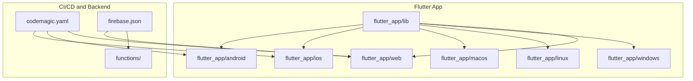
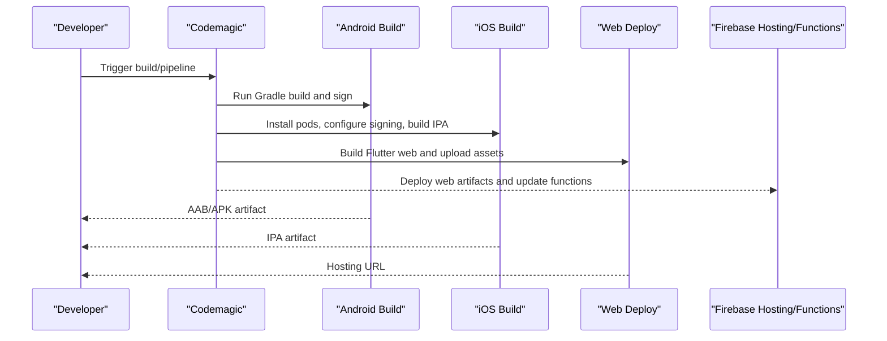
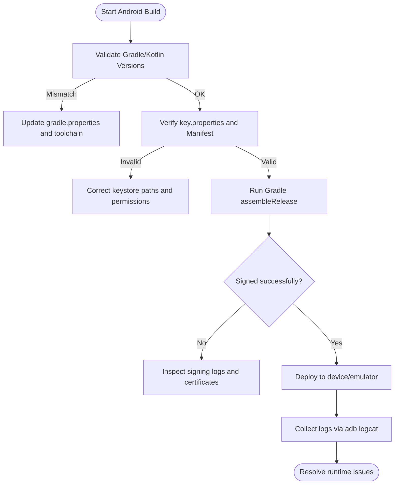
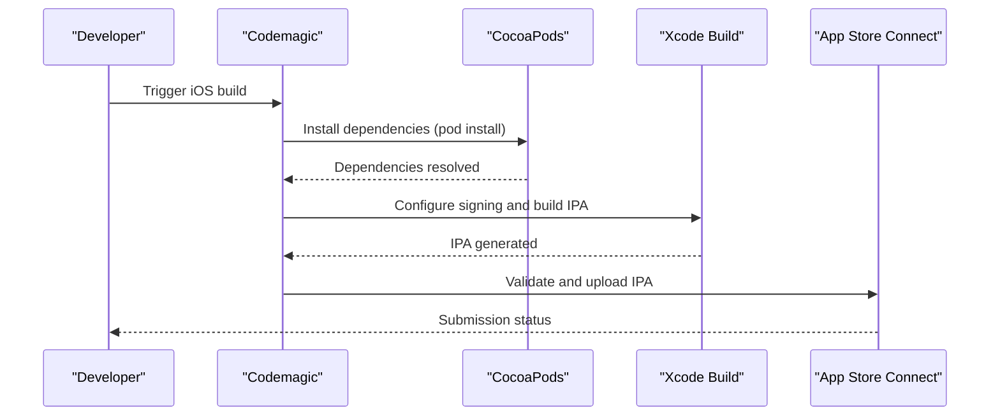
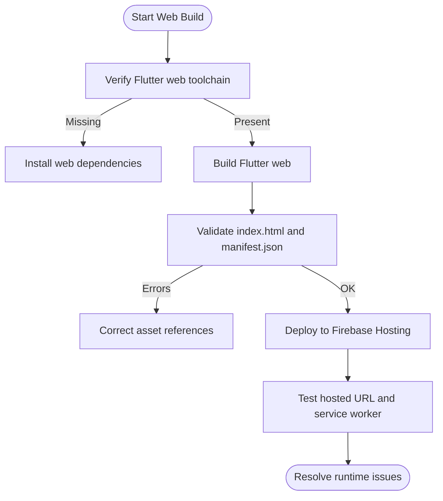
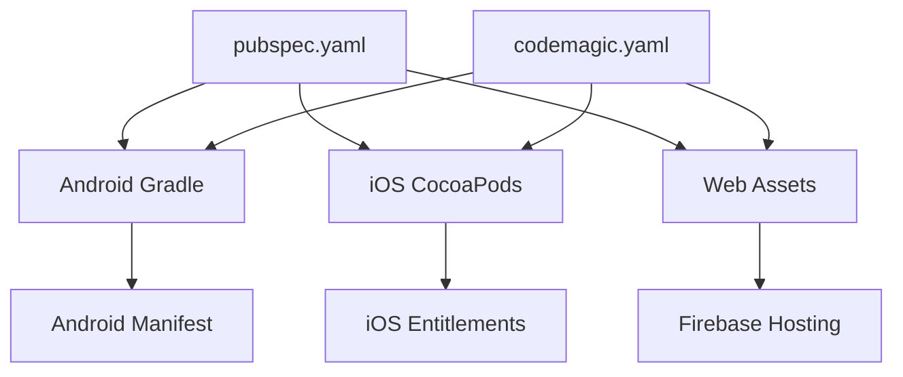

# Platform-Specific Issues

<cite>
**Referenced Files in This Document**
- [pubspec.yaml](file://flutter_app/pubspec.yaml)
- [android/build.gradle.kts](file://flutter_app/android/build.gradle.kts)
- [android/app/build.gradle.kts](file://flutter_app/android/app/build.gradle.kts)
- [android/gradle.properties](file://flutter_app/android/gradle.properties)
- [android/key.properties](file://flutter_app/android/key.properties)
- [android/local.properties](file://flutter_app/android/local.properties)
- [android/app/src/main/AndroidManifest.xml](file://flutter_app/android/app/src/main/AndroidManifest.xml)
- [ios/Podfile](file://flutter_app/ios/Podfile)
- [ios/Runner/Info.plist](file://flutter_app/ios/Runner/Info.plist)
- [ios/Runner/Runner.entitlements](file://flutter_app/ios/Runner/Runner.entitlements)
- [macos/Runner/Info.plist](file://flutter_app/macos/Runner/Info.plist)
- [linux/CMakeLists.txt](file://flutter_app/linux/CMakeLists.txt)
- [windows/CMakeLists.txt](file://flutter_app/windows/CMakeLists.txt)
- [web/index.html](file://flutter_app/web/index.html)
- [web/manifest.json](file://flutter_app/web/manifest.json)
- [firebase.json](file://firebase.json)
- [codemagic.yaml](file://codemagic.yaml)
- [scripts/deploy_web_hosting_html.ps1](file://scripts/deploy_web_hosting_html.ps1)
- [scripts/build_android_aab.ps1](file://scripts/build_android_aab.ps1)
- [scripts/build_ios_ipa_macos.sh](file://scripts/build_ios_ipa_macos.sh)
- [scripts/codemagic_ios_install_signing.sh](file://scripts/codemagic_ios_install_signing.sh)
- [scripts/codemagic_ios_validate_export_options.py](file://scripts/codemagic_ios_validate_export_options.py)
- [scripts/codemagic_ios_verify_profile_matches_p12.sh](file://scripts/codemagic_ios_verify_profile_matches_p12.sh)
- [scripts/codemagic_ios_upload_crashlytics_dsyms.sh](file://scripts/codemagic_ios_upload_crashlytics_dsyms.sh)
- [functions/package.json](file://functions/package.json)
</cite>

## Table of Contents
1. [Introduction](#introduction)
2. [Project Structure](#project-structure)
3. [Core Components](#core-components)
4. [Architecture Overview](#architecture-overview)
5. [Detailed Component Analysis](#detailed-component-analysis)
6. [Dependency Analysis](#dependency-analysis)
7. [Performance Considerations](#performance-considerations)
8. [Troubleshooting Guide](#troubleshooting-guide)
9. [Conclusion](#conclusion)
10. [Appendices](#appendices)

## Introduction
This document provides platform-specific troubleshooting guidance for iOS, Android, Web, Windows, macOS, and Linux within a Flutter-based application. It focuses on build errors, signing issues, deployment problems, runtime exceptions, plugin compatibility, native code integration, platform API limitations, device/emulator issues, version compatibility, debugging techniques, log collection, crash reporting setup, and common store submission rejections. The content is derived from the repository’s configuration files, scripts, and platform project structures to ensure accuracy and relevance.

## Project Structure
The project follows a standard Flutter multi-platform layout:
- flutter_app contains the Dart source and per-platform directories (android, ios, macos, linux, windows, web).
- Root-level firebase.json and codemagic.yaml configure Firebase hosting/functions and CI/CD pipelines.
- functions directory holds Cloud Functions sources and dependencies.
- scripts include automation for building, signing, deploying, and validating artifacts across platforms.

**Diagram sources**
- [codemagic.yaml](file://codemagic.yaml)
- [firebase.json](file://firebase.json)
- [flutter_app/android/build.gradle.kts](file://flutter_app/android/build.gradle.kts)
- [flutter_app/ios/Podfile](file://flutter_app/ios/Podfile)
- [flutter_app/web/index.html](file://flutter_app/web/index.html)

**Section sources**
- [pubspec.yaml](file://flutter_app/pubspec.yaml)
- [android/build.gradle.kts](file://flutter_app/android/build.gradle.kts)
- [ios/Podfile](file://flutter_app/ios/Podfile)
- [web/index.html](file://flutter_app/web/index.html)
- [firebase.json](file://firebase.json)
- [codemagic.yaml](file://codemagic.yaml)

## Core Components
Key components that influence platform behavior and troubleshooting:
- Flutter app configuration and dependencies (pubspec.yaml).
- Android Gradle build and signing configuration (build.gradle.kts, gradle.properties, key.properties, local.properties, AndroidManifest.xml).
- iOS CocoaPods and entitlements (Podfile, Info.plist, Runner.entitlements).
- Web entrypoints and manifest (index.html, manifest.json).
- Desktop targets (macOS Info.plist, Linux CMakeLists.txt, Windows CMakeLists.txt).
- CI/CD and deployment scripts (codemagic.yaml, deploy scripts).
- Firebase configuration and rules (firebase.json, functions package.json).

**Section sources**
- [pubspec.yaml](file://flutter_app/pubspec.yaml)
- [android/build.gradle.kts](file://flutter_app/android/build.gradle.kts)
- [android/gradle.properties](file://flutter_app/android/gradle.properties)
- [android/key.properties](file://flutter_app/android/key.properties)
- [android/local.properties](file://flutter_app/android/local.properties)
- [android/app/src/main/AndroidManifest.xml](file://flutter_app/android/app/src/main/AndroidManifest.xml)
- [ios/Podfile](file://flutter_app/ios/Podfile)
- [ios/Runner/Info.plist](file://flutter_app/ios/Runner/Info.plist)
- [ios/Runner/Runner.entitlements](file://flutter_app/ios/Runner/Runner.entitlements)
- [macos/Runner/Info.plist](file://flutter_app/macos/Runner/Info.plist)
- [linux/CMakeLists.txt](file://flutter_app/linux/CMakeLists.txt)
- [windows/CMakeLists.txt](file://flutter_app/windows/CMakeLists.txt)
- [web/index.html](file://flutter_app/web/index.html)
- [web/manifest.json](file://flutter_app/web/manifest.json)
- [firebase.json](file://firebase.json)
- [functions/package.json](file://functions/package.json)

## Architecture Overview
The application uses Flutter for cross-platform UI with platform-specific native integrations:
- Android builds via Gradle; signing configured through key properties and manifests.
- iOS builds via Xcode/CocoaPods; signing and entitlements managed by Podfile and plist/entitlements.
- Web deploys to Firebase Hosting; service workers and assets are served from web/.
- Desktop targets use CMake configurations for Linux and Windows; macOS uses Xcode workspace settings.
- CI/CD orchestrates builds and deployments using Codemagic and shell/PowerShell scripts.

**Diagram sources**
- [codemagic.yaml](file://codemagic.yaml)
- [scripts/build_android_aab.ps1](file://scripts/build_android_aab.ps1)
- [scripts/build_ios_ipa_macos.sh](file://scripts/build_ios_ipa_macos.sh)
- [scripts/deploy_web_hosting_html.ps1](file://scripts/deploy_web_hosting_html.ps1)
- [firebase.json](file://firebase.json)

## Detailed Component Analysis

### Android Troubleshooting
Common issues and resolutions:
- Build errors due to Gradle or Kotlin versions: Ensure gradle.properties aligns with the project’s Kotlin and AGP versions. Validate local SDK paths in local.properties.
- Signing failures: Verify key.properties contains correct keystore paths and passwords; confirm AndroidManifest.xml has matching package name and permissions.
- Plugin compatibility: Check pubspec.yaml for plugins requiring specific Android APIs; update minSdkVersion if needed.
- Emulator/device issues: Confirm ABI support and emulator image matches target architecture; test on both x86_64 and arm64-v8a emulators.
- Runtime exceptions: Use adb logcat to capture logs; enable ProGuard/R8 rules carefully to avoid stripping critical classes.

**Diagram sources**
- [android/build.gradle.kts](file://flutter_app/android/build.gradle.kts)
- [android/gradle.properties](file://flutter_app/android/gradle.properties)
- [android/key.properties](file://flutter_app/android/key.properties)
- [android/local.properties](file://flutter_app/android/local.properties)
- [android/app/src/main/AndroidManifest.xml](file://flutter_app/android/app/src/main/AndroidManifest.xml)

**Section sources**
- [android/build.gradle.kts](file://flutter_app/android/build.gradle.kts)
- [android/gradle.properties](file://flutter_app/android/gradle.properties)
- [android/key.properties](file://flutter_app/android/key.properties)
- [android/local.properties](file://flutter_app/android/local.properties)
- [android/app/src/main/AndroidManifest.xml](file://flutter_app/android/app/src/main/AndroidManifest.xml)

### iOS Troubleshooting
Common issues and resolutions:
- CocoaPods dependency conflicts: Update Podfile and run pod install; verify platform deployment target.
- Signing and provisioning: Ensure Runner.entitlements match required capabilities; validate profiles and certificates in CI environment.
- Store submission rejections: Check Info.plist keys for privacy declarations; ensure proper bundle identifiers and minimum OS versions.
- Emulator/simulator issues: Confirm simulator architectures and Xcode command line tools installation.
- Crash reporting: Upload dSYMs to Crashlytics during CI; verify symbolication settings.

**Diagram sources**
- [ios/Podfile](file://flutter_app/ios/Podfile)
- [ios/Runner/Info.plist](file://flutter_app/ios/Runner/Info.plist)
- [ios/Runner/Runner.entitlements](file://flutter_app/ios/Runner/Runner.entitlements)
- [scripts/codemagic_ios_install_signing.sh](file://scripts/codemagic_ios_install_signing.sh)
- [scripts/codemagic_ios_validate_export_options.py](file://scripts/codemagic_ios_validate_export_options.py)
- [scripts/codemagic_ios_verify_profile_matches_p12.sh](file://scripts/codemagic_ios_verify_profile_matches_p12.sh)
- [scripts/codemagic_ios_upload_crashlytics_dsyms.sh](file://scripts/codemagic_ios_upload_crashlytics_dsyms.sh)

**Section sources**
- [ios/Podfile](file://flutter_app/ios/Podfile)
- [ios/Runner/Info.plist](file://flutter_app/ios/Runner/Info.plist)
- [ios/Runner/Runner.entitlements](file://flutter_app/ios/Runner/Runner.entitlements)
- [scripts/codemagic_ios_install_signing.sh](file://scripts/codemagic_ios_install_signing.sh)
- [scripts/codemagic_ios_validate_export_options.py](file://scripts/codemagic_ios_validate_export_options.py)
- [scripts/codemagic_ios_verify_profile_matches_p12.sh](file://scripts/codemagic_ios_verify_profile_matches_p12.sh)
- [scripts/codemagic_ios_upload_crashlytics_dsyms.sh](file://scripts/codemagic_ios_upload_crashlytics_dsyms.sh)

### Web Troubleshooting
Common issues and resolutions:
- Build failures: Ensure Flutter web toolchain is installed; check index.html and manifest.json for correct asset paths.
- CORS and Firebase hosting: Validate firebase.json hosting configuration; ensure storage CORS rules allow necessary origins.
- Service worker issues: Confirm firebase-messaging-sw.js is present and correctly referenced.
- Performance: Optimize assets and consider CanvasKit vs HTML renderer based on target devices.

**Diagram sources**
- [web/index.html](file://flutter_app/web/index.html)
- [web/manifest.json](file://flutter_app/web/manifest.json)
- [firebase.json](file://firebase.json)
- [scripts/deploy_web_hosting_html.ps1](file://scripts/deploy_web_hosting_html.ps1)

**Section sources**
- [web/index.html](file://flutter_app/web/index.html)
- [web/manifest.json](file://flutter_app/web/manifest.json)
- [firebase.json](file://firebase.json)
- [scripts/deploy_web_hosting_html.ps1](file://scripts/deploy_web_hosting_html.ps1)

### Windows Troubleshooting
Common issues and resolutions:
- CMake configuration errors: Ensure CMakeLists.txt includes required modules and dependencies.
- Visual Studio toolchain: Verify MSVC compiler and Windows SDK versions match project requirements.
- Plugin compatibility: Check pubspec.yaml for Windows-specific plugins; update versions if needed.
- Debugging: Use Visual Studio debugger; collect logs via console output and event viewer.

**Section sources**
- [windows/CMakeLists.txt](file://flutter_app/windows/CMakeLists.txt)

### macOS Troubleshooting
Common issues and resolutions:
- Xcode workspace settings: Validate Runner.xcworkspace and Info.plist configurations.
- Entitlements and capabilities: Ensure Runner.entitlements include required permissions (e.g., push notifications).
- Code signing: Use consistent team and certificate configurations; verify profile validity.
- Debugging: Use Xcode debugger; collect logs via Console.app.

**Section sources**
- [macos/Runner/Info.plist](file://flutter_app/macos/Runner/Info.plist)

### Linux Troubleshooting
Common issues and resolutions:
- CMake and dependencies: Ensure CMakeLists.txt lists required libraries; install system dependencies via package manager.
- Display server: Verify Wayland/X11 compatibility; test on target desktop environments.
- Debugging: Use gdb or IDE debugger; collect logs via terminal output.

**Section sources**
- [linux/CMakeLists.txt](file://flutter_app/linux/CMakeLists.txt)

## Dependency Analysis
Platform dependencies and their interactions:
- Flutter plugins defined in pubspec.yaml may require platform-specific implementations.
- Android Gradle and Kotlin versions must align with plugin requirements.
- iOS CocoaPods manage native libraries; Podfile should reflect correct platform versions.
- Web assets and Firebase configuration must be consistent across deployments.
- CI/CD scripts orchestrate dependency resolution and artifact generation.

**Diagram sources**
- [pubspec.yaml](file://flutter_app/pubspec.yaml)
- [android/build.gradle.kts](file://flutter_app/android/build.gradle.kts)
- [ios/Podfile](file://flutter_app/ios/Podfile)
- [firebase.json](file://firebase.json)
- [codemagic.yaml](file://codemagic.yaml)

**Section sources**
- [pubspec.yaml](file://flutter_app/pubspec.yaml)
- [android/build.gradle.kts](file://flutter_app/android/build.gradle.kts)
- [ios/Podfile](file://flutter_app/ios/Podfile)
- [firebase.json](file://firebase.json)
- [codemagic.yaml](file://codemagic.yaml)

## Performance Considerations
- Android: Enable R8 optimization; minimize APK size by excluding unused resources.
- iOS: Optimize images and assets; use bitcode where applicable.
- Web: Prefer CanvasKit for complex graphics; lazy-load heavy assets.
- Desktop: Profile memory usage and CPU-intensive operations; use platform-native optimizations.

[No sources needed since this section provides general guidance]

## Troubleshooting Guide
- Android: Use adb logcat; verify Gradle cache integrity; rebuild with --info flag for detailed logs.
- iOS: Check Xcode build logs; validate provisioning profiles; use Instruments for performance profiling.
- Web: Inspect browser devtools; verify network requests and service worker registration.
- Windows/macOS/Linux: Use platform debuggers; collect core dumps and stack traces.
- CI/CD: Review Codemagic logs; ensure secrets and environment variables are correctly set.

**Section sources**
- [scripts/build_android_aab.ps1](file://scripts/build_android_aab.ps1)
- [scripts/build_ios_ipa_macos.sh](file://scripts/build_ios_ipa_macos.sh)
- [scripts/deploy_web_hosting_html.ps1](file://scripts/deploy_web_hosting_html.ps1)
- [codemagic.yaml](file://codemagic.yaml)

## Conclusion
This guide consolidates platform-specific troubleshooting strategies for Flutter applications across Android, iOS, Web, Windows, macOS, and Linux. By leveraging repository configurations and scripts, developers can resolve build errors, signing issues, deployment problems, and runtime exceptions effectively. Adhering to best practices ensures stable releases and smooth user experiences across all platforms.

[No sources needed since this section summarizes without analyzing specific files]

## Appendices
- Additional references for Firebase configuration and Cloud Functions:
  - [firebase.json](file://firebase.json)
  - [functions/package.json](file://functions/package.json)

**Section sources**
- [firebase.json](file://firebase.json)
- [functions/package.json](file://functions/package.json)