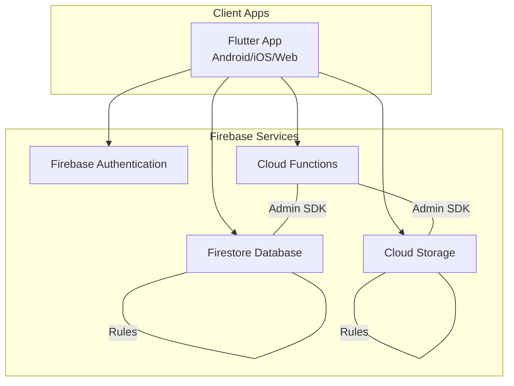
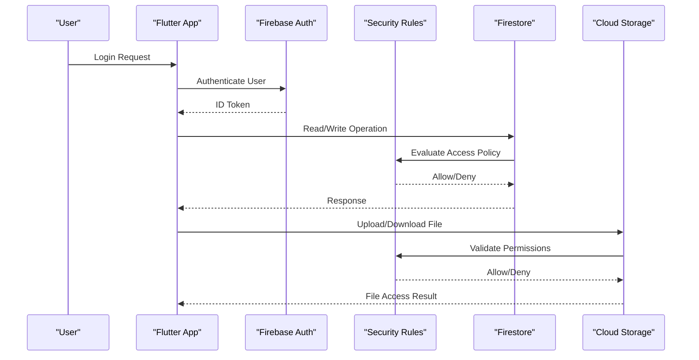
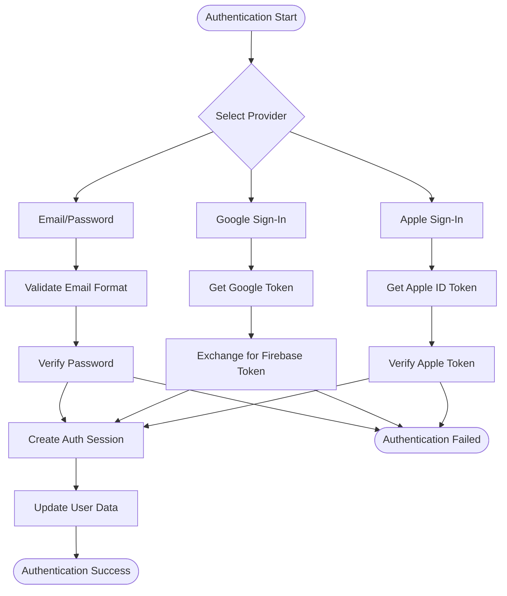
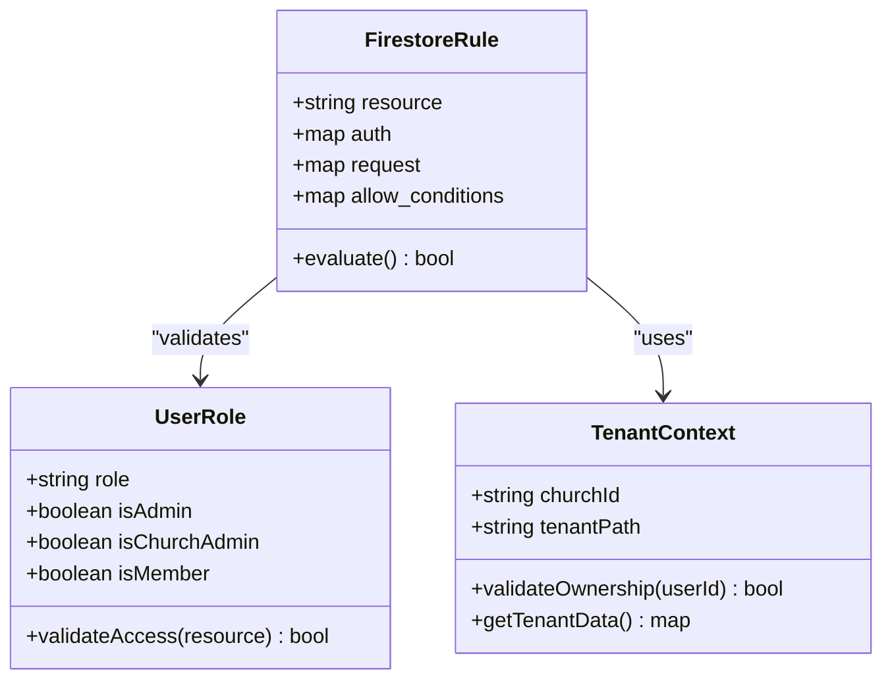
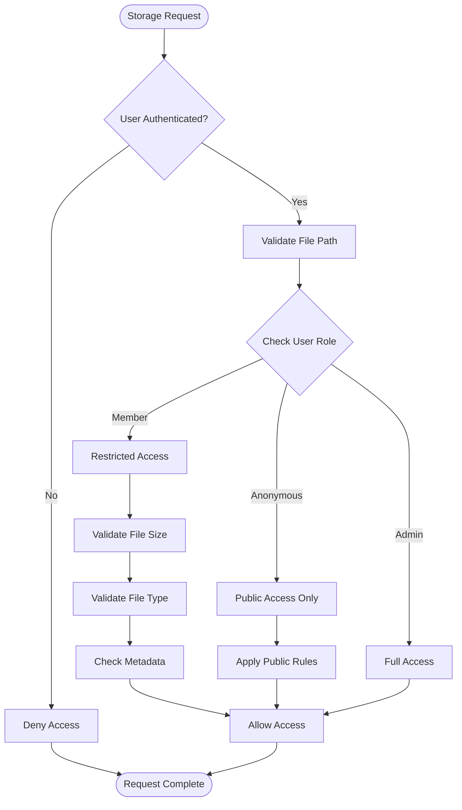
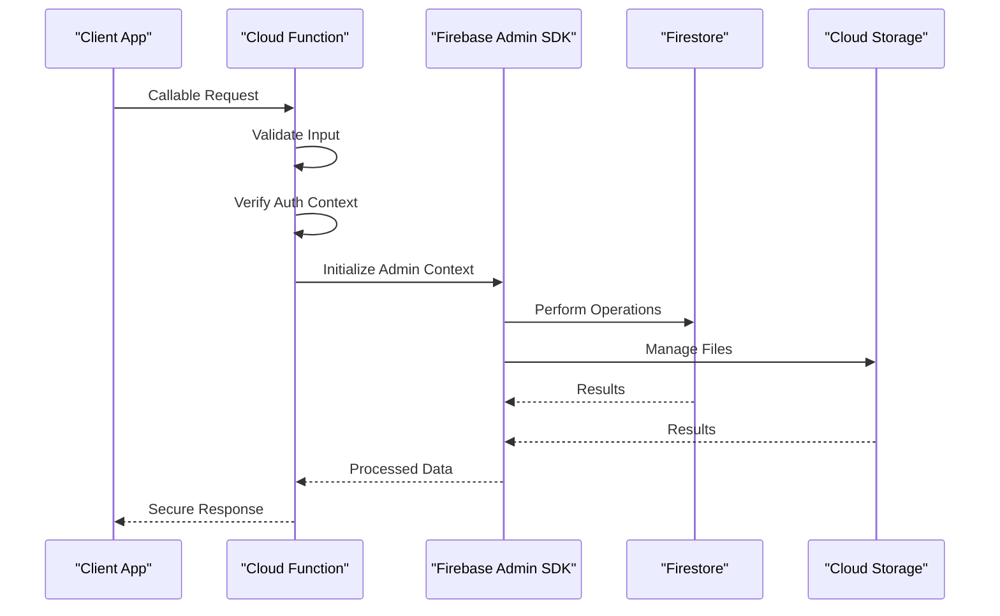
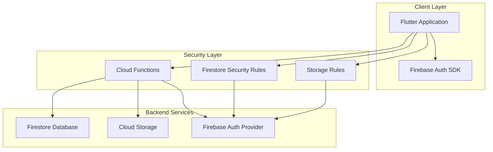
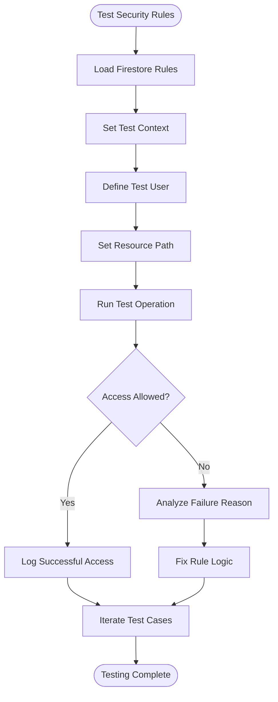
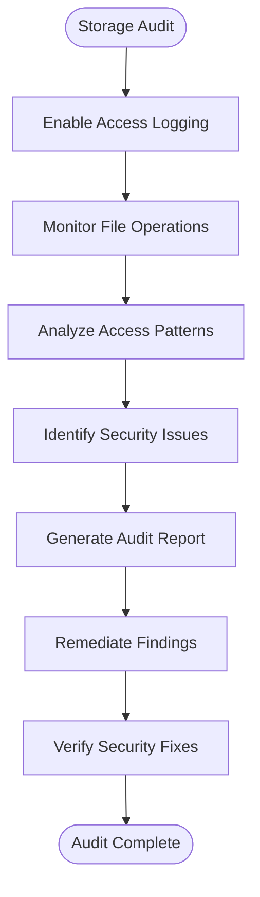

# Security Troubleshooting

<cite>
**Referenced Files in This Document**
- [firestore.rules](file://firestore.rules)
- [storage.rules](file://storage.rules)
- [functions/index.ts](file://functions/src/index.ts)
- [functions/masterPlatformAuth.ts](file://functions/src/masterPlatformAuth.ts)
- [functions/memberAccessPolicy.ts](file://functions/src/memberAccessPolicy.ts)
- [flutter_app/lib/firebase_options.dart](file://flutter_app/lib/firebase_options.dart)
- [flutter_app/android/app/google-services.json](file://flutter_app/android/app/google-services.json)
- [flutter_app/ios/Runner/GoogleService-Info.plist](file://flutter_app/ios/Runner/GoogleService-Info.plist)
- [security_rules_test_firestore/test/firestore.rules.test.js](file://security_rules_test_firestore/test/firestore.rules.test.js)
- [scripts/deploy_firebase_rules.ps1](file://scripts/deploy_firebase_rules.ps1)
- [scripts/auditoria_acessos_firestore_storage.ps1](file://scripts/auditoria_acessos_firestore_storage.ps1)
- [scripts/cors_storage_wide_open.json](file://scripts/cors_storage_wide_open.json)
- [firebase.json](file://firebase.json)
</cite>

## Table of Contents
1. [Introduction](#introduction)
2. [Project Structure](#project-structure)
3. [Core Components](#core-components)
4. [Architecture Overview](#architecture-overview)
5. [Detailed Component Analysis](#detailed-component-analysis)
6. [Dependency Analysis](#dependency-analysis)
7. [Performance Considerations](#performance-considerations)
8. [Troubleshooting Guide](#troubleshooting-guide)
9. [Conclusion](#conclusion)
10. [Appendices](#appendices)

## Introduction
This document provides a comprehensive security troubleshooting guide for the Gestão Yahweh Premium application. It focuses on diagnosing authentication failures, authorization issues, and permission problems across Firebase Authentication, Firestore Security Rules, Cloud Storage rules, and Cloud Functions. It also includes guidance for debugging storage access policies, validating security configurations, identifying common misconfigurations, and applying secure coding practices. The content is designed to be accessible to both developers and operators with varying levels of technical expertise.

## Project Structure
The project integrates a Flutter app with Firebase services (Authentication, Firestore, Storage, Cloud Functions). Security configuration spans multiple layers:
- Client-side configuration files for Firebase initialization
- Firestore Security Rules defining data access policies
- Storage Rules controlling media access
- Cloud Functions implementing server-side logic and policy enforcement
- Scripts for deploying rules and auditing access patterns

**Diagram sources**
- [flutter_app/lib/firebase_options.dart](file://flutter_app/lib/firebase_options.dart)
- [firestore.rules](file://firestore.rules)
- [storage.rules](file://storage.rules)
- [functions/src/index.ts](file://functions/src/index.ts)

**Section sources**
- [firebase.json](file://firebase.json)
- [flutter_app/lib/firebase_options.dart](file://flutter_app/lib/firebase_options.dart)

## Core Components
The security architecture centers around four key components:

### Firebase Authentication
- Handles user identity verification and session management
- Supports multiple sign-in providers including email/password, Google, and Apple
- Provides ID tokens used by Firestore and Storage rules for authorization

### Firestore Security Rules
- Define granular access control at document and collection levels
- Validate user roles, ownership, and data integrity
- Enforce tenant isolation for multi-church environments

### Cloud Storage Rules
- Control file upload, download, and deletion permissions
- Validate file types, sizes, and paths
- Integrate with Firestore metadata for enhanced security

### Cloud Functions
- Implement business logic with elevated privileges via Admin SDK
- Process events from Firestore and Storage triggers
- Handle sensitive operations like email notifications and data synchronization

**Section sources**
- [functions/src/masterPlatformAuth.ts](file://functions/src/masterPlatformAuth.ts)
- [functions/src/memberAccessPolicy.ts](file://functions/src/memberAccessPolicy.ts)

## Architecture Overview
The application follows a secure-by-design architecture where client requests are validated at multiple layers before accessing backend resources.

**Diagram sources**
- [firestore.rules](file://firestore.rules)
- [storage.rules](file://storage.rules)
- [functions/src/index.ts](file://functions/src/index.ts)

## Detailed Component Analysis

### Authentication Flow Debugging
The authentication system supports multiple providers and validates user sessions through ID tokens. Common issues include invalid credentials, expired sessions, and provider configuration problems.

**Diagram sources**
- [functions/src/masterPlatformAuth.ts](file://functions/src/masterPlatformAuth.ts)

**Section sources**
- [flutter_app/lib/firebase_options.dart](file://flutter_app/lib/firebase_options.dart)
- [flutter_app/android/app/google-services.json](file://flutter_app/android/app/google-services.json)
- [flutter_app/ios/Runner/GoogleService-Info.plist](file://flutter_app/ios/Runner/GoogleService-Info.plist)

### Firestore Security Rules Analysis
Firestore rules enforce fine-grained access control based on user roles, document ownership, and tenant context.

**Diagram sources**
- [firestore.rules](file://firestore.rules)

**Section sources**
- [firestore.rules](file://firestore.rules)

### Storage Access Policies
Cloud Storage rules control file operations based on user authentication, file metadata, and organizational boundaries.

**Diagram sources**
- [storage.rules](file://storage.rules)

**Section sources**
- [storage.rules](file://storage.rules)

### Cloud Functions Security Context
Cloud Functions operate with elevated privileges using the Firebase Admin SDK, requiring careful handling of user context and input validation.

**Diagram sources**
- [functions/src/index.ts](file://functions/src/index.ts)
- [functions/src/masterPlatformAuth.ts](file://functions/src/masterPlatformAuth.ts)

**Section sources**
- [functions/src/index.ts](file://functions/src/index.ts)
- [functions/src/memberAccessPolicy.ts](file://functions/src/memberAccessPolicy.ts)

## Dependency Analysis
The security components have specific dependency relationships that must be maintained for proper functionality.

**Diagram sources**
- [firebase.json](file://firebase.json)
- [functions/src/index.ts](file://functions/src/index.ts)

**Section sources**
- [firebase.json](file://firebase.json)

## Performance Considerations
Security checks impact application performance and should be optimized:

### Rule Optimization
- Use wildcard paths judiciously to minimize rule complexity
- Leverage composite indexes for efficient queries
- Cache frequently accessed security decisions when possible

### Authentication Caching
- Implement local token caching to reduce authentication overhead
- Use offline persistence for improved responsiveness
- Monitor token refresh rates and optimize accordingly

### Storage Operations
- Batch storage operations when possible
- Use appropriate file formats and compression
- Implement CDN caching for public assets

[No sources needed since this section provides general guidance]

## Troubleshooting Guide

### Authentication Failures
Common authentication issues and their resolution:

#### Invalid Credentials
- Verify user credentials format and encoding
- Check password hashing algorithms
- Ensure proper error handling for failed attempts

#### Expired Sessions
- Implement automatic token refresh mechanisms
- Handle session expiration gracefully
- Provide clear user feedback for re-authentication

#### Provider Configuration Issues
- Validate OAuth client IDs and secrets
- Check redirect URIs and allowed domains
- Verify provider-specific settings

### Authorization Problems
Authorization failures typically stem from incorrect role assignments or rule misconfigurations:

#### Role-Based Access Control
- Verify user role assignments in database
- Check role inheritance and permissions
- Audit role changes and updates

#### Document Ownership
- Validate ownership claims in security rules
- Ensure proper tenant isolation
- Check cross-tenant access scenarios

### Permission Issues
Permission problems often involve storage and database access:

#### Storage Access Denied
- Review storage rules for file path restrictions
- Check file metadata and permissions
- Validate user capabilities for specific operations

#### Database Query Failures
- Analyze query structure against index definitions
- Verify field-level permissions
- Check composite query requirements

### Debugging Tools and Techniques

#### Firestore Rules Testing
Use the built-in rules simulator to test access patterns:

**Diagram sources**
- [security_rules_test_firestore/test/firestore.rules.test.js](file://security_rules_test_firestore/test/firestore.rules.test.js)

#### Storage Access Auditing
Monitor storage operations to identify access patterns and potential security issues:

**Diagram sources**
- [scripts/auditoria_acessos_firestore_storage.ps1](file://scripts/auditoria_acessos_firestore_storage.ps1)

### Common Security Misconfigurations

#### Overly Permissive Rules
- Avoid wildcard paths that grant excessive access
- Implement least-privilege principles
- Regularly audit rule effectiveness

#### Missing Input Validation
- Validate all user inputs on both client and server
- Sanitize data before processing
- Implement proper error handling

#### Insecure Default Settings
- Review default permissions for new collections
- Configure appropriate CORS policies
- Set proper security headers

### Secure Coding Practices

#### Input Validation
- Implement server-side validation for all inputs
- Use parameterized queries to prevent injection attacks
- Validate data types and formats

#### Data Protection
- Encrypt sensitive data at rest and in transit
- Implement proper key management
- Use secure communication channels

#### Error Handling
- Provide generic error messages to clients
- Log detailed errors server-side
- Implement proper exception handling

### Security Audit Procedures

#### Regular Security Reviews
- Conduct periodic security assessments
- Review access logs and audit trails
- Test security controls regularly

#### Vulnerability Scanning
- Use automated tools to detect vulnerabilities
- Perform manual security testing
- Monitor for emerging threats

#### Compliance Verification
- Ensure adherence to security standards
- Validate regulatory compliance
- Maintain security documentation

**Section sources**
- [scripts/deploy_firebase_rules.ps1](file://scripts/deploy_firebase_rules.ps1)
- [scripts/auditoria_acessos_firestore_storage.ps1](file://scripts/auditoria_acessos_firestore_storage.ps1)
- [scripts/cors_storage_wide_open.json](file://scripts/cors_storage_wide_open.json)

## Conclusion
This security troubleshooting guide provides comprehensive coverage of authentication, authorization, and permission issues in the Gestão Yahweh Premium application. By following the diagnostic procedures, implementing secure coding practices, and conducting regular security audits, development teams can maintain a robust security posture. The integration of automated testing, monitoring, and continuous security validation ensures ongoing protection against evolving threats.

[No sources needed since this section summarizes without analyzing specific files]

## Appendices

### A. Quick Reference Checklist

#### Pre-Deployment Security Checklist
- [ ] Review and validate Firestore security rules
- [ ] Test storage access policies
- [ ] Verify Cloud Functions security context
- [ ] Check authentication provider configurations
- [ ] Validate CORS settings
- [ ] Review error handling and logging

#### Post-Deployment Monitoring
- [ ] Monitor authentication failure rates
- [ ] Track authorization denials
- [ ] Alert on suspicious access patterns
- [ ] Review storage access logs
- [ ] Validate rule effectiveness

### B. Emergency Response Procedures

#### Security Incident Response
1. **Immediate Actions**
   - Disable compromised accounts
   - Revoke active sessions
   - Block suspicious IP addresses
   
2. **Investigation Steps**
   - Analyze access logs
   - Review recent rule changes
   - Check for unauthorized modifications
   
3. **Recovery Procedures**
   - Restore from clean backups
   - Reset affected credentials
   - Patch security vulnerabilities

[No sources needed since this section provides general guidance]