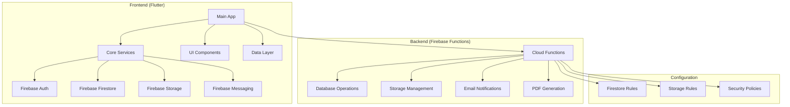
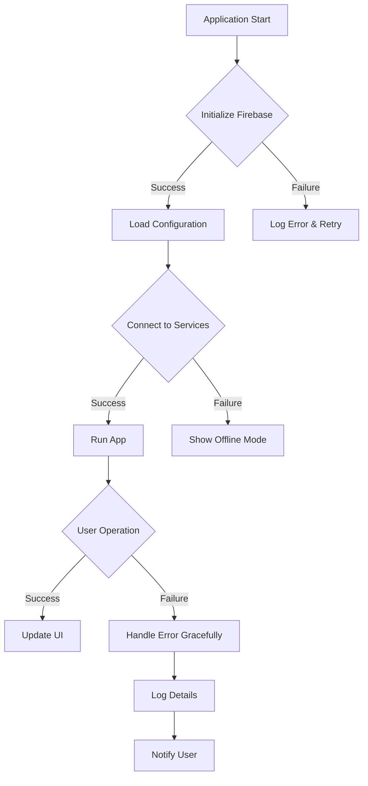
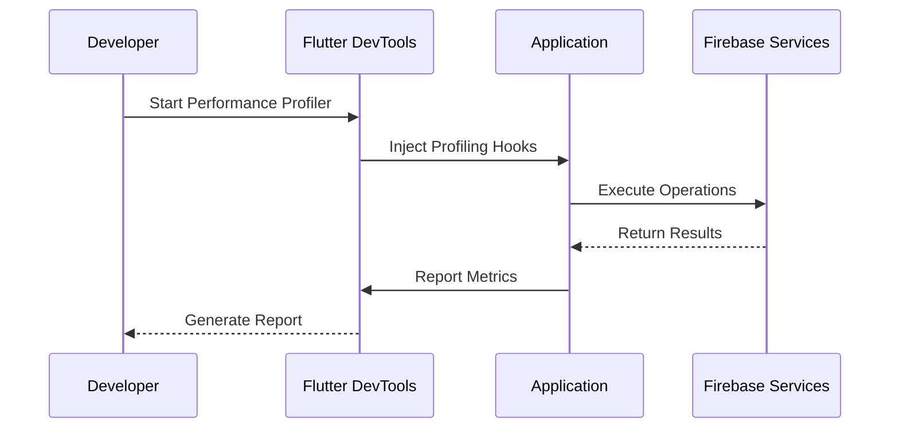
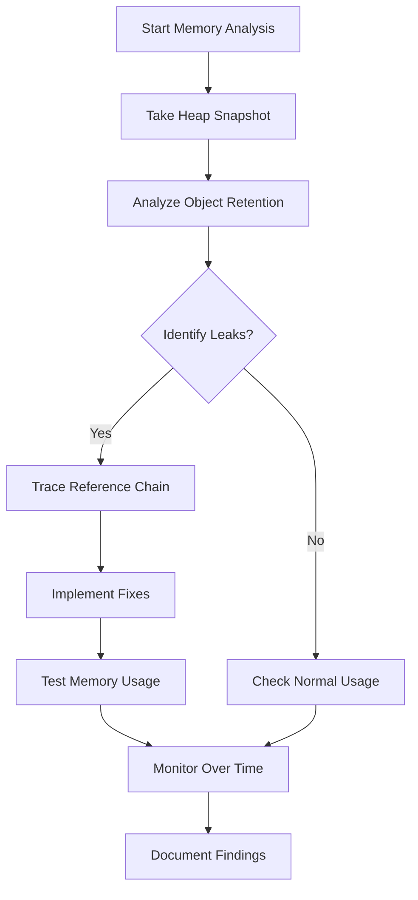
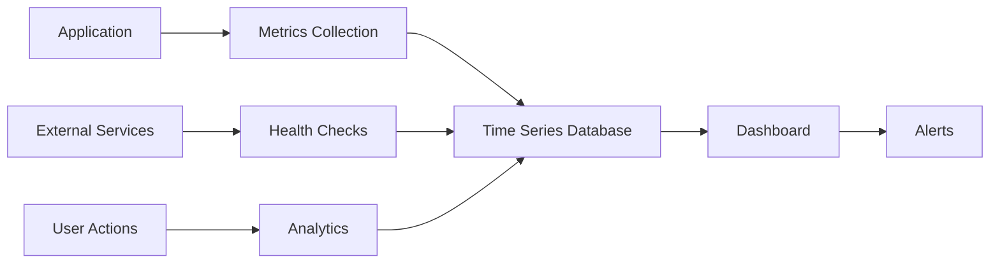

# Troubleshooting & FAQ

<cite>
**Referenced Files in This Document**
- [README.md](file://README.md)
- [flutter_app/lib/main.dart](file://flutter_app/lib/main.dart)
- [functions/src/index.ts](file://functions/src/index.ts)
- [firebase.json](file://firebase.json)
- [firestore.rules](file://firestore.rules)
- [storage.rules](file://storage.rules)
- [pubspec.yaml](file://flutter_app/pubspec.yaml)
- [functions/package.json](file://functions/package.json)
- [codemagic.yaml](file://codemagic.yaml)
- [devtools_options.yaml](file://flutter_app/devtools_options.yaml)
</cite>

## Table of Contents
1. [Introduction](#introduction)
2. [Project Structure Overview](#project-structure-overview)
3. [Common Issues & Solutions](#common-issues--solutions)
4. [Error Handling & Debugging](#error-handling--debugging)
5. [Performance Monitoring & Optimization](#performance-monitoring--optimization)
6. [Firebase Integration Troubleshooting](#firebase-integration-troubleshooting)
7. [Mobile Platform Issues](#mobile-platform-issues)
8. [Web Deployment Issues](#web-deployment-issues)
9. [Security & Authentication Problems](#security--authentication-problems)
10. [Memory Leak Detection](#memory-leak-detection)
11. [Health Checks & Monitoring](#health-checks--monitoring)
12. [Diagnostic Procedures](#diagnostic-procedures)
13. [FAQ - Frequently Asked Questions](#faq---frequently-asked-questions)
14. [Conclusion](#conclusion)

## Introduction

This comprehensive troubleshooting guide addresses common issues, error scenarios, and diagnostic procedures for the Gestão Yahweh Premium application. The application is a multi-platform Flutter application with Firebase backend integration, supporting Android, iOS, Web, Windows, macOS, and Linux platforms.

The guide covers debugging techniques, log analysis, performance profiling, memory leak detection, monitoring tools implementation, error tracking, health checks, deployment troubleshooting, security issues, and platform-specific problem resolution.

## Project Structure Overview

Gestão Yahweh Premium follows a modular architecture with clear separation between frontend (Flutter), backend (Firebase Functions), and configuration files:



**Diagram sources**
- [flutter_app/lib/main.dart:1-50](file://flutter_app/lib/main.dart#L1-L50)
- [functions/src/index.ts:1-100](file://functions/src/index.ts#L1-L100)
- [firebase.json:1-50](file://firebase.json#L1-L50)

**Section sources**
- [README.md:1-100](file://README.md#L1-L100)
- [flutter_app/lib/main.dart:1-100](file://flutter_app/lib/main.dart#L1-L100)

## Common Issues & Solutions

### 1. Firebase Connection Issues

**Symptoms:**
- Application fails to connect to Firebase services
- Authentication errors
- Database connection timeouts

**Solutions:**
- Verify Firebase configuration files are properly set up
- Check network connectivity and firewall settings
- Ensure correct Firebase project credentials
- Validate SSL certificates for web deployments

### 2. Build & Deployment Problems

**Symptoms:**
- Build failures during compilation
- Deployment errors to app stores
- Code signing issues

**Solutions:**
- Clean build artifacts and rebuild
- Update dependencies and plugins
- Verify code signing certificates and profiles
- Check platform-specific requirements

### 3. Performance Issues

**Symptoms:**
- Slow app startup time
- Memory leaks causing crashes
- High CPU usage
- Poor UI responsiveness

**Solutions:**
- Implement proper caching strategies
- Optimize database queries
- Use efficient data structures
- Profile memory usage regularly

**Section sources**
- [flutter_app/ANALISE_PROJETO.md:1-200](file://flutter_app/ANALISE_PROJETO.md#L1-L200)
- [PERFORMANCE_REPORT.md:1-150](file://PERFORMANCE_REPORT.md#L1-L150)

## Error Handling & Debugging

### Error Categories

#### Runtime Errors
- Null reference exceptions
- Type casting errors
- Network timeout errors
- Database operation failures

#### Build-time Errors
- Dependency conflicts
- Missing plugins or packages
- Platform-specific compilation issues

#### Runtime Errors in Production

**Common Patterns:**


**Diagram sources**
- [flutter_app/lib/main.dart:100-200](file://flutter_app/lib/main.dart#L100-L200)

### Debugging Techniques

#### Flutter DevTools Usage
- Enable performance overlay
- Monitor memory usage
- Analyze widget tree
- Inspect network requests

#### Logging Strategy
- Structured logging with levels (DEBUG, INFO, WARN, ERROR)
- Context-aware error messages
- Performance metrics collection
- User session tracking

#### Crash Reporting
- Implement crashlytics integration
- Capture stack traces
- Device information collection
- User action replay

**Section sources**
- [flutter_app/devtools_options.yaml:1-50](file://flutter_app/devtools_options.yaml#L1-L50)
- [docs/FIREBASE_OBSERVABILITY.md:1-100](file://docs/FIREBASE_OBSERVABILITY.md#L1-L100)

## Performance Monitoring & Optimization

### Key Performance Indicators

#### App Startup Time
- Cold start optimization
- Lazy loading implementation
- Resource preloading strategies

#### Memory Management
- Regular memory profiling
- Garbage collection tuning
- Image and asset optimization

#### Database Performance
- Query optimization
- Index utilization
- Caching strategies

### Performance Profiling Tools



**Diagram sources**
- [flutter_app/devtools_options.yaml:1-100](file://flutter_app/devtools_options.yaml#L1-L100)

### Optimization Strategies

#### Frontend Optimization
- Widget tree optimization
- State management efficiency
- Image compression and caching
- Network request batching

#### Backend Optimization
- Cloud Function optimization
- Database query optimization
- Cache implementation
- CDN utilization

**Section sources**
- [docs/ARCHITECTURE_PERFORMANCE_MULTI_PLATFORM.md:1-200](file://docs/ARCHITECTURE_PERFORMANCE_MULTI_PLATFORM.md#L1-L200)
- [docs/PA DRONIZACAO_PERFORMANCE_CONTROLE_TOTAL.md:1-150](file://docs/PA DRONIZACAO_PERFORMANCE_CONTROLE_TOTAL.md#L1-L150)

## Firebase Integration Troubleshooting

### Authentication Issues

#### Common Problems
- Invalid credentials
- Token expiration
- Permission denied errors
- Multi-factor authentication failures

#### Solutions
- Verify Firebase project configuration
- Check user permissions and roles
- Implement token refresh mechanisms
- Handle authentication state changes

### Firestore Database Issues

#### Query Performance
- Implement proper indexing
- Use pagination for large datasets
- Optimize query conditions
- Leverage composite indexes

#### Data Consistency
- Handle concurrent updates
- Implement optimistic locking
- Use transactions for critical operations
- Monitor data synchronization

### Storage Problems

#### Upload/Download Issues
- File size limitations
- Network interruption handling
- Progress tracking implementation
- Error recovery mechanisms

#### Security Rules
- Validate permission rules
- Test rule configurations
- Monitor access patterns
- Implement rate limiting

**Section sources**
- [firestore.rules:1-200](file://firestore.rules#L1-L200)
- [storage.rules:1-150](file://storage.rules#L1-L150)
- [docs/FIREBASE_PADRAO_CONTROLE_TOTAL.md:1-100](file://docs/FIREBASE_PADRAO_CONTROLE_TOTAL.md#L1-L100)

## Mobile Platform Issues

### Android-Specific Problems

#### Build Issues
- Gradle configuration problems
- Dependency conflicts
- Native library integration
- Code signing certificate issues

#### Runtime Issues
- Memory constraints on low-end devices
- Background process limitations
- Notification delivery problems
- Permission handling

### iOS-Specific Problems

#### Code Signing
- Certificate and profile management
- App Store Connect integration
- Provisioning profile issues
- Entitlement configuration

#### App Store Submission
- Binary validation errors
- Metadata requirements
- Privacy manifest compliance
- Review rejection reasons

### Cross-Platform Considerations

#### Platform-Specific Features
- Feature detection and fallbacks
- Platform-specific optimizations
- Shared code best practices
- Testing across platforms

**Section sources**
- [ANDROID/README_CREDENCIAIS.txt:1-100](file://ANDROID/README_CREDENCIAIS.txt#L1-L100)
- [IOS/CREDENCIAIS_APPLE_ATUAL.txt:1-100](file://IOS/CREDENCIAIS_APPLE_ATUAL.txt#L1-L100)
- [scripts/build_android_aab.ps1:1-100](file://scripts/build_android_aab.ps1#L1-L100)

## Web Deployment Issues

### Firebase Hosting Problems

#### Common Issues
- Domain configuration errors
- SSL certificate problems
- CORS policy violations
- Asset loading failures

#### Solutions
- Verify domain DNS settings
- Configure proper headers
- Implement cache-busting strategies
- Monitor hosting logs

### Browser Compatibility

#### Cross-Browser Testing
- Feature detection implementation
- Polyfill usage for older browsers
- Responsive design validation
- Performance comparison across browsers

#### Progressive Web App Issues
- Service worker registration
- Offline functionality testing
- Push notification setup
- Manifest configuration

**Section sources**
- [firebase.json:1-100](file://firebase.json#L1-L100)
- [flutter_app/web/index.html:1-100](file://flutter_app/web/index.html#L1-L100)

## Security & Authentication Problems

### Authentication Security

#### Best Practices
- Implement secure token storage
- Use HTTPS for all communications
- Validate user input thoroughly
- Implement proper session management

#### Common Vulnerabilities
- SQL injection prevention
- XSS attack mitigation
- CSRF protection
- Rate limiting implementation

### Data Protection

#### Encryption
- Data at rest encryption
- Data in transit security
- Key management strategies
- Secure backup procedures

#### Access Control
- Role-based access control
- Permission validation
- Audit logging
- Compliance requirements

**Section sources**
- [firestore.rules:1-200](file://firestore.rules#L1-L200)
- [storage.rules:1-150](file://storage.rules#L1-L150)
- [docs/PLAY_STORE_SEGURANCA_DADOS_EMAIL.md:1-100](file://docs/PLAY_STORE_SEGURANCA_DADOS_EMAIL.md#L1-L100)

## Memory Leak Detection

### Memory Profiling Techniques

#### Flutter-Specific Tools
- Using Flutter DevTools memory profiler
- Analyzing heap snapshots
- Identifying retained objects
- Monitoring garbage collection

#### Common Memory Leak Sources
- Event listeners not removed
- Large images not disposed
- Database connections not closed
- Circular references in objects

### Memory Optimization Strategies



**Diagram sources**
- [flutter_app/lib/debug/debug_memory.dart:1-100](file://flutter_app/lib/debug/debug_memory.dart#L1-L100)

### Performance Monitoring Implementation

#### Real-time Monitoring
- Custom memory metrics collection
- Performance impact assessment
- Alert system for anomalies
- Historical trend analysis

#### Automated Testing
- Memory regression tests
- Load testing procedures
- Stress testing scenarios
- Continuous integration monitoring

**Section sources**
- [PONTO_BASE_MEMORIA_2026-07-24_11.2.305+2134.md:1-100](file://PONTO_BASE_MEMORIA_2026-07-24_11.2.305+2134.md#L1-L100)
- [flutter_app/lib/debug/debug_memory.dart:1-150](file://flutter_app/lib/debug/debug_memory.dart#L1-L150)

## Health Checks & Monitoring

### Application Health Monitoring

#### System Health Endpoints
- Database connectivity checks
- External service availability
- Resource utilization monitoring
- Error rate tracking

#### Alerting Mechanisms
- Threshold-based alerts
- Anomaly detection
- Escalation procedures
- Incident response workflows

### Monitoring Dashboard Implementation



**Diagram sources**
- [functions/src/churchPerformancePack.ts:1-100](file://functions/src/churchPerformancePack.ts#L1-L100)

### Log Analysis

#### Centralized Logging
- Structured log format
- Log aggregation
- Search and filtering
- Retention policies

#### Diagnostic Information
- Stack trace collection
- Environment context
- User session data
- Performance metrics

**Section sources**
- [docs/FIREBASE_OBSERVABILITY.md:1-200](file://docs/FIREBASE_OBSERVABILITY.md#L1-L200)
- [functions/src/churchPerformancePack.ts:1-150](file://functions/src/churchPerformancePack.ts#L1-L150)

## Diagnostic Procedures

### Systematic Troubleshooting Approach

#### Step-by-Step Diagnosis
1. **Reproduce the Issue**: Create consistent reproduction steps
2. **Collect Information**: Gather logs, screenshots, and system info
3. **Isolate Variables**: Identify specific components causing issues
4. **Analyze Patterns**: Look for recurring error patterns
5. **Implement Solutions**: Apply fixes and verify resolution

#### Diagnostic Tools Checklist

##### Development Environment
- Flutter DevTools enabled
- Console logging configured
- Network inspection active
- Performance profiling ready

##### Production Environment
- Crash reporting enabled
- Analytics tracking active
- Error monitoring configured
- Performance metrics collected

### Common Diagnostic Commands

#### Flutter Development
```bash
flutter doctor -v
flutter analyze
flutter test --coverage
flutter pub deps
```

#### Firebase Operations
```bash
firebase deploy --only functions
firebase functions:log
firebase firestore:export
```

#### Mobile Development
```bash
adb logcat
xcodebuild clean
pod install --repo-update
```

**Section sources**
- [scripts/flutter_analyze_relax.ps1:1-100](file://scripts/flutter_analyze_relax.ps1#L1-L100)
- [scripts/deploy_firebase_rules.ps1:1-100](file://scripts/deploy_firebase_rules.ps1#L1-L100)

## FAQ - Frequently Asked Questions

### Q1: How do I debug Firebase authentication issues?

**A:** Follow these steps:
1. Check Firebase console authentication settings
2. Verify client-side configuration
3. Enable debug logging for auth operations
4. Test with different user accounts
5. Review security rules in Firebase console

### Q2: Why is my app crashing on startup?

**A:** Common causes and solutions:
- Missing required dependencies
- Incorrect initialization order
- Insufficient memory allocation
- Platform-specific compatibility issues

### Q3: How can I improve app performance?

**A:** Performance optimization strategies:
- Implement lazy loading for heavy components
- Use efficient data structures
- Optimize database queries with proper indexing
- Cache frequently accessed data
- Minimize network requests through batching

### Q4: What should I do when users report slow loading times?

**A:** Investigation steps:
1. Check network request timing
2. Analyze database query performance
3. Monitor memory usage patterns
4. Review image and asset loading
5. Test on different device types

### Q5: How do I handle offline functionality?

**A:** Offline-first implementation:
- Implement local database caching
- Sync data when connectivity is restored
- Handle conflict resolution
- Provide user feedback about sync status

### Q6: Why am I getting permission denied errors?

**A:** Permission troubleshooting:
1. Review Firestore security rules
2. Check user authentication state
3. Validate role-based access controls
4. Test with different user permissions
5. Monitor rule evaluation in Firebase console

### Q7: How can I monitor app performance in production?

**A:** Production monitoring setup:
- Implement crash reporting (Crashlytics)
- Set up performance monitoring
- Configure custom metrics collection
- Create dashboards for key indicators
- Set up alerting for anomalies

### Q8: What's the best way to handle large file uploads?

**A:** Large file handling strategies:
- Implement chunked uploads
- Add progress tracking
- Handle upload interruptions
- Validate file types and sizes
- Provide retry mechanisms

### Q9: How do I troubleshoot push notification issues?

**A:** Push notification debugging:
1. Verify device registration tokens
2. Check notification service configuration
3. Test on different platforms
4. Monitor delivery rates
5. Review notification payload formatting

### Q10: What should I do when the app store rejects my update?

**A:** App store rejection handling:
1. Read rejection reasons carefully
2. Fix identified issues
3. Update metadata if needed
4. Resubmit with detailed notes
5. Contact support if necessary

**Section sources**
- [docs/FASE_FINAL_QA.md:1-100](file://docs/FASE_FINAL_QA.md#L1-L100)
- [CHECKLIST_PRODUCAO.md:1-150](file://CHECKLIST_PRODUCAO.md#L1-L150)

## Conclusion

This troubleshooting guide provides comprehensive coverage of common issues, diagnostic procedures, and solutions for the Gestão Yahweh Premium application. By following the systematic approaches outlined here, developers can efficiently identify and resolve problems across all supported platforms.

Key takeaways:
- Implement comprehensive error handling and logging
- Use appropriate profiling tools for performance analysis
- Follow platform-specific best practices
- Maintain thorough documentation of known issues and solutions
- Establish monitoring and alerting systems for production environments

Regular maintenance of this guide and continuous improvement of troubleshooting procedures will ensure optimal application performance and user experience across all platforms.