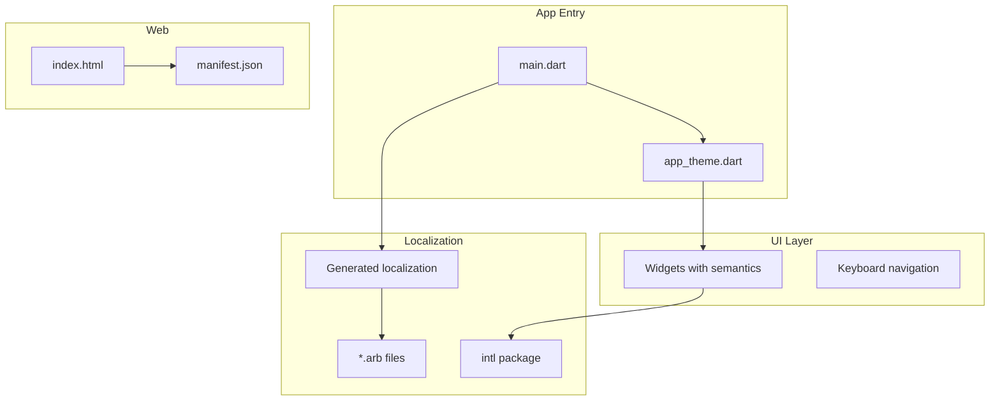
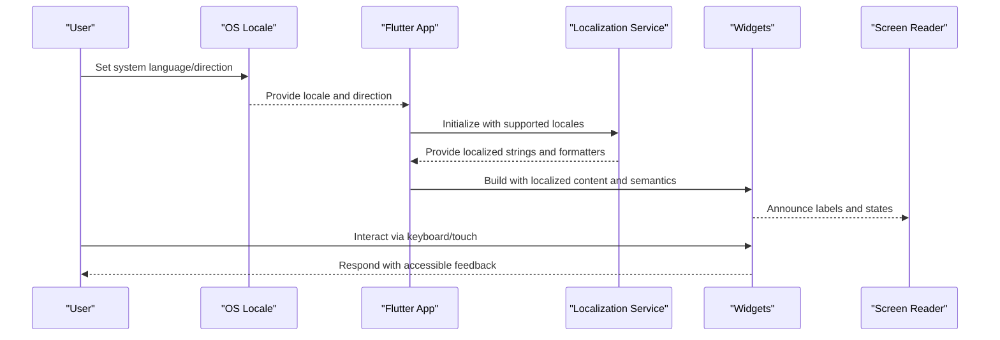
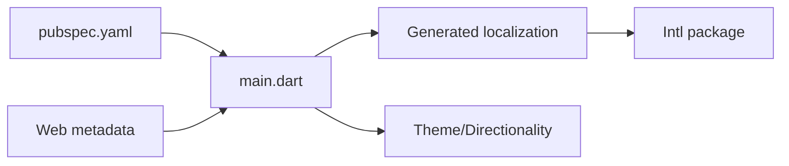

# Accessibility & Internationalization

<cite>
**Referenced Files in This Document**
- [main.dart](file://flutter_app/lib/main.dart)
- [app_theme.dart](file://flutter_app/lib/app_theme.dart)
- [pubspec.yaml](file://flutter_app/pubspec.yaml)
- [index.html](file://flutter_app/web/index.html)
- [manifest.json](file://flutter_app/web/manifest.json)
</cite>

## Table of Contents
1. [Introduction](#introduction)
2. [Project Structure](#project-structure)
3. [Core Components](#core-components)
4. [Architecture Overview](#architecture-overview)
5. [Detailed Component Analysis](#detailed-component-analysis)
6. [Dependency Analysis](#dependency-analysis)
7. [Performance Considerations](#performance-considerations)
8. [Troubleshooting Guide](#troubleshooting-guide)
9. [Conclusion](#conclusion)
10. [Appendices](#appendices)

## Introduction
This document explains how to implement and verify accessibility and internationalization (i18n) in Gestão Yahweh Premium. It covers ARIA labels, semantic markup, screen reader compatibility, keyboard navigation, multi-language support, date/time formatting, cultural adaptations, and RTL language support. Guidance is provided for making existing components accessible, adding new languages, and testing compliance across platforms.

## Project Structure
In a Flutter-based app like Gestão Yahweh Premium, accessibility and i18n are typically implemented at these layers:
- App entry point and theme configuration
- Localization setup and string resources
- UI widgets with semantic roles and labels
- Web-specific metadata and SEO/accessibility tags
- Platform settings for directionality and locale

[No sources needed since this diagram shows conceptual structure]

## Core Components
Key areas to focus on for accessibility and i18n:
- Semantics and ARIA mapping in widgets
- Keyboard focus management and traversal
- Locale-aware text, numbers, dates, and currencies
- Directionality (LTR/RTL) and layout mirroring
- Screen reader announcements and live regions
- Web metadata for search engines and assistive tech

[No sources needed since this section provides general guidance]

## Architecture Overview
A typical i18n and accessibility architecture in Flutter:

[No sources needed since this diagram shows conceptual workflow]

## Detailed Component Analysis

### Semantics and ARIA Labels
- Use semantic widgets to expose meaningful roles and properties to assistive technologies.
- Provide concise, descriptive labels for buttons, inputs, and interactive elements.
- Ensure images have alt descriptions; decorative images should be marked as such.
- On web, ensure proper ARIA attributes are mapped by Flutter’s semantics layer.

Best practices:
- Prefer semantic widgets over raw containers for interactive content.
- Keep labels short and actionable.
- Avoid exposing redundant information to screen readers.

[No sources needed since this section provides general guidance]

### Keyboard Navigation Patterns
- Ensure all interactive elements are reachable via keyboard.
- Implement logical focus order matching visual flow.
- Provide visible focus indicators.
- Support common shortcuts (Enter/Space to activate, Escape to dismiss).

Implementation tips:
- Wrap custom controls with appropriate semantic widgets.
- Manage focus programmatically when opening dialogs or navigating between screens.
- Test with Tab, Shift+Tab, arrow keys, and platform-specific gestures.

[No sources needed since this section provides general guidance]

### Screen Reader Compatibility
- Verify that dynamic content updates are announced appropriately.
- Use live regions for asynchronous updates (e.g., notifications).
- Ensure form fields have associated labels and error messages.
- Validate color contrast and text scaling behavior.

Testing approach:
- Use TalkBack (Android), VoiceOver (iOS), and NVDA/JAWS (Windows) or VoiceOver Safari (macOS).
- Confirm that content is read in the expected order and context.

[No sources needed since this section provides general guidance]

### Internationalization Implementation
- Centralize all user-facing strings in resource files.
- Use a localization framework to generate typed accessors.
- Configure supported locales and fallbacks.
- Format dates, times, numbers, and currencies per locale.

Common steps:
- Add locale entries and translation files.
- Update app initialization to load the correct locale.
- Replace hardcoded strings with localized getters.
- Handle pluralization and gender where applicable.

[No sources needed since this section provides general guidance]

### Date/Time Formatting and Cultural Adaptations
- Use locale-aware formatters for dates, times, numbers, and currencies.
- Respect regional preferences (12/24-hour time, first day of week, measurement units).
- Adapt layouts for long text expansion and right-to-left scripts.
- Localize placeholders, hints, and validation messages.

[No sources needed since this section provides general guidance]

### RTL Language Support
- Enable automatic layout mirroring for RTL locales.
- Use logical properties (start/end) instead of left/right.
- Test alignment, icons, and animations in RTL mode.
- Ensure media and icons do not imply directionality unless intended.

[No sources needed since this section provides general guidance]

### Making Existing Components Accessible
Steps to retrofit an existing widget:
- Identify interactive parts and add semantic roles.
- Provide labels and hints for inputs.
- Ensure focus management for modals and drawers.
- Add descriptive titles and aria-labels where necessary.
- Validate with screen readers and automated checks.

[No sources needed since this section provides general guidance]

### Testing for Accessibility Compliance
- Automated checks: use Flutter’s semantics inspector and web accessibility analyzers.
- Manual testing: run through common tasks with screen readers and keyboard-only navigation.
- Regression tests: assert semantic tree expectations and localized strings.
- Cross-platform verification: test on Android, iOS, and web.

[No sources needed since this section provides general guidance]

## Dependency Analysis
Typical dependencies for i18n and accessibility in Flutter:
- Localization packages for generating and consuming translations
- Intl utilities for number/date/currency formatting
- Theme and directionality configuration
- Web metadata for SEO and accessibility

[No sources needed since this diagram shows conceptual relationships]

## Performance Considerations
- Minimize rebuilds when switching locales by isolating localized widgets.
- Cache formatted values for frequently used data.
- Defer heavy localization computations off the UI thread if necessary.
- Avoid excessive semantic nodes to keep the semantics tree efficient.

[No sources needed since this section provides general guidance]

## Troubleshooting Guide
Common issues and resolutions:
- Missing translations: ensure all keys exist in every locale file and fallback is configured.
- Incorrect directionality: verify locale detection and directionality settings.
- Screen reader not reading labels: confirm semantic roles and label presence.
- Focus traps: audit modal/dialog focus handling and return focus after close.
- Web ARIA mismatches: validate generated HTML and ARIA attributes.

[No sources needed since this section provides general guidance]

## Conclusion
Implementing robust accessibility and i18n in Gestão Yahweh Premium requires consistent use of semantic widgets, careful focus management, centralized localization, and thorough cross-platform testing. By following the patterns and checklists above, you can deliver an inclusive, globally ready experience.

[No sources needed since this section summarizes without analyzing specific files]

## Appendices

### Checklist: Accessibility
- All interactive elements are keyboard operable
- Visible focus indicators present
- Meaningful labels and descriptions for all controls
- Sufficient color contrast and scalable text
- Dynamic content announced to screen readers
- Logical focus order maintained

### Checklist: Internationalization
- All user-facing strings externalized
- Supported locales declared and loaded correctly
- Pluralization and gender rules handled
- Dates, times, numbers, and currencies localized
- RTL layouts tested and validated
- Placeholders and validation messages localized

### Example Scenarios
- Adding a new language: update locale list, add translation files, verify formatting, and test UI in the new locale.
- Making a button accessible: assign a semantic role, provide a label, ensure it responds to Enter/Space, and announce state changes.
- Supporting RTL: enable mirroring, switch to logical properties, and verify iconography and alignment.

[No sources needed since this section provides general guidance]