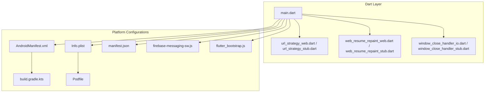
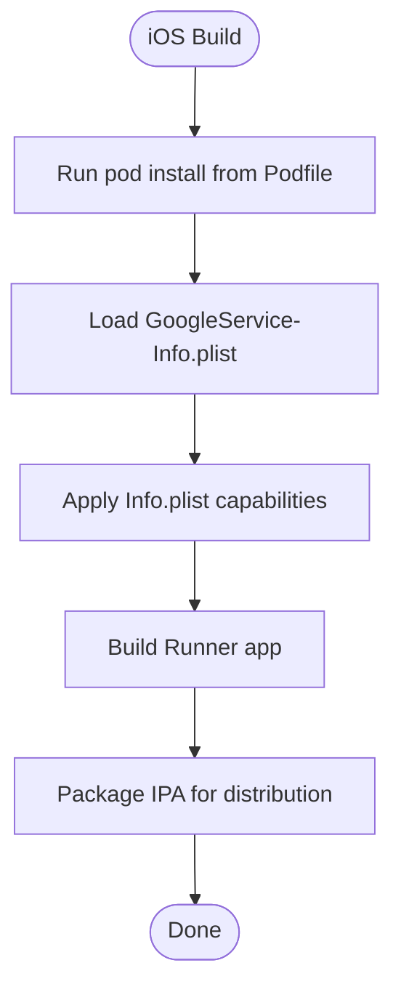
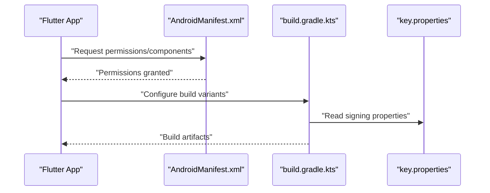
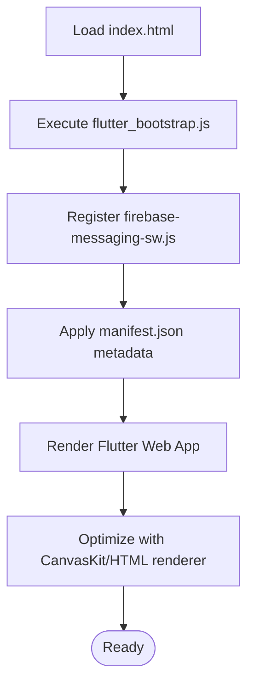
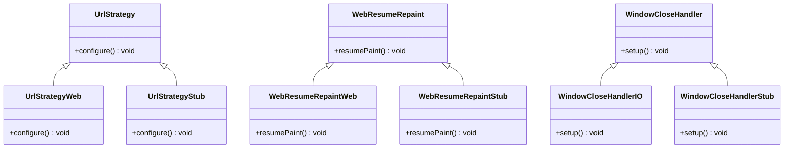
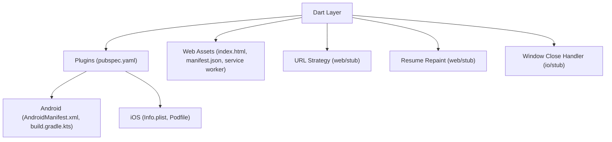

# Platform-Specific Adaptations

<cite>
**Referenced Files in This Document**
- [main.dart](file://flutter_app/lib/main.dart)
- [url_strategy_web.dart](file://flutter_app/lib/url_strategy_web.dart)
- [url_strategy_stub.dart](file://flutter_app/lib/url_strategy_stub.dart)
- [web_resume_repaint_web.dart](file://flutter_app/lib/web_resume_repaint_web.dart)
- [web_resume_repaint_stub.dart](file://flutter_app/lib/web_resume_repaint_stub.dart)
- [window_close_handler_io.dart](file://flutter_app/lib/window_close_handler_io.dart)
- [window_close_handler_stub.dart](file://flutter_app/lib/window_close_handler_stub.dart)
- [AndroidManifest.xml](file://flutter_app/android/app/src/main/AndroidManifest.xml)
- [build.gradle.kts](file://flutter_app/android/app/build.gradle.kts)
- [key.properties](file://flutter_app/android/key.properties)
- [GoogleService-Info.plist](file://flutter_app/ios/Runner/GoogleService-Info.plist)
- [Info.plist](file://flutter_app/ios/Runner/Info.plist)
- [Podfile](file://flutter_app/ios/Podfile)
- [index.html](file://flutter_app/web/index.html)
- [manifest.json](file://flutter_app/web/manifest.json)
- [firebase-messaging-sw.js](file://flutter_app/web/firebase-messaging-sw.js)
- [flutter_bootstrap.js](file://flutter_app/web/flutter_bootstrap.js)
- [pubspec.yaml](file://flutter_app/pubspec.yaml)
- [codemagic.yaml](file://codemagic.yaml)
- [deploy_web.yml](file://.github/workflows/deploy-web.yml)
- [README.md](file://flutter_app/README.md)
</cite>

## Table of Contents
1. Introduction
2. Project Structure
3. Core Components
4. Architecture Overview
5. Detailed Component Analysis
6. Dependency Analysis
7. Performance Considerations
8. Troubleshooting Guide
9. Conclusion

## Introduction
This document explains how Gestão Yahweh Premium adapts to iOS, Android, and Web platforms using Flutter’s platform-specific features and conventions. It covers UI patterns, native integrations, conditional rendering, platform detection, and progressive web app (PWA) capabilities. It also documents navigation patterns, styling considerations, and user experience optimizations tailored per platform.

## Project Structure
The Flutter application is organized under flutter_app with platform folders for Android, iOS, Linux, macOS, Web, and Windows. Key platform entry points and configurations include:
- Android: manifest, Gradle build, Google services configuration
- iOS: Info.plist, Podfile, Firebase configuration, widget extension
- Web: index.html, manifest.json, service worker, bootstrap script
- Dart layer: main entry, URL strategy, platform-specific stubs for web-only behaviors

```mermaid
graph TB
subgraph "Flutter App"
A["lib/main.dart"]
B["lib/url_strategy_web.dart"]
C["lib/url_strategy_stub.dart"]
D["lib/web_resume_repaint_web.dart"]
E["lib/web_resume_repaint_stub.dart"]
F["lib/window_close_handler_io.dart"]
G["lib/window_close_handler_stub.dart"]
end
subgraph "Android"
H["android/app/src/main/AndroidManifest.xml"]
I["android/app/build.gradle.kts"]
J["android/key.properties"]
end
subgraph "iOS"
K["ios/Runner/Info.plist"]
L["ios/Runner/GoogleService-Info.plist"]
M["ios/Podfile"]
end
subgraph "Web"
N["web/index.html"]
O["web/manifest.json"]
P["web/firebase-messaging-sw.js"]
Q["web/flutter_bootstrap.js"]
end
A --> B
A --> C
A --> D
A --> E
A --> F
A --> G
A --> H
A --> K
A --> N
```

**Diagram sources**
- [main.dart](file://flutter_app/lib/main.dart)
- [url_strategy_web.dart](file://flutter_app/lib/url_strategy_web.dart)
- [url_strategy_stub.dart](file://flutter_app/lib/url_strategy_stub.dart)
- [web_resume_repaint_web.dart](file://flutter_app/lib/web_resume_repaint_web.dart)
- [web_resume_repaint_stub.dart](file://flutter_app/lib/web_resume_repaint_stub.dart)
- [window_close_handler_io.dart](file://flutter_app/lib/window_close_handler_io.dart)
- [window_close_handler_stub.dart](file://flutter_app/lib/window_close_handler_stub.dart)
- [AndroidManifest.xml](file://flutter_app/android/app/src/main/AndroidManifest.xml)
- [build.gradle.kts](file://flutter_app/android/app/build.gradle.kts)
- [key.properties](file://flutter_app/android/key.properties)
- [Info.plist](file://flutter_app/ios/Runner/Info.plist)
- [GoogleService-Info.plist](file://flutter_app/ios/Runner/GoogleService-Info.plist)
- [Podfile](file://flutter_app/ios/Podfile)
- [index.html](file://flutter_app/web/index.html)
- [manifest.json](file://flutter_app/web/manifest.json)
- [firebase-messaging-sw.js](file://flutter_app/web/firebase-messaging-sw.js)
- [flutter_bootstrap.js](file://flutter_app/web/flutter_bootstrap.js)

**Section sources**
- [README.md](file://flutter_app/README.md)
- [pubspec.yaml](file://flutter_app/pubspec.yaml)

## Core Components
- Platform detection and conditional logic:
  - Use platform checks to render different UI or behavior on iOS vs Android vs Web.
  - Example patterns:
    - Conditional imports for web-only implementations.
    - Feature flags based on target platform.
- Native feature access via plugins:
  - Plugins are declared in the project dependencies and configured per platform.
  - Ensure permissions and capabilities are declared in platform manifests/plists.
- Web-specific enhancements:
  - Service worker registration for push notifications and offline caching.
  - PWA manifest for installability and splash screens.
  - Bootstrap customization for performance and compatibility.

Key files involved:
- Main entry and initialization
- URL strategy for routing differences
- Web resume repaint optimization
- Window close handling for desktop targets
- Android manifest and build configuration
- iOS Info.plist and Podfile
- Web assets and service worker

**Section sources**
- [main.dart](file://flutter_app/lib/main.dart)
- [url_strategy_web.dart](file://flutter_app/lib/url_strategy_web.dart)
- [url_strategy_stub.dart](file://flutter_app/lib/url_strategy_stub.dart)
- [web_resume_repaint_web.dart](file://flutter_app/lib/web_resume_repaint_web.dart)
- [web_resume_repaint_stub.dart](file://flutter_app/lib/web_resume_repaint_stub.dart)
- [window_close_handler_io.dart](file://flutter_app/lib/window_close_handler_io.dart)
- [window_close_handler_stub.dart](file://flutter_app/lib/window_close_handler_stub.dart)
- [AndroidManifest.xml](file://flutter_app/android/app/src/main/AndroidManifest.xml)
- [build.gradle.kts](file://flutter_app/android/app/build.gradle.kts)
- [key.properties](file://flutter_app/android/key.properties)
- [Info.plist](file://flutter_app/ios/Runner/Info.plist)
- [GoogleService-Info.plist](file://flutter_app/ios/Runner/GoogleService-Info.plist)
- [Podfile](file://flutter_app/ios/Podfile)
- [index.html](file://flutter_app/web/index.html)
- [manifest.json](file://flutter_app/web/manifest.json)
- [firebase-messaging-sw.js](file://flutter_app/web/firebase-messaging-sw.js)
- [flutter_bootstrap.js](file://flutter_app/web/flutter_bootstrap.js)

## Architecture Overview
The app follows a layered architecture where Dart code abstracts platform specifics through conditional imports and platform checks. Web-specific runtime behaviors are implemented via separate modules that are only included when targeting Web. Native integrations are mediated by plugins configured in platform manifests and dependency files.

**Diagram sources**
- [main.dart](file://flutter_app/lib/main.dart)
- [url_strategy_web.dart](file://flutter_app/lib/url_strategy_web.dart)
- [url_strategy_stub.dart](file://flutter_app/lib/url_strategy_stub.dart)
- [web_resume_repaint_web.dart](file://flutter_app/lib/web_resume_repaint_web.dart)
- [web_resume_repaint_stub.dart](file://flutter_app/lib/web_resume_repaint_stub.dart)
- [window_close_handler_io.dart](file://flutter_app/lib/window_close_handler_io.dart)
- [window_close_handler_stub.dart](file://flutter_app/lib/window_close_handler_stub.dart)
- [AndroidManifest.xml](file://flutter_app/android/app/src/main/AndroidManifest.xml)
- [build.gradle.kts](file://flutter_app/android/app/build.gradle.kts)
- [Info.plist](file://flutter_app/ios/Runner/Info.plist)
- [Podfile](file://flutter_app/ios/Podfile)
- [manifest.json](file://flutter_app/web/manifest.json)
- [firebase-messaging-sw.js](file://flutter_app/web/firebase-messaging-sw.js)
- [flutter_bootstrap.js](file://flutter_app/web/flutter_bootstrap.js)

## Detailed Component Analysis

### iOS Platform Adaptations
- UI patterns and conventions:
  - Follow iOS Human Interface Guidelines for navigation, gestures, and status bar behavior.
  - Use safe areas and dynamic type for accessibility.
- Native feature access:
  - Configure Firebase via GoogleService-Info.plist.
  - Declare capabilities and permissions in Info.plist.
  - Manage third-party libraries via Podfile.
- Widget and app extensions:
  - iOS widgets can be added as an extension target with their own assets and privacy manifest.

**Diagram sources**
- [Podfile](file://flutter_app/ios/Podfile)
- [GoogleService-Info.plist](file://flutter_app/ios/Runner/GoogleService-Info.plist)
- [Info.plist](file://flutter_app/ios/Runner/Info.plist)

**Section sources**
- [Info.plist](file://flutter_app/ios/Runner/Info.plist)
- [GoogleService-Info.plist](file://flutter_app/ios/Runner/GoogleService-Info.plist)
- [Podfile](file://flutter_app/ios/Podfile)

### Android Platform Adaptations
- UI patterns and conventions:
  - Follow Material Design guidelines; use system navigation components.
  - Handle orientation changes and back stack appropriately.
- Native feature access:
  - Declare permissions and components in AndroidManifest.xml.
  - Configure Firebase via google-services.json and build settings.
  - Manage signing and versioning via Gradle and key.properties.

**Diagram sources**
- [AndroidManifest.xml](file://flutter_app/android/app/src/main/AndroidManifest.xml)
- [build.gradle.kts](file://flutter_app/android/app/build.gradle.kts)
- [key.properties](file://flutter_app/android/key.properties)

**Section sources**
- [AndroidManifest.xml](file://flutter_app/android/app/src/main/AndroidManifest.xml)
- [build.gradle.kts](file://flutter_app/android/app/build.gradle.kts)
- [key.properties](file://flutter_app/android/key.properties)

### Web Platform Adaptations
- Progressive Web App features:
  - Installable via manifest.json with icons and theme colors.
  - Service worker firebase-messaging-sw.js enables push notifications and background sync.
  - Custom bootstrap flutter_bootstrap.js can optimize startup and resource loading.
- Browser compatibility:
  - CanvasKit vs HTML renderer selection for performance and compatibility.
  - URL strategy configuration for client-side routing.
- Conditional rendering:
  - Use platform checks to show web-specific UI elements or fallbacks.

**Diagram sources**
- [index.html](file://flutter_app/web/index.html)
- [flutter_bootstrap.js](file://flutter_app/web/flutter_bootstrap.js)
- [firebase-messaging-sw.js](file://flutter_app/web/firebase-messaging-sw.js)
- [manifest.json](file://flutter_app/web/manifest.json)

**Section sources**
- [index.html](file://flutter_app/web/index.html)
- [manifest.json](file://flutter_app/web/manifest.json)
- [firebase-messaging-sw.js](file://flutter_app/web/firebase-messaging-sw.js)
- [flutter_bootstrap.js](file://flutter_app/web/flutter_bootstrap.js)

### Conditional Rendering and Platform Detection
- Conditional imports:
  - Separate web-only implementations are imported conditionally to avoid including unnecessary code on non-web targets.
- Runtime checks:
  - Use platform detection to adapt UI behavior, such as showing different navigation patterns or enabling platform-specific features.
- Stub pattern:
  - Provide stub implementations for non-target platforms to keep code clean and maintainable.

**Diagram sources**
- [url_strategy_web.dart](file://flutter_app/lib/url_strategy_web.dart)
- [url_strategy_stub.dart](file://flutter_app/lib/url_strategy_stub.dart)
- [web_resume_repaint_web.dart](file://flutter_app/lib/web_resume_repaint_web.dart)
- [web_resume_repaint_stub.dart](file://flutter_app/lib/web_resume_repaint_stub.dart)
- [window_close_handler_io.dart](file://flutter_app/lib/window_close_handler_io.dart)
- [window_close_handler_stub.dart](file://flutter_app/lib/window_close_handler_stub.dart)

**Section sources**
- [url_strategy_web.dart](file://flutter_app/lib/url_strategy_web.dart)
- [url_strategy_stub.dart](file://flutter_app/lib/url_strategy_stub.dart)
- [web_resume_repaint_web.dart](file://flutter_app/lib/web_resume_repaint_web.dart)
- [web_resume_repaint_stub.dart](file://flutter_app/lib/web_resume_repaint_stub.dart)
- [window_close_handler_io.dart](file://flutter_app/lib/window_close_handler_io.dart)
- [window_close_handler_stub.dart](file://flutter_app/lib/window_close_handler_stub.dart)

### Native Integrations via Plugins
- Plugin declarations:
  - Dependencies are listed in pubspec.yaml and resolved per platform.
- Platform-specific setup:
  - Android requires manifest entries and Gradle configurations.
  - iOS requires Info.plist keys and Podfile entries.
- Best practices:
  - Keep plugin versions aligned across platforms.
  - Test plugin functionality on each target device/browser.

**Section sources**
- [pubspec.yaml](file://flutter_app/pubspec.yaml)

## Dependency Analysis
The project uses Flutter plugins and platform configurations to integrate native features. The following diagram shows how Dart code depends on platform-specific modules and configurations.

**Diagram sources**
- [pubspec.yaml](file://flutter_app/pubspec.yaml)
- [AndroidManifest.xml](file://flutter_app/android/app/src/main/AndroidManifest.xml)
- [build.gradle.kts](file://flutter_app/android/app/build.gradle.kts)
- [Info.plist](file://flutter_app/ios/Runner/Info.plist)
- [Podfile](file://flutter_app/ios/Podfile)
- [index.html](file://flutter_app/web/index.html)
- [manifest.json](file://flutter_app/web/manifest.json)
- [firebase-messaging-sw.js](file://flutter_app/web/firebase-messaging-sw.js)
- [url_strategy_web.dart](file://flutter_app/lib/url_strategy_web.dart)
- [url_strategy_stub.dart](file://flutter_app/lib/url_strategy_stub.dart)
- [web_resume_repaint_web.dart](file://flutter_app/lib/web_resume_repaint_web.dart)
- [web_resume_repaint_stub.dart](file://flutter_app/lib/web_resume_repaint_stub.dart)
- [window_close_handler_io.dart](file://flutter_app/lib/window_close_handler_io.dart)
- [window_close_handler_stub.dart](file://flutter_app/lib/window_close_handler_stub.dart)

**Section sources**
- [pubspec.yaml](file://flutter_app/pubspec.yaml)

## Performance Considerations
- Web renderer choice:
  - CanvasKit offers better graphics performance but larger payload; HTML renderer is smaller and faster initial load.
- Service worker caching:
  - Leverage firebase-messaging-sw.js for efficient background tasks and caching strategies.
- Startup optimization:
  - Customize flutter_bootstrap.js to preload critical resources and reduce time-to-first-frame.
- Platform-specific optimizations:
  - On mobile, ensure native plugins are optimized and avoid heavy synchronous calls.
  - On iOS, minimize plist keys and only enable required capabilities.

[No sources needed since this section provides general guidance]

## Troubleshooting Guide
- Common issues:
  - Missing permissions in AndroidManifest.xml or Info.plist causing runtime failures.
  - Incorrect Firebase configuration leading to authentication or messaging errors.
  - Web service worker not registering due to path mismatches or CORS issues.
- Debugging steps:
  - Verify plugin versions and platform configurations.
  - Check browser console and network tab for Web issues.
  - Use platform logs (Logcat for Android, Console for iOS) for native errors.

**Section sources**
- [AndroidManifest.xml](file://flutter_app/android/app/src/main/AndroidManifest.xml)
- [Info.plist](file://flutter_app/ios/Runner/Info.plist)
- [firebase-messaging-sw.js](file://flutter_app/web/firebase-messaging-sw.js)

## Conclusion
Gestão Yahweh Premium leverages Flutter’s cross-platform capabilities while embracing platform-specific adaptations for iOS, Android, and Web. By using conditional imports, platform checks, and native integrations, the app delivers a consistent yet platform-optimized user experience. Proper configuration of manifests, plists, and web assets ensures reliable native feature access and progressive web app functionality.

[No sources needed since this section summarizes without analyzing specific files]