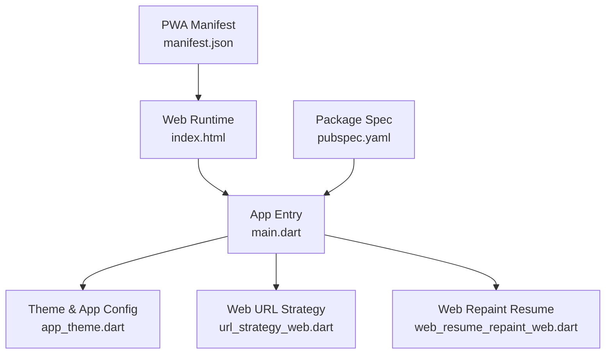
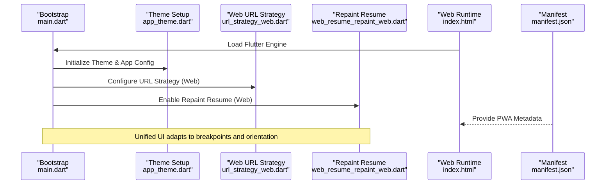
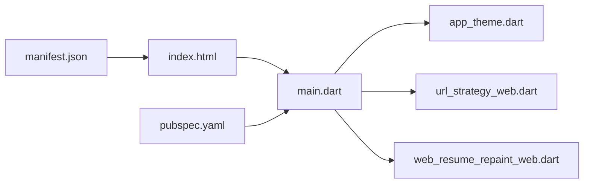

# Responsive Design Patterns

<cite>
**Referenced Files in This Document**
- [main.dart](file://flutter_app/lib/main.dart)
- [app_theme.dart](file://flutter_app/lib/app_theme.dart)
- [url_strategy_web.dart](file://flutter_app/lib/url_strategy_web.dart)
- [web_resume_repaint_web.dart](file://flutter_app/lib/web_resume_repaint_web.dart)
- [index.html](file://flutter_app/web/index.html)
- [manifest.json](file://flutter_app/web/manifest.json)
- [pubspec.yaml](file://flutter_app/pubspec.yaml)
</cite>

## Table of Contents
1. [Introduction](#introduction)
2. [Project Structure](#project-structure)
3. [Core Components](#core-components)
4. [Architecture Overview](#architecture-overview)
5. [Detailed Component Analysis](#detailed-component-analysis)
6. [Dependency Analysis](#dependency-analysis)
7. [Performance Considerations](#performance-considerations)
8. [Troubleshooting Guide](#troubleshooting-guide)
9. [Conclusion](#conclusion)

## Introduction
This document explains how Gestão Yahweh Premium implements responsive design patterns and adaptive layouts across mobile, tablet, and web platforms using Flutter. It covers breakpoint strategies, layout adaptation techniques, cross-platform responsiveness, and performance considerations for responsive designs. It also provides guidance on testing strategies across devices and screen densities to ensure consistent user experiences.

## Project Structure
The Flutter application is organized under flutter_app with platform-specific entry points and web configuration files that influence responsive behavior:
- Application bootstrap and theme initialization are defined in the main entry point and theme file.
- Web-specific behaviors such as URL strategy and repaint resumption are implemented via platform-specific stubs.
- Web runtime assets include HTML and manifest configurations that affect rendering and PWA capabilities.
- Dependencies and asset declarations are managed through the package specification file.

**Diagram sources**
- [main.dart](file://flutter_app/lib/main.dart)
- [app_theme.dart](file://flutter_app/lib/app_theme.dart)
- [url_strategy_web.dart](file://flutter_app/lib/url_strategy_web.dart)
- [web_resume_repaint_web.dart](file://flutter_app/lib/web_resume_repaint_web.dart)
- [index.html](file://flutter_app/web/index.html)
- [manifest.json](file://flutter_app/web/manifest.json)
- [pubspec.yaml](file://flutter_app/pubspec.yaml)

**Section sources**
- [main.dart](file://flutter_app/lib/main.dart)
- [app_theme.dart](file://flutter_app/lib/app_theme.dart)
- [url_strategy_web.dart](file://flutter_app/lib/url_strategy_web.dart)
- [web_resume_repaint_web.dart](file://flutter_app/lib/web_resume_repaint_web.dart)
- [index.html](file://flutter_app/web/index.html)
- [manifest.json](file://flutter_app/web/manifest.json)
- [pubspec.yaml](file://flutter_app/pubspec.yaml)

## Core Components
Responsive design in this project relies on a combination of Flutter’s built-in layout primitives and platform-aware configuration:
- Breakpoint detection and orientation handling are typically achieved through MediaQuery or LayoutBuilder to adapt UI based on available space.
- Flexible grids and adaptive panels use responsive widgets (e.g., Row/Column with Expanded/Flexible, Wrap, GridView.builder) to reflow content across sizes.
- Mobile-first principles prioritize compact layouts and progressive enhancement for larger screens.
- Web-specific optimizations include canvasKit/SKWasm selection and repaint boundaries to maintain smooth interactions.

Key implementation touchpoints:
- Application bootstrap and theme setup define global sizing, typography, and color scales that scale across breakpoints.
- Web URL strategy ensures navigation behaves consistently across platforms.
- Web repaint resume improves perceived performance during window resizing and tab switching.

**Section sources**
- [main.dart](file://flutter_app/lib/main.dart)
- [app_theme.dart](file://flutter_app/lib/app_theme.dart)
- [url_strategy_web.dart](file://flutter_app/lib/url_strategy_web.dart)
- [web_resume_repaint_web.dart](file://flutter_app/lib/web_resume_repaint_web.dart)

## Architecture Overview
The responsive architecture centers around a single codebase that adapts at runtime based on device metrics and platform context. The following diagram illustrates how the app bootstraps and integrates web-specific features while maintaining a unified UI layer.

**Diagram sources**
- [main.dart](file://flutter_app/lib/main.dart)
- [app_theme.dart](file://flutter_app/lib/app_theme.dart)
- [url_strategy_web.dart](file://flutter_app/lib/url_strategy_web.dart)
- [web_resume_repaint_web.dart](file://flutter_app/lib/web_resume_repaint_web.dart)
- [index.html](file://flutter_app/web/index.html)
- [manifest.json](file://flutter_app/web/manifest.json)

## Detailed Component Analysis

### Breakpoint Strategies and Adaptive Layouts
Breakpoints are determined by querying the current screen size and orientation. Common strategies include:
- Using MediaQuery to read constraints and derive breakpoints.
- Employing LayoutBuilder to compute local layout decisions based on parent constraints.
- Implementing responsive widgets that switch between single-column and multi-column layouts depending on width thresholds.

Adaptation techniques:
- Grids: Use GridView.builder with crossAxisCount computed from breakpoints; collapse to single column on small screens.
- Panels: Switch from side-by-side Row to stacked Column when horizontal space is limited.
- Navigation: Replace bottom navigation with drawer or tabs based on available width.

Performance tips:
- Avoid heavy rebuilds inside builders; extract reusable widgets.
- Use const constructors where possible to minimize widget tree changes.
- Apply RepaintBoundary around large, static sections to reduce repaint costs.

**Section sources**
- [main.dart](file://flutter_app/lib/main.dart)
- [app_theme.dart](file://flutter_app/lib/app_theme.dart)

### Cross-Platform Responsiveness
Flutter renders natively on mobile and uses CanvasKit or SKWasm on web. Platform-specific behaviors:
- URL strategy normalization ensures consistent routing across platforms.
- Web repaint resume reduces flicker and improves UX during resize events.
- Asset scaling and density handling are managed via pubspec asset declarations.

Testing across platforms:
- Validate layout on phones, tablets, and desktop browsers.
- Test orientation changes and dynamic resizing.
- Verify PWA behavior and offline availability if enabled.

**Section sources**
- [url_strategy_web.dart](file://flutter_app/lib/url_strategy_web.dart)
- [web_resume_repaint_web.dart](file://flutter_app/lib/web_resume_repaint_web.dart)
- [pubspec.yaml](file://flutter_app/pubspec.yaml)

### Mobile-First Design Principles
Mobile-first ensures core functionality and readability on small screens:
- Start with compact layouts and minimal chrome.
- Gradually enhance for larger viewports with additional columns, sidebars, and richer interactions.
- Prioritize touch targets and legible typography for mobile users.

Implementation patterns:
- Use flexible spacing and scalable typography units.
- Defer non-critical content until sufficient space is available.
- Optimize images and media for bandwidth-constrained environments.

**Section sources**
- [app_theme.dart](file://flutter_app/lib/app_theme.dart)
- [pubspec.yaml](file://flutter_app/pubspec.yaml)

### Responsive Grids and Flexible Layouts
Grids and flexible layouts adapt to varying widths:
- Compute cross-axis counts based on breakpoints.
- Use Wrap for fluid item wrapping without fixed grid dimensions.
- Combine Expanded and Flexible to proportionally distribute space.

Best practices:
- Keep items lightweight and avoid nested complex layouts.
- Precompute layout decisions outside build methods when possible.
- Test edge cases like very narrow widths and tall content.

**Section sources**
- [app_theme.dart](file://flutter_app/lib/app_theme.dart)

### Web-Specific Optimizations
Web runtime configuration impacts responsiveness and performance:
- index.html initializes the Flutter engine and can be tuned for performance.
- manifest.json defines PWA metadata affecting installability and display modes.
- URL strategy and repaint resume improve navigation and resize UX.

Recommendations:
- Minimize initial payload and defer heavy assets.
- Use efficient image formats and lazy loading.
- Monitor repaint and reflow costs during development.

**Section sources**
- [index.html](file://flutter_app/web/index.html)
- [manifest.json](file://flutter_app/web/manifest.json)
- [url_strategy_web.dart](file://flutter_app/lib/url_strategy_web.dart)
- [web_resume_repaint_web.dart](file://flutter_app/lib/web_resume_repaint_web.dart)

## Dependency Analysis
Responsive behavior depends on Flutter’s layout system and platform integrations. The following diagram shows key dependencies among core files involved in responsive design.

**Diagram sources**
- [main.dart](file://flutter_app/lib/main.dart)
- [app_theme.dart](file://flutter_app/lib/app_theme.dart)
- [url_strategy_web.dart](file://flutter_app/lib/url_strategy_web.dart)
- [web_resume_repaint_web.dart](file://flutter_app/lib/web_resume_repaint_web.dart)
- [index.html](file://flutter_app/web/index.html)
- [manifest.json](file://flutter_app/web/manifest.json)
- [pubspec.yaml](file://flutter_app/pubspec.yaml)

**Section sources**
- [main.dart](file://flutter_app/lib/main.dart)
- [app_theme.dart](file://flutter_app/lib/app_theme.dart)
- [url_strategy_web.dart](file://flutter_app/lib/url_strategy_web.dart)
- [web_resume_repaint_web.dart](file://flutter_app/lib/web_resume_repaint_web.dart)
- [index.html](file://flutter_app/web/index.html)
- [manifest.json](file://flutter_app/web/manifest.json)
- [pubspec.yaml](file://flutter_app/pubspec.yaml)

## Performance Considerations
To maintain smooth responsive experiences:
- Prefer const widgets and avoid unnecessary rebuilds.
- Use RepaintBoundary around large, static components.
- Optimize images and media; consider lazy loading and appropriate resolutions.
- On web, monitor CanvasKit vs SKWasm trade-offs and choose the most suitable renderer per target audience.
- Profile layout passes and repaint regions during development to identify bottlenecks.

[No sources needed since this section provides general guidance]

## Troubleshooting Guide
Common issues and remedies:
- Layout overflow: Inspect constraints with devtools; adjust padding/margins and use Flexible/Expanded appropriately.
- Excessive repaints: Identify hotspots with the performance overlay; wrap stable areas with RepaintBoundary.
- Web resize flicker: Ensure repaint resume is enabled and minimize heavy computations during resize.
- Orientation glitches: Rebuild dependent widgets on orientation change and validate safe area insets.

[No sources needed since this section provides general guidance]

## Conclusion
Gestão Yahweh Premium leverages Flutter’s responsive capabilities to deliver consistent experiences across devices. By adopting mobile-first principles, implementing robust breakpoint strategies, and optimizing web-specific behaviors, the application achieves adaptive layouts that perform well on phones, tablets, and desktops. Continuous testing and profiling ensure reliability and usability across diverse screen sizes and orientations.

[No sources needed since this section summarizes without analyzing specific files]