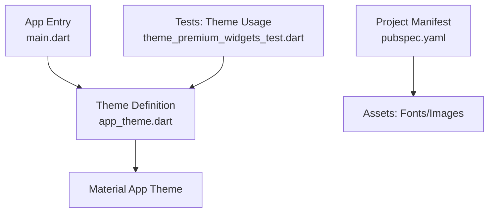
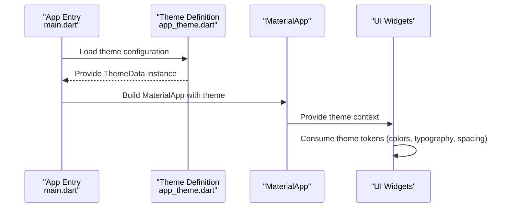
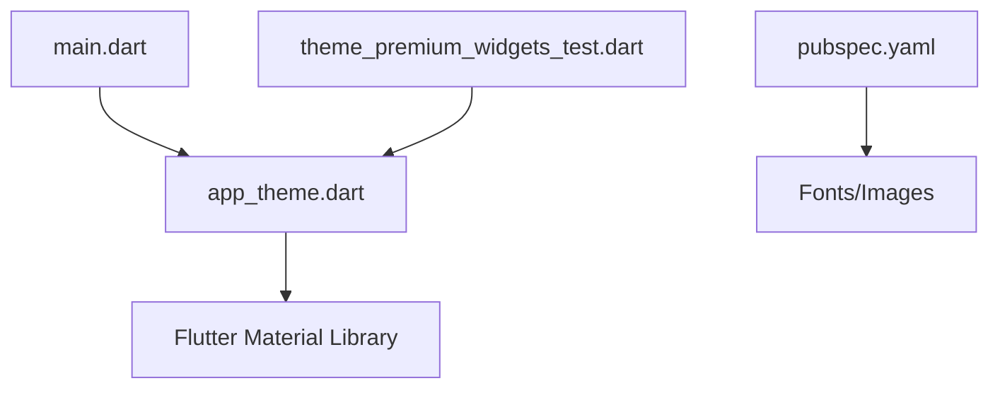

# Theme System & Styling

<cite>
**Referenced Files in This Document**
- [app_theme.dart](file://flutter_app/lib/app_theme.dart)
- [main.dart](file://flutter_app/lib/main.dart)
- [pubspec.yaml](file://flutter_app/pubspec.yaml)
- [theme_premium_widgets_test.dart](file://flutter_app/test/theme_premium_widgets_test.dart)
</cite>

## Table of Contents
1. [Introduction](#introduction)
2. [Project Structure](#project-structure)
3. [Core Components](#core-components)
4. [Architecture Overview](#architecture-overview)
5. [Detailed Component Analysis](#detailed-component-analysis)
6. [Dependency Analysis](#dependency-analysis)
7. [Performance Considerations](#performance-considerations)
8. [Troubleshooting Guide](#troubleshooting-guide)
9. [Conclusion](#conclusion)
10. [Appendices](#appendices)

## Introduction
This document explains the theme system and styling architecture used by Gestão Yahweh Premium. It covers how colors, typography, spacing, and Material Design tokens are organized, how to customize themes for brand variants, and how to implement dark/light mode switching. It also provides guidance on responsive styling, adaptive layouts, and platform-specific considerations across Flutter’s supported platforms (Android, iOS, Web, Windows, macOS, Linux).

## Project Structure
The Flutter application centralizes theming under a dedicated theme file and wires it into the app entry point. Assets such as fonts and images are declared in the project manifest. Tests validate that premium widgets consume the theme correctly.

**Diagram sources**
- [main.dart:1-200](file://flutter_app/lib/main.dart#L1-L200)
- [app_theme.dart:1-200](file://flutter_app/lib/app_theme.dart#L1-L200)
- [pubspec.yaml:1-200](file://flutter_app/pubspec.yaml#L1-L200)
- [theme_premium_widgets_test.dart:1-200](file://flutter_app/test/theme_premium_widgets_test.dart#L1-L200)

**Section sources**
- [main.dart:1-200](file://flutter_app/lib/main.dart#L1-L200)
- [app_theme.dart:1-200](file://flutter_app/lib/app_theme.dart#L1-L200)
- [pubspec.yaml:1-200](file://flutter_app/pubspec.yaml#L1-L200)
- [theme_premium_widgets_test.dart:1-200](file://flutter_app/test/theme_premium_widgets_test.dart#L1-L200)

## Core Components
- Centralized theme definition: All color tokens, typography scales, and Material theme configuration are defined in a single theme file to ensure consistency and easy customization.
- App bootstrap: The application entry point configures MaterialApp with the centralized theme and ensures consistent behavior across platforms.
- Asset declarations: Fonts and images are registered in the project manifest so they can be referenced by the theme and UI components.
- Theme validation: Unit tests assert that premium widgets render with expected theme values, preventing accidental regressions when updating the theme.

Key responsibilities:
- Color palette management: Define semantic color roles (primary, secondary, surface, error, etc.) and provide light/dark variants.
- Typography system: Establish text styles for headings, body, captions, and buttons using a consistent scale.
- Spacing conventions: Standardize padding, margins, and layout gaps via theme tokens or utility constants.
- Material Design implementation: Configure Material 3 tokens (shapes, elevations, color schemes) to align with platform guidelines.

**Section sources**
- [app_theme.dart:1-200](file://flutter_app/lib/app_theme.dart#L1-L200)
- [main.dart:1-200](file://flutter_app/lib/main.dart#L1-L200)
- [pubspec.yaml:1-200](file://flutter_app/pubspec.yaml#L1-L200)
- [theme_premium_widgets_test.dart:1-200](file://flutter_app/test/theme_premium_widgets_test.dart#L1-L200)

## Architecture Overview
The theme architecture follows a unidirectional flow from the theme definition to the Material app and its widgets. Widgets access theme tokens through the theme context rather than hardcoding values.

**Diagram sources**
- [main.dart:1-200](file://flutter_app/lib/main.dart#L1-L200)
- [app_theme.dart:1-200](file://flutter_app/lib/app_theme.dart#L1-L200)

## Detailed Component Analysis

### Theme Definition and Tokens
- Colors: Semantic color roles are defined for light and dark modes. These include primary, secondary, surface, background, error, and accent colors.
- Typography: Text styles are organized by role (headline, title, body, caption, button) with consistent font families, sizes, weights, and line heights.
- Spacing: Layout tokens define standard paddings, margins, and gaps to maintain visual rhythm across screens.
- Material tokens: Shapes, elevations, and color scheme configurations follow Material Design guidelines for consistency across platforms.

Customization patterns:
- Brand variants: Create new theme instances by overriding color roles and typography while preserving structure.
- Dark/Light mode: Provide paired theme definitions for light and dark modes; switch at runtime based on user preference or system settings.
- Extensibility: Add new colors and fonts by extending the token map and referencing them consistently in widgets.

Responsive and adaptive considerations:
- Use theme tokens to adapt spacing and typography at different breakpoints.
- Prefer flexible layouts that respond to screen size and orientation changes without hardcoding dimensions.

Platform-specific styling:
- Respect platform defaults where appropriate (e.g., navigation bars, dialogs) while maintaining brand consistency.
- Ensure accessibility by adhering to contrast ratios and dynamic type scaling on each platform.

**Section sources**
- [app_theme.dart:1-200](file://flutter_app/lib/app_theme.dart#L1-L200)

### App Bootstrap and Theme Integration
- MaterialApp is configured with the centralized theme instance.
- Theme is provided globally so all descendant widgets can access it via the theme context.
- Platform-specific behaviors (such as status bar appearance) are aligned with the active theme.

Best practices:
- Avoid per-widget theme overrides unless necessary; prefer global theme updates.
- Keep theme initialization simple and deterministic to reduce startup overhead.

**Section sources**
- [main.dart:1-200](file://flutter_app/lib/main.dart#L1-L200)

### Asset Management for Fonts and Images
- Fonts and images are declared in the project manifest for inclusion in builds.
- Theme references assets via standardized paths to ensure consistency.
- Asset organization supports scalable branding and multi-platform delivery.

Guidelines:
- Register only required assets to minimize bundle size.
- Use vector icons where possible for scalability and crisp rendering.

**Section sources**
- [pubspec.yaml:1-200](file://flutter_app/pubspec.yaml#L1-L200)

### Theme Validation via Tests
- Tests assert that premium widgets consume theme tokens correctly.
- Assertions cover color usage, typography application, and spacing adherence.
- Tests help prevent regressions when modifying theme definitions.

Recommendations:
- Extend test coverage to include new theme tokens and widget states.
- Use golden tests for visual regression detection where applicable.

**Section sources**
- [theme_premium_widgets_test.dart:1-200](file://flutter_app/test/theme_premium_widgets_test.dart#L1-L200)

## Dependency Analysis
The theme system has minimal external dependencies within the app, relying primarily on Flutter’s Material framework and asset resolution.

**Diagram sources**
- [main.dart:1-200](file://flutter_app/lib/main.dart#L1-L200)
- [app_theme.dart:1-200](file://flutter_app/lib/app_theme.dart#L1-L200)
- [pubspec.yaml:1-200](file://flutter_app/pubspec.yaml#L1-L200)
- [theme_premium_widgets_test.dart:1-200](file://flutter_app/test/theme_premium_widgets_test.dart#L1-L200)

**Section sources**
- [main.dart:1-200](file://flutter_app/lib/main.dart#L1-L200)
- [app_theme.dart:1-200](file://flutter_app/lib/app_theme.dart#L1-L200)
- [pubspec.yaml:1-200](file://flutter_app/pubspec.yaml#L1-L200)
- [theme_premium_widgets_test.dart:1-200](file://flutter_app/test/theme_premium_widgets_test.dart#L1-L200)

## Performance Considerations
- Keep theme definitions static and immutable to avoid unnecessary rebuilds.
- Minimize asset count and use efficient formats (e.g., SVG for icons) to reduce memory footprint.
- Leverage Flutter’s built-in caching for fonts and images.
- Avoid heavy computations inside theme getters; precompute derived values where needed.

[No sources needed since this section provides general guidance]

## Troubleshooting Guide
Common issues and resolutions:
- Theme not applied: Ensure MaterialApp is configured with the correct theme instance and that no local theme overrides are masking global settings.
- Missing fonts/images: Verify asset declarations in the project manifest and confirm paths match theme references.
- Contrast/accessibility failures: Adjust color tokens to meet WCAG contrast requirements; enable dynamic type scaling for readability.
- Test failures after theme changes: Update assertions in theme-related tests to reflect new token values.

**Section sources**
- [theme_premium_widgets_test.dart:1-200](file://flutter_app/test/theme_premium_widgets_test.dart#L1-L200)

## Conclusion
Gestão Yahweh Premium’s theme system centralizes design tokens for colors, typography, spacing, and Material tokens, enabling consistent branding and easy customization. By following the outlined patterns for theme extension, dark/light mode switching, and responsive styling, teams can maintain a cohesive user experience across platforms while adapting to brand-specific requirements.

[No sources needed since this section summarizes without analyzing specific files]

## Appendices

### How to Customize Themes
- Create brand variants by defining new theme instances with overridden color roles and typography.
- Switch between light and dark modes by toggling the active theme instance at runtime.
- Extend the token set by adding new colors and fonts, then reference them consistently in widgets.

### Responsive and Adaptive Layouts
- Use theme-based spacing and typography to adapt layouts across screen sizes.
- Prefer flexible layouts that adjust to orientation changes and platform constraints.

### Platform-Specific Styling
- Respect platform conventions for navigation, dialogs, and input fields while maintaining brand consistency.
- Ensure accessibility features like dynamic type and high contrast are honored on each platform.

[No sources needed since this section provides general guidance]