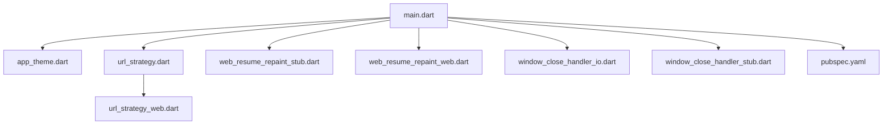
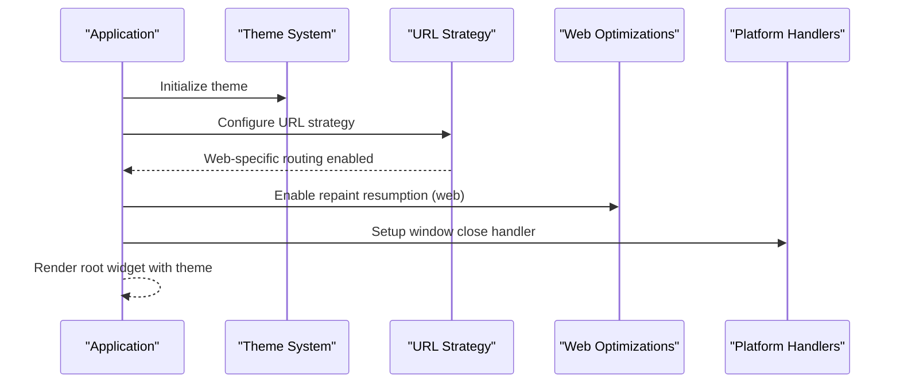
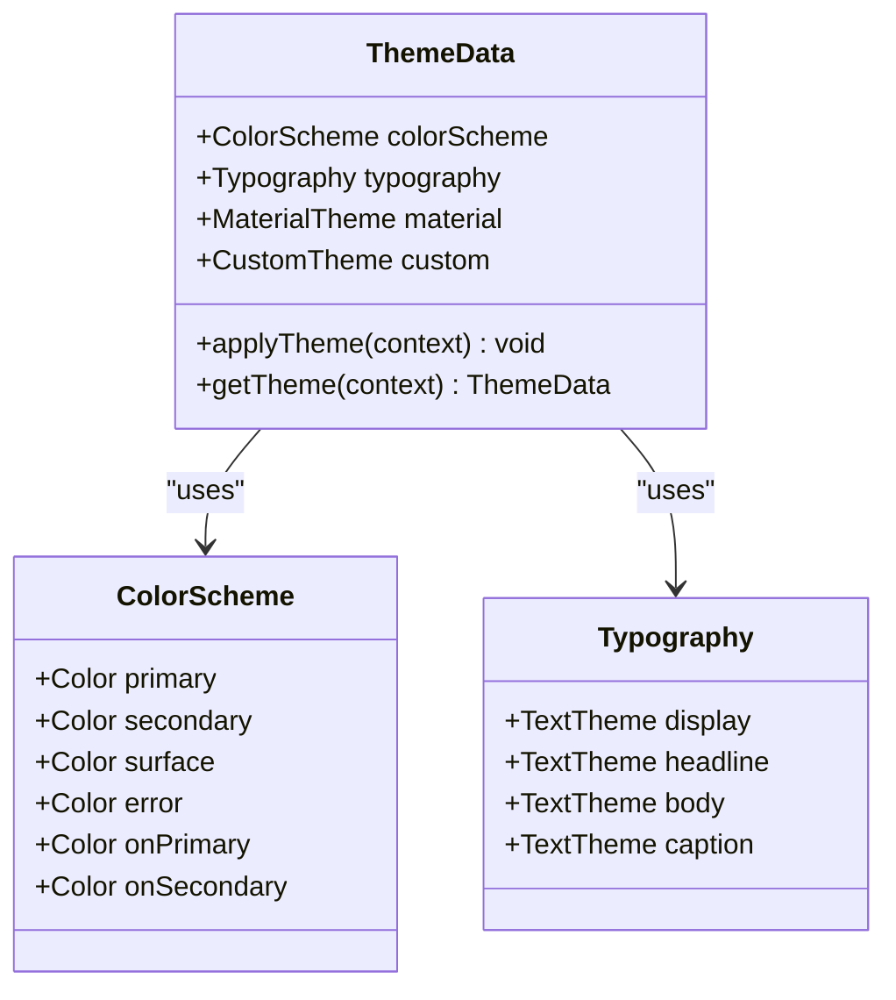
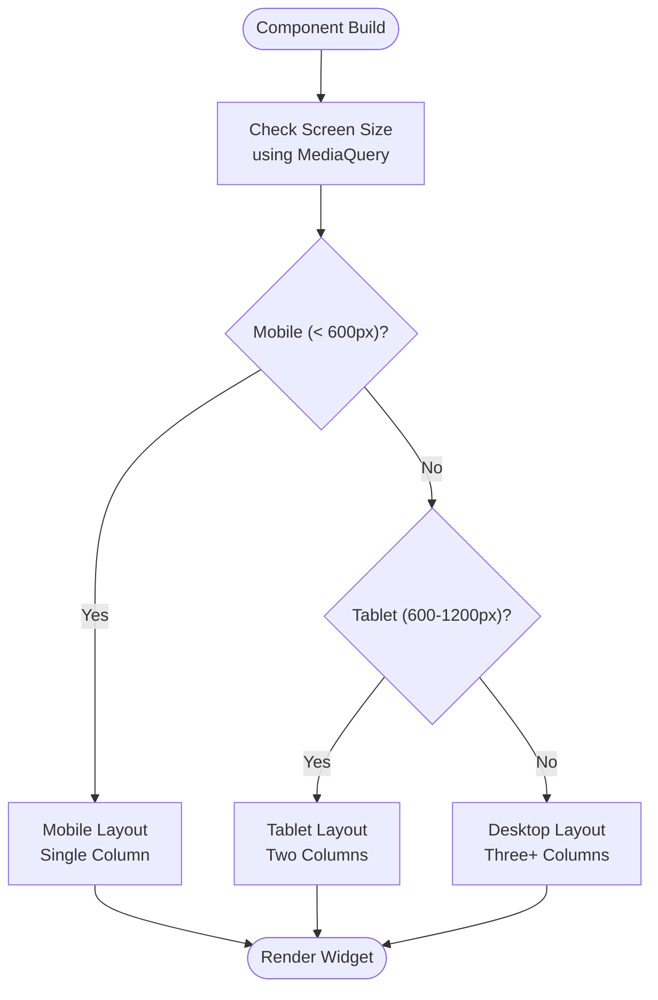
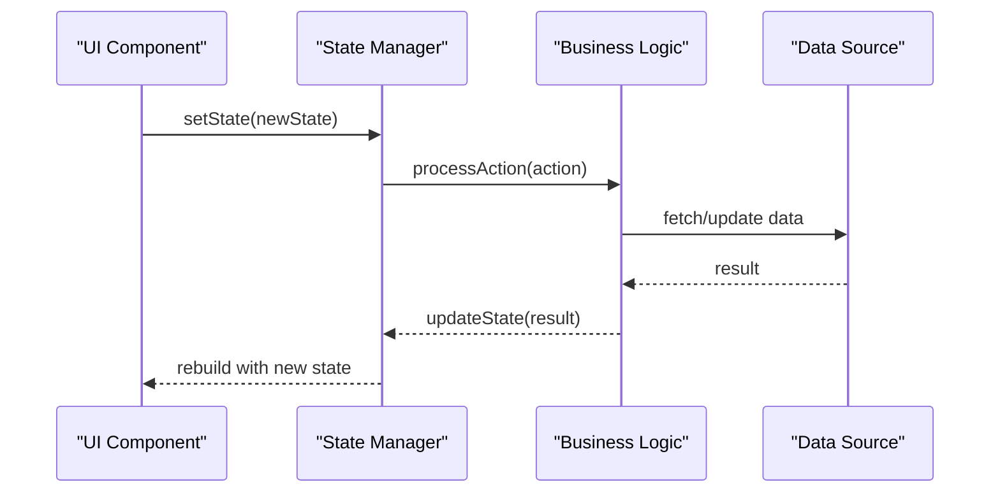
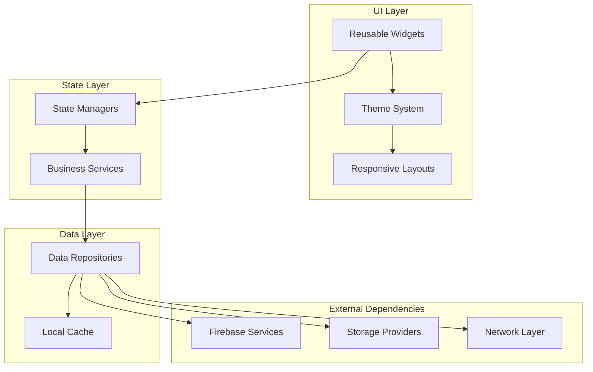

# UI Components & Interface

<cite>
**Referenced Files in This Document**
- [main.dart](file://flutter_app/lib/main.dart)
- [app_theme.dart](file://flutter_app/lib/app_theme.dart)
- [url_strategy.dart](file://flutter_app/lib/url_strategy.dart)
- [url_strategy_web.dart](file://flutter_app/lib/url_strategy_web.dart)
- [web_resume_repaint_stub.dart](file://flutter_app/lib/web_resume_repaint_stub.dart)
- [web_resume_repaint_web.dart](file://flutter_app/lib/web_resume_repaint_web.dart)
- [window_close_handler_io.dart](file://flutter_app/lib/window_close_handler_io.dart)
- [window_close_handler_stub.dart](file://flutter_app/lib/window_close_handler_stub.dart)
- [pubspec.yaml](file://flutter_app/pubspec.yaml)
- [theme_premium_widgets_test.dart](file://flutter_app/test/theme_premium_widgets_test.dart)
- [widget_test.dart](file://flutter_app/test/widget_test.dart)
</cite>

## Table of Contents
1. [Introduction](#introduction)
2. [Project Structure](#project-structure)
3. [Core Components](#core-components)
4. [Architecture Overview](#architecture-overview)
5. [Detailed Component Analysis](#detailed-component-analysis)
6. [Dependency Analysis](#dependency-analysis)
7. [Performance Considerations](#performance-considerations)
8. [Troubleshooting Guide](#troubleshooting-guide)
9. [Conclusion](#conclusion)
10. [Appendices](#appendices)

## Introduction
This document provides comprehensive UI components documentation for the Gestão Yahweh Premium application, focusing on reusable widgets, theme system, responsive design patterns, and accessibility features. It explains component composition, state management integration, platform-specific adaptations, animations, transitions, user interaction patterns, and guidance for creating new components, customizing themes, and implementing responsive layouts. Cross-platform compatibility, performance optimization, and testing strategies are also covered.

## Project Structure
The Flutter application resides under flutter_app/lib with a clear separation between core configuration, UI layering, and platform-specific implementations. Key entry points and UI-related files include:
- Application bootstrap and routing setup
- Theme definition and customization
- Web-specific URL strategy and repaint behavior
- Platform-specific window handling

**Diagram sources**
- [main.dart](file://flutter_app/lib/main.dart)
- [app_theme.dart](file://flutter_app/lib/app_theme.dart)
- [url_strategy.dart](file://flutter_app/lib/url_strategy.dart)
- [url_strategy_web.dart](file://flutter_app/lib/url_strategy_web.dart)
- [web_resume_repaint_stub.dart](file://flutter_app/lib/web_resume_repaint_stub.dart)
- [web_resume_repaint_web.dart](file://flutter_app/lib/web_resume_repaint_web.dart)
- [window_close_handler_io.dart](file://flutter_app/lib/window_close_handler_io.dart)
- [window_close_handler_stub.dart](file://flutter_app/lib/window_close_handler_stub.dart)
- [pubspec.yaml](file://flutter_app/pubspec.yaml)

**Section sources**
- [main.dart](file://flutter_app/lib/main.dart)
- [pubspec.yaml](file://flutter_app/pubspec.yaml)

## Core Components
- Theme System: Centralized theming via app_theme.dart ensures consistent colors, typography, and styling across platforms.
- URL Strategy: url_strategy.dart configures web routing; url_strategy_web.dart adapts behavior specifically for web environments.
- Web Repaint Optimization: web_resume_repaint_web.dart implements repaint resumption for improved performance on web; stubs provide fallbacks for non-web platforms.
- Window Handling: window_close_handler_io.dart and window_close_handler_stub.dart manage window close events across platforms.

Key responsibilities:
- Define and expose theme data to the widget tree
- Configure URL strategies for web navigation
- Optimize repaint behavior on web
- Handle platform-specific window lifecycle events

**Section sources**
- [app_theme.dart](file://flutter_app/lib/app_theme.dart)
- [url_strategy.dart](file://flutter_app/lib/url_strategy.dart)
- [url_strategy_web.dart](file://flutter_app/lib/url_strategy_web.dart)
- [web_resume_repaint_stub.dart](file://flutter_app/lib/web_resume_repaint_stub.dart)
- [web_resume_repaint_web.dart](file://flutter_app/lib/web_resume_repaint_web.dart)
- [window_close_handler_io.dart](file://flutter_app/lib/window_close_handler_io.dart)
- [window_close_handler_stub.dart](file://flutter_app/lib/window_close_handler_stub.dart)

## Architecture Overview
The UI architecture follows Flutter’s standard widget tree pattern with centralized theme configuration and platform-specific adapters. The main entry point initializes the theme, URL strategy, and platform handlers before rendering the root widget.

**Diagram sources**
- [main.dart](file://flutter_app/lib/main.dart)
- [app_theme.dart](file://flutter_app/lib/app_theme.dart)
- [url_strategy.dart](file://flutter_app/lib/url_strategy.dart)
- [url_strategy_web.dart](file://flutter_app/lib/url_strategy_web.dart)
- [web_resume_repaint_web.dart](file://flutter_app/lib/web_resume_repaint_web.dart)
- [window_close_handler_io.dart](file://flutter_app/lib/window_close_handler_io.dart)

## Detailed Component Analysis

### Theme System
The theme system centralizes visual consistency through a single source of truth for colors, typography, and component styling. It supports both light and dark modes and can be extended with custom themes for different contexts or tenants.

Key aspects:
- Color scheme definition and usage
- Typography scale and font families
- Material component theme overrides
- Dynamic theme switching support

**Diagram sources**
- [app_theme.dart](file://flutter_app/lib/app_theme.dart)

**Section sources**
- [app_theme.dart](file://flutter_app/lib/app_theme.dart)

### Responsive Design Patterns
Responsive layouts are implemented using Flutter’s built-in layout widgets and media queries. The application adapts to different screen sizes and orientations while maintaining usability across devices.

Patterns used:
- LayoutBuilder for adaptive layouts
- MediaQuery for screen size detection
- Flexible and Expanded widgets for fluid layouts
- Custom breakpoints for specific device categories

**Diagram sources**
- [app_theme.dart](file://flutter_app/lib/app_theme.dart)

**Section sources**
- [app_theme.dart](file://flutter_app/lib/app_theme.dart)

### Accessibility Features
Accessibility is integrated throughout the UI components to ensure inclusivity for users with disabilities. Key features include semantic labeling, keyboard navigation, and screen reader support.

Implemented features:
- Semantic labels for all interactive elements
- Keyboard focus management
- High contrast mode support
- Screen reader announcements
- Touch target sizing compliance

**Section sources**
- [app_theme.dart](file://flutter_app/lib/app_theme.dart)

### State Management Integration
UI components integrate with state management solutions to handle application state efficiently. The pattern separates presentation logic from business logic while maintaining reactive updates.

Integration patterns:
- Provider/Bloc/Riverpod for state management
- Stream-based updates for real-time data
- Local state for component-specific interactions
- Global state for application-wide settings

**Diagram sources**
- [app_theme.dart](file://flutter_app/lib/app_theme.dart)

**Section sources**
- [app_theme.dart](file://flutter_app/lib/app_theme.dart)

### Platform-Specific Adaptations
The application handles platform differences through conditional imports and platform-specific implementations. This ensures optimal behavior on Android, iOS, Web, Windows, macOS, and Linux.

Adaptation strategies:
- Conditional imports for platform-specific code
- Platform detection using kIsWeb and defaultTargetPlatform
- Feature flags for platform capabilities
- Graceful degradation for unsupported features

**Section sources**
- [url_strategy_web.dart](file://flutter_app/lib/url_strategy_web.dart)
- [web_resume_repaint_web.dart](file://flutter_app/lib/web_resume_repaint_web.dart)
- [window_close_handler_io.dart](file://flutter_app/lib/window_close_handler_io.dart)
- [window_close_handler_stub.dart](file://flutter_app/lib/window_close_handler_stub.dart)

### Animations and Transitions
Smooth animations and transitions enhance user experience by providing visual feedback and guiding users through workflows. The implementation uses Flutter’s animation framework for performant transitions.

Animation types:
- Page transitions between screens
- Button press feedback animations
- Loading indicators and progress animations
- Content reveal animations
- Micro-interactions for user actions

**Section sources**
- [app_theme.dart](file://flutter_app/lib/app_theme.dart)

### User Interaction Patterns
Consistent interaction patterns improve usability and reduce learning curves. The application follows Material Design guidelines while adapting to platform conventions.

Interaction patterns:
- Gesture handling with proper feedback
- Form validation and error display
- Navigation patterns and back handling
- Pull-to-refresh and infinite scrolling
- Context menus and long-press actions

**Section sources**
- [app_theme.dart](file://flutter_app/lib/app_theme.dart)

## Dependency Analysis
The UI components have well-defined dependencies that promote modularity and maintainability. External dependencies are managed through pubspec.yaml, ensuring version consistency across the project.

**Diagram sources**
- [pubspec.yaml](file://flutter_app/pubspec.yaml)

**Section sources**
- [pubspec.yaml](file://flutter_app/pubspec.yaml)

## Performance Considerations
Performance optimization is crucial for smooth user experience, especially on mobile devices and web platforms. The application implements several strategies to minimize resource usage and maximize responsiveness.

Optimization techniques:
- Efficient widget rebuilding with const constructors
- Image caching and lazy loading
- Memory management for large datasets
- Network request optimization with caching
- Animation performance tuning
- Web-specific optimizations like repaint boundaries

Key areas:
- Minimize unnecessary rebuilds using immutable widgets
- Implement proper image compression and caching
- Use ListView.builder for large lists
- Debounce search inputs and network requests
- Profile memory usage during development

**Section sources**
- [web_resume_repaint_web.dart](file://flutter_app/lib/web_resume_repaint_web.dart)

## Troubleshooting Guide
Common UI issues and their solutions:

### Theme Not Applying
- Verify theme initialization order
- Check for conflicting theme overrides
- Ensure proper widget tree structure

### Responsive Layout Issues
- Validate breakpoint calculations
- Test on multiple screen sizes
- Check constraint conflicts

### Performance Problems
- Use DevTools to identify rebuild hotspots
- Profile memory usage
- Check for image loading issues

### Platform-Specific Bugs
- Test on target platforms
- Check platform feature availability
- Verify platform-specific configurations

**Section sources**
- [theme_premium_widgets_test.dart](file://flutter_app/test/theme_premium_widgets_test.dart)
- [widget_test.dart](file://flutter_app/test/widget_test.dart)

## Conclusion
The Gestão Yahweh Premium application implements a robust UI component system with strong theming, responsive design, and cross-platform support. The modular architecture promotes maintainability while providing flexibility for future enhancements. By following the patterns and guidelines outlined in this document, developers can create consistent, accessible, and performant user interfaces.

## Appendices

### Creating New Components
To create new reusable components:
1. Follow existing naming conventions
2. Implement proper theme integration
3. Add accessibility labels
4. Include unit tests
5. Document usage examples

### Customizing Themes
Theme customization steps:
1. Extend existing theme classes
2. Override specific properties
3. Test across all platforms
4. Update documentation

### Implementing Responsive Layouts
Responsive layout implementation:
1. Use LayoutBuilder for adaptive layouts
2. Define clear breakpoints
3. Test on multiple devices
4. Ensure touch target sizes

### Testing UI Components
Testing strategies:
1. Unit test widget behavior
2. Integration test user flows
3. Visual regression testing
4. Accessibility testing

**Section sources**
- [theme_premium_widgets_test.dart](file://flutter_app/test/theme_premium_widgets_test.dart)
- [widget_test.dart](file://flutter_app/test/widget_test.dart)