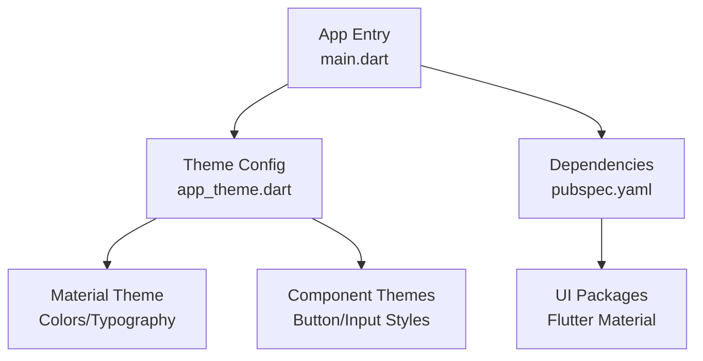
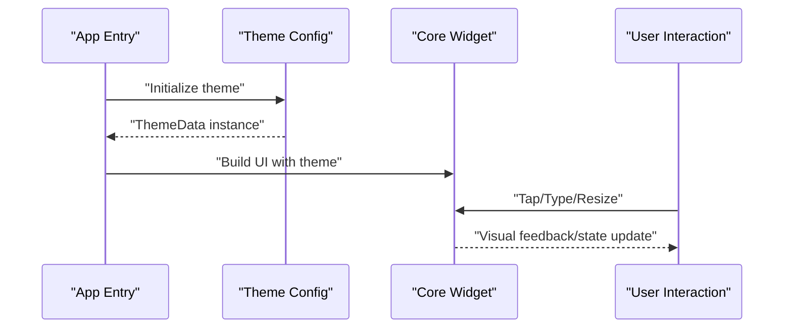
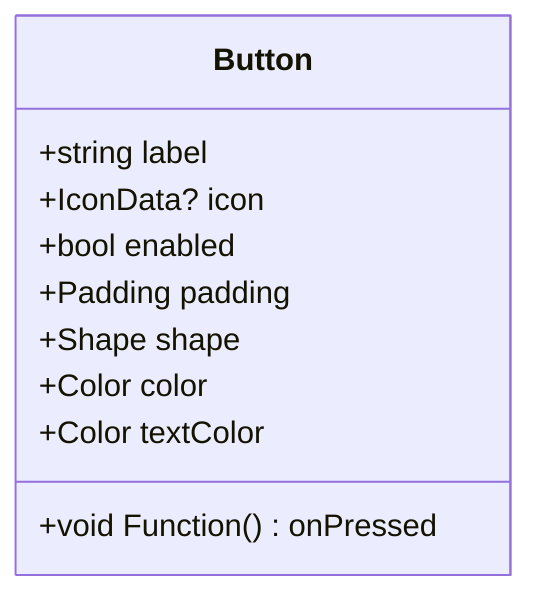
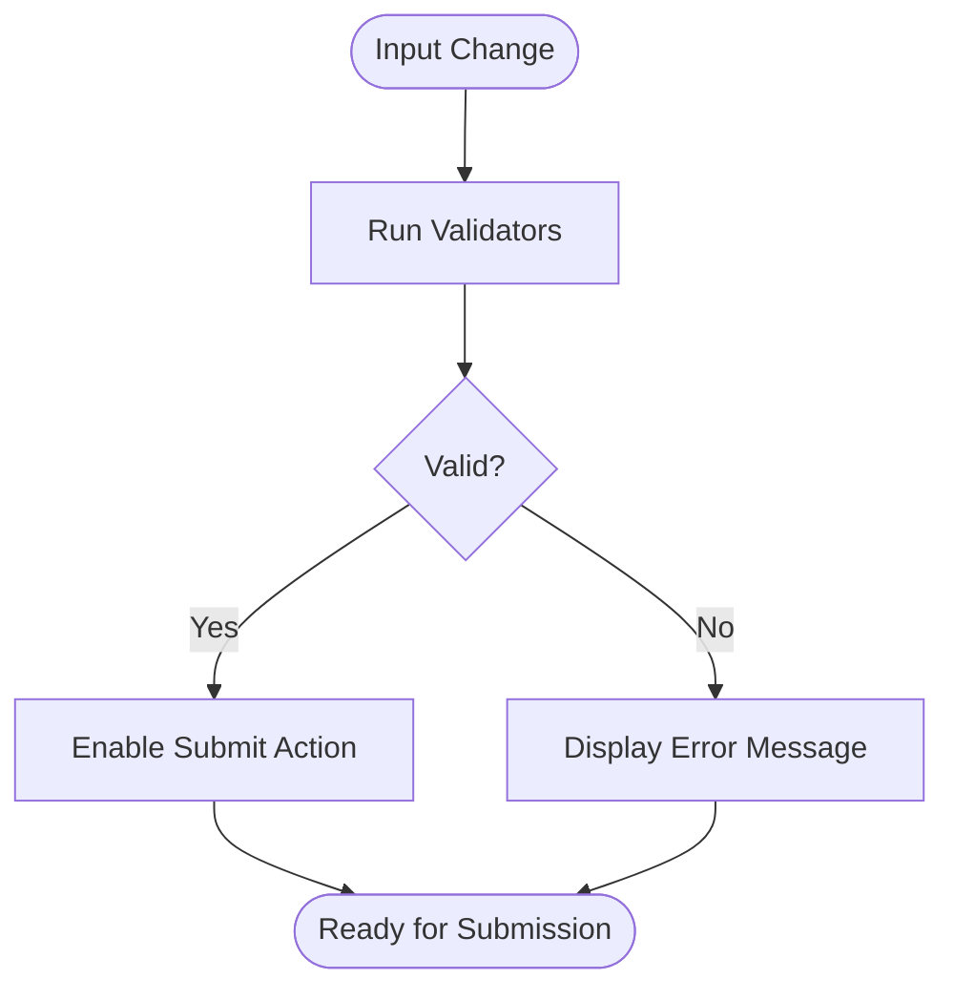
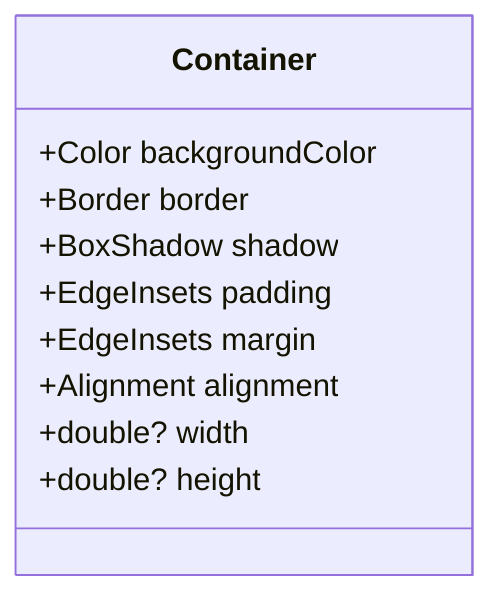
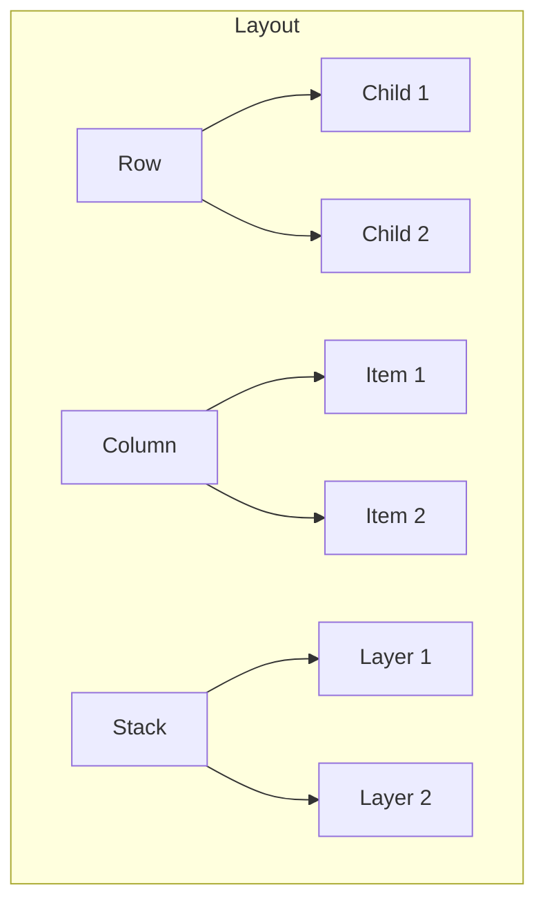
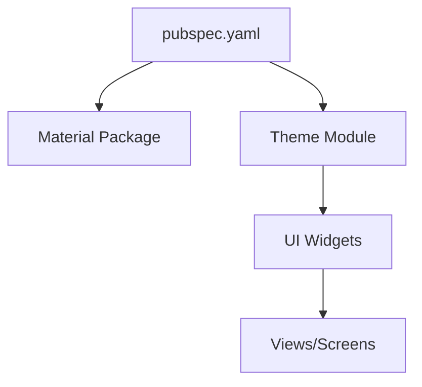

# Core Widgets

<cite>
**Referenced Files in This Document**
- [main.dart](file://flutter_app/lib/main.dart)
- [app_theme.dart](file://flutter_app/lib/app_theme.dart)
- [pubspec.yaml](file://flutter_app/pubspec.yaml)
</cite>

## Table of Contents
1. [Introduction](#introduction)
2. [Project Structure](#project-structure)
3. [Core Components](#core-components)
4. [Architecture Overview](#architecture-overview)
5. [Detailed Component Analysis](#detailed-component-analysis)
6. [Dependency Analysis](#dependency-analysis)
7. [Performance Considerations](#performance-considerations)
8. [Troubleshooting Guide](#troubleshooting-guide)
9. [Conclusion](#conclusion)
10. [Appendices](#appendices)

## Introduction
This document provides comprehensive guidance for implementing and customizing core UI widgets in the Flutter application: buttons, text inputs, containers, and basic layout components. It covers widget properties, styling options, event handlers, theme integration, accessibility features, and responsive design considerations. Practical examples are included to demonstrate common UI patterns such as primary/secondary buttons, input fields with validation, and container layouts. The goal is to help developers build consistent, accessible, and performant user interfaces across platforms.

## Project Structure
The Flutter application organizes UI-related code under the lib directory, with the main entry point and theme configuration at the root level. Key files relevant to core widgets include:
- Application entry point that initializes the app and theme
- Theme definition file that centralizes colors, typography, and component themes
- Dependency manifest that lists packages used by the UI layer

**Diagram sources**
- [main.dart](file://flutter_app/lib/main.dart)
- [app_theme.dart](file://flutter_app/lib/app_theme.dart)
- [pubspec.yaml](file://flutter_app/pubspec.yaml)

**Section sources**
- [main.dart](file://flutter_app/lib/main.dart)
- [app_theme.dart](file://flutter_app/lib/app_theme.dart)
- [pubspec.yaml](file://flutter_app/pubspec.yaml)

## Core Components
This section outlines the core widgets commonly used throughout the application and how they integrate with the theme system.

- Buttons
  - Primary button: high-emphasis action, typically uses the theme’s primary color and bold typography.
  - Secondary button: lower-emphasis action, often uses outlined or subdued styles.
  - Properties: label, icon, onPressed handler, disabled state, padding, shape, elevation.
  - Event handling: tap callbacks, loading states, and error feedback.
  - Accessibility: semantic labels, focus traversal, and screen reader support.

- Text Inputs
  - Properties: controller, validator, hint, label, prefix/suffix icons, enabled/disabled state.
  - Validation: synchronous and asynchronous validators, error messages, and visual feedback.
  - Styling: input decoration, border styles, focused states, and error states.
  - Accessibility: proper labeling, hints, and error descriptions.

- Containers
  - Purpose: grouping and spacing content; applying background colors, borders, shadows, and constraints.
  - Layout: alignment, padding, margin, width/height constraints, and overflow behavior.
  - Theming: using theme colors and shapes for consistency.

- Basic Layouts
  - Row/Column: horizontal/vertical arrangements with flexible spacing and alignment.
  - Stack: layered content with positioning controls.
  - Responsive design: adapting layouts based on screen size and orientation.

**Section sources**
- [app_theme.dart](file://flutter_app/lib/app_theme.dart)
- [pubspec.yaml](file://flutter_app/pubspec.yaml)

## Architecture Overview
The UI architecture follows a clear separation between presentation and theming:
- The app entry initializes the theme and routes.
- The theme file defines global styles and component-specific themes.
- Widgets consume theme data via context to ensure consistency.

**Diagram sources**
- [main.dart](file://flutter_app/lib/main.dart)
- [app_theme.dart](file://flutter_app/lib/app_theme.dart)

## Detailed Component Analysis

### Button Widget
Buttons represent actions and are styled through the theme. Common patterns include primary and secondary variants.

- Properties
  - Label and icon: define visible content.
  - onPressed: callback for user interaction.
  - State: enabled/disabled, loading indicators.
  - Style: padding, shape, elevation, colors from theme.

- Event Handling
  - Tap events trigger business logic.
  - Loading states prevent duplicate submissions.
  - Error states provide immediate feedback.

- Accessibility
  - Semantic labels for screen readers.
  - Focus management for keyboard navigation.

- Example Patterns
  - Primary button: high-emphasis call-to-action.
  - Secondary button: supportive actions like cancel or back.

**Diagram sources**
- [app_theme.dart](file://flutter_app/lib/app_theme.dart)

**Section sources**
- [app_theme.dart](file://flutter_app/lib/app_theme.dart)

### Text Input Widget
Text inputs capture user data and provide validation and feedback.

- Properties
  - Controller: manages text state.
  - Validator: synchronous/asynchronous checks.
  - Decoration: hint, label, prefix/suffix icons.
  - States: enabled/disabled, focused, error.

- Validation Flow
  - On change: validate input.
  - On submit: enforce rules and show errors.
  - Success: proceed with action.

- Accessibility
  - Proper labels and hints.
  - Clear error messages.

- Example Patterns
  - Email field with format validation.
  - Password field with strength requirements.

**Diagram sources**
- [app_theme.dart](file://flutter_app/lib/app_theme.dart)

**Section sources**
- [app_theme.dart](file://flutter_app/lib/app_theme.dart)

### Container Widget
Containers group and style content, providing spacing and visual boundaries.

- Properties
  - Background color, border, shadow.
  - Padding, margin, alignment.
  - Constraints: width, height, max/min limits.

- Usage Patterns
  - Card-like sections with elevation.
  - Form sections with borders and spacing.
  - Responsive wrappers for different screen sizes.

- Theming
  - Use theme colors and shapes for consistency.

**Diagram sources**
- [app_theme.dart](file://flutter_app/lib/app_theme.dart)

**Section sources**
- [app_theme.dart](file://flutter_app/lib/app_theme.dart)

### Basic Layout Components
Layouts arrange widgets efficiently and adapt to different screen sizes.

- Row/Column
  - Horizontal/vertical arrangement.
  - Flexibility with Expanded/Flexible.
  - Alignment and spacing control.

- Stack
  - Layered content with Positioned widgets.
  - Overlays and floating elements.

- Responsive Design
  - MediaQuery and LayoutBuilder for adaptive layouts.
  - Breakpoints for mobile/tablet/desktop.

**Diagram sources**
- [app_theme.dart](file://flutter_app/lib/app_theme.dart)

**Section sources**
- [app_theme.dart](file://flutter_app/lib/app_theme.dart)

## Dependency Analysis
The UI layer depends on Flutter’s Material library and the project’s theme configuration. Dependencies are declared in the manifest file, ensuring consistent package versions across platforms.

**Diagram sources**
- [pubspec.yaml](file://flutter_app/pubspec.yaml)
- [app_theme.dart](file://flutter_app/lib/app_theme.dart)

**Section sources**
- [pubspec.yaml](file://flutter_app/pubspec.yaml)
- [app_theme.dart](file://flutter_app/lib/app_theme.dart)

## Performance Considerations
- Minimize rebuilds by using const constructors and isolating state changes.
- Avoid heavy computations in build methods; use FutureBuilder or StreamBuilder for async tasks.
- Optimize images and assets for faster rendering.
- Use ListView.builder for long lists to improve performance.
- Leverage theme caching to reduce recomputation.

[No sources needed since this section provides general guidance]

## Troubleshooting Guide
Common issues and resolutions:
- Theme not applied: Ensure MaterialApp wraps the widget tree and theme is correctly configured.
- Validation not triggering: Verify validators are attached to the correct form fields and triggered on appropriate events.
- Layout overflow: Check constraints and use Flexible/Expanded to handle dynamic content.
- Accessibility problems: Add semantic labels and ensure proper focus order.

**Section sources**
- [app_theme.dart](file://flutter_app/lib/app_theme.dart)

## Conclusion
By following the guidelines in this document, developers can create consistent, accessible, and responsive UIs using core widgets. Integrating with the theme system ensures visual coherence, while proper validation and event handling enhance user experience. Adhering to best practices improves performance and maintainability across platforms.

[No sources needed since this section summarizes without analyzing specific files]

## Appendices
- Best Practices
  - Use theme colors and typography consistently.
  - Implement meaningful accessibility labels.
  - Test on multiple screen sizes and orientations.
  - Keep widget logic simple and delegate complex operations to services.

[No sources needed since this section provides general guidance]