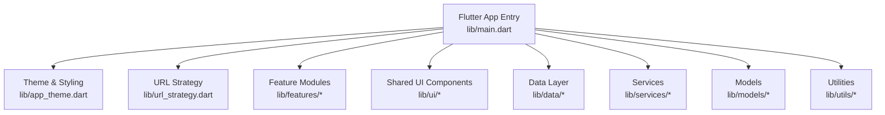
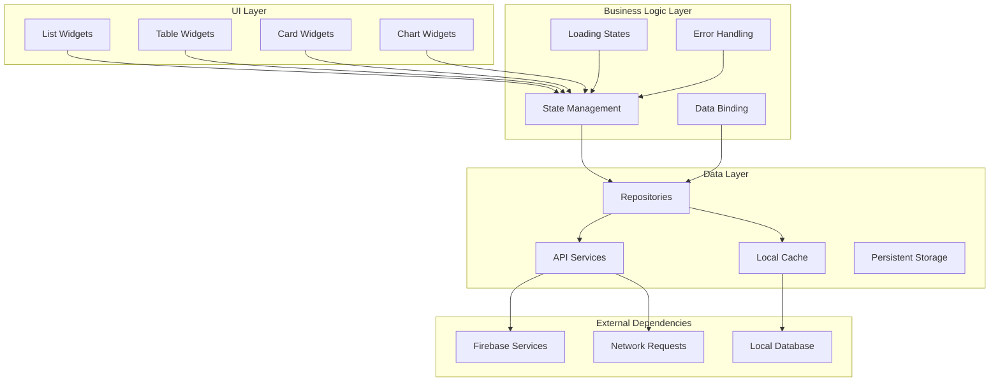
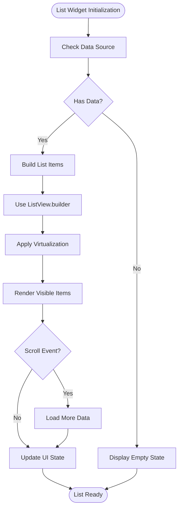
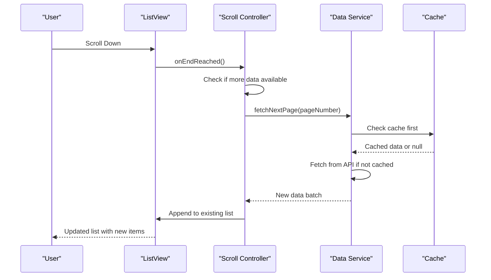
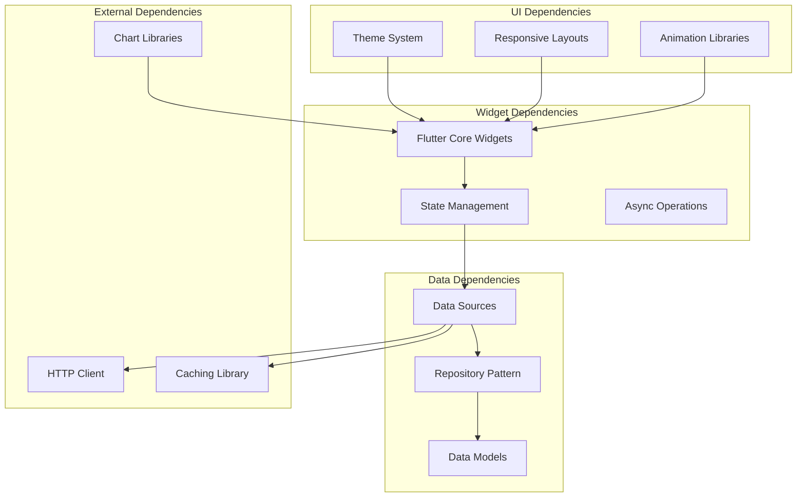

# Data Display Widgets

<cite>
**Referenced Files in This Document**
- [main.dart](file://flutter_app/lib/main.dart)
- [app_theme.dart](file://flutter_app/lib/app_theme.dart)
- [url_strategy.dart](file://flutter_app/lib/url_strategy.dart)
- [ARCHITECTURE_PERFORMANCE_MULTI_PLATFORM.md](file://docs/ARCHITECTURE_PERFORMANCE_MULTI_PLATFORM.md)
- [ARCHITECTURE_PERFORMANCE_V4.md](file://docs/ARCHITECTURE_PERFORMANCE_V4.md)
- [PADRONIZACAO_PERFORMANCE_CONTROLE_TOTAL.md](file://docs/PADRONIZACAO_PERFORMANCE_CONTROLE_TOTAL.md)
- [ANALISE_PROJETO.md](file://flutter_app/ANALISE_PROJETO.md)
- [README.md](file://flutter_app/README.md)
</cite>

## Table of Contents
1. [Introduction](#introduction)
2. [Project Structure](#project-structure)
3. [Core Components](#core-components)
4. [Architecture Overview](#architecture-overview)
5. [Detailed Component Analysis](#detailed-component-analysis)
6. [Dependency Analysis](#dependency-analysis)
7. [Performance Considerations](#performance-considerations)
8. [Troubleshooting Guide](#troubleshooting-guide)
9. [Conclusion](#conclusion)
10. [Appendices](#appendices)

## Introduction
This document provides comprehensive guidance for implementing and optimizing data display widgets in the Flutter application, including lists, tables, cards, charts, and other visualization components. It covers data binding patterns, loading states, error handling, empty state management, infinite scrolling, pagination, filtering, sorting, performance optimization for large datasets, virtualization techniques, memory-efficient rendering, accessibility best practices, and responsive design across platforms.

The Flutter app is organized under flutter_app/lib with feature-based modules and shared UI utilities. The project emphasizes multi-platform performance and consistent UX across mobile and web.

## Project Structure
At a high level, the Flutter application entry point and theme configuration are located in the lib directory. The main entry file initializes routing, theming, and platform-specific strategies. Documentation files provide architectural guidance for performance and multi-platform considerations.

**Diagram sources**
- [main.dart:1-50](file://flutter_app/lib/main.dart#L1-L50)
- [app_theme.dart:1-100](file://flutter_app/lib/app_theme.dart#L1-L100)
- [url_strategy.dart:1-50](file://flutter_app/lib/url_strategy.dart#L1-L50)

**Section sources**
- [main.dart:1-100](file://flutter_app/lib/main.dart#L1-L100)
- [app_theme.dart:1-200](file://flutter_app/lib/app_theme.dart#L1-L200)
- [url_strategy.dart:1-100](file://flutter_app/lib/url_strategy.dart#L1-L100)
- [ANALISE_PROJETO.md:1-200](file://flutter_app/ANALISE_PROJETO.md#L1-L200)
- [README.md:1-100](file://flutter_app/README.md#L1-L100)

## Core Components
Data display widgets in Flutter typically leverage built-in widgets like ListView, GridView, DataTable, Card, and third-party chart libraries. Key implementation patterns include:

- **Lists**: Use ListView.builder for efficient rendering with item builders and proper key management.
- **Tables**: Implement DataTable for structured data presentation with sortable columns.
- **Cards**: Wrap content in Card widgets for visual separation and elevation.
- **Charts**: Utilize libraries like fl_chart or syncfusion_flutter_charts for data visualization.
- **Virtualization**: Employ ListView.builder, GridView.builder, or custom scrollable views for large datasets.

Best practices include:
- Proper state management with Provider, Riverpod, or Bloc
- Efficient data binding through streams or reactive patterns
- Loading indicators during async operations
- Error boundaries and retry mechanisms
- Empty state placeholders with actionable guidance

**Section sources**
- [ARCHITECTURE_PERFORMANCE_MULTI_PLATFORM.md:1-200](file://docs/ARCHITECTURE_PERFORMANCE_MULTI_PLATFORM.md#L1-L200)
- [ARCHITECTURE_PERFORMANCE_V4.md:1-200](file://docs/ARCHITECTURE_PERFORMANCE_V4.md#L1-L200)
- [PADRONIZACAO_PERFORMANCE_CONTROLE_TOTAL.md:1-200](file://docs/PADRONIZACAO_PERFORMANCE_CONTROLE_TOTAL.md#L1-L200)

## Architecture Overview
The data display architecture follows a layered approach with clear separation of concerns between UI, business logic, and data layers.

**Diagram sources**
- [ARCHITECTURE_PERFORMANCE_MULTI_PLATFORM.md:1-200](file://docs/ARCHITECTURE_PERFORMANCE_MULTI_PLATFORM.md#L1-L200)
- [ARCHITECTURE_PERFORMANCE_V4.md:1-200](file://docs/ARCHITECTURE_PERFORMANCE_V4.md#L1-L200)

## Detailed Component Analysis

### List Implementation Patterns
Lists are fundamental for displaying collections of data. The recommended approach uses ListView.builder for optimal performance with large datasets.

Key implementation aspects:
- **Item Builders**: Create reusable list item widgets with proper keys
- **Scroll Physics**: Configure appropriate scroll behavior (bounce, never, clamping)
- **Item Count**: Handle dynamic item counts from data sources
- **Memory Management**: Dispose of resources properly when items are removed

**Diagram sources**
- [ARCHITECTURE_PERFORMANCE_MULTI_PLATFORM.md:1-200](file://docs/ARCHITECTURE_PERFORMANCE_MULTI_PLATFORM.md#L1-L200)

### Table Implementation Patterns
Tables provide structured data presentation with features like sorting, filtering, and column customization.

Implementation guidelines:
- **Column Definitions**: Define flexible column configurations
- **Sorting Logic**: Implement ascending/descending sort on click
- **Filtering**: Add search functionality across multiple columns
- **Responsive Design**: Handle different screen sizes appropriately

### Chart Implementation Patterns
Charts visualize numerical data through various chart types including line, bar, pie, and area charts.

Best practices:
- **Data Transformation**: Pre-process data for optimal chart rendering
- **Animation**: Enable smooth transitions for data updates
- **Interactivity**: Add tooltips, zoom, and selection capabilities
- **Performance**: Optimize chart data size and update frequency

**Section sources**
- [ARCHITECTURE_PERFORMANCE_V4.md:1-200](file://docs/ARCHITECTURE_PERFORMANCE_V4.md#L1-L200)
- [PADRONIZACAO_PERFORMANCE_CONTROLE_TOTAL.md:1-200](file://docs/PADRONIZACAO_PERFORMANCE_CONTROLE_TOTAL.md#L1-L200)

### Infinite Scrolling Implementation
Infinite scrolling enhances user experience by automatically loading more content as users scroll through lists.

**Diagram sources**
- [ARCHITECTURE_PERFORMANCE_MULTI_PLATFORM.md:1-200](file://docs/ARCHITECTURE_PERFORMANCE_MULTI_PLATFORM.md#L1-L200)

### Pagination Implementation
Pagination divides large datasets into manageable chunks for better performance and user experience.

Key considerations:
- **Page Size**: Optimal balance between performance and usability
- **Navigation Controls**: Previous/next buttons and page indicators
- **State Persistence**: Maintain current page across navigation
- **Error Recovery**: Handle network failures gracefully

### Filtering and Sorting
Advanced data manipulation features enhance usability for large datasets.

Implementation patterns:
- **Debounced Search**: Prevent excessive API calls during typing
- **Multi-criteria Filters**: Combine multiple filter conditions
- **Stable Sorting**: Maintain consistent order across updates
- **Performance Optimization**: Filter at data layer when possible

**Section sources**
- [ARCHITECTURE_PERFORMANCE_V4.md:1-200](file://docs/ARCHITECTURE_PERFORMANCE_V4.md#L1-L200)

## Dependency Analysis
Data display widgets depend on various internal and external dependencies for optimal functionality.

**Diagram sources**
- [ARCHITECTURE_PERFORMANCE_MULTI_PLATFORM.md:1-200](file://docs/ARCHITECTURE_PERFORMANCE_MULTI_PLATFORM.md#L1-L200)

**Section sources**
- [ARCHITECTURE_PERFORMANCE_MULTI_PLATFORM.md:1-200](file://docs/ARCHITECTURE_PERFORMANCE_MULTI_PLATFORM.md#L1-L200)
- [ARCHITECTURE_PERFORMANCE_V4.md:1-200](file://docs/ARCHITECTURE_PERFORMANCE_V4.md#L1-L200)

## Performance Considerations
Optimizing data display widgets for large datasets requires careful attention to memory usage, rendering efficiency, and network performance.

### Virtualization Techniques
- **ListView.builder**: Only builds visible items for optimal memory usage
- **GridView.builder**: Similar benefits for grid layouts
- **Custom Scroll Views**: For complex scrolling scenarios
- **Item Reuse**: Recycle widgets to minimize allocation overhead

### Memory Management
- **Proper Disposal**: Clean up resources in dispose methods
- **Image Optimization**: Use appropriate image sizes and caching
- **Data Caching**: Implement intelligent caching strategies
- **Garbage Collection**: Avoid memory leaks through proper references

### Rendering Optimization
- **Const Constructors**: Use const where possible for widget reuse
- **Rebuild Minimization**: Use selective state updates
- **Batch Updates**: Group multiple state changes together
- **Background Processing**: Offload heavy computations

### Network Optimization
- **Request Debouncing**: Prevent duplicate API calls
- **Response Caching**: Store frequently accessed data locally
- **Progressive Loading**: Show partial results while loading more
- **Error Retries**: Implement exponential backoff strategies

**Section sources**
- [PADRONIZACAO_PERFORMANCE_CONTROLE_TOTAL.md:1-200](file://docs/PADRONIZACAO_PERFORMANCE_CONTROLE_TOTAL.md#L1-L200)
- [ARCHITECTURE_PERFORMANCE_V4.md:1-200](file://docs/ARCHITECTURE_PERFORMANCE_V4.md#L1-L200)

## Troubleshooting Guide
Common issues and solutions for data display widgets:

### Performance Issues
- **Symptoms**: Slow scrolling, janky animations, high memory usage
- **Solutions**: Implement virtualization, optimize widget rebuilds, reduce unnecessary state updates
- **Debugging Tools**: Use Flutter DevTools, memory profiler, and performance overlay

### Memory Leaks
- **Symptoms**: Increasing memory usage over time, app crashes
- **Solutions**: Properly dispose controllers, cancel subscriptions, remove listeners
- **Detection**: Use memory profiling tools and leak detection libraries

### Network Errors
- **Symptoms**: Failed data loading, timeout errors, inconsistent data
- **Solutions**: Implement retry logic, handle offline scenarios, add proper error messages
- **Monitoring**: Track network requests and response times

### UI Responsiveness
- **Symptoms**: Unresponsive UI, delayed interactions, frozen screens
- **Solutions**: Move heavy operations off main thread, use background processing
- **Optimization**: Profile CPU usage and identify bottlenecks

**Section sources**
- [ARCHITECTURE_PERFORMANCE_MULTI_PLATFORM.md:1-200](file://docs/ARCHITECTURE_PERFORMANCE_MULTI_PLATFORM.md#L1-L200)

## Conclusion
Effective data display widget implementation requires a balanced approach combining performance optimization, user experience considerations, and maintainable code structure. By following the patterns and guidelines outlined in this document, developers can create responsive, accessible, and efficient data presentations that work seamlessly across different platforms and device types.

Key takeaways include:
- Prioritize virtualization for large datasets
- Implement robust error handling and loading states
- Follow accessibility guidelines for inclusive design
- Optimize for both mobile and web platforms
- Use appropriate state management patterns
- Test thoroughly across different devices and network conditions

## Appendices

### Accessibility Guidelines
Ensure data display widgets are accessible to all users:
- **Screen Reader Support**: Provide meaningful labels and descriptions
- **Keyboard Navigation**: Support tab navigation and keyboard shortcuts
- **Color Contrast**: Ensure sufficient contrast ratios for readability
- **Dynamic Text**: Support text scaling and zoom functionality
- **Focus Management**: Manage focus order and visibility

### Responsive Design Patterns
Adapt data displays for different screen sizes:
- **Mobile**: Simplified views, touch-friendly interactions
- **Tablet**: Balanced layout with enhanced features
- **Desktop**: Full-featured interface with advanced controls
- **Cross-Platform**: Consistent experience across iOS, Android, and Web

### Testing Strategies
Comprehensive testing ensures reliable widget behavior:
- **Unit Tests**: Test individual widget functionality
- **Integration Tests**: Verify data flow and state management
- **Widget Tests**: Validate UI rendering and interactions
- **Performance Tests**: Measure memory usage and rendering speed
- **Accessibility Tests**: Ensure compliance with accessibility standards