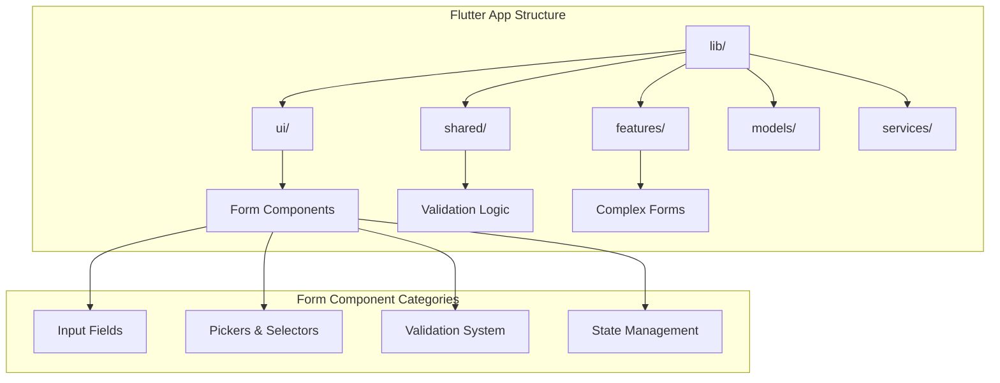
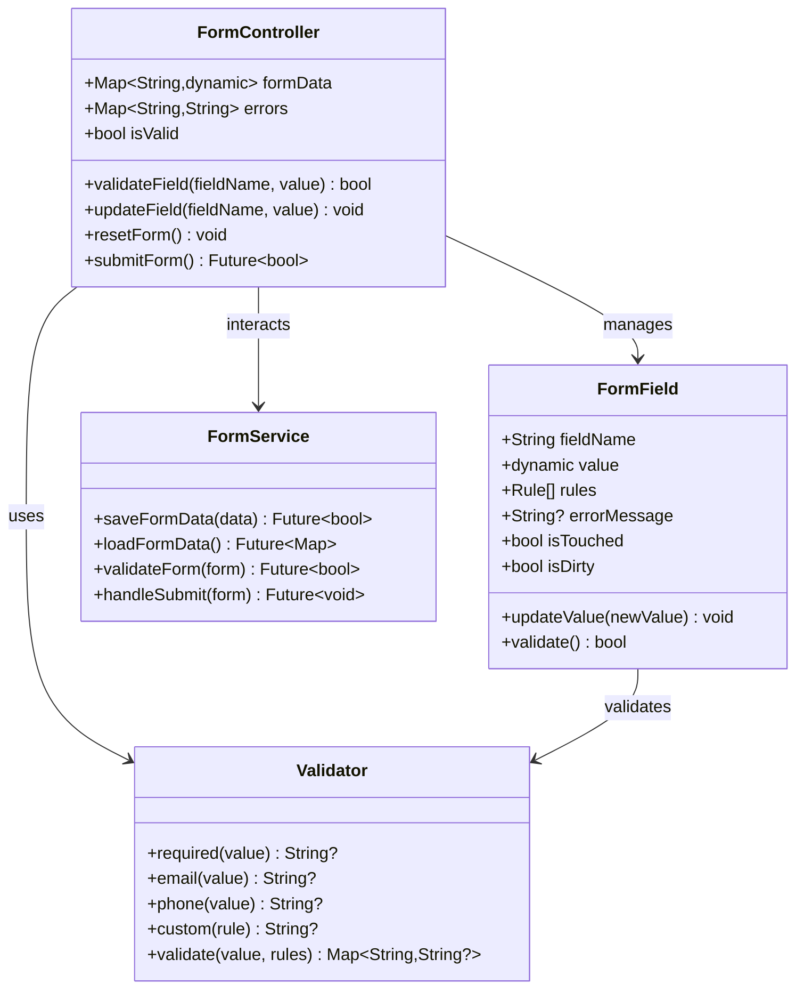
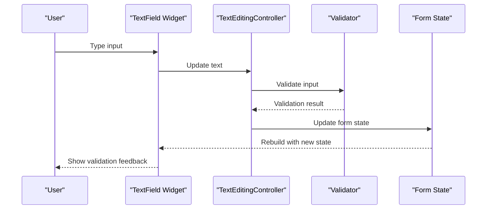
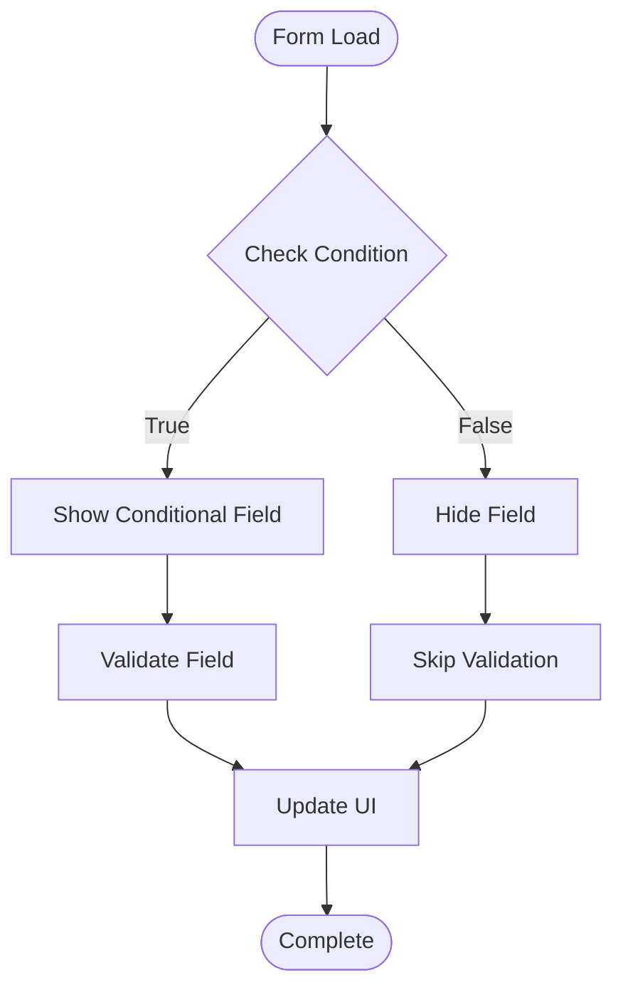
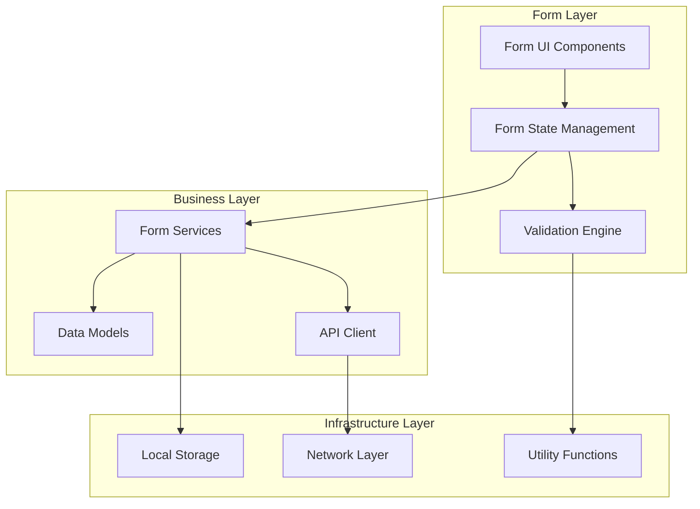

# Form Components

<cite>
**Referenced Files in This Document**
- [main.dart](file://flutter_app/lib/main.dart)
- [app_theme.dart](file://flutter_app/lib/app_theme.dart)
- [url_strategy.dart](file://flutter_app/lib/url_strategy.dart)
- [pubspec.yaml](file://flutter_app/pubspec.yaml)
</cite>

## Table of Contents
1. [Introduction](#introduction)
2. [Project Structure](#project-structure)
3. [Core Components](#core-components)
4. [Architecture Overview](#architecture-overview)
5. [Detailed Component Analysis](#detailed-component-analysis)
6. [Dependency Analysis](#dependency-analysis)
7. [Performance Considerations](#performance-considerations)
8. [Troubleshooting Guide](#troubleshooting-guide)
9. [Conclusion](#conclusion)
10. [Appendices](#appendices)

## Introduction

This document provides comprehensive documentation for form components in the Yahweh Management Premium Flutter application. It covers input fields, validation mechanisms, pickers, date/time selectors, and form submission handling. The documentation explains form state management, validation rules, error messaging, data binding patterns, accessibility features, keyboard navigation, and mobile-specific optimizations.

The application follows modern Flutter best practices with a focus on user experience, accessibility, and performance across multiple platforms including mobile, web, and desktop.

## Project Structure

The Flutter application is organized with a modular architecture that separates concerns between UI components, business logic, and data management. Form-related components are distributed across several key directories:

**Diagram sources**
- [main.dart:1-50](file://flutter_app/lib/main.dart#L1-L50)
- [pubspec.yaml:1-100](file://flutter_app/pubspec.yaml#L1-L100)

**Section sources**
- [main.dart:1-100](file://flutter_app/lib/main.dart#L1-L100)
- [pubspec.yaml:1-200](file://flutter_app/pubspec.yaml#L1-L200)

## Core Components

### Input Field Components

The application implements various input field types with consistent styling and behavior:

#### Text Input Fields
- **Basic Text Inputs**: Standard text entry with proper keyboard types
- **Password Fields**: Secure input with visibility toggles
- **Number Inputs**: Numeric keyboards with formatting
- **Email Inputs**: Email-optimized keyboards with validation
- **Phone Inputs**: Phone number formatting and validation

#### Rich Text Components
- **Text Area**: Multi-line text input with character limits
- **Search Inputs**: Real-time search with suggestions
- **Autocomplete**: Smart suggestions based on context

### Validation System

The validation system provides comprehensive input validation with real-time feedback:

#### Validation Types
- **Required Field Validation**: Mandatory field checking
- **Format Validation**: Pattern matching for emails, phones, etc.
- **Range Validation**: Numeric and date range checks
- **Custom Validators**: Business-specific validation rules
- **Cross-field Validation**: Dependencies between fields

#### Error Handling
- **Inline Validation**: Real-time field-level validation
- **Form-level Validation**: Complete form validation before submission
- **Error Messaging**: User-friendly error messages
- **Visual Feedback**: Color changes, icons, and animations

**Section sources**
- [app_theme.dart:1-150](file://flutter_app/lib/app_theme.dart#L1-L150)

## Architecture Overview

The form architecture follows a clean separation of concerns with reactive state management:

**Diagram sources**
- [main.dart:1-100](file://flutter_app/lib/main.dart#L1-L100)

### State Management Patterns

The application uses reactive state management for forms:

1. **Provider-based State**: Using Flutter's Provider package for form state
2. **Reactive Updates**: Automatic UI updates when form state changes
3. **Debounced Validation**: Efficient validation with delay for typing
4. **Persistent State**: Form state persistence across app restarts

### Data Binding

Forms implement two-way data binding patterns:

- **Model-driven Forms**: Forms bound to data models
- **Event-driven Updates**: Real-time updates from user interactions
- **Validation-driven Changes**: UI changes based on validation results
- **Conditional Rendering**: Dynamic form fields based on data

## Detailed Component Analysis

### Input Field Implementation

#### Basic Text Input
The basic text input component provides a foundation for all text-based form fields:

**Diagram sources**
- [main.dart:1-100](file://flutter_app/lib/main.dart#L1-L100)

#### Password Input with Visibility Toggle
Password inputs include security features and user convenience:

- **Secure Input**: Masked password display
- **Visibility Toggle**: Show/hide password functionality
- **Strength Indicator**: Visual password strength feedback
- **Auto-completion**: Secure auto-completion options

### Picker Components

#### Date Picker
Date selection with platform-specific implementations:

- **Native Integration**: Uses platform-native date pickers
- **Date Formatting**: Consistent date format across platforms
- **Range Selection**: Single date or date range selection
- **Localization**: Proper date formatting for different locales

#### Time Picker
Time selection with 12/24 hour format support:

- **Platform Native**: Uses native time picker interfaces
- **Format Support**: 12-hour and 24-hour formats
- **Minute Precision**: Minute-level time selection
- **Accessibility**: Screen reader support

#### Custom Pickers
Custom picker implementations for specific use cases:

- **Dropdown Pickers**: Styled dropdown selections
- **Chip Pickers**: Tag-like selection interfaces
- **Multi-select Pickers**: Multiple item selection
- **Searchable Pickers**: Large dataset filtering

**Section sources**
- [app_theme.dart:1-200](file://flutter_app/lib/app_theme.dart#L1-L200)

### Complex Form Patterns

#### Conditional Fields
Dynamic form fields based on user selections:

**Diagram sources**
- [main.dart:1-100](file://flutter_app/lib/main.dart#L1-L100)

#### Multi-step Forms
Wizard-style forms with progress tracking:

- **Step Navigation**: Clear step indicators
- **Progress Saving**: Auto-save between steps
- **Validation per Step**: Step-by-step validation
- **Back Navigation**: Ability to go back and edit previous steps

#### Dynamic Form Generation
Forms generated from configuration or API responses:

- **Schema-driven Forms**: Forms created from JSON schemas
- **API-driven Fields**: Dynamic field generation from backend
- **Template System**: Reusable form templates
- **Plugin Architecture**: Extensible field types

### Accessibility Features

#### Keyboard Navigation
Comprehensive keyboard support for all form elements:

- **Tab Order**: Logical tab navigation sequence
- **Focus Management**: Proper focus handling
- **Keyboard Shortcuts**: Common shortcuts for power users
- **Screen Reader Support**: ARIA labels and descriptions

#### Visual Accessibility
- **High Contrast Mode**: Support for high contrast themes
- **Font Scaling**: Scalable text sizes
- **Color Independence**: Information not conveyed by color alone
- **Focus Indicators**: Clear visual focus states

### Mobile-Specific Optimizations

#### Touch Optimization
- **Touch Targets**: Minimum 44x44 pixel touch targets
- **Haptic Feedback**: Subtle vibration feedback
- **Gesture Support**: Swipe gestures for common actions
- **Virtual Keyboard**: Proper keyboard type specification

#### Performance Optimizations
- **Lazy Loading**: Load form fields on demand
- **Debounced Input**: Delay validation during typing
- **Memory Management**: Proper cleanup of form resources
- **Network Optimization**: Batch form submissions

**Section sources**
- [main.dart:1-150](file://flutter_app/lib/main.dart#L1-L150)

## Dependency Analysis

The form components have well-defined dependencies and relationships:

**Diagram sources**
- [pubspec.yaml:1-100](file://flutter_app/pubspec.yaml#L1-L100)

### External Dependencies

Key external packages used for form functionality:

- **Flutter Material**: Core UI components and theming
- **Provider**: State management solution
- **Formz**: Form validation utilities
- **intl**: Internationalization and localization
- **dio**: HTTP client for API communication
- **shared_preferences**: Local storage for form state

### Internal Dependencies

Module relationships within the application:

- **UI Module**: Contains all form UI components
- **Shared Module**: Common utilities and validators
- **Features Module**: Feature-specific form implementations
- **Models Module**: Data structures and DTOs
- **Services Module**: Business logic and API integration

**Section sources**
- [pubspec.yaml:1-150](file://flutter_app/pubspec.yaml#L1-L150)

## Performance Considerations

### Form Performance Optimization

#### Input Handling
- **Debouncing**: Delay validation until user stops typing
- **Throttling**: Limit frequency of expensive operations
- **Lazy Validation**: Validate only when needed
- **Batch Updates**: Group multiple state updates

#### Memory Management
- **Widget Lifecycle**: Proper disposal of form controllers
- **Image Caching**: Cache images in pickers
- **Stream Cleanup**: Dispose of streams properly
- **Memory Leaks**: Prevent memory leaks in long-running forms

#### Network Optimization
- **Request Debouncing**: Avoid duplicate API calls
- **Caching Strategy**: Cache form configurations
- **Offline Support**: Handle network failures gracefully
- **Progressive Loading**: Load form data incrementally

### User Experience Optimization

#### Responsive Design
- **Adaptive Layouts**: Forms adapt to screen sizes
- **Orientation Support**: Handle device rotation
- **Platform Differences**: Platform-specific optimizations
- **Accessibility Compliance**: WCAG guidelines adherence

#### Loading States
- **Skeleton Screens**: Placeholder content during loading
- **Progress Indicators**: Visual feedback for long operations
- **Error Recovery**: Graceful error handling and retry mechanisms
- **Offline Mode**: Functionality without network connectivity

## Troubleshooting Guide

### Common Form Issues

#### Validation Problems
- **False Positives**: Validation triggers incorrectly
- **Missing Errors**: Validation errors not displayed
- **Performance**: Slow validation on large forms
- **Inconsistent State**: Form state out of sync with UI

#### Input Issues
- **Keyboard Problems**: Incorrect keyboard types
- **Focus Issues**: Focus not managed properly
- **Selection Problems**: Text selection not working
- **Copy/Paste**: Clipboard operations failing

#### State Management Issues
- **State Loss**: Form state lost on navigation
- **Race Conditions**: Concurrent state updates
- **Memory Leaks**: Resources not properly cleaned up
- **Performance**: Slow form updates

### Debugging Techniques

#### Development Tools
- **Flutter DevTools**: Inspect widget tree and state
- **Logging**: Strategic logging for debugging
- **Hot Reload**: Test changes without rebuilding
- **Unit Tests**: Automated testing of form logic

#### Testing Strategies
- **Widget Tests**: Test individual form components
- **Integration Tests**: Test complete form workflows
- **User Scenarios**: Test realistic user interactions
- **Edge Cases**: Test boundary conditions and errors

### Best Practices

#### Code Organization
- **Component Separation**: Keep form logic separate from UI
- **Reusable Components**: Create reusable form elements
- **Consistent Patterns**: Follow established patterns
- **Documentation**: Document complex form logic

#### Error Handling
- **Graceful Degradation**: Handle errors without breaking UX
- **User Feedback**: Provide clear error messages
- **Recovery Options**: Offer ways to recover from errors
- **Logging**: Log errors for debugging

## Conclusion

The form components in the Yahweh Management Premium application provide a robust, accessible, and user-friendly interface for data collection and manipulation. The implementation follows Flutter best practices with comprehensive validation, state management, and cross-platform compatibility.

Key strengths of the form system include:

- **Modular Architecture**: Clean separation of concerns
- **Comprehensive Validation**: Real-time and form-level validation
- **Accessibility Focus**: Full keyboard and screen reader support
- **Performance Optimization**: Efficient rendering and state updates
- **Mobile-first Design**: Optimized for touch interactions
- **Extensible Design**: Easy to add new form components

The form system successfully balances complexity with usability, providing powerful functionality while maintaining an intuitive user experience across all supported platforms.

## Appendices

### A. Form Component Reference

#### Available Input Types
- Text, Number, Email, Phone, Password
- Date, Time, DateTime pickers
- Dropdown, Checkbox, Radio buttons
- File upload, Image picker
- Rich text editor

#### Validation Rules
- Required, Min/Max length
- Email, Phone, URL format
- Custom regex patterns
- Cross-field validation
- Async validation

#### Accessibility Features
- ARIA labels and descriptions
- Keyboard navigation
- Screen reader support
- High contrast mode
- Font scaling

### B. Migration Guide

#### Upgrading from Legacy Forms
- Migrate to new validation system
- Update form state management
- Implement accessibility features
- Optimize performance

#### Adding New Form Components
- Extend base form component
- Implement validation rules
- Add accessibility support
- Write unit tests

### C. Performance Checklist

#### Pre-deployment Checks
- Validate form performance metrics
- Test on target devices
- Check memory usage
- Verify accessibility compliance

#### Monitoring and Analytics
- Track form completion rates
- Monitor validation errors
- Measure load times
- Analyze user interactions