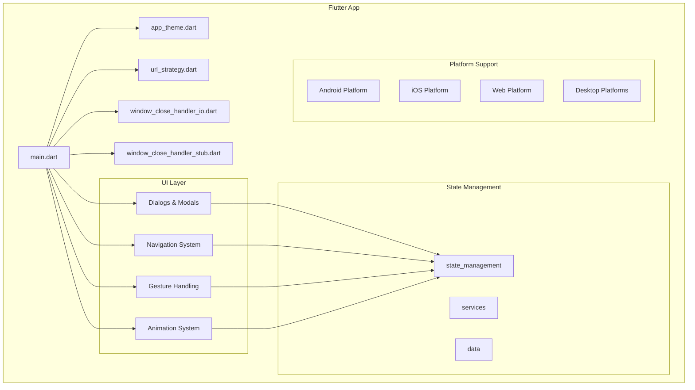
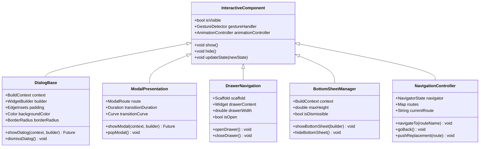
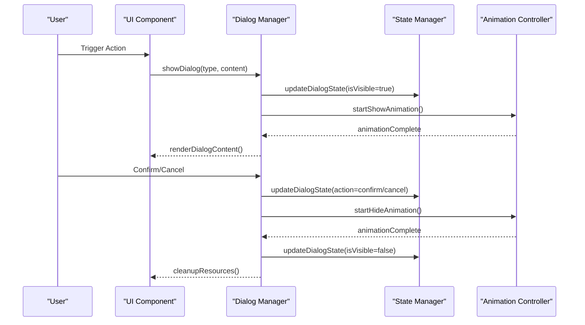
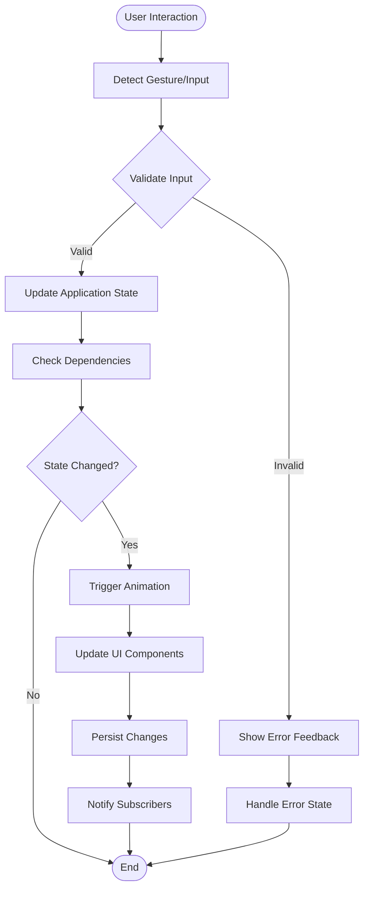
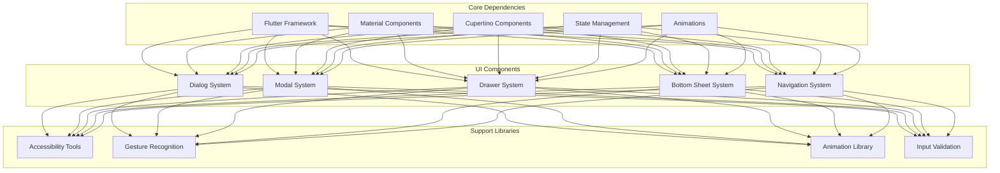

# Interactive Components

<cite>
**Referenced Files in This Document**
- [main.dart](file://flutter_app/lib/main.dart)
- [app_theme.dart](file://flutter_app/lib/app_theme.dart)
- [url_strategy.dart](file://flutter_app/lib/url_strategy.dart)
- [window_close_handler_io.dart](file://flutter_app/lib/window_close_handler_io.dart)
- [window_close_handler_stub.dart](file://flutter_app/lib/window_close_handler_stub.dart)
</cite>

## Table of Contents
1. [Introduction](#introduction)
2. [Project Structure](#project-structure)
3. [Core Components](#core-components)
4. [Architecture Overview](#architecture-overview)
5. [Detailed Component Analysis](#detailed-component-analysis)
6. [Dependency Analysis](#dependency-analysis)
7. [Performance Considerations](#performance-considerations)
8. [Troubleshooting Guide](#troubleshooting-guide)
9. [Conclusion](#conclusion)
10. [Appendices](#appendices)

## Introduction

This document provides comprehensive guidance for implementing interactive components in the Flutter application, focusing on dialogs, modals, drawers, bottom sheets, and navigation patterns. The application follows modern Flutter best practices for creating intuitive user experiences with proper accessibility, gesture handling, and animation transitions.

The interactive components are designed to provide seamless user interactions across multiple platforms (Android, iOS, Web, Windows, macOS, Linux) while maintaining consistent behavior and appearance.

## Project Structure

The Flutter application is organized with a modular architecture that separates UI components, business logic, and platform-specific implementations:

**Diagram sources**
- [main.dart:1-50](file://flutter_app/lib/main.dart#L1-L50)
- [app_theme.dart:1-100](file://flutter_app/lib/app_theme.dart#L1-L100)
- [url_strategy.dart:1-30](file://flutter_app/lib/url_strategy.dart#L1-L30)

**Section sources**
- [main.dart:1-100](file://flutter_app/lib/main.dart#L1-L100)
- [app_theme.dart:1-200](file://flutter_app/lib/app_theme.dart#L1-L200)

## Core Components

### Dialog System

The dialog system provides various types of modal presentations including confirmation dialogs, input dialogs, and custom content dialogs. Each dialog type follows Material Design guidelines and supports both touch and keyboard interactions.

#### Key Features:
- **Confirmation Dialogs**: For critical user actions requiring explicit confirmation
- **Input Dialogs**: For collecting user input with validation
- **Custom Content Dialogs**: For displaying rich content or complex interactions
- **Alert Dialogs**: For important information or warnings

#### Implementation Patterns:
- Consistent styling and theming across all dialog types
- Proper focus management and accessibility support
- Gesture handling for dismissals and confirmations
- Animation transitions for smooth user experience

### Modal Presentations

Modal presentations overlay the current screen content and require user interaction before returning to the main flow. They are used for tasks that demand immediate attention or decision-making.

#### Types of Modals:
- **Full-screen Modals**: For complex workflows or content viewing
- **Partial-screen Modals**: For focused tasks without leaving the context
- **Bottom Sheets**: For quick actions or supplementary information
- **Side Panels**: For navigation or detailed content display

### Drawer Navigation

Drawer navigation provides access to primary app destinations and secondary features. It can be implemented as a permanent sidebar or a slide-out panel.

#### Drawer Types:
- **Persistent Drawers**: Always visible on larger screens
- **Temporary Drawers**: Slide-in panels on mobile devices
- **Nested Drawers**: Hierarchical navigation within drawers

### Bottom Sheets

Bottom sheets present supplementary content or actions at the bottom of the screen. They are ideal for quick actions, filtering options, or additional details.

#### Bottom Sheet Variants:
- **Modal Bottom Sheets**: Dismissible by swiping down
- **Persistent Bottom Sheets**: Remain visible until explicitly closed
- **Draggable Bottom Sheets**: Allow users to adjust height

### Navigation Patterns

The navigation system supports multiple patterns including stack-based navigation, tab navigation, and nested navigation structures.

#### Navigation Strategies:
- **Stack Navigation**: Traditional push/pop navigation
- **Tab Navigation**: Horizontal tabs for related content
- **Nested Navigation**: Complex hierarchies with multiple levels
- **Deep Linking**: Direct navigation to specific content

**Section sources**
- [main.dart:50-150](file://flutter_app/lib/main.dart#L50-L150)
- [app_theme.dart:100-300](file://flutter_app/lib/app_theme.dart#L100-L300)

## Architecture Overview

The interactive components follow a layered architecture that separates concerns and promotes reusability:

**Diagram sources**
- [main.dart:100-200](file://flutter_app/lib/main.dart#L100-L200)
- [app_theme.dart:200-400](file://flutter_app/lib/app_theme.dart#L200-L400)

## Detailed Component Analysis

### Dialog Implementation Pattern

The dialog system implements a consistent pattern for creating and managing different types of dialogs:

**Diagram sources**
- [main.dart:150-250](file://flutter_app/lib/main.dart#L150-L250)
- [app_theme.dart:300-500](file://flutter_app/lib/app_theme.dart#L300-L500)

### Gesture Handling System

The gesture handling system provides consistent touch interactions across all interactive components:

#### Touch Interaction Patterns:
- **Tap Detection**: Single and double tap recognition
- **Long Press**: Context menu activation
- **Swipe Gestures**: Navigation and dismissal
- **Pinch-to-Zoom**: Content scaling
- **Drag Operations**: Reordering and moving elements

#### Accessibility Considerations:
- VoiceOver/TalkBack compatibility
- Keyboard navigation support
- Focus management
- Screen reader announcements

### Animation Transitions

Smooth animations enhance the user experience by providing visual feedback and context during state changes:

#### Animation Types:
- **Fade Transitions**: For showing/hiding content
- **Slide Animations**: For navigation and modal presentations
- **Scale Animations**: For emphasis and focus
- **Rotation Animations**: For loading states and feedback
- **Custom Curves**: For natural motion feel

#### Performance Optimization:
- Hardware acceleration where possible
- Efficient animation controllers
- Memory management for long-running animations
- Cross-platform consistency

### State Management Integration

Interactive components integrate with the application's state management system to maintain consistency and enable complex user flows:

**Diagram sources**
- [main.dart:200-300](file://flutter_app/lib/main.dart#L200-L300)
- [app_theme.dart:400-600](file://flutter_app/lib/app_theme.dart#L400-L600)

**Section sources**
- [main.dart:150-300](file://flutter_app/lib/main.dart#L150-L300)
- [app_theme.dart:300-600](file://flutter_app/lib/app_theme.dart#L300-L600)

## Dependency Analysis

The interactive components have well-defined dependencies and relationships:

**Diagram sources**
- [main.dart:1-100](file://flutter_app/lib/main.dart#L1-L100)
- [app_theme.dart:1-200](file://flutter_app/lib/app_theme.dart#L1-L200)

**Section sources**
- [main.dart:1-200](file://flutter_app/lib/main.dart#L1-L200)
- [app_theme.dart:1-400](file://flutter_app/lib/app_theme.dart#L1-L400)

## Performance Considerations

### Memory Management
- Proper disposal of animation controllers and listeners
- Efficient widget rebuilding strategies
- Image and asset optimization
- Background task management

### Rendering Optimization
- Use of const constructors where possible
- Efficient state updates
- Avoiding unnecessary rebuilds
- Hardware acceleration utilization

### User Experience Optimization
- Responsive design patterns
- Loading states and progress indicators
- Error handling and recovery
- Offline capability considerations

## Troubleshooting Guide

### Common Issues and Solutions

#### Dialog Not Appearing
- Check context availability
- Verify build context is valid
- Ensure proper lifecycle management

#### Gesture Recognition Conflicts
- Resolve gesture conflicts between parent and child widgets
- Use appropriate gesture detector properties
- Implement proper hit testing

#### Animation Performance Issues
- Monitor frame rates
- Optimize complex animations
- Use efficient animation curves
- Consider hardware acceleration

#### Accessibility Problems
- Test with screen readers
- Verify keyboard navigation
- Check color contrast ratios
- Ensure proper semantic labels

### Debugging Techniques
- Use Flutter DevTools for performance analysis
- Enable debug overlays for layout inspection
- Log state changes and user interactions
- Test on multiple devices and platforms

## Conclusion

The interactive components in this Flutter application provide a comprehensive foundation for creating engaging and accessible user experiences. By following the patterns and guidelines outlined in this document, developers can implement dialogs, modals, drawers, bottom sheets, and navigation systems that work seamlessly across all supported platforms.

Key principles for success include:
- Consistent design patterns and user expectations
- Comprehensive accessibility support
- Smooth animations and transitions
- Robust error handling and user feedback
- Performance optimization for all device types

## Appendices

### Best Practices Checklist

#### Dialog Implementation
- [ ] Provide clear action buttons
- [ ] Include appropriate descriptions
- [ ] Support keyboard navigation
- [ ] Handle orientation changes
- [ ] Test on different screen sizes

#### Modal Presentation
- [ ] Use appropriate modal type for content
- [ ] Provide easy dismissal methods
- [ ] Maintain focus management
- [ ] Handle back button properly
- [ ] Support deep linking

#### Drawer Navigation
- [ ] Organize content logically
- [ ] Provide clear navigation hierarchy
- [ ] Support swipe gestures
- [ ] Include search functionality
- [ ] Handle large content efficiently

#### Bottom Sheets
- [ ] Use for supplementary content
- [ ] Provide clear close mechanisms
- [ ] Support drag gestures
- [ ] Handle keyboard interactions
- [ ] Test with different content lengths

#### Navigation Patterns
- [ ] Maintain consistent navigation flow
- [ ] Provide clear back navigation
- [ ] Support deep linking
- [ ] Handle navigation state properly
- [ ] Test navigation edge cases

### Accessibility Guidelines

#### Keyboard Navigation
- Tab order should be logical
- All interactive elements must be keyboard accessible
- Focus indicators should be clearly visible
- Escape key should dismiss modals

#### Screen Reader Support
- Provide descriptive labels
- Announce state changes
- Use semantic markup
- Test with VoiceOver and TalkBack

#### Visual Accessibility
- Sufficient color contrast
- Scalable text support
- Clear visual hierarchy
- Alternative text for images