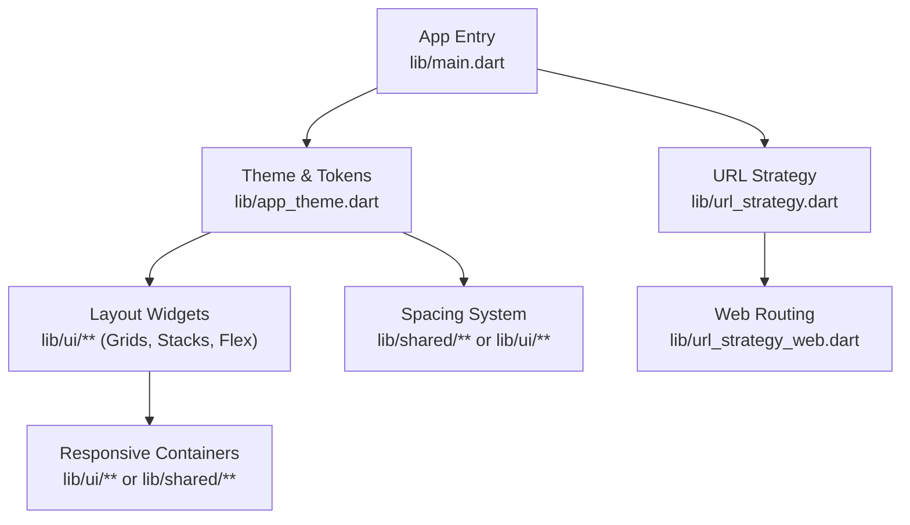
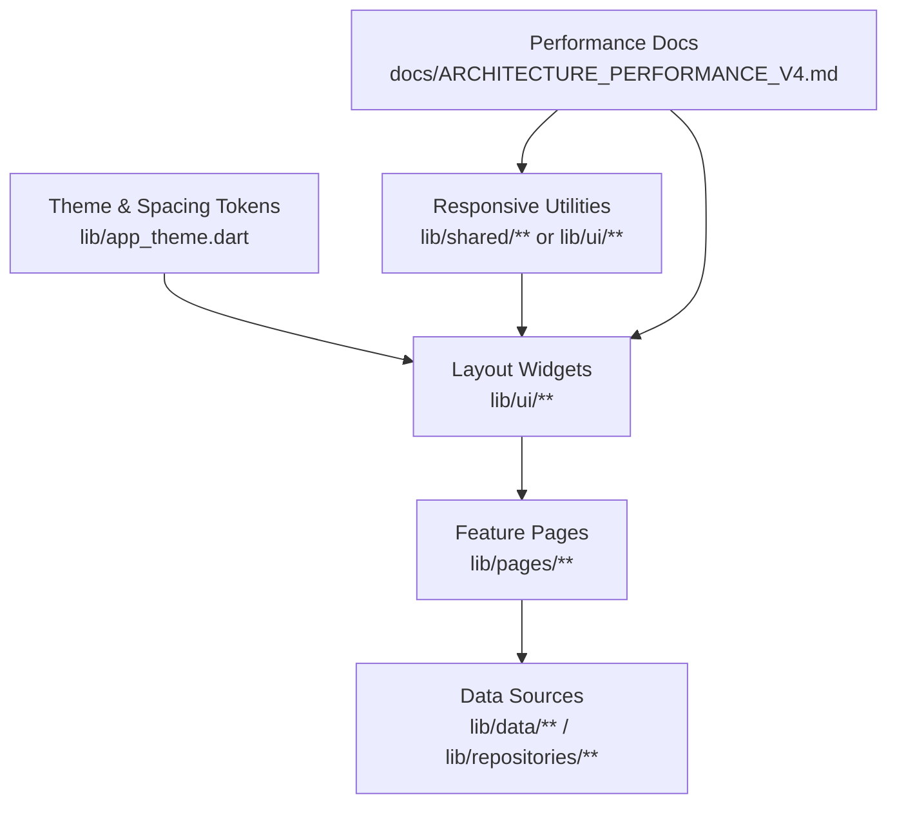
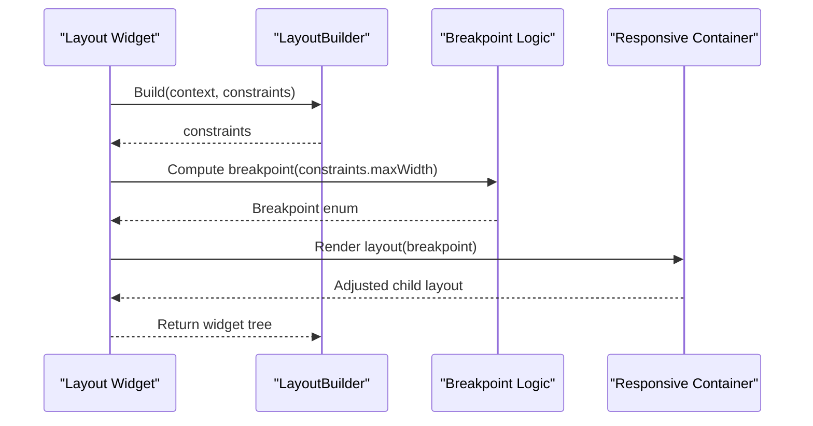
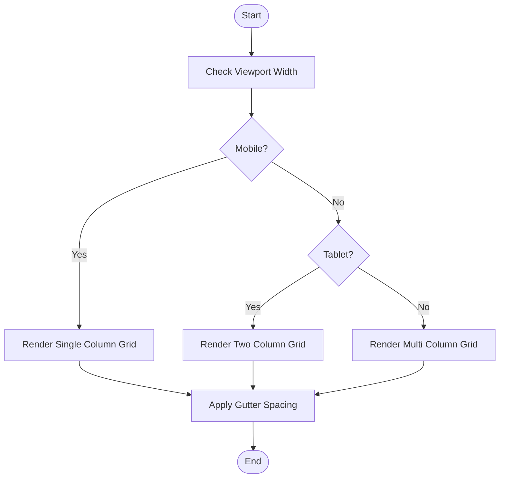
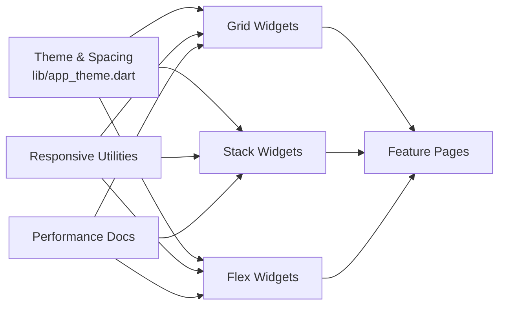

# Layout Components

<cite>
**Referenced Files in This Document**
- [main.dart](file://flutter_app/lib/main.dart)
- [app_theme.dart](file://flutter_app/lib/app_theme.dart)
- [url_strategy.dart](file://flutter_app/lib/url_strategy.dart)
- [ARCHITECTURE_PERFORMANCE_V4.md](file://docs/ARCHITECTURE_PERFORMANCE_V4.md)
- [ARCHITECTURE_INSTANT_UX.md](file://docs/ARCHITECTURE_INSTANT_UX.md)
- [PADRAO_MESTRE_WISDOMAPP_YAHWEH_TOTAL.md](file://docs/PADRAO_MESTRE_WISDOMAPP_YAHWEH_TOTAL.md)
- [ANALISE_PROJETO.md](file://flutter_app/docs/ANALISE_PROJETO.md)
</cite>

## Table of Contents
1. [Introduction](#introduction)
2. [Project Structure](#project-structure)
3. [Core Components](#core-components)
4. [Architecture Overview](#architecture-overview)
5. [Detailed Component Analysis](#detailed-component-analysis)
6. [Dependency Analysis](#dependency-analysis)
7. [Performance Considerations](#performance-considerations)
8. [Troubleshooting Guide](#troubleshooting-guide)
9. [Conclusion](#conclusion)
10. [Appendices](#appendices)

## Introduction
This document provides comprehensive guidance for implementing and optimizing layout components in the Flutter application, focusing on grids, stacks, flex layouts, and responsive containers. It explains layout strategies, spacing systems, alignment options, and adaptive design patterns. It also includes examples of complex layouts using grid systems, nested flex layouts, and responsive breakpoints, along with performance optimization techniques for large layouts, memory management, and rendering efficiency. Finally, it offers guidelines to maintain consistent spacing and alignment across different screen sizes and orientations.

## Project Structure
The Flutter application organizes UI-related code under lib/ui and shared modules, while theme and configuration files centralize spacing and sizing tokens. The main entry point initializes the app and applies global settings such as URL strategy and theming. Documentation files describe architecture and performance standards that influence how layouts should be structured and optimized.

**Diagram sources**
- [main.dart](file://flutter_app/lib/main.dart)
- [app_theme.dart](file://flutter_app/lib/app_theme.dart)
- [url_strategy.dart](file://flutter_app/lib/url_strategy.dart)

**Section sources**
- [main.dart](file://flutter_app/lib/main.dart)
- [app_theme.dart](file://flutter_app/lib/app_theme.dart)
- [url_strategy.dart](file://flutter_app/lib/url_strategy.dart)

## Core Components
- Grids: Use multi-column layouts with consistent gutters and column spans. Prefer semantic grouping and avoid deep nesting.
- Stacks: Layer content for overlays, badges, and floating elements. Control z-order and overflow behavior explicitly.
- Flex Layouts: Align items along primary and cross axes; use flexible weights and constraints to adapt to varying content sizes.
- Responsive Containers: Adapt layout based on viewport width and orientation; encapsulate breakpoint logic to keep widgets reusable.

Key implementation patterns:
- Centralize spacing tokens in a theme or constants file to ensure consistency.
- Encapsulate responsive logic in small, testable widgets or builders.
- Prefer Row/Column with Expanded/Flexible for simple flows; switch to GridView/CustomScrollView for data-heavy lists.
- Use LayoutBuilder and MediaQuery to compute dynamic sizes without hardcoding.

[No sources needed since this section provides general guidance]

## Architecture Overview
The layout system is driven by a centralized theme and responsive utilities. Widgets compose grids, stacks, and flex layouts, while responsive containers adjust structure based on available space. Performance-oriented practices are enforced through documentation and architectural guidelines.

**Diagram sources**
- [app_theme.dart](file://flutter_app/lib/app_theme.dart)
- [ARCHITECTURE_PERFORMANCE_V4.md](file://docs/ARCHITECTURE_PERFORMANCE_V4.md)

**Section sources**
- [app_theme.dart](file://flutter_app/lib/app_theme.dart)
- [ARCHITECTURE_PERFORMANCE_V4.md](file://docs/ARCHITECTURE_PERFORMANCE_V4.md)

## Detailed Component Analysis

### Grid Systems
- Purpose: Organize content into rows and columns with consistent spacing.
- Best Practices:
  - Define column counts per breakpoint (e.g., 1 on mobile, 2–3 on tablet, 4+ on desktop).
  - Use fixed gutter values from the spacing system.
  - Avoid deeply nested grids; flatten where possible.
- Example Patterns:
  - Dashboard cards in a responsive grid.
  - Media galleries with variable spans.
- Performance Tips:
  - Lazy-load grid items when dealing with large datasets.
  - Reuse grid item widgets via const constructors.

[No sources needed since this section provides general guidance]

### Stack Layers
- Purpose: Overlay elements such as badges, tooltips, and floating action buttons.
- Best Practices:
  - Keep stack depth minimal; prefer explicit positioning for critical overlays.
  - Ensure accessibility labels for overlaid interactive elements.
- Example Patterns:
  - Image card with status badge and progress indicator.
  - Floating controls over media players.
- Performance Tips:
  - Avoid animating heavy children inside stacks frequently.
  - Use offstage or visibility-aware widgets to reduce unnecessary builds.

[No sources needed since this section provides general guidance]

### Flex Layouts
- Purpose: Distribute space along primary and cross axes with flexible growth/shrink behavior.
- Best Practices:
  - Use Row/Column with Expanded/Flexible for proportional layouts.
  - Set mainAxisSize appropriately to control remaining space distribution.
  - Combine mainAxisAlignment and crossAxisAlignment for precise alignment.
- Example Patterns:
  - Header with title, actions, and avatar aligned horizontally.
  - Form rows with label, input, and helper text wrapping gracefully.
- Performance Tips:
  - Minimize rebuilds by isolating dynamic parts in separate widgets.
  - Prefer SizedBox with fixed dimensions for known sizes.

[No sources needed since this section provides general guidance]

### Responsive Containers
- Purpose: Adapt layout structure based on viewport size and orientation.
- Best Practices:
  - Use LayoutBuilder or MediaQuery to detect breakpoints.
  - Encapsulate breakpoint logic in reusable builders or widgets.
  - Maintain consistent spacing across breakpoints using tokens.
- Example Patterns:
  - Single-column list on mobile switching to two-column grid on larger screens.
  - Sidebar navigation collapsing into a drawer below a threshold.
- Performance Tips:
  - Cache computed layouts where appropriate.
  - Avoid recomputing breakpoints on every frame; debounce if necessary.

[No sources needed since this section provides general guidance]

#### Sequence Diagram: Responsive Layout Decision Flow

**Diagram sources**
- [app_theme.dart](file://flutter_app/lib/app_theme.dart)

**Section sources**
- [app_theme.dart](file://flutter_app/lib/app_theme.dart)

#### Flowchart: Complex Grid Composition

[No sources needed since this diagram shows conceptual workflow, not actual code structure]

## Dependency Analysis
Layout components depend on theme tokens for spacing and sizing, and on responsive utilities for breakpoint decisions. Feature pages consume these components to build user interfaces. Performance documentation influences how widgets are composed and optimized.

**Diagram sources**
- [app_theme.dart](file://flutter_app/lib/app_theme.dart)
- [ARCHITECTURE_PERFORMANCE_V4.md](file://docs/ARCHITECTURE_PERFORMANCE_V4.md)

**Section sources**
- [app_theme.dart](file://flutter_app/lib/app_theme.dart)
- [ARCHITECTURE_PERFORMANCE_V4.md](file://docs/ARCHITECTURE_PERFORMANCE_V4.md)

## Performance Considerations
- Rendering Efficiency:
  - Use const constructors for static widgets.
  - Isolate expensive computations outside the build method.
  - Prefer ListView.builder or GridView.builder for large datasets.
- Memory Management:
  - Dispose resources in initState and dispose lifecycle methods.
  - Avoid holding references to large objects in widget state.
  - Use image caching libraries to prevent repeated downloads.
- Adaptive Design:
  - Centralize breakpoint thresholds to minimize duplication.
  - Debounce resize events to avoid excessive rebuilds.
  - Test layouts on multiple device profiles and orientations.

Guidelines from project documentation emphasize instant UX and performance best practices, which should guide layout composition and optimization strategies.

**Section sources**
- [ARCHITECTURE_PERFORMANCE_V4.md](file://docs/ARCHITECTURE_PERFORMANCE_V4.md)
- [ARCHITECTURE_INSTANT_UX.md](file://docs/ARCHITECTURE_INSTANT_UX.md)

## Troubleshooting Guide
Common issues and resolutions:
- Inconsistent Spacing:
  - Ensure all spacing values come from the centralized theme tokens.
  - Audit widgets using dev tools to verify spacing adherence.
- Misaligned Elements:
  - Verify mainAxisSize and alignment properties in Row/Column.
  - Check overflow handling in constrained parents.
- Performance Degradation:
  - Profile rebuilds with Flutter DevTools.
  - Replace heavy widgets with lighter alternatives where possible.
- Responsive Breakpoints Not Triggering:
  - Confirm constraints are correctly passed to LayoutBuilder.
  - Validate breakpoint thresholds against target devices.

**Section sources**
- [ANALISE_PROJETO.md](file://flutter_app/docs/ANALISE_PROJETO.md)

## Conclusion
Effective layout design in Flutter relies on disciplined use of grids, stacks, flex layouts, and responsive containers. Centralizing spacing tokens, encapsulating responsive logic, and adhering to performance best practices ensures consistent, efficient, and maintainable user interfaces. Following the guidelines and patterns outlined here will help teams deliver high-quality layouts across diverse screen sizes and orientations.

[No sources needed since this section summarizes without analyzing specific files]

## Appendices
- References to architecture and performance documentation for deeper insights into layout optimization strategies.
- Guidelines for maintaining consistent spacing and alignment across platforms.

**Section sources**
- [PADRAO_MESTRE_WISDOMAPP_YAHWEH_TOTAL.md](file://docs/PADRAO_MESTRE_WISDOMAPP_YAHWEH_TOTAL.md)
- [ARCHITECTURE_PERFORMANCE_V4.md](file://docs/ARCHITECTURE_PERFORMANCE_V4.md)