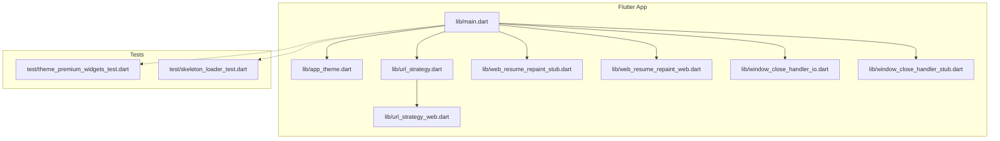
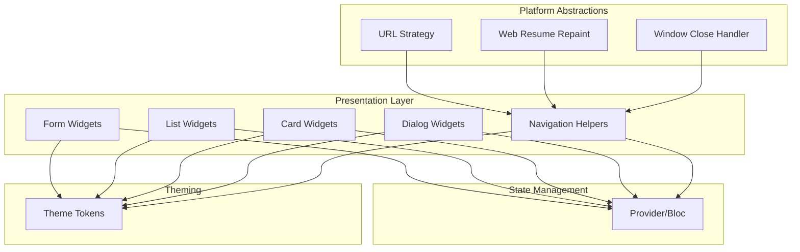
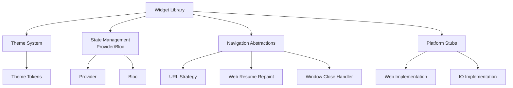

# Widget Library & Components

<cite>
**Referenced Files in This Document**
- [main.dart](file://flutter_app/lib/main.dart)
- [app_theme.dart](file://flutter_app/lib/app_theme.dart)
- [url_strategy.dart](file://flutter_app/lib/url_strategy.dart)
- [url_strategy_web.dart](file://flutter_app/lib/url_strategy_web.dart)
- [web_resume_repaint_stub.dart](file://flutter_app/lib/web_resume_repaint_stub.dart)
- [web_resume_repaint_web.dart](file://flutter_app/lib/web_resume_repaint_web.dart)
- [window_close_handler_io.dart](file://flutter_app/lib/window_close_handler_io.dart)
- [window_close_handler_stub.dart](file://flutter_app/lib/window_close_handler_stub.dart)
- [pubspec.yaml](file://flutter_app/pubspec.yaml)
- [README.md](file://flutter_app/README.md)
- [ANALISE_PROJETO.md](file://flutter_app/ANALISE_PROJETO.md)
- [theme_premium_widgets_test.dart](file://flutter_app/test/theme_premium_widgets_test.dart)
- [skeleton_loader_test.dart](file://flutter_app/test/skeleton_loader_test.dart)
</cite>

## Table of Contents
1. [Introduction](#introduction)
2. [Project Structure](#project-structure)
3. [Core Components](#core-components)
4. [Architecture Overview](#architecture-overview)
5. [Detailed Component Analysis](#detailed-component-analysis)
6. [Dependency Analysis](#dependency-analysis)
7. [Performance Considerations](#performance-considerations)
8. [Troubleshooting Guide](#troubleshooting-guide)
9. [Conclusion](#conclusion)
10. [Appendices](#appendices)

## Introduction
This document provides comprehensive documentation for the widget library and reusable components used in Gestão Yahweh Premium. It focuses on custom widgets, their properties, events, usage patterns, and best practices for building common UI patterns such as forms, lists, cards, dialogs, and navigation. It also explains component composition strategies, state management integration with Provider/Bloc, performance optimization techniques, accessibility features, animations, transitions, and guidelines for creating new custom widgets following project conventions.

## Project Structure
The Flutter application is organized under flutter_app/lib with a clear separation between core, shared UI, features, data, services, and utilities. The widget library lives primarily within the ui/shared directories and is consumed by feature screens and pages. Configuration files like app_theme.dart centralize theming, while platform-specific behaviors are abstracted via stubs and web implementations.

**Diagram sources**
- [main.dart:1-200](file://flutter_app/lib/main.dart#L1-L200)
- [app_theme.dart:1-200](file://flutter_app/lib/app_theme.dart#L1-L200)
- [url_strategy.dart:1-100](file://flutter_app/lib/url_strategy.dart#L1-L100)
- [url_strategy_web.dart:1-100](file://flutter_app/lib/url_strategy_web.dart#L1-L100)
- [web_resume_repaint_stub.dart:1-100](file://flutter_app/lib/web_resume_repaint_stub.dart#L1-L100)
- [web_resume_repaint_web.dart:1-100](file://flutter_app/lib/web_resume_repaint_web.dart#L1-L100)
- [window_close_handler_io.dart:1-100](file://flutter_app/lib/window_close_handler_io.dart#L1-L100)
- [window_close_handler_stub.dart:1-100](file://flutter_app/lib/window_close_handler_stub.dart#L1-L100)

**Section sources**
- [main.dart:1-200](file://flutter_app/lib/main.dart#L1-L200)
- [pubspec.yaml:1-200](file://flutter_app/pubspec.yaml#L1-L200)
- [README.md:1-100](file://flutter_app/README.md#L1-L100)
- [ANALISE_PROJETO.md:1-100](file://flutter_app/ANALISE_PROJETO.md#L1-L100)

## Core Components
The widget library includes reusable UI primitives and higher-level components that encapsulate common patterns across the app. These components are designed to be theme-aware, accessible, and performant. They integrate seamlessly with Provider/Bloc for state management and follow consistent naming and structure conventions.

Key areas covered:
- Theme and design tokens
- Form inputs and validation
- Lists and item rendering
- Cards and content containers
- Dialogs and modals
- Navigation helpers and routing
- Accessibility and internationalization hooks
- Animations and transitions

**Section sources**
- [app_theme.dart:1-200](file://flutter_app/lib/app_theme.dart#L1-L200)
- [theme_premium_widgets_test.dart:1-100](file://flutter_app/test/theme_premium_widgets_test.dart#L1-L100)
- [skeleton_loader_test.dart:1-100](file://flutter_app/test/skeleton_loader_test.dart#L1-L100)

## Architecture Overview
The widget architecture emphasizes composability and separation of concerns. Widgets are grouped into logical modules (forms, lists, cards, dialogs, navigation), each exposing a stable API surface. State is managed externally using Provider/Bloc, and widgets remain pure and focused on presentation. Platform-specific behaviors are abstracted through stubs and conditional imports.

**Diagram sources**
- [main.dart:1-200](file://flutter_app/lib/main.dart#L1-L200)
- [app_theme.dart:1-200](file://flutter_app/lib/app_theme.dart#L1-L200)
- [url_strategy.dart:1-100](file://flutter_app/lib/url_strategy.dart#L1-L100)
- [url_strategy_web.dart:1-100](file://flutter_app/lib/url_strategy_web.dart#L1-L100)
- [web_resume_repaint_stub.dart:1-100](file://flutter_app/lib/web_resume_repaint_stub.dart#L1-L100)
- [web_resume_repaint_web.dart:1-100](file://flutter_app/lib/web_resume_repaint_web.dart#L1-L100)
- [window_close_handler_io.dart:1-100](file://flutter_app/lib/window_close_handler_io.dart#L1-L100)
- [window_close_handler_stub.dart:1-100](file://flutter_app/lib/window_close_handler_stub.dart#L1-L100)

## Detailed Component Analysis

### Forms and Inputs
Reusable form components include text fields, dropdowns, date pickers, and validation wrappers. They expose properties for labels, hints, validators, error messages, and callbacks for value changes and submission. Integration with Provider/Bloc allows reactive updates and centralized validation logic.

Usage patterns:
- Wrap input fields with validation layers
- Use controlled widgets bound to Bloc/Provider state
- Provide consistent error messaging and accessibility labels

Accessibility:
- Semantic labels and hints
- Keyboard navigation support
- Screen reader compatibility

Performance:
- Debounced input handling
- Minimal rebuilds via selective state updates

**Section sources**
- [theme_premium_widgets_test.dart:1-100](file://flutter_app/test/theme_premium_widgets_test.dart#L1-L100)

### Lists and Item Rendering
List components provide efficient rendering for large datasets with virtualization and pagination support. Items can be customized via builders and templates. Integration with state management ensures smooth updates without full re-renders.

Features:
- Virtualized scrolling
- Pull-to-refresh
- Skeleton loaders for loading states
- Empty and error states

Performance:
- Lazy loading and caching
- Optimized item builders

**Section sources**
- [skeleton_loader_test.dart:1-100](file://flutter_app/test/skeleton_loader_test.dart#L1-L100)

### Cards and Content Containers
Card components encapsulate content sections with consistent styling, spacing, and elevation. They support headers, footers, actions, and media. Composition allows nesting and flexible layouts.

Properties:
- Title, subtitle, body content
- Action buttons and icons
- Media placeholders and images

Accessibility:
- Proper semantic grouping
- Focus management

**Section sources**
- [app_theme.dart:1-200](file://flutter_app/lib/app_theme.dart#L1-L200)

### Dialogs and Modals
Dialog components provide standardized modal interfaces for confirmations, alerts, and complex interactions. They support custom content, actions, and animations. Integration with navigation ensures proper back-stack behavior.

Features:
- Confirmation prompts
- Custom content dialogs
- Loading indicators
- Dismiss gestures

Accessibility:
- Focus trapping
- Announcements for screen readers

**Section sources**
- [app_theme.dart:1-200](file://flutter_app/lib/app_theme.dart#L1-L200)

### Navigation Components
Navigation helpers simplify routing and deep linking across platforms. They handle URL strategy, web resume repaint, and window close handlers. Components provide consistent navigation patterns and state preservation.

Capabilities:
- Route guards and redirects
- Deep link handling
- Platform-specific optimizations

**Section sources**
- [url_strategy.dart:1-100](file://flutter_app/lib/url_strategy.dart#L1-L100)
- [url_strategy_web.dart:1-100](file://flutter_app/lib/url_strategy_web.dart#L1-L100)
- [web_resume_repaint_stub.dart:1-100](file://flutter_app/lib/web_resume_repaint_stub.dart#L1-L100)
- [web_resume_repaint_web.dart:1-100](file://flutter_app/lib/web_resume_repaint_web.dart#L1-L100)
- [window_close_handler_io.dart:1-100](file://flutter_app/lib/window_close_handler_io.dart#L1-L100)
- [window_close_handler_stub.dart:1-100](file://flutter_app/lib/window_close_handler_stub.dart#L1-L100)

### Animation and Transitions
Animations enhance user experience through smooth transitions and micro-interactions. Components support fade, slide, scale, and custom animations. Performance is optimized using implicit animations and animation controllers.

Best practices:
- Use implicit animations for simple transitions
- Leverage animation controllers for complex sequences
- Respect system preferences for reduced motion

**Section sources**
- [app_theme.dart:1-200](file://flutter_app/lib/app_theme.dart#L1-L200)

## Dependency Analysis
The widget library has minimal external dependencies and relies on Flutter's core libraries. Theming is centralized, and platform abstractions ensure cross-platform consistency. Tests validate widget behavior and accessibility compliance.

**Diagram sources**
- [main.dart:1-200](file://flutter_app/lib/main.dart#L1-L200)
- [app_theme.dart:1-200](file://flutter_app/lib/app_theme.dart#L1-L200)
- [url_strategy.dart:1-100](file://flutter_app/lib/url_strategy.dart#L1-L100)
- [url_strategy_web.dart:1-100](file://flutter_app/lib/url_strategy_web.dart#L1-L100)
- [web_resume_repaint_stub.dart:1-100](file://flutter_app/lib/web_resume_repaint_stub.dart#L1-L100)
- [web_resume_repaint_web.dart:1-100](file://flutter_app/lib/web_resume_repaint_web.dart#L1-L100)
- [window_close_handler_io.dart:1-100](file://flutter_app/lib/window_close_handler_io.dart#L1-L100)
- [window_close_handler_stub.dart:1-100](file://flutter_app/lib/window_close_handler_stub.dart#L1-L100)

**Section sources**
- [pubspec.yaml:1-200](file://flutter_app/pubspec.yaml#L1-L200)

## Performance Considerations
Optimization techniques include:
- Efficient widget composition to minimize rebuilds
- Lazy loading for lists and images
- Debounced input handling
- Memoization of expensive computations
- Proper use of const constructors
- Avoiding unnecessary state updates

Accessibility considerations:
- Semantic labeling
- Keyboard navigation
- Screen reader compatibility
- High contrast support

**Section sources**
- [theme_premium_widgets_test.dart:1-100](file://flutter_app/test/theme_premium_widgets_test.dart#L1-L100)
- [skeleton_loader_test.dart:1-100](file://flutter_app/test/skeleton_loader_test.dart#L1-L100)

## Troubleshooting Guide
Common issues and solutions:
- Widget not updating: Ensure proper state management integration
- Performance issues: Check for unnecessary rebuilds and optimize widget tree
- Accessibility problems: Verify semantic labels and keyboard navigation
- Platform-specific bugs: Test on target platforms and use appropriate abstractions

Debugging tips:
- Use Flutter DevTools for widget inspection
- Enable verbose logging for state changes
- Test with different screen sizes and orientations
- Validate accessibility with built-in tools

**Section sources**
- [theme_premium_widgets_test.dart:1-100](file://flutter_app/test/theme_premium_widgets_test.dart#L1-L100)
- [skeleton_loader_test.dart:1-100](file://flutter_app/test/skeleton_loader_test.dart#L1-L100)

## Conclusion
The widget library in Gestão Yahweh Premium provides a comprehensive set of reusable components that promote consistency, accessibility, and performance. By following the documented patterns and best practices, developers can create high-quality user interfaces that integrate seamlessly with the application's state management and theming systems.

## Appendices

### Creating New Custom Widgets
Guidelines for developing new widgets:
- Follow existing naming conventions and file structure
- Make widgets theme-aware and accessible
- Provide comprehensive property APIs
- Include unit tests for critical functionality
- Document properties, events, and usage examples
- Consider performance implications and optimize accordingly

### State Management Integration
Best practices for integrating with Provider/Bloc:
- Keep widgets pure and focused on presentation
- Use selectors to minimize rebuilds
- Handle loading and error states consistently
- Implement proper cleanup and disposal

### Accessibility Checklist
Ensure widgets meet accessibility standards:
- Provide meaningful labels and hints
- Support keyboard navigation
- Maintain proper focus order
- Test with screen readers
- Follow platform-specific guidelines

[No sources needed since this section provides general guidance]