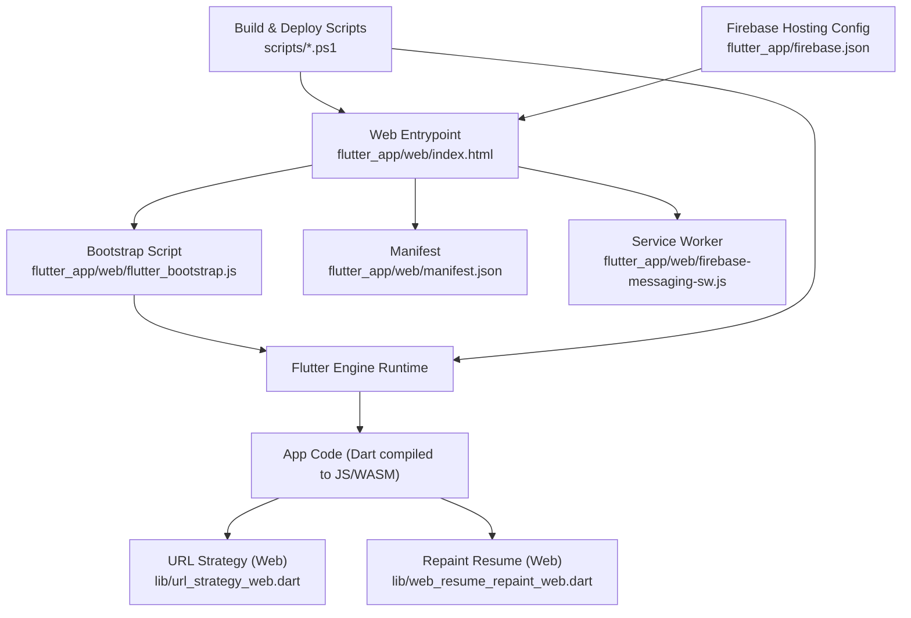
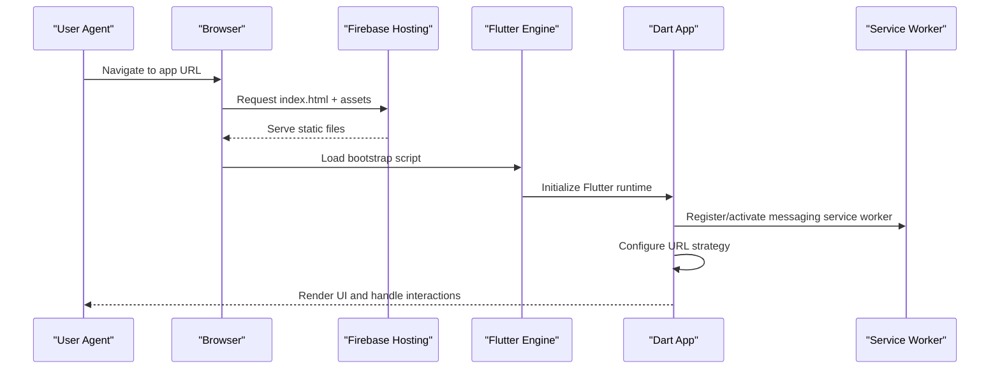
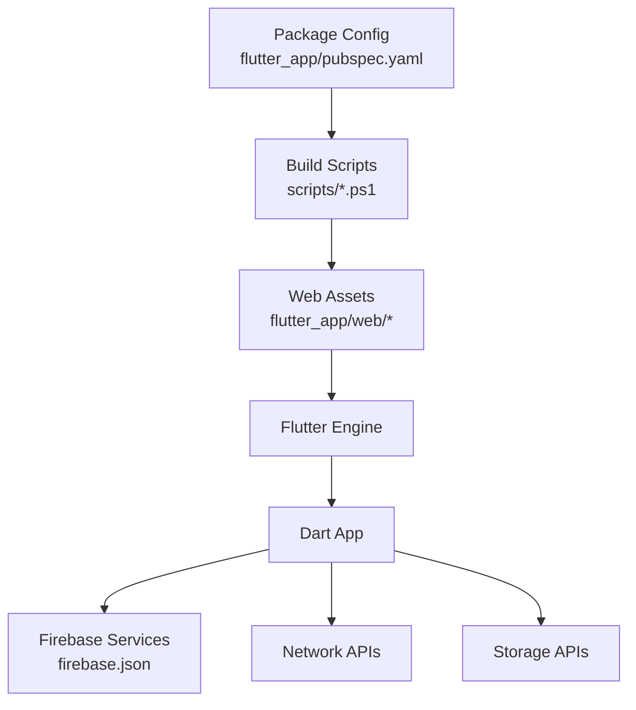

# Browser Compatibility & Optimization

<cite>
**Referenced Files in This Document**
- [pubspec.yaml](file://flutter_app/pubspec.yaml)
- [firebase.json](file://flutter_app/firebase.json)
- [index.html](file://flutter_app/web/index.html)
- [manifest.json](file://flutter_app/web/manifest.json)
- [flutter_bootstrap.js](file://flutter_app/web/flutter_bootstrap.js)
- [firebase-messaging-sw.js](file://flutter_app/web/firebase-messaging-sw.js)
- [url_strategy_web.dart](file://flutter_app/lib/url_strategy_web.dart)
- [web_resume_repaint_web.dart](file://flutter_app/lib/web_resume_repaint_web.dart)
- [deploy_web_hosting_html_dom.ps1](file://scripts/deploy_web_hosting_html_dom.ps1)
- [deploy_web_hosting_skwasm.ps1](file://scripts/deploy_web_hosting_skwasm.ps1)
- [deploy_web_hosting_canvaskit.ps1](file://scripts/deploy_web_hosting_canvaskit.ps1)
- [build_e_deploy_web.ps1](file://scripts/build_e_deploy_web.ps1)
- [PERFORMANCE_REPORT.md](file://PERFORMANCE_REPORT.md)
- [ARCHITECTURE_PERFORMANCE_MULTI_PLATFORM.md](file://docs/ARCHITECTURE_PERFORMANCE_MULTI_PLATFORM.md)
</cite>

## Table of Contents
1. [Introduction](#introduction)
2. [Project Structure](#project-structure)
3. [Core Components](#core-components)
4. [Architecture Overview](#architecture-overview)
5. [Detailed Component Analysis](#detailed-component-analysis)
6. [Dependency Analysis](#dependency-analysis)
7. [Performance Considerations](#performance-considerations)
8. [Troubleshooting Guide](#troubleshooting-guide)
9. [Conclusion](#conclusion)
10. [Appendices](#appendices)

## Introduction
This document provides a comprehensive guide to browser compatibility and optimization for the Flutter web platform used by this project. It covers supported browsers, feature detection strategies, fallback mechanisms, performance optimizations (bundle splitting, lazy loading, asset optimization), debugging tools, profiling, cross-browser testing, memory management, rendering optimization, mobile browser considerations, and troubleshooting common issues with practical solutions.

## Project Structure
The Flutter web target is configured under flutter_app/web and integrated into the build pipeline via scripts and Firebase hosting configuration. Key elements include:
- Web entrypoint and manifest files
- Bootstrap script for runtime initialization
- Service worker for background tasks
- URL strategy and repaint resume behavior for web-specific optimizations
- Build and deployment scripts that select backend targets (HTML DOM vs SkWASM) and CanvasKit variants

**Diagram sources**
- [index.html](file://flutter_app/web/index.html)
- [flutter_bootstrap.js](file://flutter_app/web/flutter_bootstrap.js)
- [manifest.json](file://flutter_app/web/manifest.json)
- [firebase-messaging-sw.js](file://flutter_app/web/firebase-messaging-sw.js)
- [url_strategy_web.dart](file://flutter_app/lib/url_strategy_web.dart)
- [web_resume_repaint_web.dart](file://flutter_app/lib/web_resume_repaint_web.dart)
- [firebase.json](file://flutter_app/firebase.json)
- [build_e_deploy_web.ps1](file://scripts/build_e_deploy_web.ps1)
- [deploy_web_hosting_html_dom.ps1](file://scripts/deploy_web_hosting_html_dom.ps1)
- [deploy_web_hosting_skwasm.ps1](file://scripts/deploy_web_hosting_skwasm.ps1)
- [deploy_web_hosting_canvaskit.ps1](file://scripts/deploy_web_hosting_canvaskit.ps1)

**Section sources**
- [pubspec.yaml](file://flutter_app/pubspec.yaml)
- [firebase.json](file://flutter_app/firebase.json)
- [index.html](file://flutter_app/web/index.html)
- [manifest.json](file://flutter_app/web/manifest.json)
- [flutter_bootstrap.js](file://flutter_app/web/flutter_bootstrap.js)
- [firebase-messaging-sw.js](file://flutter_app/web/firebase-messaging-sw.js)
- [url_strategy_web.dart](file://flutter_app/lib/url_strategy_web.dart)
- [web_resume_repaint_web.dart](file://flutter_app/lib/web_resume_repaint_web.dart)
- [build_e_deploy_web.ps1](file://scripts/build_e_deploy_web.ps1)
- [deploy_web_hosting_html_dom.ps1](file://scripts/deploy_web_hosting_html_dom.ps1)
- [deploy_web_hosting_skwasm.ps1](file://scripts/deploy_web_hosting_skwasm.ps1)
- [deploy_web_hosting_canvaskit.ps1](file://scripts/deploy_web_hosting_canvaskit.ps1)

## Core Components
- Web Entrypoint and Manifest: The HTML shell and manifest define app metadata, icons, theme colors, and initial bootstrap behavior.
- Bootstrap Script: Initializes the Flutter engine, loads assets, and configures runtime options.
- Service Worker: Enables push notifications and offline behaviors through Firebase Messaging on the web.
- URL Strategy: Ensures consistent routing behavior across browsers using HTML5 history API.
- Repaint Resume: Optimizes rendering performance by resuming repaints after user interactions or visibility changes.
- Build and Deployment Scripts: Select between HTML DOM and SkWASM backends, configure CanvasKit variants, and deploy to Firebase Hosting.

**Section sources**
- [index.html](file://flutter_app/web/index.html)
- [flutter_bootstrap.js](file://flutter_app/web/flutter_bootstrap.js)
- [firebase-messaging-sw.js](file://flutter_app/web/firebase-messaging-sw.js)
- [url_strategy_web.dart](file://flutter_app/lib/url_strategy_web.dart)
- [web_resume_repaint_web.dart](file://flutter_app/lib/web_resume_repaint_web.dart)
- [build_e_deploy_web.ps1](file://scripts/build_e_deploy_web.ps1)
- [deploy_web_hosting_html_dom.ps1](file://scripts/deploy_web_hosting_html_dom.ps1)
- [deploy_web_hosting_skwasm.ps1](file://scripts/deploy_web_hosting_skwasm.ps1)
- [deploy_web_hosting_canvaskit.ps1](file://scripts/deploy_web_hosting_canvaskit.ps1)

## Architecture Overview
The web architecture centers around Flutter’s web compilation targets and Firebase Hosting delivery. The build process selects either HTML DOM or SkWASM as the rendering backend, while CanvasKit can be tuned for graphics performance. The service worker integrates Firebase Messaging for push notifications. Routing uses HTML5 history to maintain SPA semantics.

**Diagram sources**
- [index.html](file://flutter_app/web/index.html)
- [flutter_bootstrap.js](file://flutter_app/web/flutter_bootstrap.js)
- [firebase-messaging-sw.js](file://flutter_app/web/firebase-messaging-sw.js)
- [url_strategy_web.dart](file://flutter_app/lib/url_strategy_web.dart)
- [firebase.json](file://flutter_app/firebase.json)

## Detailed Component Analysis

### Supported Browsers and Feature Detection
- Target browsers should align with modern standards: latest stable versions of Chrome, Edge, Firefox, Safari, and iOS Safari.
- Use feature detection for advanced APIs (e.g., WebAssembly, OffscreenCanvas, BroadcastChannel, IndexedDB, Web Workers).
- Provide graceful fallbacks when features are unavailable (e.g., disable non-critical enhancements, degrade animations, or switch rendering modes).
- Validate environment capabilities at startup and log warnings for unsupported features.

[No sources needed since this section provides general guidance]

### Fallback Mechanisms
- Rendering fallback: Prefer SkWASM for performance; fall back to HTML DOM if WASM is not supported.
- Graphics fallback: Choose CanvasKit variants based on device capability; disable heavy effects on low-end devices.
- Networking fallback: Retry failed requests with exponential backoff; cache responses where appropriate.
- Storage fallback: Use session storage when persistent storage is restricted.

[No sources needed since this section provides general guidance]

### Performance Optimization Techniques
- Bundle Splitting:
  - Split large dependencies and route-based code chunks to reduce initial load time.
  - Lazy-load heavy modules and third-party libraries on demand.
- Asset Optimization:
  - Compress images (WebP/AVIF), use responsive images, and preload critical assets.
  - Minify CSS/JS and enable HTTP/2 server push for critical resources.
- Caching Strategy:
  - Use service worker caching for static assets and API responses.
  - Implement cache-busting for versioned builds.
- Rendering Optimization:
  - Avoid unnecessary rebuilds; use const constructors and state isolation.
  - Defer non-critical work off the main thread using Web Workers where possible.

[No sources needed since this section provides general guidance]

### Backend Selection: HTML DOM vs SkWASM
- HTML DOM backend:
  - Pros: Broad compatibility, lower initial payload.
  - Cons: Lower performance for complex UIs.
- SkWASM backend:
  - Pros: High performance, better animation smoothness.
  - Cons: Requires WebAssembly support; larger initial download.
- Selection logic:
  - Detect WASM support and choose SkWASM; otherwise, fallback to HTML DOM.
  - Allow runtime overrides via configuration flags.

**Section sources**
- [build_e_deploy_web.ps1](file://scripts/build_e_deploy_web.ps1)
- [deploy_web_hosting_html_dom.ps1](file://scripts/deploy_web_hosting_html_dom.ps1)
- [deploy_web_hosting_skwasm.ps1](file://scripts/deploy_web_hosting_skwasm.ps1)

### CanvasKit Configuration
- Choose appropriate CanvasKit variant (default, full, minimal) based on device capability and network conditions.
- Preload essential CanvasKit assets to avoid layout shifts.
- Disable heavy effects on low-memory devices.

**Section sources**
- [deploy_web_hosting_canvaskit.ps1](file://scripts/deploy_web_hosting_canvaskit.ps1)

### URL Strategy and Routing
- Use HTML5 history API to maintain clean URLs and deep linking.
- Ensure server-side rewrites direct all routes to index.html for SPA routing.
- Handle navigation errors gracefully and provide meaningful fallback pages.

**Section sources**
- [url_strategy_web.dart](file://flutter_app/lib/url_strategy_web.dart)
- [firebase.json](file://flutter_app/firebase.json)

### Repaint Resume Optimization
- Pause repaints during heavy operations and resume after completion.
- Optimize for visibility changes (tab switching) to reduce CPU usage.
- Monitor repaint frequency and adjust update strategies accordingly.

**Section sources**
- [web_resume_repaint_web.dart](file://flutter_app/lib/web_resume_repaint_web.dart)

### Service Worker and Push Notifications
- Register and activate the service worker for background sync and push notifications.
- Handle message events and integrate with Firebase Cloud Messaging.
- Cache critical assets for offline access and fallback states.

**Section sources**
- [firebase-messaging-sw.js](file://flutter_app/web/firebase-messaging-sw.js)
- [firebase.json](file://flutter_app/firebase.json)

### Build and Deployment Pipeline
- Automated builds select backend targets and optimize assets.
- Deploy to Firebase Hosting with proper caching headers and security rules.
- Version assets and implement cache busting for reliable updates.

**Section sources**
- [build_e_deploy_web.ps1](file://scripts/build_e_deploy_web.ps1)
- [deploy_web_hosting_html_dom.ps1](file://scripts/deploy_web_hosting_html_dom.ps1)
- [deploy_web_hosting_skwasm.ps1](file://scripts/deploy_web_hosting_skwasm.ps1)
- [deploy_web_hosting_canvaskit.ps1](file://scripts/deploy_web_hosting_canvaskit.ps1)
- [firebase.json](file://flutter_app/firebase.json)

## Dependency Analysis
The web application depends on Flutter’s web compilation targets, Firebase services, and browser APIs. Dependencies are managed through package configurations and build scripts.

**Diagram sources**
- [pubspec.yaml](file://flutter_app/pubspec.yaml)
- [build_e_deploy_web.ps1](file://scripts/build_e_deploy_web.ps1)
- [firebase.json](file://flutter_app/firebase.json)

**Section sources**
- [pubspec.yaml](file://flutter_app/pubspec.yaml)
- [build_e_deploy_web.ps1](file://scripts/build_e_deploy_web.ps1)
- [firebase.json](file://flutter_app/firebase.json)

## Performance Considerations
- Measure initial load time, Time to Interactive (TTI), and First Contentful Paint (FCP).
- Profile JavaScript execution and identify long-running tasks.
- Optimize image and video assets; use lazy loading for below-the-fold content.
- Monitor memory usage and prevent leaks in event handlers and observers.
- Use DevTools to analyze rendering performance and frame drops.

**Section sources**
- [PERFORMANCE_REPORT.md](file://PERFORMANCE_REPORT.md)
- [ARCHITECTURE_PERFORMANCE_MULTI_PLATFORM.md](file://docs/ARCHITECTURE_PERFORMANCE_MULTI_PLATFORM.md)

## Troubleshooting Guide
Common browser-specific issues and solutions:
- WebAssembly not supported:
  - Fall back to HTML DOM backend and verify feature detection logic.
- CanvasKit loading failures:
  - Check network connectivity and CORS settings; preload essential assets.
- Push notifications not working:
  - Verify service worker registration and Firebase configuration.
- Routing errors:
  - Ensure server-side rewrites point to index.html and handle 404s appropriately.
- Memory leaks:
  - Inspect heap snapshots and release unused listeners and timers.

[No sources needed since this section provides general guidance]

## Conclusion
This document outlines the browser compatibility and optimization strategies for the Flutter web platform within this project. By leveraging feature detection, fallback mechanisms, and performance tuning techniques, the application delivers a robust and efficient user experience across diverse browsers and devices. Continuous monitoring and testing ensure sustained performance and reliability.

[No sources needed since this section summarizes without analyzing specific files]

## Appendices
- Cross-Browser Testing Strategies:
  - Use automated testing frameworks to validate functionality across browsers.
  - Perform manual testing on real devices for mobile browsers.
- Debugging Tools:
  - Utilize browser DevTools for network, performance, and memory analysis.
  - Integrate logging and error tracking for production insights.
- Mobile Browser Considerations:
  - Optimize touch interactions and viewport handling.
  - Test orientation changes and keyboard behavior.

[No sources needed since this section provides general guidance]