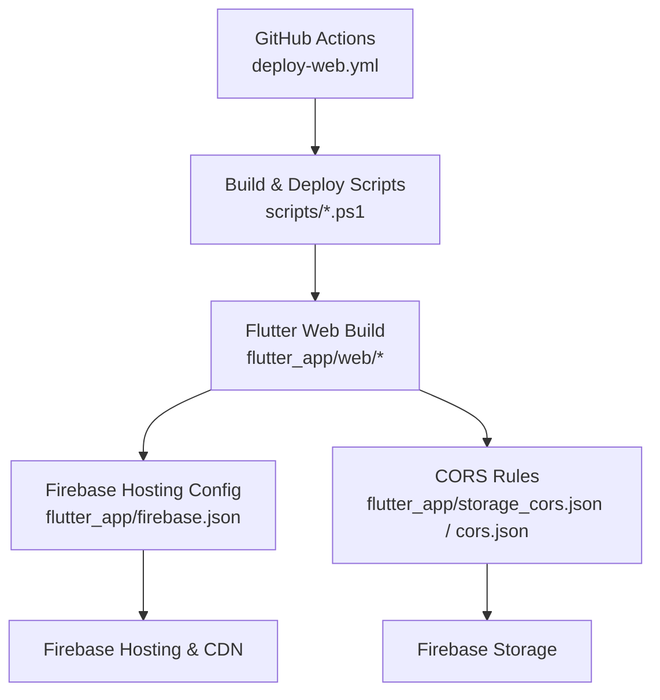
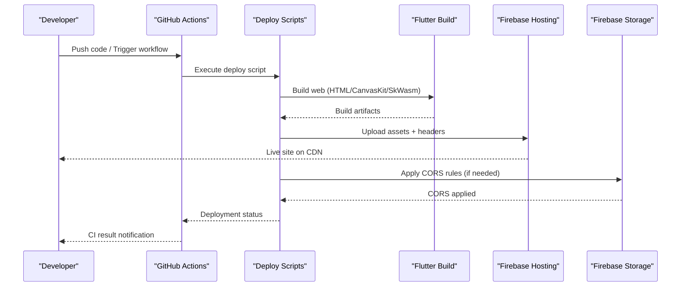
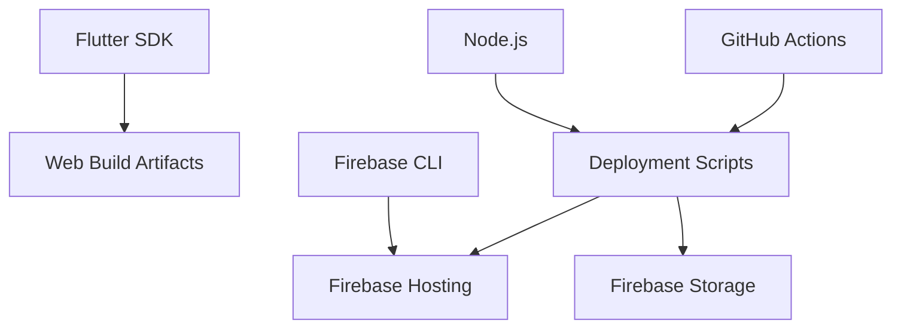

# Hosting & Deployment

<cite>
**Referenced Files in This Document**
- [firebase.json](file://flutter_app/firebase.json)
- [.firebaserc](file://flutter_app/.firebaserc)
- [deploy-web.yml](file://.github/workflows/deploy-web.yml)
- [deploy_web_hosting.ps1](file://scripts/deploy_web_hosting.ps1)
- [deploy_web_hosting_html.ps1](file://scripts/deploy_web_hosting_html.ps1)
- [deploy_web_hosting_skwasm.ps1](file://scripts/deploy_web_hosting_skwasm.ps1)
- [deploy_web_hosting_canvaskit.ps1](file://scripts/deploy_web_hosting_canvaskit.ps1)
- [build_e_deploy_web.ps1](file://scripts/build_e_deploy_web.ps1)
- [index.html](file://flutter_app/web/index.html)
- [flutter_bootstrap.js](file://flutter_app/web/flutter_bootstrap.js)
- [manifest.json](file://flutter_app/web/manifest.json)
- [version.json](file://flutter_app/web/version.json)
- [storage_cors.json](file://flutter_app/storage_cors.json)
- [cors.json](file://cors.json)
- [DEPLOY_WINDOWS.bat](file://DEPLOY_WINDOWS.bat)
- [DEPLOY_MAC_LINUX.sh](file://DEPLOY_MAC_LINUX.sh)
</cite>

## Table of Contents
1. [Introduction](#introduction)
2. [Project Structure](#project-structure)
3. [Core Components](#core-components)
4. [Architecture Overview](#architecture-overview)
5. [Detailed Component Analysis](#detailed-component-analysis)
6. [Dependency Analysis](#dependency-analysis)
7. [Performance Considerations](#performance-considerations)
8. [Troubleshooting Guide](#troubleshooting-guide)
9. [Conclusion](#conclusion)
10. [Appendices](#appendices)

## Introduction
This document provides comprehensive hosting and deployment guidance for the Flutter web platform, focusing on Firebase Hosting configuration, CDN setup, and automated deployment workflows. It covers build processes for multiple targets (HTML DOM, CanvasKit, SkWasm), environment configuration, domain and SSL setup, performance optimization, caching strategies, and production best practices. Step-by-step procedures are included to streamline deployments, along with rollback strategies and monitoring recommendations.

## Project Structure
The web application is a Flutter project with dedicated web assets and deployment tooling:
- Web entry points and bootstrapping reside under flutter_app/web.
- Firebase Hosting configuration is defined at flutter_app/firebase.json and flutter_app/.firebaserc.
- GitHub Actions workflow automates web deployments via .github/workflows/deploy-web.yml.
- PowerShell scripts under scripts orchestrate builds and deployments for different targets.
- CORS rules for Storage are managed via storage_cors.json and cors.json.

**Diagram sources**
- [deploy-web.yml](file://.github/workflows/deploy-web.yml)
- [deploy_web_hosting.ps1](file://scripts/deploy_web_hosting.ps1)
- [deploy_web_hosting_html.ps1](file://scripts/deploy_web_hosting_html.ps1)
- [deploy_web_hosting_skwasm.ps1](file://scripts/deploy_web_hosting_skwasm.ps1)
- [deploy_web_hosting_canvaskit.ps1](file://scripts/deploy_web_hosting_canvaskit.ps1)
- [build_e_deploy_web.ps1](file://scripts/build_e_deploy_web.ps1)
- [firebase.json](file://flutter_app/firebase.json)
- [storage_cors.json](file://flutter_app/storage_cors.json)
- [cors.json](file://cors.json)

**Section sources**
- [firebase.json](file://flutter_app/firebase.json)
- [.firebaserc](file://flutter_app/.firebaserc)
- [deploy-web.yml](file://.github/workflows/deploy-web.yml)
- [deploy_web_hosting.ps1](file://scripts/deploy_web_hosting.ps1)
- [deploy_web_hosting_html.ps1](file://scripts/deploy_web_hosting_html.ps1)
- [deploy_web_hosting_skwasm.ps1](file://scripts/deploy_web_hosting_skwasm.ps1)
- [deploy_web_hosting_canvaskit.ps1](file://scripts/deploy_web_hosting_canvaskit.ps1)
- [build_e_deploy_web.ps1](file://scripts/build_e_deploy_web.ps1)
- [index.html](file://flutter_app/web/index.html)
- [flutter_bootstrap.js](file://flutter_app/web/flutter_bootstrap.js)
- [manifest.json](file://flutter_app/web/manifest.json)
- [version.json](file://flutter_app/web/version.json)
- [storage_cors.json](file://flutter_app/storage_cors.json)
- [cors.json](file://cors.json)

## Core Components
- Firebase Hosting configuration defines rewrites, headers, SPA routing, and asset caching policies.
- The GitHub Actions workflow triggers builds and deploys to Firebase Hosting based on branch events.
- PowerShell scripts encapsulate target-specific builds (HTML, CanvasKit, SkWasm) and deploy steps.
- Web assets include index.html, manifest.json, version.json, and bootstrap logic for runtime selection.
- CORS configurations ensure secure access to Firebase Storage from hosted origins.

Key responsibilities:
- Build orchestration: Select engine target and produce optimized artifacts.
- Deployment automation: Push built assets to Firebase Hosting with appropriate cache headers.
- Environment alignment: Ensure consistent versions and configurations across environments.
- Security and performance: Enforce HTTPS, set cache-control headers, and optimize assets.

**Section sources**
- [firebase.json](file://flutter_app/firebase.json)
- [deploy-web.yml](file://.github/workflows/deploy-web.yml)
- [deploy_web_hosting.ps1](file://scripts/deploy_web_hosting.ps1)
- [deploy_web_hosting_html.ps1](file://scripts/deploy_web_hosting_html.ps1)
- [deploy_web_hosting_skwasm.ps1](file://scripts/deploy_web_hosting_skwasm.ps1)
- [deploy_web_hosting_canvaskit.ps1](file://scripts/deploy_web_hosting_canvaskit.ps1)
- [build_e_deploy_web.ps1](file://scripts/build_e_deploy_web.ps1)
- [index.html](file://flutter_app/web/index.html)
- [flutter_bootstrap.js](file://flutter_app/web/flutter_bootstrap.js)
- [manifest.json](file://flutter_app/web/manifest.json)
- [version.json](file://flutter_app/web/version.json)
- [storage_cors.json](file://flutter_app/storage_cors.json)
- [cors.json](file://cors.json)

## Architecture Overview
The deployment pipeline integrates CI/CD with Firebase Hosting and Storage:
- GitHub Actions triggers on push or PR events.
- Build scripts compile Flutter web for selected targets.
- Assets are deployed to Firebase Hosting with CDN distribution.
- CORS rules govern cross-origin requests to Storage.
- Versioning and metadata files support cache busting and updates.

**Diagram sources**
- [deploy-web.yml](file://.github/workflows/deploy-web.yml)
- [deploy_web_hosting.ps1](file://scripts/deploy_web_hosting.ps1)
- [build_e_deploy_web.ps1](file://scripts/build_e_deploy_web.ps1)
- [firebase.json](file://flutter_app/firebase.json)
- [storage_cors.json](file://flutter_app/storage_cors.json)

## Detailed Component Analysis

### Firebase Hosting Configuration
- firebase.json defines hosting settings including rewrites for SPA routing, custom headers, and cache policies.
- .firebaserc specifies the active Firebase project and environment aliases.
- Recommended practices:
  - Use immutable asset filenames for long-term caching.
  - Configure cache-control headers for static assets and dynamic routes.
  - Enable HTTPS and enforce secure headers.

Operational notes:
- Verify rewrite rules route all paths to index.html for client-side routing.
- Validate that headers include security directives and CDN optimizations.
- Confirm project alias matches intended environment.

**Section sources**
- [firebase.json](file://flutter_app/firebase.json)
- [.firebaserc](file://flutter_app/.firebaserc)

### GitHub Actions Workflow
- deploy-web.yml orchestrates the end-to-end deployment process.
- Steps typically include checkout, dependency installation, building Flutter web, and deploying to Firebase Hosting.
- Secrets and environment variables should be configured securely in GitHub repository settings.

Best practices:
- Pin Flutter and Node versions for reproducibility.
- Cache dependencies to speed up builds.
- Add notifications for deployment success/failure.

**Section sources**
- [deploy-web.yml](file://.github/workflows/deploy-web.yml)

### Deployment Scripts
- deploy_web_hosting.ps1 serves as the main orchestrator for hosting deployments.
- Target-specific scripts:
  - deploy_web_hosting_html.ps1 builds and deploys HTML DOM target.
  - deploy_web_hosting_canvaskit.ps1 builds and deploys CanvasKit target.
  - deploy_web_hosting_skwasm.ps1 builds and deploys SkWasm target.
- build_e_deploy_web.ps1 consolidates build and deploy steps for general use.

Workflow highlights:
- Select engine target via flags or environment variables.
- Generate versioned artifacts and update version.json.
- Deploy to Firebase Hosting with appropriate cache headers.
- Optionally apply CORS rules for Storage.

**Section sources**
- [deploy_web_hosting.ps1](file://scripts/deploy_web_hosting.ps1)
- [deploy_web_hosting_html.ps1](file://scripts/deploy_web_hosting_html.ps1)
- [deploy_web_hosting_canvaskit.ps1](file://scripts/deploy_web_hosting_canvaskit.ps1)
- [deploy_web_hosting_skwasm.ps1](file://scripts/deploy_web_hosting_skwasm.ps1)
- [build_e_deploy_web.ps1](file://scripts/build_e_deploy_web.ps1)

### Web Assets and Bootstrap
- index.html is the primary entry point for the web app.
- flutter_bootstrap.js initializes the Flutter runtime and selects the appropriate engine target.
- manifest.json defines PWA metadata and icons.
- version.json tracks build version for cache busting and update detection.

Recommendations:
- Ensure bootstrap logic respects environment variables for target selection.
- Update version.json on each build to invalidate caches.
- Optimize images and fonts for faster loading.

**Section sources**
- [index.html](file://flutter_app/web/index.html)
- [flutter_bootstrap.js](file://flutter_app/web/flutter_bootstrap.js)
- [manifest.json](file://flutter_app/web/manifest.json)
- [version.json](file://flutter_app/web/version.json)

### CORS Configuration
- storage_cors.json and cors.json define cross-origin policies for Firebase Storage.
- Proper CORS configuration is essential for web apps accessing Storage resources.

Guidelines:
- Restrict allowed origins to your hosted domain.
- Permit necessary HTTP methods and headers.
- Test CORS behavior across browsers and devices.

**Section sources**
- [storage_cors.json](file://flutter_app/storage_cors.json)
- [cors.json](file://cors.json)

### Cross-Platform Deployment Scripts
- DEPLOY_WINDOWS.bat and DEPLOY_MAC_LINUX.sh provide platform-specific deployment commands.
- These scripts can wrap the PowerShell scripts for convenience on respective platforms.

Usage tips:
- Ensure required tools (Flutter, Firebase CLI) are installed and accessible.
- Set environment variables for project ID and credentials.
- Log outputs for debugging and auditing.

**Section sources**
- [DEPLOY_WINDOWS.bat](file://DEPLOY_WINDOWS.bat)
- [DEPLOY_MAC_LINUX.sh](file://DEPLOY_MAC_LINUX.sh)

## Dependency Analysis
The deployment system relies on several key dependencies:
- Flutter SDK for building web applications.
- Firebase CLI for hosting and Storage management.
- Node.js for running scripts and managing packages.
- GitHub Actions runner for CI/CD execution.

**Diagram sources**
- [deploy-web.yml](file://.github/workflows/deploy-web.yml)
- [deploy_web_hosting.ps1](file://scripts/deploy_web_hosting.ps1)
- [build_e_deploy_web.ps1](file://scripts/build_e_deploy_web.ps1)

**Section sources**
- [deploy-web.yml](file://.github/workflows/deploy-web.yml)
- [deploy_web_hosting.ps1](file://scripts/deploy_web_hosting.ps1)
- [build_e_deploy_web.ps1](file://scripts/build_e_deploy_web.ps1)

## Performance Considerations
Optimizing performance involves multiple layers:
- Asset Optimization:
  - Compress images and fonts.
  - Use modern formats (WebP, AVIF).
  - Implement lazy loading for heavy resources.
- Caching Strategies:
  - Set long-lived cache headers for immutable assets.
  - Use short cache durations for dynamic content.
  - Leverage CDN caching policies.
- Engine Selection:
  - HTML DOM for smaller bundle size.
  - CanvasKit for better graphics performance.
  - SkWasm for balanced performance and compatibility.
- Network Efficiency:
  - Enable gzip/brotli compression.
  - Minimize HTTP requests.
  - Use service workers for offline support.

[No sources needed since this section provides general guidance]

## Troubleshooting Guide
Common issues and resolutions:
- Build Failures:
  - Verify Flutter and dependencies are correctly installed.
  - Check for missing environment variables or secrets.
  - Review build logs for specific error messages.
- Deployment Errors:
  - Ensure Firebase CLI is authenticated and project is set.
  - Validate firebase.json configuration syntax.
  - Check network connectivity and permissions.
- Runtime Issues:
  - Inspect browser console for JavaScript errors.
  - Verify CORS rules for Storage access.
  - Clear browser cache if assets appear stale.

Debugging tips:
- Use verbose logging in deployment scripts.
- Test builds locally before pushing to CI.
- Monitor Firebase Hosting analytics and error reporting.

[No sources needed since this section provides general guidance]

## Conclusion
This documentation outlines a robust hosting and deployment strategy for the Flutter web platform using Firebase Hosting and GitHub Actions. By following the provided guidelines, teams can automate builds, optimize performance, and maintain reliable deployments across multiple targets. Adhering to best practices ensures scalability, security, and maintainability in production environments.

[No sources needed since this section summarizes without analyzing specific files]

## Appendices

### Step-by-Step Deployment Procedures
1. Prepare Environment:
   - Install Flutter SDK and Firebase CLI.
   - Authenticate with Firebase and set project.
2. Configure Firebase Hosting:
   - Edit firebase.json for routing and headers.
   - Verify .firebaserc project alias.
3. Build Web Application:
   - Choose target (HTML, CanvasKit, SkWasm).
   - Run appropriate deployment script.
4. Deploy to Hosting:
   - Execute deployment script or trigger GitHub Actions.
   - Monitor deployment progress and logs.
5. Verify Deployment:
   - Access hosted URL and test functionality.
   - Check CDN cache and asset loading.

### Rollback Strategies
- Maintain previous versions of assets in separate directories.
- Use Firebase Hosting aliases to switch between versions.
- Automate rollback by redeploying known-good builds.

### Monitoring Setup
- Enable Firebase Analytics and Crashlytics for web.
- Configure error tracking and performance monitoring.
- Set up alerts for deployment failures and runtime errors.

[No sources needed since this section provides general guidance]