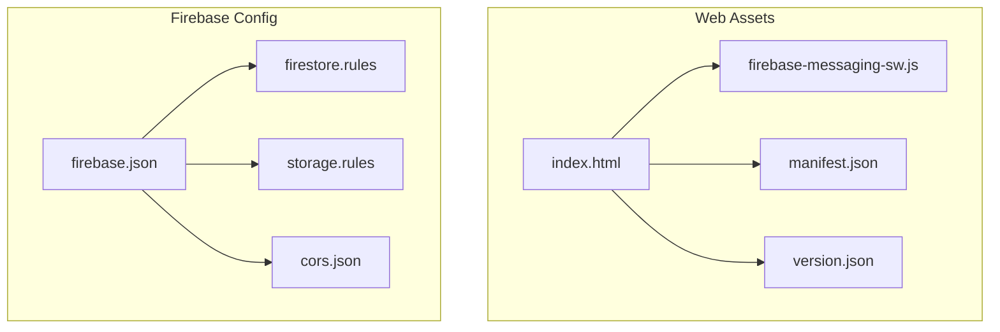
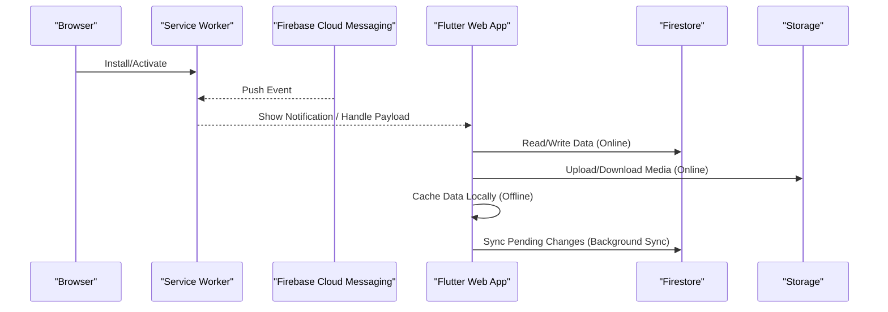
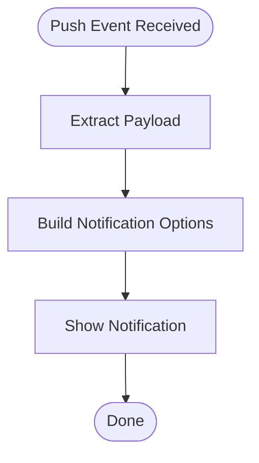
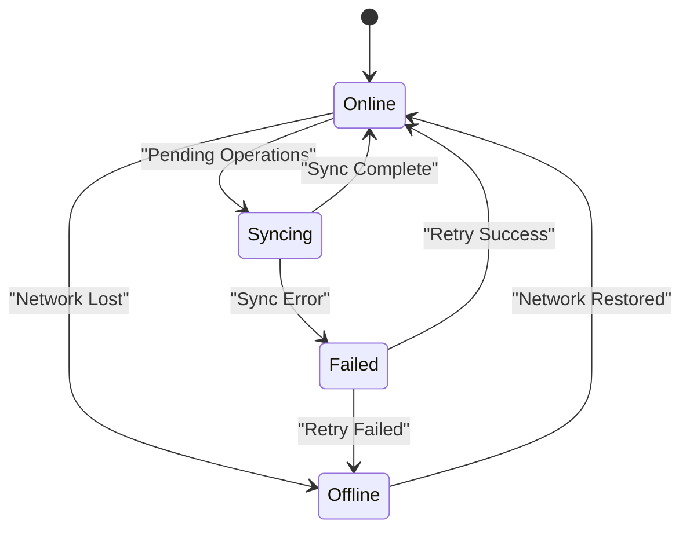
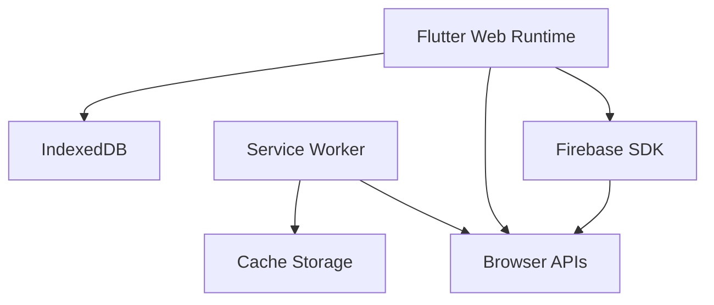

# Offline Capabilities & Service Workers

<cite>
**Referenced Files in This Document**
- [firebase-messaging-sw.js](file://flutter_app/web/firebase-messaging-sw.js)
- [index.html](file://flutter_app/web/index.html)
- [manifest.json](file://flutter_app/web/manifest.json)
- [version.json](file://flutter_app/web/version.json)
- [firebase.json](file://firebase.json)
- [firestore.rules](file://firestore.rules)
- [storage.rules](file://storage.rules)
- [cors.json](file://cors.json)
- [README.md](file://README.md)
</cite>

## Table of Contents
1. [Introduction](#introduction)
2. [Project Structure](#project-structure)
3. [Core Components](#core-components)
4. [Architecture Overview](#architecture-overview)
5. [Detailed Component Analysis](#detailed-component-analysis)
6. [Dependency Analysis](#dependency-analysis)
7. [Performance Considerations](#performance-considerations)
8. [Troubleshooting Guide](#troubleshooting-guide)
9. [Conclusion](#conclusion)
10. [Appendices](#appendices)

## Introduction
This document explains the offline capabilities and service worker implementation for the web platform within this project. It focuses on how the Flutter Web application integrates with Firebase Cloud Messaging (FCM), caching strategies, background synchronization, push notifications, local storage usage, cache invalidation, conflict resolution, data persistence, network request interception, fallback mechanisms, storage quotas, cleanup strategies, and debugging techniques. The content is derived from the repository’s web assets, Firebase configuration, and security rules.

## Project Structure
The web-related components are primarily located under flutter_app/web and the root-level Firebase configuration files. Key elements include:
- A service worker for FCM push notifications
- Web manifest and versioning metadata
- HTML entry point that bootstraps the Flutter Web app
- Firebase hosting and rules configuration

**Diagram sources**
- [index.html](file://flutter_app/web/index.html)
- [manifest.json](file://flutter_app/web/manifest.json)
- [version.json](file://flutter_app/web/version.json)
- [firebase-messaging-sw.js](file://flutter_app/web/firebase-messaging-sw.js)
- [firebase.json](file://firebase.json)
- [firestore.rules](file://firestore.rules)
- [storage.rules](file://storage.rules)
- [cors.json](file://cors.json)

**Section sources**
- [index.html](file://flutter_app/web/index.html)
- [manifest.json](file://flutter_app/web/manifest.json)
- [version.json](file://flutter_app/web/version.json)
- [firebase-messaging-sw.js](file://flutter_app/web/firebase-messaging-sw.js)
- [firebase.json](file://firebase.json)
- [firestore.rules](file://firestore.rules)
- [storage.rules](file://storage.rules)
- [cors.json](file://cors.json)

## Core Components
- Service Worker for Push Notifications: The file firebase-messaging-sw.js serves as the FCM service worker to handle push events and display notifications. It enables background processing and notification delivery even when the app is not active.
- Web Manifest and Versioning: manifest.json defines PWA metadata (name, icons, theme colors, start URL). version.json provides runtime version information used by the app to manage updates and cache busting.
- HTML Entry Point: index.html initializes the Flutter Web application and loads necessary assets. It may also register or reference the service worker depending on the build configuration.
- Firebase Hosting and Rules: firebase.json configures hosting behavior and rewrites. firestore.rules and storage.rules enforce access control and data validation at the server level. cors.json configures cross-origin resource sharing for storage and APIs.

**Section sources**
- [firebase-messaging-sw.js](file://flutter_app/web/firebase-messaging-sw.js)
- [manifest.json](file://flutter_app/web/manifest.json)
- [version.json](file://flutter_app/web/version.json)
- [index.html](file://flutter_app/web/index.html)
- [firebase.json](file://firebase.json)
- [firestore.rules](file://firestore.rules)
- [storage.rules](file://storage.rules)
- [cors.json](file://cors.json)

## Architecture Overview
The offline-first architecture combines Flutter Web’s runtime with Firebase services:
- Push notifications via FCM are handled by the service worker.
- Data synchronization uses Firestore and Storage, governed by security rules.
- Caching strategies leverage browser caches and IndexedDB through Flutter plugins or custom implementations.
- Background sync can be implemented using the Background Sync API or scheduled tasks triggered by service worker events.

**Diagram sources**
- [firebase-messaging-sw.js](file://flutter_app/web/firebase-messaging-sw.js)
- [firebase.json](file://firebase.json)
- [firestore.rules](file://firestore.rules)
- [storage.rules](file://storage.rules)

## Detailed Component Analysis

### Service Worker Implementation (FCM)
The service worker handles push events and displays notifications. It should:
- Listen for push events and extract payload data
- Display user-visible notifications with appropriate actions
- Optionally perform silent background tasks (e.g., queueing sync operations)
- Manage message handling when the app is in foreground vs background

**Diagram sources**
- [firebase-messaging-sw.js](file://flutter_app/web/firebase-messaging-sw.js)

**Section sources**
- [firebase-messaging-sw.js](file://flutter_app/web/firebase-messaging-sw.js)

### Caching Strategies
Caching strategies ensure fast loading and offline availability:
- Static asset caching via service worker or HTTP headers
- Application shell caching for immediate load
- Data caching using IndexedDB or localStorage for Firestore snapshots
- Image/media caching via cache storage or CDN with proper headers

Key considerations:
- Cache versioning to avoid stale content
- Cache invalidation policies based on TTL or content hashes
- Graceful degradation when cache is unavailable

**Section sources**
- [manifest.json](file://flutter_app/web/manifest.json)
- [version.json](file://flutter_app/web/version.json)
- [index.html](file://flutter_app/web/index.html)

### Offline Data Synchronization
Data synchronization involves:
- Local-first writes to IndexedDB or localStorage
- Queueing operations for later sync when connectivity is restored
- Conflict resolution strategies (last-write-wins, merge strategies)
- Background sync using Background Sync API or periodic sync

**Diagram sources**
- [firestore.rules](file://firestore.rules)
- [storage.rules](file://storage.rules)

### Background Sync and Push Notifications
- Background sync ensures pending operations are completed when connectivity is available
- Push notifications deliver real-time updates even when the app is not active
- Integration with FCM requires proper service worker setup and permission handling

**Section sources**
- [firebase-messaging-sw.js](file://flutter_app/web/firebase-messaging-sw.js)

### Local Storage Usage
Local storage patterns include:
- Storing user preferences and settings
- Caching small JSON payloads for quick access
- Maintaining offline state and UI preferences
- Using IndexedDB for larger datasets and complex queries

Best practices:
- Implement structured storage with clear schemas
- Use encryption for sensitive data
- Monitor storage quotas and implement cleanup strategies

**Section sources**
- [index.html](file://flutter_app/web/index.html)
- [version.json](file://flutter_app/web/version.json)

### Cache Invalidation and Conflict Resolution
Cache invalidation strategies:
- Time-based expiration (TTL)
- Content-based invalidation using hashes or versions
- Manual invalidation triggers for critical updates

Conflict resolution approaches:
- Last-write-wins for simple scenarios
- Merge strategies for collaborative editing
- Server-side reconciliation for complex conflicts

**Section sources**
- [firestore.rules](file://firestore.rules)
- [storage.rules](file://storage.rules)

### Network Request Interception and Fallback Mechanisms
- Intercept network requests to serve cached responses when offline
- Implement retry logic with exponential backoff
- Provide fallback UI states for missing data
- Use service worker fetch events to manage request/response cycles

**Section sources**
- [firebase-messaging-sw.js](file://flutter_app/web/firebase-messaging-sw.js)

### Storage Quotas and Cleanup Strategies
- Monitor storage usage and implement automatic cleanup
- Remove expired cache entries and temporary files
- Prioritize essential data during quota pressure
- Implement user-initiated cleanup options

**Section sources**
- [index.html](file://flutter_app/web/index.html)
- [version.json](file://flutter_app/web/version.json)

## Dependency Analysis
The web platform dependencies include:
- Flutter Web runtime for application logic
- Firebase SDK for authentication, Firestore, Storage, and Cloud Messaging
- Browser APIs for service worker, cache storage, and IndexedDB
- HTTP client libraries for network operations

**Diagram sources**
- [index.html](file://flutter_app/web/index.html)
- [firebase-messaging-sw.js](file://flutter_app/web/firebase-messaging-sw.js)

**Section sources**
- [index.html](file://flutter_app/web/index.html)
- [firebase-messaging-sw.js](file://flutter_app/web/firebase-messaging-sw.js)

## Performance Considerations
- Minimize service worker bundle size for faster installation
- Implement efficient caching strategies to reduce network requests
- Use lazy loading for large assets and features
- Optimize database queries and storage operations
- Monitor memory usage and implement garbage collection strategies

[No sources needed since this section provides general guidance]

## Troubleshooting Guide
Common issues and solutions:
- Service worker not installing: Check browser console for errors and verify correct registration
- Push notifications not working: Verify FCM configuration and permissions
- Cache not updating: Clear browser cache and check cache versioning
- Offline mode not working: Ensure proper service worker fetch event handling
- Storage quota exceeded: Implement cleanup strategies and monitor usage

Debugging techniques:
- Use browser developer tools to inspect service worker lifecycle
- Monitor network requests and cache storage
- Log service worker events and error handling
- Test offline functionality using browser dev tools

**Section sources**
- [firebase-messaging-sw.js](file://flutter_app/web/firebase-messaging-sw.js)
- [index.html](file://flutter_app/web/index.html)

## Conclusion
The web platform implements comprehensive offline capabilities through service workers, caching strategies, and background synchronization. The integration with Firebase services provides robust data synchronization and push notification support. Proper implementation of cache invalidation, conflict resolution, and storage management ensures a reliable offline-first experience. Continuous monitoring and debugging are essential for maintaining optimal performance and user experience.

[No sources needed since this section summarizes without analyzing specific files]

## Appendices

### Configuration Reference
- Firebase Hosting Configuration: firebase.json
- Security Rules: firestore.rules, storage.rules
- CORS Configuration: cors.json
- Web Manifest: manifest.json
- Version Management: version.json

**Section sources**
- [firebase.json](file://firebase.json)
- [firestore.rules](file://firestore.rules)
- [storage.rules](file://storage.rules)
- [cors.json](file://cors.json)
- [manifest.json](file://flutter_app/web/manifest.json)
- [version.json](file://flutter_app/web/version.json)

### Best Practices Checklist
- Implement proper service worker lifecycle management
- Use efficient caching strategies with versioning
- Handle offline scenarios gracefully with fallback UI
- Implement robust error handling and retry logic
- Monitor storage usage and implement cleanup strategies
- Test thoroughly across different browsers and devices
- Maintain security rules and CORS configurations

[No sources needed since this section provides general guidance]