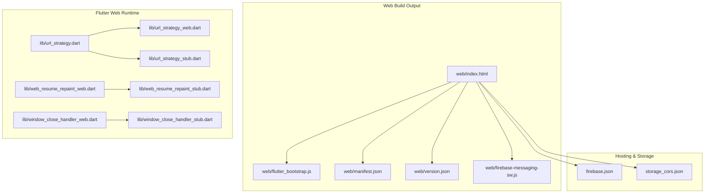
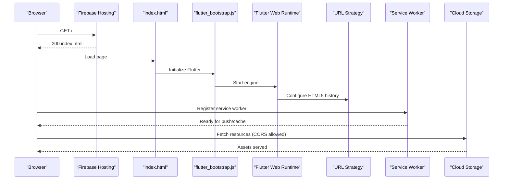
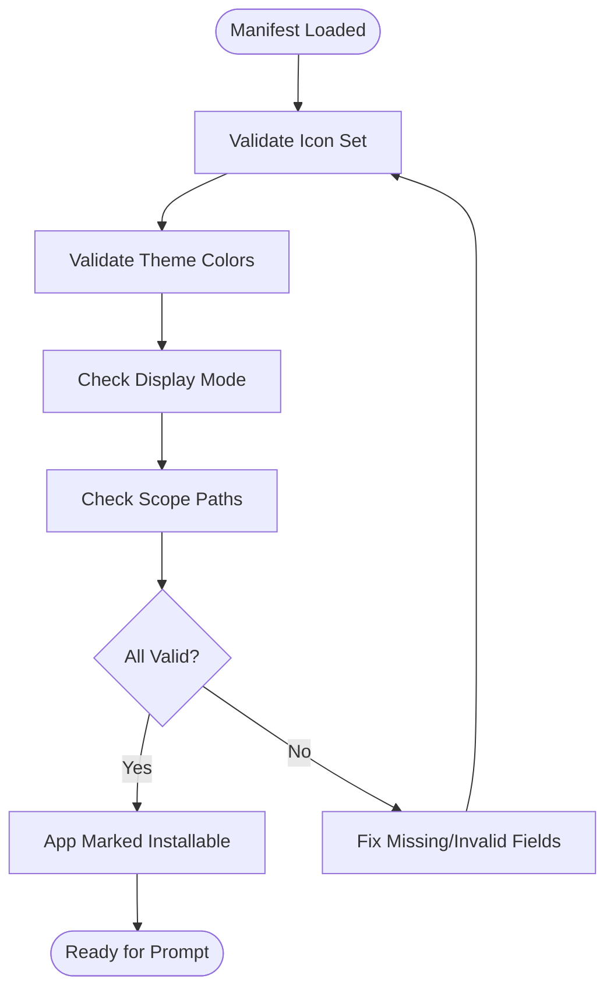
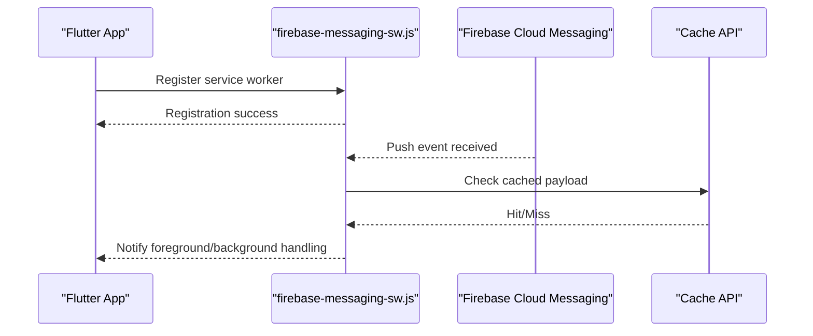
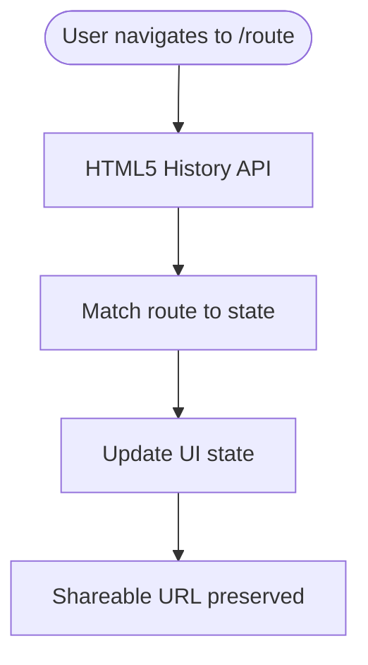
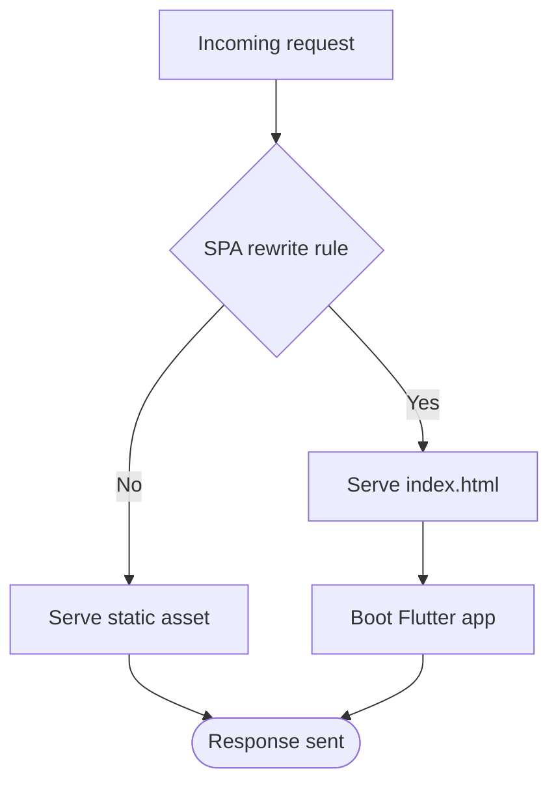
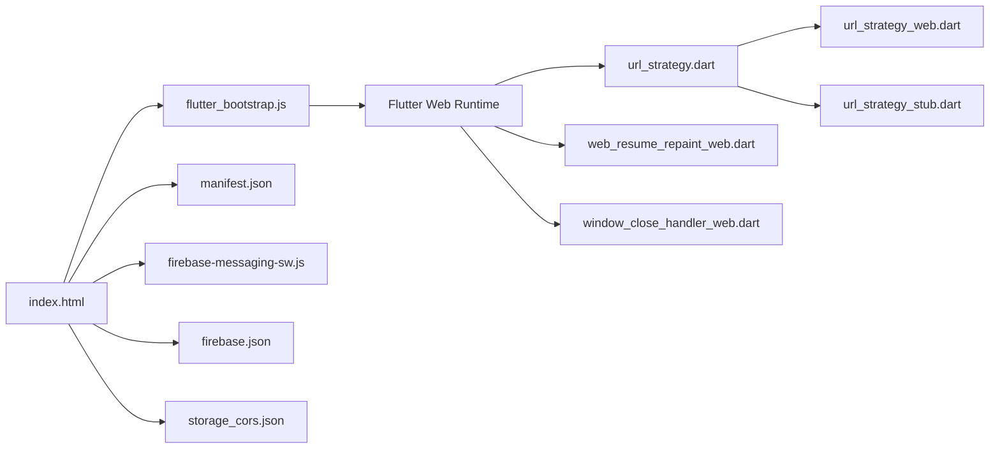

# PWA Implementation & Features

<cite>
**Referenced Files in This Document**
- [index.html](file://flutter_app/web/index.html)
- [manifest.json](file://flutter_app/web/manifest.json)
- [firebase-messaging-sw.js](file://flutter_app/web/firebase-messaging-sw.js)
- [flutter_bootstrap.js](file://flutter_app/web/flutter_bootstrap.js)
- [version.json](file://flutter_app/web/version.json)
- [url_strategy.dart](file://flutter_app/lib/url_strategy.dart)
- [url_strategy_web.dart](file://flutter_app/lib/url_strategy_web.dart)
- [url_strategy_stub.dart](file://flutter_app/lib/url_strategy_stub.dart)
- [web_resume_repaint_web.dart](file://flutter_app/lib/web_resume_repaint_web.dart)
- [web_resume_repaint_stub.dart](file://flutter_app/lib/web_resume_repaint_stub.dart)
- [window_close_handler_web.dart](file://flutter_app/lib/window_close_handler_web.dart)
- [window_close_handler_stub.dart](file://flutter_app/lib/window_close_handler_stub.dart)
- [firebase.json](file://flutter_app/firebase.json)
- [storage_cors.json](file://flutter_app/storage_cors.json)
- [assetlinks.json](file://flutter_app/web/assetlinks.json)
- [404.html](file://flutter_app/public/404.html)
- [reset_password.html](file://flutter_app/public/reset_password.html)
</cite>

## Table of Contents
1. [Introduction](#introduction)
2. [Project Structure](#project-structure)
3. [Core Components](#core-components)
4. [Architecture Overview](#architecture-overview)
5. [Detailed Component Analysis](#detailed-component-analysis)
6. [Dependency Analysis](#dependency-analysis)
7. [Performance Considerations](#performance-considerations)
8. [Troubleshooting Guide](#troubleshooting-guide)
9. [Conclusion](#conclusion)
10. [Appendices](#appendices)

## Introduction
This document provides a comprehensive guide to the Progressive Web App (PWA) implementation for Gestão Yahweh Premium. It covers configuration, manifest setup, service worker integration, web-specific features, URL strategy and routing, deep linking, app icons and splash screens, theme colors, browser optimizations, installation prompts, offline detection, capabilities, security considerations (CSP headers and cross-origin policies), and deployment notes. The goal is to make the PWA behavior clear and actionable for both developers and non-technical stakeholders.

## Project Structure
The Flutter web build outputs static assets under flutter_app/web and flutter_app/public. Key PWA-related files include:
- Web entry point and bootstrap scripts
- Manifest for installability and branding
- Service worker for background tasks and push notifications
- Versioning file for cache busting
- URL strategy configuration for HTML5 history mode
- Platform-specific stubs and implementations for web-only behaviors

**Diagram sources**
- [index.html](file://flutter_app/web/index.html)
- [flutter_bootstrap.js](file://flutter_app/web/flutter_bootstrap.js)
- [manifest.json](file://flutter_app/web/manifest.json)
- [version.json](file://flutter_app/web/version.json)
- [firebase-messaging-sw.js](file://flutter_app/web/firebase-messaging-sw.js)
- [url_strategy.dart](file://flutter_app/lib/url_strategy.dart)
- [url_strategy_web.dart](file://flutter_app/lib/url_strategy_web.dart)
- [url_strategy_stub.dart](file://flutter_app/lib/url_strategy_stub.dart)
- [web_resume_repaint_web.dart](file://flutter_app/lib/web_resume_repaint_web.dart)
- [web_resume_repaint_stub.dart](file://flutter_app/lib/web_resume_repaint_stub.dart)
- [window_close_handler_web.dart](file://flutter_app/lib/window_close_handler_web.dart)
- [window_close_handler_stub.dart](file://flutter_app/lib/window_close_handler_stub.dart)
- [firebase.json](file://flutter_app/firebase.json)
- [storage_cors.json](file://flutter_app/storage_cors.json)

**Section sources**
- [index.html](file://flutter_app/web/index.html)
- [flutter_bootstrap.js](file://flutter_app/web/flutter_bootstrap.js)
- [manifest.json](file://flutter_app/web/manifest.json)
- [version.json](file://flutter_app/web/version.json)
- [firebase-messaging-sw.js](file://flutter_app/web/firebase-messaging-sw.js)
- [url_strategy.dart](file://flutter_app/lib/url_strategy.dart)
- [url_strategy_web.dart](file://flutter_app/lib/url_strategy_web.dart)
- [url_strategy_stub.dart](file://flutter_app/lib/url_strategy_stub.dart)
- [web_resume_repaint_web.dart](file://flutter_app/lib/web_resume_repaint_web.dart)
- [web_resume_repaint_stub.dart](file://flutter_app/lib/web_resume_repaint_stub.dart)
- [window_close_handler_web.dart](file://flutter_app/lib/window_close_handler_web.dart)
- [window_close_handler_stub.dart](file://flutter_app/lib/window_close_handler_stub.dart)
- [firebase.json](file://flutter_app/firebase.json)
- [storage_cors.json](file://flutter_app/storage_cors.json)

## Core Components
- Web entry point and bootstrap: index.html loads the Flutter web runtime via flutter_bootstrap.js and includes the manifest and version metadata.
- Manifest: manifest.json defines installability, icons, theme colors, display mode, and scope.
- Service Worker: firebase-messaging-sw.js integrates Firebase Cloud Messaging for push notifications on the web.
- URL Strategy: url_strategy.dart configures HTML5 history-based routing; platform-specific implementations are provided via url_strategy_web.dart and url_strategy_stub.dart.
- Web resume repaint: web_resume_repaint_web.dart optimizes repaint behavior when resuming from background on web.
- Window close handler: window_close_handler_web.dart handles closing events on web platforms.
- Hosting and storage: firebase.json configures hosting rules and SPA fallback; storage_cors.json sets CORS for media access.

**Section sources**
- [index.html](file://flutter_app/web/index.html)
- [flutter_bootstrap.js](file://flutter_app/web/flutter_bootstrap.js)
- [manifest.json](file://flutter_app/web/manifest.json)
- [firebase-messaging-sw.js](file://flutter_app/web/firebase-messaging-sw.js)
- [url_strategy.dart](file://flutter_app/lib/url_strategy.dart)
- [url_strategy_web.dart](file://flutter_app/lib/url_strategy_web.dart)
- [url_strategy_stub.dart](file://flutter_app/lib/url_strategy_stub.dart)
- [web_resume_repaint_web.dart](file://flutter_app/lib/web_resume_repaint_web.dart)
- [window_close_handler_web.dart](file://flutter_app/lib/window_close_handler_web.dart)
- [firebase.json](file://flutter_app/firebase.json)
- [storage_cors.json](file://flutter_app/storage_cors.json)

## Architecture Overview
The PWA architecture combines Flutter’s web runtime with standard web technologies:
- The browser loads index.html, which bootstraps the Flutter engine using flutter_bootstrap.js.
- The manifest.json enables installation and controls appearance.
- Routing uses HTML5 history mode configured by url_strategy.dart and its web-specific implementation.
- Background tasks and push notifications are handled by the service worker (firebase-messaging-sw.js).
- Hosting is managed via firebase.json, including SPA fallback and caching strategies.
- Storage access is governed by storage_cors.json for cross-origin resource sharing.

**Diagram sources**
- [index.html](file://flutter_app/web/index.html)
- [flutter_bootstrap.js](file://flutter_app/web/flutter_bootstrap.js)
- [url_strategy.dart](file://flutter_app/lib/url_strategy.dart)
- [url_strategy_web.dart](file://flutter_app/lib/url_strategy_web.dart)
- [firebase-messaging-sw.js](file://flutter_app/web/firebase-messaging-sw.js)
- [firebase.json](file://flutter_app/firebase.json)
- [storage_cors.json](file://flutter_app/storage_cors.json)

## Detailed Component Analysis

### Manifest Configuration and Installability
- Purpose: Defines app name, short name, description, icons, theme color, background color, display mode, and scope for installation and presentation.
- Key aspects:
  - Icons: Provide multiple resolutions for splash and taskbar usage.
  - Theme and background colors: Control UI chrome and splash screen transitions.
  - Display mode: Choose standalone or minimal-ui for app-like experience.
  - Scope: Restrict navigation to app paths for consistent UX.
- Installation prompt: Triggered by browsers when criteria are met; can be prompted programmatically after user interaction.

**Diagram sources**
- [manifest.json](file://flutter_app/web/manifest.json)

**Section sources**
- [manifest.json](file://flutter_app/web/manifest.json)

### Service Worker Integration and Push Notifications
- Purpose: Enables background sync, caching, and push notifications via Firebase Cloud Messaging.
- Behavior:
  - Registers the service worker during bootstrap.
  - Handles push events and notification clicks.
  - Can cache critical assets for offline resilience.
- Best practices:
  - Keep the service worker lightweight; delegate heavy logic to background tasks.
  - Use versioning to force updates when needed.

**Diagram sources**
- [firebase-messaging-sw.js](file://flutter_app/web/firebase-messaging-sw.js)

**Section sources**
- [firebase-messaging-sw.js](file://flutter_app/web/firebase-messaging-sw.js)

### URL Strategy and Routing
- Purpose: Enable clean URLs and deep linking using HTML5 history mode.
- Implementation:
  - url_strategy.dart sets the global strategy.
  - url_strategy_web.dart provides web-specific behavior.
  - url_strategy_stub.dart ensures non-web builds remain unaffected.
- Deep linking: Routes map to specific app states; ensure server-side fallback to index.html for SPA routing.

**Diagram sources**
- [url_strategy.dart](file://flutter_app/lib/url_strategy.dart)
- [url_strategy_web.dart](file://flutter_app/lib/url_strategy_web.dart)
- [url_strategy_stub.dart](file://flutter_app/lib/url_strategy_stub.dart)

**Section sources**
- [url_strategy.dart](file://flutter_app/lib/url_strategy.dart)
- [url_strategy_web.dart](file://flutter_app/lib/url_strategy_web.dart)
- [url_strategy_stub.dart](file://flutter_app/lib/url_strategy_stub.dart)

### Web Resume Repaint Optimization
- Purpose: Improve perceived performance when the app resumes from background on web by controlling repaint behavior.
- Implementation:
  - web_resume_repaint_web.dart applies web-specific optimizations.
  - web_resume_repaint_stub.dart ensures compatibility on other platforms.

**Section sources**
- [web_resume_repaint_web.dart](file://flutter_app/lib/web_resume_repaint_web.dart)
- [web_resume_repaint_stub.dart](file://flutter_app/lib/web_resume_repaint_stub.dart)

### Window Close Handler
- Purpose: Handle window close events on web to perform cleanup or confirm unsaved changes.
- Implementation:
  - window_close_handler_web.dart implements web-specific behavior.
  - window_close_handler_stub.dart maintains compatibility elsewhere.

**Section sources**
- [window_close_handler_web.dart](file://flutter_app/lib/window_close_handler_web.dart)
- [window_close_handler_stub.dart](file://flutter_app/lib/window_close_handler_stub.dart)

### Hosting, SPA Fallback, and Versioning
- Purpose: Configure Firebase Hosting for SPA routing, caching, and asset versioning.
- Key elements:
  - firebase.json defines rewrites to index.html for SPA routes.
  - version.json helps with cache busting and update checks.
  - public/404.html and public/reset_password.html provide custom error and utility pages.

**Diagram sources**
- [firebase.json](file://flutter_app/firebase.json)
- [version.json](file://flutter_app/web/version.json)
- [404.html](file://flutter_app/public/404.html)
- [reset_password.html](file://flutter_app/public/reset_password.html)

**Section sources**
- [firebase.json](file://flutter_app/firebase.json)
- [version.json](file://flutter_app/web/version.json)
- [404.html](file://flutter_app/public/404.html)
- [reset_password.html](file://flutter_app/public/reset_password.html)

### Cross-Origin Policies and Storage CORS
- Purpose: Allow web clients to access cloud storage resources securely.
- Implementation:
  - storage_cors.json defines allowed origins, methods, and headers for storage buckets.
- Best practices:
  - Restrict origins to your domain.
  - Limit exposed headers and methods to necessary ones.

**Section sources**
- [storage_cors.json](file://flutter_app/storage_cors.json)

### Android Asset Links (Optional Deep Linking)
- Purpose: Associate the web app with an Android app for verified deep links and enhanced integration.
- Implementation:
  - assetlinks.json declares site-to-app associations.

**Section sources**
- [assetlinks.json](file://flutter_app/web/assetlinks.json)

## Dependency Analysis
The PWA components interact through well-defined boundaries:
- index.html depends on flutter_bootstrap.js and manifest.json.
- Flutter runtime initializes URL strategy based on platform.
- Service worker operates independently but integrates with messaging services.
- Hosting and storage configurations govern how assets and data are served and accessed.

**Diagram sources**
- [index.html](file://flutter_app/web/index.html)
- [flutter_bootstrap.js](file://flutter_app/web/flutter_bootstrap.js)
- [manifest.json](file://flutter_app/web/manifest.json)
- [url_strategy.dart](file://flutter_app/lib/url_strategy.dart)
- [url_strategy_web.dart](file://flutter_app/lib/url_strategy_web.dart)
- [url_strategy_stub.dart](file://flutter_app/lib/url_strategy_stub.dart)
- [web_resume_repaint_web.dart](file://flutter_app/lib/web_resume_repaint_web.dart)
- [window_close_handler_web.dart](file://flutter_app/lib/window_close_handler_web.dart)
- [firebase-messaging-sw.js](file://flutter_app/web/firebase-messaging-sw.js)
- [firebase.json](file://flutter_app/firebase.json)
- [storage_cors.json](file://flutter_app/storage_cors.json)

**Section sources**
- [index.html](file://flutter_app/web/index.html)
- [flutter_bootstrap.js](file://flutter_app/web/flutter_bootstrap.js)
- [manifest.json](file://flutter_app/web/manifest.json)
- [url_strategy.dart](file://flutter_app/lib/url_strategy.dart)
- [url_strategy_web.dart](file://flutter_app/lib/url_strategy_web.dart)
- [url_strategy_stub.dart](file://flutter_app/lib/url_strategy_stub.dart)
- [web_resume_repaint_web.dart](file://flutter_app/lib/web_resume_repaint_web.dart)
- [window_close_handler_web.dart](file://flutter_app/lib/window_close_handler_web.dart)
- [firebase-messaging-sw.js](file://flutter_app/web/firebase-messaging-sw.js)
- [firebase.json](file://flutter_app/firebase.json)
- [storage_cors.json](file://flutter_app/storage_cors.json)

## Performance Considerations
- Minimize initial payload: Ensure only essential assets are loaded at startup.
- Leverage caching: Use service worker caching strategies for repeat visits.
- Optimize images and fonts: Provide appropriate formats and sizes.
- Avoid unnecessary repaints: Utilize web_resume_repaint optimizations.
- Monitor network requests: Inspect and reduce redundant fetches.

[No sources needed since this section provides general guidance]

## Troubleshooting Guide
- Installation not triggering:
  - Verify manifest validity and icon presence.
  - Ensure HTTPS and proper scope.
- Routing issues:
  - Confirm HTML5 history mode and SPA rewrite in hosting config.
- Offline behavior:
  - Check service worker registration and cache entries.
- CORS errors:
  - Validate storage_cors.json settings for allowed origins and methods.
- Push notifications not received:
  - Confirm service worker messaging integration and permissions.

**Section sources**
- [manifest.json](file://flutter_app/web/manifest.json)
- [firebase.json](file://flutter_app/firebase.json)
- [firebase-messaging-sw.js](file://flutter_app/web/firebase-messaging-sw.js)
- [storage_cors.json](file://flutter_app/storage_cors.json)

## Conclusion
Gestão Yahweh Premium’s PWA leverages Flutter’s web runtime alongside standard web technologies to deliver a robust, installable, and responsive application. Proper configuration of the manifest, service worker, URL strategy, hosting, and CORS ensures a seamless user experience across devices and browsers. Adhering to best practices for performance, security, and troubleshooting will maintain reliability and usability in production.

[No sources needed since this section summarizes without analyzing specific files]

## Appendices

### Security Considerations
- Content Security Policy (CSP):
  - Define strict CSP headers to mitigate XSS and injection attacks.
  - Whitelist only required domains for scripts, styles, and media.
- Cross-Origin Resource Sharing (CORS):
  - Restrict storage bucket access to trusted origins.
  - Limit exposed headers and HTTP methods.
- HTTPS enforcement:
  - Require secure connections for all endpoints.
- Permissions and prompts:
  - Request user consent for notifications and sensitive features.

[No sources needed since this section provides general guidance]

### Examples and References
- PWA installation prompts:
  - Trigger after user interaction; handle beforeinstallprompt events.
- Offline detection:
  - Use navigator.onLine and service worker cache status.
- Web app capabilities:
  - Access device APIs via modern browser interfaces where supported.

[No sources needed since this section provides general guidance]