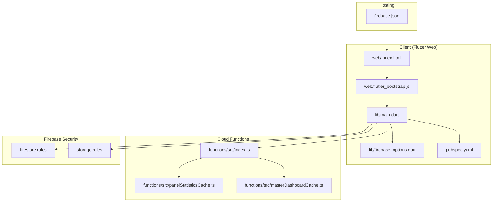
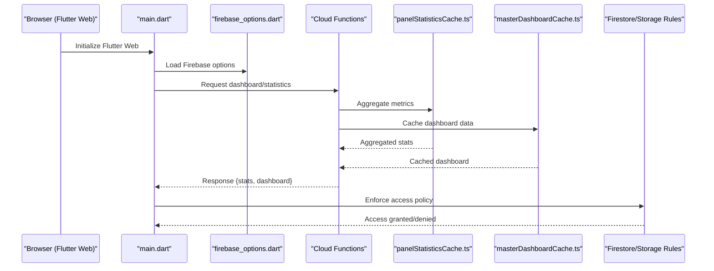
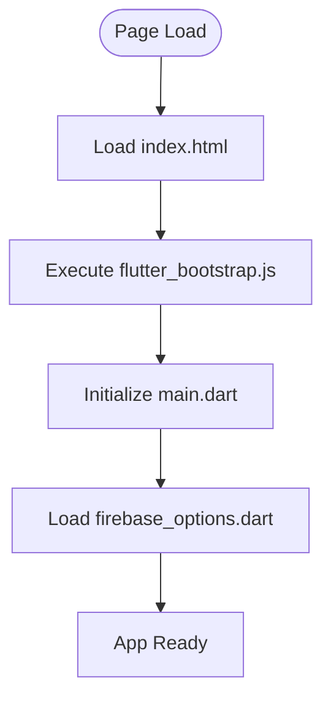
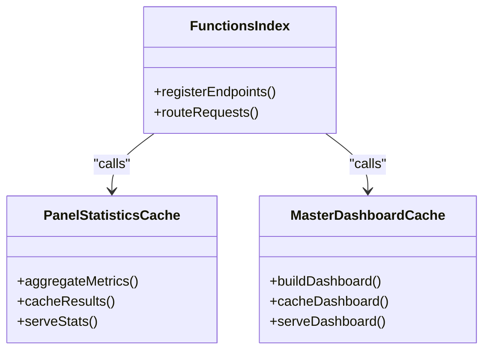
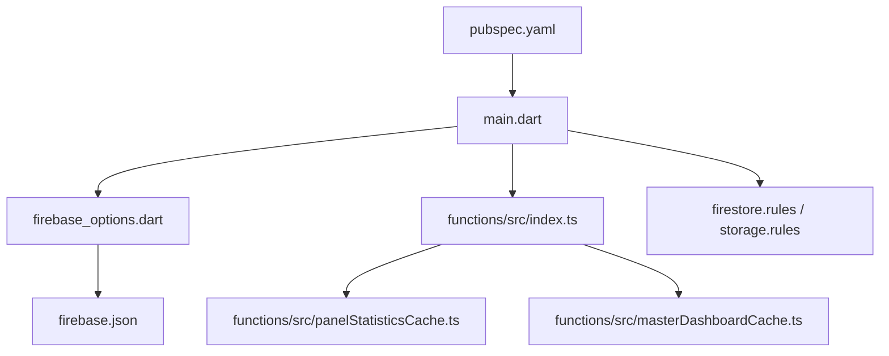

# Web Analytics & Monitoring

<cite>
**Referenced Files in This Document**
- [firebase.json](file://firebase.json)
- [firestore.rules](file://firestore.rules)
- [storage.rules](file://storage.rules)
- [functions/index.ts](file://functions/src/index.ts)
- [functions/panelStatisticsCache.ts](file://functions/src/panelStatisticsCache.ts)
- [functions/masterDashboardCache.ts](file://functions/src/masterDashboardCache.ts)
- [flutter_app/lib/main.dart](file://flutter_app/lib/main.dart)
- [flutter_app/lib/firebase_options.dart](file://flutter_app/lib/firebase_options.dart)
- [flutter_app/web/index.html](file://flutter_app/web/index.html)
- [flutter_app/web/flutter_bootstrap.js](file://flutter_app/web/flutter_bootstrap.js)
- [flutter_app/pubspec.yaml](file://flutter_app/pubspec.yaml)
- [docs/FIREBASE_OBSERVABILITY.md](file://docs/FIREBASE_OBSERVABILITY.md)
- [scripts/deploy_web_hosting.ps1](file://scripts/deploy_web_hosting.ps1)
</cite>

## Table of Contents
1. [Introduction](#introduction)
2. [Project Structure](#project-structure)
3. [Core Components](#core-components)
4. [Architecture Overview](#architecture-overview)
5. [Detailed Component Analysis](#detailed-component-analysis)
6. [Dependency Analysis](#dependency-analysis)
7. [Performance Considerations](#performance-considerations)
8. [Troubleshooting Guide](#troubleshooting-guide)
9. [Conclusion](#conclusion)
10. [Appendices](#appendices)

## Introduction
This document provides a comprehensive guide to web analytics and monitoring for the platform, focusing on analytics integration, event tracking, performance monitoring, error reporting, user behavior analysis, conversion tracking, custom metrics, dashboards, alerting, privacy and GDPR considerations, log aggregation, and benchmarking strategies. It maps these practices to the project’s Firebase-based architecture and Flutter web runtime, ensuring that both client-side and server-side telemetry are aligned with production-grade standards.

## Project Structure
The web analytics and monitoring stack spans several layers:
- Client-side (Flutter web): initialization, configuration, and optional analytics SDKs
- Hosting and bootstrap: web entry points and bootstrapping scripts
- Cloud Functions: backend services for statistics caching, dashboard data, and background processing
- Firebase configuration and rules: hosting, storage, and security policies
- Documentation and deployment scripts: observability guidance and deployment automation

**Diagram sources**
- [flutter_app/web/index.html](file://flutter_app/web/index.html)
- [flutter_app/web/flutter_bootstrap.js](file://flutter_app/web/flutter_bootstrap.js)
- [flutter_app/lib/main.dart](file://flutter_app/lib/main.dart)
- [flutter_app/lib/firebase_options.dart](file://flutter_app/lib/firebase_options.dart)
- [flutter_app/pubspec.yaml](file://flutter_app/pubspec.yaml)
- [firebase.json](file://firebase.json)
- [functions/src/index.ts](file://functions/src/index.ts)
- [functions/src/panelStatisticsCache.ts](file://functions/src/panelStatisticsCache.ts)
- [functions/src/masterDashboardCache.ts](file://functions/src/masterDashboardCache.ts)
- [firestore.rules](file://firestore.rules)
- [storage.rules](file://storage.rules)

**Section sources**
- [firebase.json](file://firebase.json)
- [flutter_app/web/index.html](file://flutter_app/web/index.html)
- [flutter_app/web/flutter_bootstrap.js](file://flutter_app/web/flutter_bootstrap.js)
- [flutter_app/lib/main.dart](file://flutter_app/lib/main.dart)
- [flutter_app/lib/firebase_options.dart](file://flutter_app/lib/firebase_options.dart)
- [flutter_app/pubspec.yaml](file://flutter_app/pubspec.yaml)
- [functions/src/index.ts](file://functions/src/index.ts)
- [functions/src/panelStatisticsCache.ts](file://functions/src/panelStatisticsCache.ts)
- [functions/src/masterDashboardCache.ts](file://functions/src/masterDashboardCache.ts)
- [firestore.rules](file://firestore.rules)
- [storage.rules](file://storage.rules)

## Core Components
- Hosting configuration: defines how the web app is served and cached, enabling performance optimizations and CDN distribution.
- Bootstrap and initialization: ensures the Flutter web app initializes correctly and loads necessary assets and options.
- Firebase options: centralizes environment-specific configuration for Firebase services used by analytics and monitoring.
- Cloud Functions: provide backend endpoints for statistics and dashboard data, supporting efficient analytics aggregation and caching.
- Security rules: enforce access control for Firestore and Storage, critical for protecting telemetry and user data.

Key responsibilities:
- Client-side initialization and configuration
- Event emission and metric collection
- Backend aggregation and caching
- Secure data access and compliance

**Section sources**
- [firebase.json](file://firebase.json)
- [flutter_app/web/index.html](file://flutter_app/web/index.html)
- [flutter_app/web/flutter_bootstrap.js](file://flutter_app/web/flutter_bootstrap.js)
- [flutter_app/lib/main.dart](file://flutter_app/lib/main.dart)
- [flutter_app/lib/firebase_options.dart](file://flutter_app/lib/firebase_options.dart)
- [functions/src/index.ts](file://functions/src/index.ts)
- [functions/src/panelStatisticsCache.ts](file://functions/src/panelStatisticsCache.ts)
- [functions/src/masterDashboardCache.ts](file://functions/src/masterDashboardCache.ts)
- [firestore.rules](file://firestore.rules)
- [storage.rules](file://storage.rules)

## Architecture Overview
The analytics and monitoring architecture integrates client-side telemetry with backend aggregation and secure storage. The flow emphasizes low-latency reads via cached statistics and strict access controls.

**Diagram sources**
- [flutter_app/lib/main.dart](file://flutter_app/lib/main.dart)
- [flutter_app/lib/firebase_options.dart](file://flutter_app/lib/firebase_options.dart)
- [functions/src/index.ts](file://functions/src/index.ts)
- [functions/src/panelStatisticsCache.ts](file://functions/src/panelStatisticsCache.ts)
- [functions/src/masterDashboardCache.ts](file://functions/src/masterDashboardCache.ts)
- [firestore.rules](file://firestore.rules)
- [storage.rules](file://storage.rules)

## Detailed Component Analysis

### Hosting Configuration
- Purpose: Configure Firebase Hosting for static assets, caching headers, redirects, and rewrites.
- Impact: Improves load times, enables CDN delivery, and supports SEO-friendly URLs.
- Best practices: Set appropriate cache-control headers for assets; use rewrites for SPA routing; ensure HTTPS enforcement.

**Section sources**
- [firebase.json](file://firebase.json)

### Web Bootstrap and Initialization
- Purpose: Ensure the Flutter web app boots correctly, loads assets, and initializes Firebase options.
- Key files: index.html, flutter_bootstrap.js, main.dart, firebase_options.dart.
- Recommendations: Defer non-critical scripts; preload essential assets; validate environment variables before initialization.

**Diagram sources**
- [flutter_app/web/index.html](file://flutter_app/web/index.html)
- [flutter_app/web/flutter_bootstrap.js](file://flutter_app/web/flutter_bootstrap.js)
- [flutter_app/lib/main.dart](file://flutter_app/lib/main.dart)
- [flutter_app/lib/firebase_options.dart](file://flutter_app/lib/firebase_options.dart)

**Section sources**
- [flutter_app/web/index.html](file://flutter_app/web/index.html)
- [flutter_app/web/flutter_bootstrap.js](file://flutter_app/web/flutter_bootstrap.js)
- [flutter_app/lib/main.dart](file://flutter_app/lib/main.dart)
- [flutter_app/lib/firebase_options.dart](file://flutter_app/lib/firebase_options.dart)

### Firebase Options and Dependencies
- Purpose: Centralize Firebase configuration and declare dependencies for analytics and monitoring.
- Actions: Verify correct project IDs and service configurations; pin dependency versions for stability.

**Section sources**
- [flutter_app/lib/firebase_options.dart](file://flutter_app/lib/firebase_options.dart)
- [flutter_app/pubspec.yaml](file://flutter_app/pubspec.yaml)

### Cloud Functions for Statistics and Dashboard
- Purpose: Provide backend endpoints to aggregate and cache analytics data efficiently.
- Responsibilities: Compute metrics, cache results, serve dashboard payloads, enforce authentication and authorization.

**Diagram sources**
- [functions/src/index.ts](file://functions/src/index.ts)
- [functions/src/panelStatisticsCache.ts](file://functions/src/panelStatisticsCache.ts)
- [functions/src/masterDashboardCache.ts](file://functions/src/masterDashboardCache.ts)

**Section sources**
- [functions/src/index.ts](file://functions/src/index.ts)
- [functions/src/panelStatisticsCache.ts](file://functions/src/panelStatisticsCache.ts)
- [functions/src/masterDashboardCache.ts](file://functions/src/masterDashboardCache.ts)

### Security Rules for Telemetry Data
- Purpose: Protect analytics and user data through strict access policies.
- Guidelines: Validate tenant context; restrict writes to authorized roles; sanitize inputs; enforce rate limits where applicable.

**Section sources**
- [firestore.rules](file://firestore.rules)
- [storage.rules](file://storage.rules)

## Dependency Analysis
Analytics and monitoring depend on:
- Flutter web runtime and Firebase options
- Hosting configuration for asset delivery
- Cloud Functions for aggregation and caching
- Security rules for access control

**Diagram sources**
- [flutter_app/pubspec.yaml](file://flutter_app/pubspec.yaml)
- [flutter_app/lib/main.dart](file://flutter_app/lib/main.dart)
- [flutter_app/lib/firebase_options.dart](file://flutter_app/lib/firebase_options.dart)
- [firebase.json](file://firebase.json)
- [functions/src/index.ts](file://functions/src/index.ts)
- [functions/src/panelStatisticsCache.ts](file://functions/src/panelStatisticsCache.ts)
- [functions/src/masterDashboardCache.ts](file://functions/src/masterDashboardCache.ts)
- [firestore.rules](file://firestore.rules)
- [storage.rules](file://storage.rules)

**Section sources**
- [flutter_app/pubspec.yaml](file://flutter_app/pubspec.yaml)
- [flutter_app/lib/main.dart](file://flutter_app/lib/main.dart)
- [flutter_app/lib/firebase_options.dart](file://flutter_app/lib/firebase_options.dart)
- [firebase.json](file://firebase.json)
- [functions/src/index.ts](file://functions/src/index.ts)
- [functions/src/panelStatisticsCache.ts](file://functions/src/panelStatisticsCache.ts)
- [functions/src/masterDashboardCache.ts](file://functions/src/masterDashboardCache.ts)
- [firestore.rules](file://firestore.rules)
- [storage.rules](file://storage.rules)

## Performance Considerations
- Asset optimization: Use caching headers, minification, and code splitting to reduce payload sizes.
- Lazy loading: Defer non-critical analytics SDKs until after core UI renders.
- Efficient queries: Aggregate metrics server-side to minimize client requests and improve responsiveness.
- Caching strategy: Leverage CDN and browser caches for static assets; implement short TTLs for dynamic analytics endpoints.
- Benchmarking: Measure Time to First Byte (TTFB), Largest Contentful Paint (LCP), and Interaction to Next Paint (INP) using browser dev tools or performance APIs.

[No sources needed since this section provides general guidance]

## Troubleshooting Guide
Common issues and resolutions:
- Initialization failures: Verify Firebase options and network connectivity; check console logs for errors during bootstrap.
- Missing analytics events: Ensure event emission occurs after app readiness; validate permissions and rule enforcement.
- Slow dashboard loads: Inspect function execution logs; optimize aggregation queries; increase cache hit rates.
- Access denied: Review security rules and tenant context; confirm authenticated user roles.

Operational tips:
- Enable verbose logging in development; disable in production to avoid overhead.
- Use structured logging for consistent parsing and alerting.
- Implement retry logic with exponential backoff for transient failures.

**Section sources**
- [docs/FIREBASE_OBSERVABILITY.md](file://docs/FIREBASE_OBSERVABILITY.md)

## Conclusion
A robust web analytics and monitoring system combines careful client-side initialization, efficient backend aggregation, and strict security policies. By leveraging Firebase Hosting, Cloud Functions, and well-defined rules, the platform can deliver accurate insights while maintaining performance and compliance. Continuous benchmarking, structured logging, and proactive alerting ensure reliability and scalability.

[No sources needed since this section summarizes without analyzing specific files]

## Appendices

### Privacy and GDPR Compliance
- Consent management: Implement explicit consent prompts before enabling analytics.
- Data minimization: Collect only necessary metrics; avoid sensitive personal data.
- Anonymization: Hash or pseudonymize identifiers where possible.
- Retention policies: Define clear retention windows and automated purging.
- User rights: Provide mechanisms for data export and deletion.

[No sources needed since this section provides general guidance]

### Monitoring Tools and Log Aggregation
- Tools: Use browser performance APIs, Firebase Analytics (if enabled), and Cloud Logging for centralized logs.
- Aggregation: Forward structured logs to a SIEM or log management platform; set up alerts for anomalies.
- Dashboards: Build operational dashboards combining frontend metrics and backend performance indicators.

[No sources needed since this section provides general guidance]

### Deployment and Observability Scripts
- Deploy web hosting: Automate deployment and verify asset integrity post-deploy.
- Observability: Integrate health checks and synthetic tests to monitor availability and performance.

**Section sources**
- [scripts/deploy_web_hosting.ps1](file://scripts/deploy_web_hosting.ps1)
- [docs/FIREBASE_OBSERVABILITY.md](file://docs/FIREBASE_OBSERVABILITY.md)