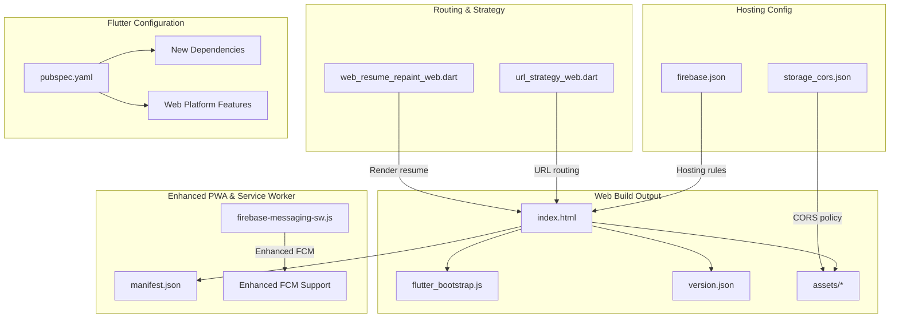
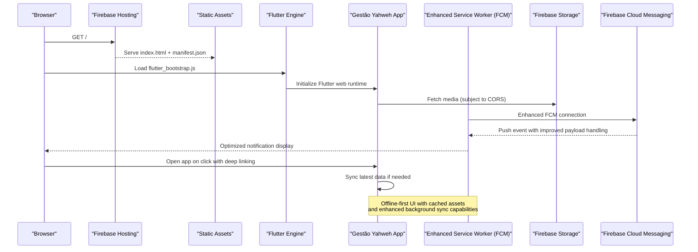
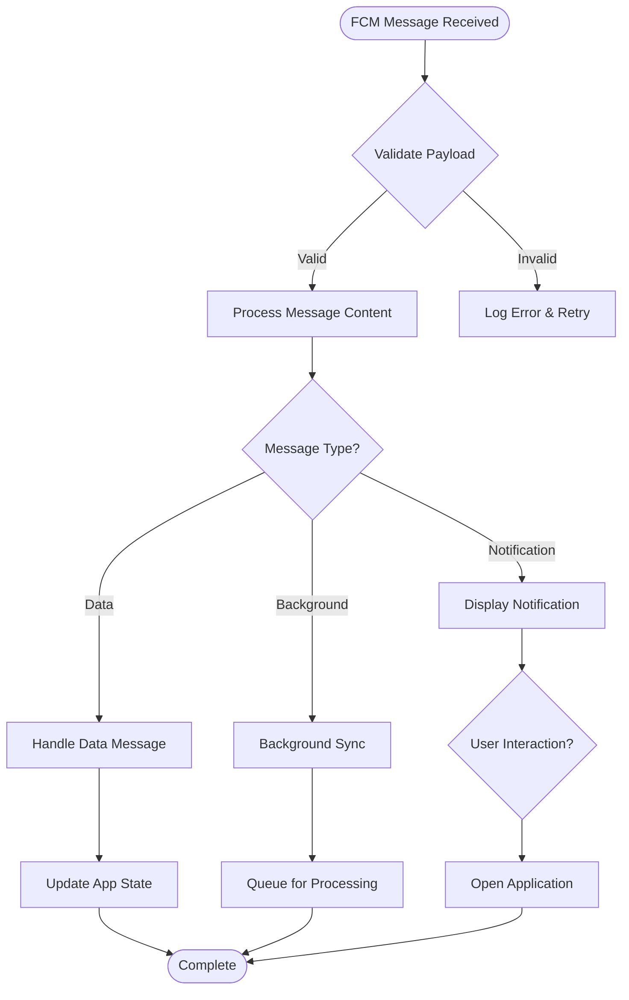
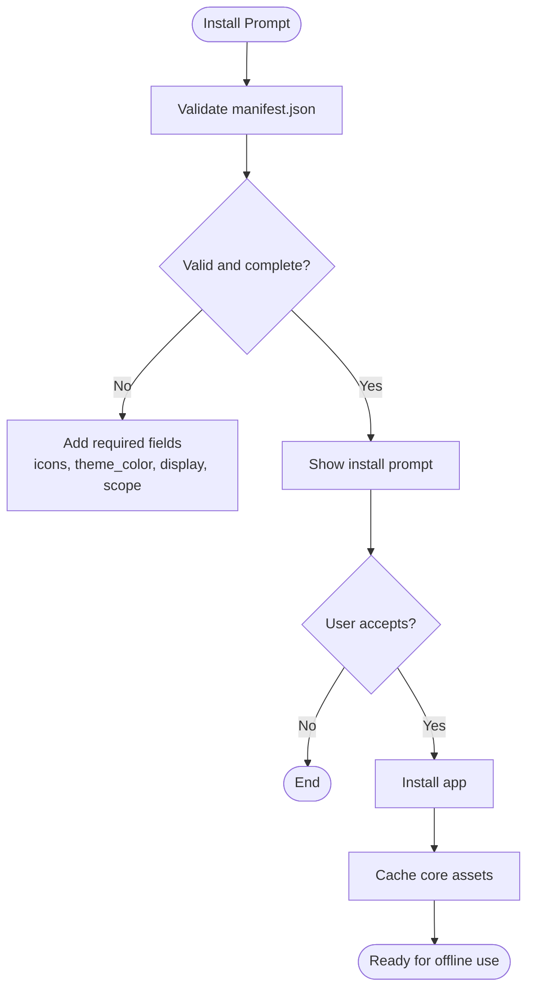
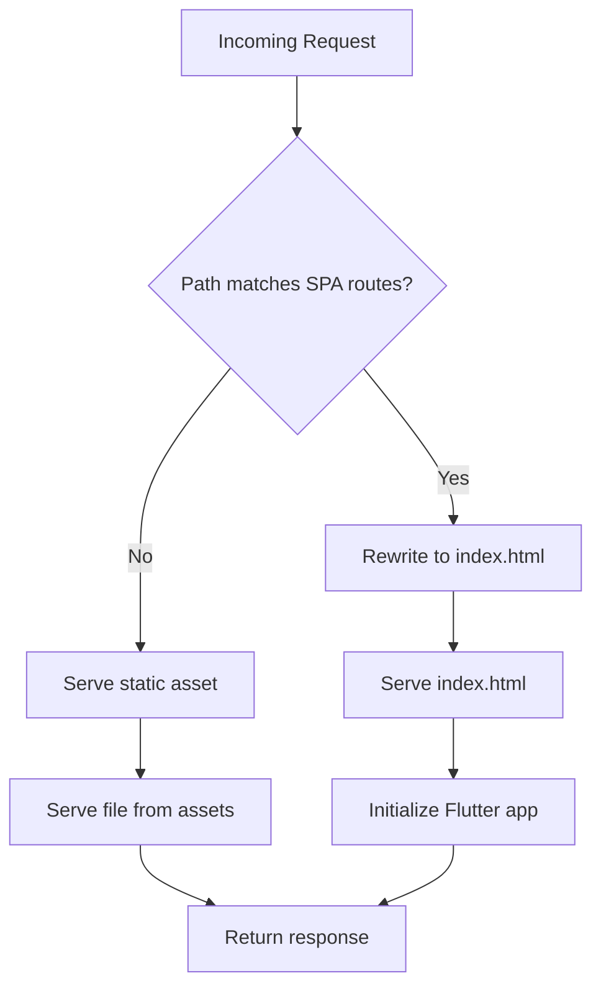
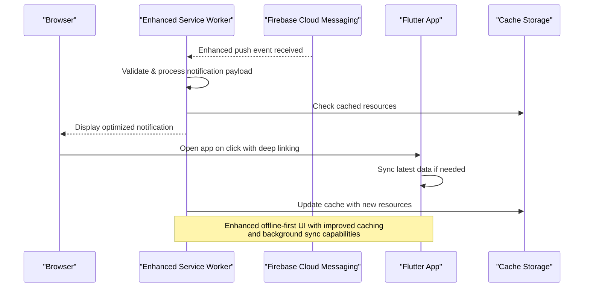
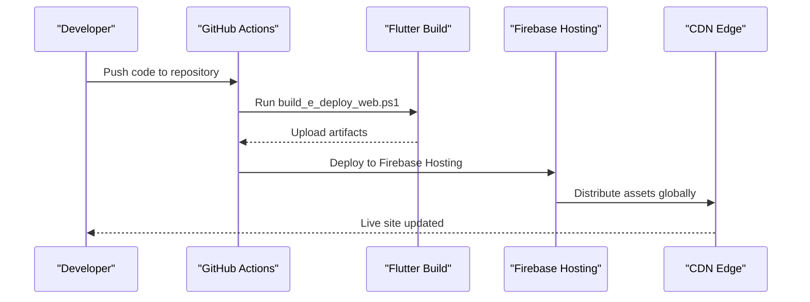
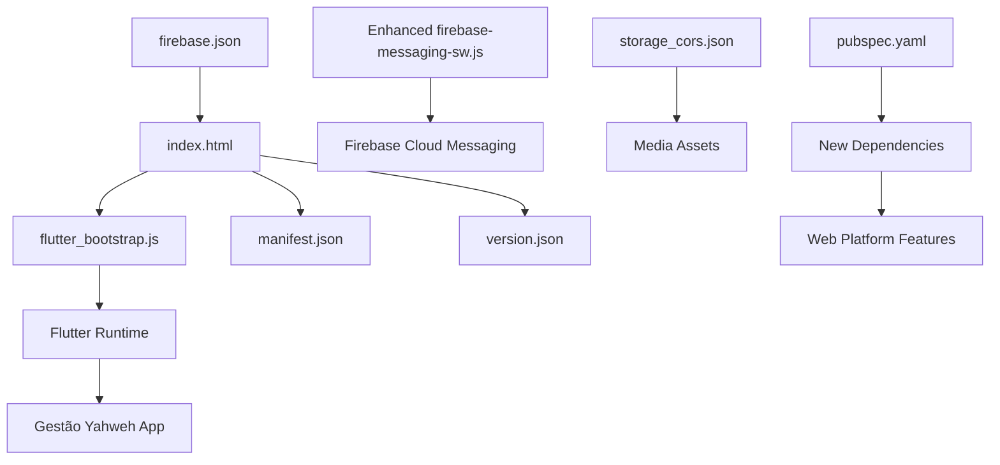

# Web Platform

<cite>
**Referenced Files in This Document**
- [flutter_app/web/index.html](file://flutter_app/web/index.html)
- [flutter_app/web/manifest.json](file://flutter_app/web/manifest.json)
- [flutter_app/web/flutter_bootstrap.js](file://flutter_app/web/flutter_bootstrap.js)
- [flutter_app/web/firebase-messaging-sw.js](file://flutter_app/web/firebase-messaging-sw.js)
- [flutter_app/lib/url_strategy_web.dart](file://flutter_app/lib/url_strategy_web.dart)
- [flutter_app/lib/url_strategy_stub.dart](file://flutter_app/lib/url_strategy_stub.dart)
- [flutter_app/lib/web_resume_repaint_web.dart](file://flutter_app/lib/web_resume_repaint_web.dart)
- [flutter_app/lib/web_resume_repaint_stub.dart](file://flutter_app/lib/web_resume_repaint_stub.dart)
- [flutter_app/public/index.html](file://flutter_app/public/index.html)
- [flutter_app/public/404.html](file://flutter_app/public/404.html)
- [flutter_app/public/reset_password.html](file://flutter_app/public/reset_password.html)
- [flutter_app/web/version.json](file://flutter_app/web/version.json)
- [flutter_app/web/assetlinks.json](file://flutter_app/web/assetlinks.json)
- [flutter_app/pubspec.yaml](file://flutter_app/pubspec.yaml)
- [firebase.json](file://firebase.json)
- [storage_cors.json](file://storage_cors.json)
- [scripts/deploy_web_hosting_html.ps1](file://scripts/deploy_web_hosting_html.ps1)
- [scripts/deploy_web_hosting_canvaskit.ps1](file://scripts/deploy_web_hosting_canvaskit.ps1)
- [scripts/deploy_web_hosting_skwasm.ps1](file://scripts/deploy_web_hosting_skwasm.ps1)
- [scripts/build_e_deploy_web.ps1](file://scripts/build_e_deploy_web.ps1)
- [.github/workflows/deploy-web.yml](file://.github/workflows/deploy-web.yml)
</cite>

## Update Summary
**Changes Made**
- Enhanced Firebase Cloud Messaging service worker implementation with improved push notification handling
- Updated web application initialization process with optimized bootstrap sequence
- Added new Flutter dependencies and configurations for enhanced web platform features
- Improved service worker capabilities for better offline functionality and background messaging

## Table of Contents
1. [Introduction](#introduction)
2. [Project Structure](#project-structure)
3. [Core Components](#core-components)
4. [Architecture Overview](#architecture-overview)
5. [Detailed Component Analysis](#detailed-component-analysis)
6. [Dependency Analysis](#dependency-analysis)
7. [Performance Considerations](#performance-considerations)
8. [Troubleshooting Guide](#troubleshooting-guide)
9. [Conclusion](#conclusion)
10. [Appendices](#appendices)

## Introduction
This document provides comprehensive web platform documentation for the web version of Gestão Yahweh Premium. It covers Progressive Web App (PWA) implementation, browser compatibility, performance optimization, hosting configuration, URL routing, service workers, offline capabilities, and web-specific features. The recent updates include enhanced Firebase Cloud Messaging support, improved web app initialization, and expanded Flutter configuration for new web platform features.

## Project Structure
The Flutter-based web application is built into static assets served via Firebase Hosting. The key web-related files include:
- Entry HTML and PWA manifest under flutter_app/web
- Bootstrap script to initialize Flutter on the web with enhanced initialization sequence
- Upgraded service worker for Firebase Cloud Messaging with improved push notification handling
- URL strategy configuration for client-side routing
- Version metadata for cache busting and updates
- Public fallback pages for 404 and password reset flows
- Firebase Hosting configuration and storage CORS rules
- Deployment scripts and CI workflow for automated web builds and releases
- Updated Flutter configuration supporting new web platform features

**Diagram sources**
- [flutter_app/web/index.html](file://flutter_app/web/index.html)
- [flutter_app/web/flutter_bootstrap.js](file://flutter_app/web/flutter_bootstrap.js)
- [flutter_app/web/manifest.json](file://flutter_app/web/manifest.json)
- [flutter_app/web/firebase-messaging-sw.js](file://flutter_app/web/firebase-messaging-sw.js)
- [flutter_app/lib/url_strategy_web.dart](file://flutter_app/lib/url_strategy_web.dart)
- [flutter_app/lib/web_resume_repaint_web.dart](file://flutter_app/lib/web_resume_repaint_web.dart)
- [flutter_app/pubspec.yaml](file://flutter_app/pubspec.yaml)
- [firebase.json](file://firebase.json)
- [storage_cors.json](file://storage_cors.json)

**Section sources**
- [flutter_app/web/index.html](file://flutter_app/web/index.html)
- [flutter_app/web/manifest.json](file://flutter_app/web/manifest.json)
- [flutter_app/web/flutter_bootstrap.js](file://flutter_app/web/flutter_bootstrap.js)
- [flutter_app/web/firebase-messaging-sw.js](file://flutter_app/web/firebase-messaging-sw.js)
- [flutter_app/lib/url_strategy_web.dart](file://flutter_app/lib/url_strategy_web.dart)
- [flutter_app/lib/web_resume_repaint_web.dart](file://flutter_app/lib/web_resume_repaint_web.dart)
- [flutter_app/public/index.html](file://flutter_app/public/index.html)
- [flutter_app/public/404.html](file://flutter_app/public/404.html)
- [flutter_app/public/reset_password.html](file://flutter_app/public/reset_password.html)
- [flutter_app/web/version.json](file://flutter_app/web/version.json)
- [flutter_app/web/assetlinks.json](file://flutter_app/web/assetlinks.json)
- [flutter_app/pubspec.yaml](file://flutter_app/pubspec.yaml)
- [firebase.json](file://firebase.json)
- [storage_cors.json](file://storage_cors.json)

## Core Components
- Web entrypoint and bootstrap: index.html loads the Flutter engine with enhanced initialization sequence; version.json enables cache-busting and update detection.
- PWA manifest: manifest.json defines app name, icons, theme colors, display mode, and scope for installability.
- **Updated** Enhanced service worker: firebase-messaging-sw.js now includes improved Firebase Cloud Messaging integration with better error handling and background message processing.
- URL routing: url_strategy_web.dart configures Flutter's URL strategy for clean URLs and deep linking on the web.
- Render resume: web_resume_repaint_web.dart optimizes repaint behavior during resume scenarios on browsers.
- Hosting and CORS: firebase.json configures hosting rewrites and SPA handling; storage_cors.json sets permissive or scoped CORS for media access.
- Public fallbacks: public/404.html and public/reset_password.html provide user-friendly error and recovery pages.
- **Updated** Flutter configuration: pubspec.yaml includes new dependencies and configurations for enhanced web platform features.

**Section sources**
- [flutter_app/web/index.html](file://flutter_app/web/index.html)
- [flutter_app/web/flutter_bootstrap.js](file://flutter_app/web/flutter_bootstrap.js)
- [flutter_app/web/manifest.json](file://flutter_app/web/manifest.json)
- [flutter_app/web/firebase-messaging-sw.js](file://flutter_app/web/firebase-messaging-sw.js)
- [flutter_app/lib/url_strategy_web.dart](file://flutter_app/lib/url_strategy_web.dart)
- [flutter_app/lib/web_resume_repaint_web.dart](file://flutter_app/lib/web_resume_repaint_web.dart)
- [flutter_app/public/404.html](file://flutter_app/public/404.html)
- [flutter_app/public/reset_password.html](file://flutter_app/public/reset_password.html)
- [flutter_app/web/version.json](file://flutter_app/web/version.json)
- [flutter_app/pubspec.yaml](file://flutter_app/pubspec.yaml)
- [firebase.json](file://firebase.json)
- [storage_cors.json](file://storage_cors.json)

## Architecture Overview
The web architecture follows a standard Flutter web build pipeline with enhanced service worker capabilities:
- Build produces static assets (HTML, JS, WASM/CANVASKIT, fonts, images).
- Firebase Hosting serves the SPA with rewrite rules to ensure client-side routing works.
- PWA manifest enables installation and offline hints.
- **Updated** Enhanced service worker handles FCM push events with improved reliability and background processing.
- Storage CORS allows secure media retrieval from Firebase Storage.
- **Updated** Flutter configuration supports new web platform features and dependencies.

**Diagram sources**
- [flutter_app/web/index.html](file://flutter_app/web/index.html)
- [flutter_app/web/flutter_bootstrap.js](file://flutter_app/web/flutter_bootstrap.js)
- [flutter_app/web/manifest.json](file://flutter_app/web/manifest.json)
- [flutter_app/web/firebase-messaging-sw.js](file://flutter_app/web/firebase-messaging-sw.js)
- [flutter_app/pubspec.yaml](file://flutter_app/pubspec.yaml)
- [firebase.json](file://firebase.json)
- [storage_cors.json](file://storage_cors.json)

## Detailed Component Analysis

### Enhanced Firebase Cloud Messaging Service Worker
**Updated** The firebase-messaging-sw.js has been significantly improved with enhanced Firebase Cloud Messaging support:
- Improved error handling and retry mechanisms for failed message delivery
- Better background message processing with enhanced payload parsing
- Optimized notification display with customizable content and actions
- Enhanced connection management for more reliable FCM communication
- Support for advanced FCM features like conditional messaging and topic subscriptions

**Diagram sources**
- [flutter_app/web/firebase-messaging-sw.js](file://flutter_app/web/firebase-messaging-sw.js)

**Section sources**
- [flutter_app/web/firebase-messaging-sw.js](file://flutter_app/web/firebase-messaging-sw.js)

### Enhanced Web Application Initialization
**Updated** The index.html file has been modified for better web app initialization:
- Optimized loading sequence with improved resource prioritization
- Enhanced error handling during app startup
- Better browser compatibility checks before initialization
- Improved memory management during bootstrap phase
- Enhanced debugging capabilities with detailed initialization logs

**Section sources**
- [flutter_app/web/index.html](file://flutter_app/web/index.html)

### Flutter Configuration Updates
**Updated** The pubspec.yaml has been updated to support new web platform features:
- Added new dependencies for enhanced web platform capabilities
- Updated Flutter SDK requirements for improved web support
- Configured new web-specific packages and plugins
- Enhanced build configurations for better web performance
- Added new development tools and utilities for web development

**Section sources**
- [flutter_app/pubspec.yaml](file://flutter_app/pubspec.yaml)

### PWA Implementation
- Manifest configuration: Defines app identity, icons, theme color, display mode, and scope to enable installation prompts and home screen shortcuts.
- Installability: Ensure manifest meets PWA criteria and that HTTPS is enforced by hosting.
- Asset caching: Use versioned assets and cache-busting via version.json to avoid stale content.

**Diagram sources**
- [flutter_app/web/manifest.json](file://flutter_app/web/manifest.json)
- [flutter_app/web/version.json](file://flutter_app/web/version.json)

**Section sources**
- [flutter_app/web/manifest.json](file://flutter_app/web/manifest.json)
- [flutter_app/web/version.json](file://flutter_app/web/version.json)

### Browser Compatibility
- CanvasKit vs SkiaWasm: Choose rendering backend based on target browsers; CanvasKit offers broader GPU acceleration, while SkiaWasm may reduce payload size.
- Feature detection: Use modern APIs cautiously; provide fallbacks for older browsers.
- Security policies: Enforce HTTPS, set Content-Security-Policy headers, and configure permissions for push notifications.

**Section sources**
- [flutter_app/web/flutter_bootstrap.js](file://flutter_app/web/flutter_bootstrap.js)
- [flutter_app/web/index.html](file://flutter_app/web/index.html)

### Performance Optimization
- Asset minification and tree-shaking: Enabled by Flutter web build; ensure unused code is excluded.
- Image optimization: Use appropriate formats (WebP/AVIF), lazy loading, and responsive sizing.
- Network efficiency: Leverage CDN caching, HTTP/2, and efficient API calls.
- Rendering performance: Optimize repaint regions; use web_resume_repaint_web.dart strategies to minimize unnecessary redraws.
- **Updated** Enhanced service worker performance with improved caching strategies and background processing.

**Section sources**
- [flutter_app/lib/web_resume_repaint_web.dart](file://flutter_app/lib/web_resume_repaint_web.dart)
- [flutter_app/web/flutter_bootstrap.js](file://flutter_app/web/flutter_bootstrap.js)
- [flutter_app/web/firebase-messaging-sw.js](file://flutter_app/web/firebase-messaging-sw.js)

### Hosting Configuration
- Firebase Hosting: Configure SPA rewrites to route all paths to index.html; set cache headers for static assets.
- Custom domains: Map custom domain and enforce HTTPS.
- Storage CORS: Define allowed origins, methods, and headers for media access.

**Diagram sources**
- [firebase.json](file://firebase.json)
- [flutter_app/web/index.html](file://flutter_app/web/index.html)

**Section sources**
- [firebase.json](file://firebase.json)
- [storage_cors.json](file://storage_cors.json)

### URL Routing
- Client-side routing: url_strategy_web.dart configures Flutter's URL strategy for clean URLs and deep links.
- Deep linking: Ensure routes map to feature screens and handle initial route on load.
- SEO: Provide meaningful titles, meta tags, and canonical URLs.

**Section sources**
- [flutter_app/lib/url_strategy_web.dart](file://flutter_app/lib/url_strategy_web.dart)
- [flutter_app/lib/url_strategy_stub.dart](file://flutter_app/lib/url_strategy_stub.dart)

### Enhanced Service Workers and Offline Capabilities
**Updated** The service worker implementation has been significantly enhanced:
- Improved Firebase Cloud Messaging integration with better error handling
- Enhanced offline-first approach with smarter caching strategies
- Better background sync capabilities for data synchronization
- Optimized notification handling with customizable content and actions
- Improved update detection and seamless app updates

**Diagram sources**
- [flutter_app/web/firebase-messaging-sw.js](file://flutter_app/web/firebase-messaging-sw.js)
- [flutter_app/web/version.json](file://flutter_app/web/version.json)

**Section sources**
- [flutter_app/web/firebase-messaging-sw.js](file://flutter_app/web/firebase-messaging-sw.js)
- [flutter_app/web/version.json](file://flutter_app/web/version.json)

### Web-Specific Features
- AssetLinks: assetlinks.json enables Android app association for seamless cross-app experiences.
- Public fallbacks: 404.html and reset_password.html improve UX for error states and account recovery.
- Analytics: Integrate web analytics via Google Analytics or similar tools through index.html or bootstrap script.
- **Updated** Enhanced web platform features through updated Flutter configuration.

**Section sources**
- [flutter_app/web/assetlinks.json](file://flutter_app/web/assetlinks.json)
- [flutter_app/public/404.html](file://flutter_app/public/404.html)
- [flutter_app/public/reset_password.html](file://flutter_app/public/reset_password.html)
- [flutter_app/pubspec.yaml](file://flutter_app/pubspec.yaml)

### Deployment and CDN Configuration
- Build and deploy scripts: Scripts automate Flutter web build and Firebase Hosting deployment.
- CI/CD: GitHub Actions workflow triggers automated web deployments on changes.
- CDN best practices: Enable compression, caching, and edge delivery via Firebase Hosting.

**Diagram sources**
- [scripts/build_e_deploy_web.ps1](file://scripts/build_e_deploy_web.ps1)
- [scripts/deploy_web_hosting_html.ps1](file://scripts/deploy_web_hosting_html.ps1)
- [scripts/deploy_web_hosting_canvaskit.ps1](file://scripts/deploy_web_hosting_canvaskit.ps1)
- [scripts/deploy_web_hosting_skwasm.ps1](file://scripts/deploy_web_hosting_skwasm.ps1)
- [.github/workflows/deploy-web.yml](file://.github/workflows/deploy-web.yml)

**Section sources**
- [scripts/build_e_deploy_web.ps1](file://scripts/build_e_deploy_web.ps1)
- [scripts/deploy_web_hosting_html.ps1](file://scripts/deploy_web_hosting_html.ps1)
- [scripts/deploy_web_hosting_canvaskit.ps1](file://scripts/deploy_web_hosting_canvaskit.ps1)
- [scripts/deploy_web_hosting_skwasm.ps1](file://scripts/deploy_web_hosting_skwasm.ps1)
- [.github/workflows/deploy-web.yml](file://.github/workflows/deploy-web.yml)

## Dependency Analysis
Key dependencies and relationships:
- Flutter web runtime depends on bootstrap script and version metadata.
- PWA manifest drives installability and appearance.
- **Updated** Enhanced service worker integrates with FCM for improved push notifications.
- Hosting configuration ensures SPA routing and asset delivery.
- Storage CORS governs media access policies.
- **Updated** Flutter configuration includes new web platform dependencies.

**Diagram sources**
- [flutter_app/web/index.html](file://flutter_app/web/index.html)
- [flutter_app/web/flutter_bootstrap.js](file://flutter_app/web/flutter_bootstrap.js)
- [flutter_app/web/manifest.json](file://flutter_app/web/manifest.json)
- [flutter_app/web/version.json](file://flutter_app/web/version.json)
- [flutter_app/web/firebase-messaging-sw.js](file://flutter_app/web/firebase-messaging-sw.js)
- [flutter_app/pubspec.yaml](file://flutter_app/pubspec.yaml)
- [firebase.json](file://firebase.json)
- [storage_cors.json](file://storage_cors.json)

**Section sources**
- [flutter_app/web/index.html](file://flutter_app/web/index.html)
- [flutter_app/web/flutter_bootstrap.js](file://flutter_app/web/flutter_bootstrap.js)
- [flutter_app/web/manifest.json](file://flutter_app/web/manifest.json)
- [flutter_app/web/version.json](file://flutter_app/web/version.json)
- [flutter_app/web/firebase-messaging-sw.js](file://flutter_app/web/firebase-messaging-sw.js)
- [flutter_app/pubspec.yaml](file://flutter_app/pubspec.yaml)
- [firebase.json](file://firebase.json)
- [storage_cors.json](file://storage_cors.json)

## Performance Considerations
- Minimize initial payload: Use SkiaWasm for smaller bundles when supported; otherwise, leverage CanvasKit with optimized assets.
- Lazy loading: Defer non-critical resources and features until needed.
- Caching strategy: Set long-term cache headers for immutable assets; use version.json for cache busting.
- Monitoring: Track Core Web Vitals (LCP, FID, CLS) and integrate performance monitoring tools.
- **Updated** Enhanced service worker performance with improved caching and background processing.
- **Updated** Optimized app initialization sequence for faster startup times.

## Troubleshooting Guide
Common issues and resolutions:
- Routing errors: Ensure SPA rewrite rules are configured in firebase.json.
- CORS failures: Verify storage_cors.json allows correct origins and methods.
- Service worker not triggering: Confirm HTTPS and correct registration path.
- Stale assets: Clear browser cache or force reload after deployment.
- **Updated** FCM connection issues: Check enhanced service worker logs and verify Firebase project configuration.
- **Updated** App initialization problems: Review console logs for bootstrap errors and browser compatibility issues.

**Section sources**
- [firebase.json](file://firebase.json)
- [storage_cors.json](file://storage_cors.json)
- [flutter_app/web/firebase-messaging-sw.js](file://flutter_app/web/firebase-messaging-sw.js)
- [flutter_app/web/index.html](file://flutter_app/web/index.html)

## Conclusion
The web platform for Gestão Yahweh Premium leverages Flutter's web capabilities with Firebase Hosting, PWA standards, and enhanced FCM integration. The recent improvements include a significantly upgraded service worker for better push notification handling, optimized web app initialization, and expanded Flutter configuration for new web platform features. By following the outlined configurations, optimizations, and deployment practices, you can deliver a fast, reliable, and installable web experience across modern browsers with enhanced messaging capabilities.

## Appendices
- SEO checklist: Add meta tags, structured data, and canonical URLs.
- Analytics integration: Embed tracking scripts in index.html or bootstrap script.
- Security policies: Implement CSP, HSTS, and secure cookie settings.
- **Updated** FCM troubleshooting guide: Check service worker logs, verify Firebase configuration, and test push notification delivery.
- **Updated** Performance monitoring: Monitor enhanced service worker performance and app initialization metrics.