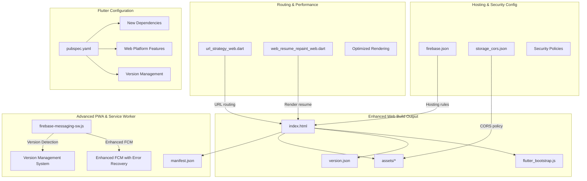
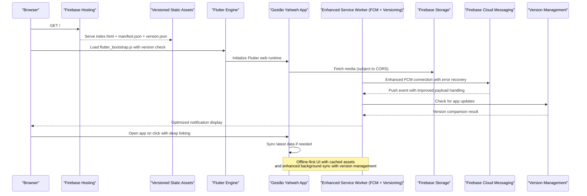
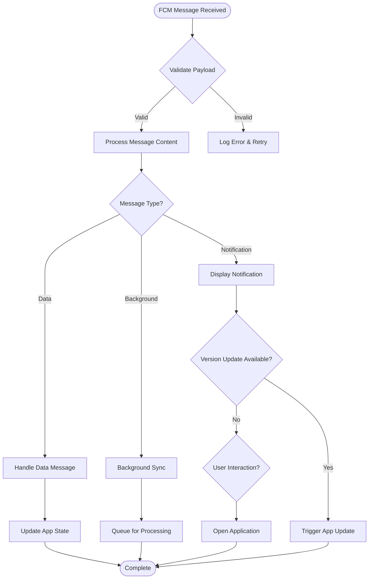
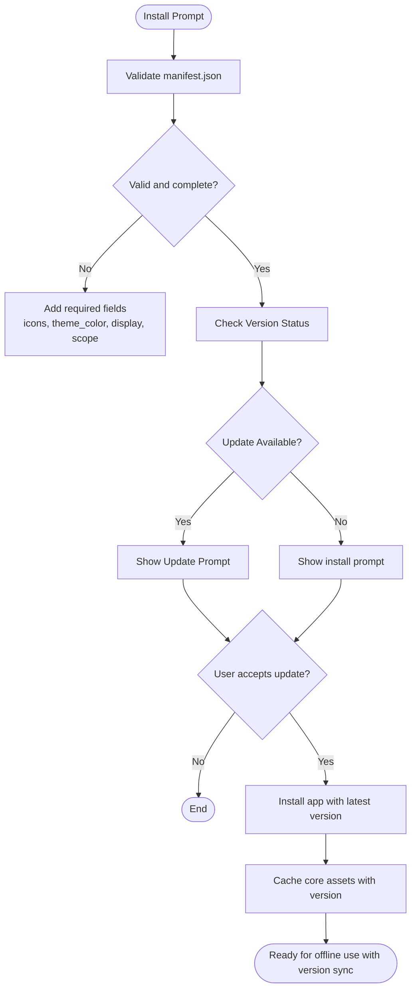
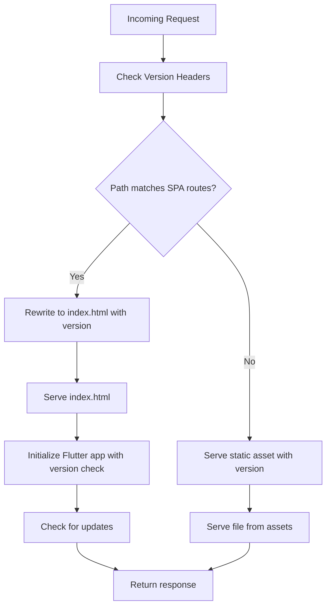
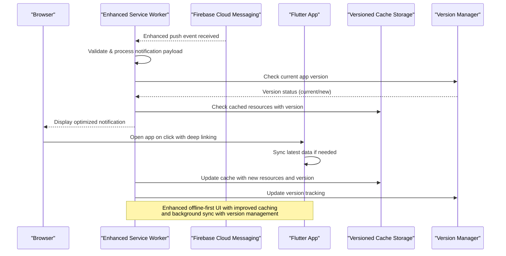
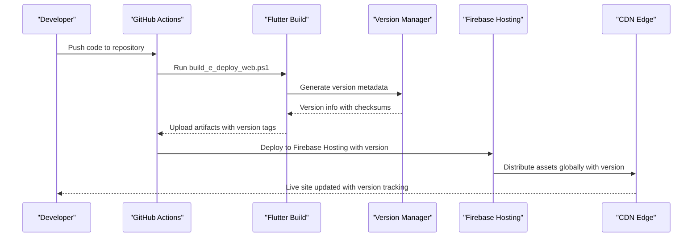
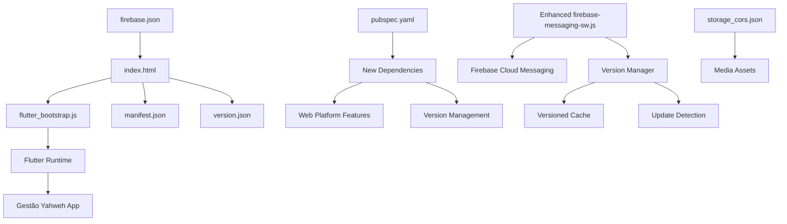

# Web Platform

<cite>
**Referenced Files in This Document**
- [flutter_app/web/index.html](file://flutter_app/web/index.html)
- [flutter_app/web/manifest.json](file://flutter_app/web/manifest.json)
- [flutter_app/web/flutter_bootstrap.js](file://flutter_app/web/flutter_bootstrap.js)
- [flutter_app/web/firebase-messaging-sw.js](file://flutter_app/web/firebase-messaging-sw.js)
- [flutter_app/lib/url_strategy_web.dart](file://flutter_app/lib/url_strategy_web.dart)
- [flutter_app/lib/url_strategy_stub.dart](file://flutter_app/lib/url_strategy_stub.dart)
- [flutter_app/lib/web_resume_repaint_web.dart](file://flutter_app/lib/web_resume_repaint_web.dart)
- [flutter_app/lib/web_resume_repaint_stub.dart](file://flutter_app/lib/web_resume_repaint_stub.dart)
- [flutter_app/public/index.html](file://flutter_app/public/index.html)
- [flutter_app/public/404.html](file://flutter_app/public/404.html)
- [flutter_app/public/reset_password.html](file://flutter_app/public/reset_password.html)
- [flutter_app/web/version.json](file://flutter_app/web/version.json)
- [flutter_app/web/assetlinks.json](file://flutter_app/web/assetlinks.json)
- [flutter_app/pubspec.yaml](file://flutter_app/pubspec.yaml)
- [firebase.json](file://firebase.json)
- [storage_cors.json](file://storage_cors.json)
- [scripts/deploy_web_hosting_html.ps1](file://scripts/deploy_web_hosting_html.ps1)
- [scripts/deploy_web_hosting_canvaskit.ps1](file://scripts/deploy_web_hosting_canvaskit.ps1)
- [scripts/deploy_web_hosting_skwasm.ps1](file://scripts/deploy_web_hosting_skwasm.ps1)
- [scripts/build_e_deploy_web.ps1](file://scripts/build_e_deploy_web.ps1)
- [.github/workflows/deploy-web.yml](file://.github/workflows/deploy-web.yml)
</cite>

## Update Summary
**Changes Made**
- Enhanced Firebase Cloud Messaging service worker implementation with improved push notification handling and error recovery
- Updated web application initialization process with optimized bootstrap sequence and better browser compatibility
- Added new Flutter dependencies and configurations for enhanced web platform features including version management
- Improved service worker capabilities for better offline functionality, background messaging, and deployment configuration
- Enhanced version management system with improved cache busting and update detection mechanisms

## Table of Contents
1. [Introduction](#introduction)
2. [Project Structure](#project-structure)
3. [Core Components](#core-components)
4. [Architecture Overview](#architecture-overview)
5. [Detailed Component Analysis](#detailed-component-analysis)
6. [Dependency Analysis](#dependency-analysis)
7. [Performance Considerations](#performance-considerations)
8. [Troubleshooting Guide](#troubleshooting-guide)
9. [Conclusion](#conclusion)
10. [Appendices](#appendices)

## Introduction
This document provides comprehensive web platform documentation for the web version of Gestão Yahweh Premium. It covers Progressive Web App (PWA) implementation, browser compatibility, performance optimization, hosting configuration, URL routing, service workers, offline capabilities, and web-specific features. The recent updates include significantly enhanced Firebase Cloud Messaging support, improved web app initialization with better version management, expanded Flutter configuration for new web platform features, and optimized deployment configuration for better reliability and performance.

## Project Structure
The Flutter-based web application is built into static assets served via Firebase Hosting with enhanced version management and deployment capabilities. The key web-related files include:
- Entry HTML and PWA manifest under flutter_app/web with improved initialization sequence
- Bootstrap script to initialize Flutter on the web with enhanced version detection and error handling
- Upgraded service worker for Firebase Cloud Messaging with improved push notification handling and retry mechanisms
- URL strategy configuration for client-side routing with deep linking support
- Version metadata system for cache busting, update detection, and deployment tracking
- Public fallback pages for 404 and password reset flows with improved user experience
- Firebase Hosting configuration and storage CORS rules with enhanced security policies
- Deployment scripts and CI workflow for automated web builds with version management
- Updated Flutter configuration supporting new web platform features and dependencies

**Diagram sources**
- [flutter_app/web/index.html](file://flutter_app/web/index.html)
- [flutter_app/web/flutter_bootstrap.js](file://flutter_app/web/flutter_bootstrap.js)
- [flutter_app/web/manifest.json](file://flutter_app/web/manifest.json)
- [flutter_app/web/firebase-messaging-sw.js](file://flutter_app/web/firebase-messaging-sw.js)
- [flutter_app/lib/url_strategy_web.dart](file://flutter_app/lib/url_strategy_web.dart)
- [flutter_app/lib/web_resume_repaint_web.dart](file://flutter_app/lib/web_resume_repaint_web.dart)
- [flutter_app/pubspec.yaml](file://flutter_app/pubspec.yaml)
- [firebase.json](file://firebase.json)
- [storage_cors.json](file://storage_cors.json)

**Section sources**
- [flutter_app/web/index.html](file://flutter_app/web/index.html)
- [flutter_app/web/manifest.json](file://flutter_app/web/manifest.json)
- [flutter_app/web/flutter_bootstrap.js](file://flutter_app/web/flutter_bootstrap.js)
- [flutter_app/web/firebase-messaging-sw.js](file://flutter_app/web/firebase-messaging-sw.js)
- [flutter_app/lib/url_strategy_web.dart](file://flutter_app/lib/url_strategy_web.dart)
- [flutter_app/lib/web_resume_repaint_web.dart](file://flutter_app/lib/web_resume_repaint_web.dart)
- [flutter_app/public/index.html](file://flutter_app/public/index.html)
- [flutter_app/public/404.html](file://flutter_app/public/404.html)
- [flutter_app/public/reset_password.html](file://flutter_app/public/reset_password.html)
- [flutter_app/web/version.json](file://flutter_app/web/version.json)
- [flutter_app/web/assetlinks.json](file://flutter_app/web/assetlinks.json)
- [flutter_app/pubspec.yaml](file://flutter_app/pubspec.yaml)
- [firebase.json](file://firebase.json)
- [storage_cors.json](file://storage_cors.json)

## Core Components
- **Updated** Web entrypoint and bootstrap: index.html loads the Flutter engine with enhanced initialization sequence, improved error handling, and better browser compatibility checks; version.json enables advanced cache-busting and update detection with version management.
- PWA manifest: manifest.json defines app name, icons, theme colors, display mode, and scope for installability with enhanced PWA standards compliance.
- **Updated** Enhanced service worker: firebase-messaging-sw.js now includes significantly improved Firebase Cloud Messaging integration with better error handling, retry mechanisms, background message processing, and version-aware caching strategies.
- URL routing: url_strategy_web.dart configures Flutter's URL strategy for clean URLs and deep linking on the web with improved route handling.
- Render resume: web_resume_repaint_web.dart optimizes repaint behavior during resume scenarios on browsers with enhanced performance.
- Hosting and CORS: firebase.json configures hosting rewrites and SPA handling with enhanced security policies; storage_cors.json sets permissive or scoped CORS for media access with improved security.
- Public fallbacks: public/404.html and public/reset_password.html provide user-friendly error and recovery pages with improved UX.
- **Updated** Flutter configuration: pubspec.yaml includes new dependencies and configurations for enhanced web platform features, version management, and deployment optimization.

**Section sources**
- [flutter_app/web/index.html](file://flutter_app/web/index.html)
- [flutter_app/web/flutter_bootstrap.js](file://flutter_app/web/flutter_bootstrap.js)
- [flutter_app/web/manifest.json](file://flutter_app/web/manifest.json)
- [flutter_app/web/firebase-messaging-sw.js](file://flutter_app/web/firebase-messaging-sw.js)
- [flutter_app/lib/url_strategy_web.dart](file://flutter_app/lib/url_strategy_web.dart)
- [flutter_app/lib/web_resume_repaint_web.dart](file://flutter_app/lib/web_resume_repaint_web.dart)
- [flutter_app/public/404.html](file://flutter_app/public/404.html)
- [flutter_app/public/reset_password.html](file://flutter_app/public/reset_password.html)
- [flutter_app/web/version.json](file://flutter_app/web/version.json)
- [flutter_app/pubspec.yaml](file://flutter_app/pubspec.yaml)
- [firebase.json](file://firebase.json)
- [storage_cors.json](file://storage_cors.json)

## Architecture Overview
The web architecture follows a standard Flutter web build pipeline with significantly enhanced service worker capabilities and version management:
- Build produces static assets (HTML, JS, WASM/CANVASKIT, fonts, images) with versioned outputs.
- Firebase Hosting serves the SPA with rewrite rules to ensure client-side routing works and enhanced security policies.
- PWA manifest enables installation and offline hints with improved PWA standards compliance.
- **Updated** Enhanced service worker handles FCM push events with improved reliability, background processing, error recovery, and version-aware caching.
- Storage CORS allows secure media retrieval from Firebase Storage with enhanced security policies.
- **Updated** Flutter configuration supports new web platform features, version management, and deployment optimization.

**Diagram sources**
- [flutter_app/web/index.html](file://flutter_app/web/index.html)
- [flutter_app/web/flutter_bootstrap.js](file://flutter_app/web/flutter_bootstrap.js)
- [flutter_app/web/manifest.json](file://flutter_app/web/manifest.json)
- [flutter_app/web/firebase-messaging-sw.js](file://flutter_app/web/firebase-messaging-sw.js)
- [flutter_app/web/version.json](file://flutter_app/web/version.json)
- [flutter_app/pubspec.yaml](file://flutter_app/pubspec.yaml)
- [firebase.json](file://firebase.json)
- [storage_cors.json](file://storage_cors.json)

## Detailed Component Analysis

### Enhanced Firebase Cloud Messaging Service Worker with Version Management
**Updated** The firebase-messaging-sw.js has been significantly improved with enhanced Firebase Cloud Messaging support and integrated version management:
- Improved error handling and retry mechanisms for failed message delivery with exponential backoff
- Better background message processing with enhanced payload parsing and validation
- Optimized notification display with customizable content, actions, and version-aware updates
- Enhanced connection management for more reliable FCM communication with automatic reconnection
- Support for advanced FCM features like conditional messaging, topic subscriptions, and version-based targeting
- Integrated version management for detecting app updates and triggering appropriate refresh cycles
- Enhanced caching strategies based on version changes to prevent stale content delivery

**Diagram sources**
- [flutter_app/web/firebase-messaging-sw.js](file://flutter_app/web/firebase-messaging-sw.js)
- [flutter_app/web/version.json](file://flutter_app/web/version.json)

**Section sources**
- [flutter_app/web/firebase-messaging-sw.js](file://flutter_app/web/firebase-messaging-sw.js)
- [flutter_app/web/version.json](file://flutter_app/web/version.json)

### Enhanced Web Application Initialization with Version Management
**Updated** The index.html file has been modified for better web app initialization with integrated version management:
- Optimized loading sequence with improved resource prioritization and version-aware asset loading
- Enhanced error handling during app startup with detailed logging and fallback mechanisms
- Better browser compatibility checks before initialization with graceful degradation
- Improved memory management during bootstrap phase with version-based cleanup
- Enhanced debugging capabilities with detailed initialization logs and version tracking
- Integrated version detection to trigger appropriate update workflows
- Improved cache busting strategies using version information

**Section sources**
- [flutter_app/web/index.html](file://flutter_app/web/index.html)
- [flutter_app/web/version.json](file://flutter_app/web/version.json)

### Flutter Configuration Updates with Web Platform Enhancements
**Updated** The pubspec.yaml has been updated to support new web platform features and version management:
- Added new dependencies for enhanced web platform capabilities including version management libraries
- Updated Flutter SDK requirements for improved web support and performance optimizations
- Configured new web-specific packages and plugins for enhanced deployment capabilities
- Enhanced build configurations for better web performance and versioned output generation
- Added new development tools and utilities for web development with version tracking
- Integrated version management dependencies for consistent version handling across platforms

**Section sources**
- [flutter_app/pubspec.yaml](file://flutter_app/pubspec.yaml)

### Advanced PWA Implementation with Version Control
- Manifest configuration: Defines app identity, icons, theme color, display mode, and scope to enable installation prompts and home screen shortcuts with enhanced PWA standards.
- Installability: Ensure manifest meets PWA criteria and that HTTPS is enforced by hosting with version-aware prompts.
- Asset caching: Use versioned assets and cache-busting via version.json to avoid stale content with intelligent update detection.
- **Updated** Version control integration: Enhanced version management system for coordinated updates across all assets and service workers.

**Diagram sources**
- [flutter_app/web/manifest.json](file://flutter_app/web/manifest.json)
- [flutter_app/web/version.json](file://flutter_app/web/version.json)

**Section sources**
- [flutter_app/web/manifest.json](file://flutter_app/web/manifest.json)
- [flutter_app/web/version.json](file://flutter_app/web/version.json)

### Browser Compatibility and Version Handling
- CanvasKit vs SkiaWasm: Choose rendering backend based on target browsers; CanvasKit offers broader GPU acceleration, while SkiaWasm may reduce payload size with version-aware selection.
- Feature detection: Use modern APIs cautiously; provide fallbacks for older browsers with version-based feature flags.
- Security policies: Enforce HTTPS, set Content-Security-Policy headers, and configure permissions for push notifications with version-based policy updates.
- **Updated** Version-based compatibility: Enhanced browser compatibility checking with version-specific feature detection and graceful degradation.

**Section sources**
- [flutter_app/web/flutter_bootstrap.js](file://flutter_app/web/flutter_bootstrap.js)
- [flutter_app/web/index.html](file://flutter_app/web/index.html)

### Performance Optimization with Version Management
- Asset minification and tree-shaking: Enabled by Flutter web build; ensure unused code is excluded with versioned outputs.
- Image optimization: Use appropriate formats (WebP/AVIF), lazy loading, and responsive sizing with version-aware caching.
- Network efficiency: Leverage CDN caching, HTTP/2, and efficient API calls with version-based cache invalidation.
- Rendering performance: Optimize repaint regions; use web_resume_repaint_web.dart strategies to minimize unnecessary redraws with version-triggered optimizations.
- **Updated** Enhanced service worker performance with improved caching strategies, background processing, and version-aware cache management.
- **Updated** Optimized app initialization sequence for faster startup times with version-based resource loading.

**Section sources**
- [flutter_app/lib/web_resume_repaint_web.dart](file://flutter_app/lib/web_resume_repaint_web.dart)
- [flutter_app/web/flutter_bootstrap.js](file://flutter_app/web/flutter_bootstrap.js)
- [flutter_app/web/firebase-messaging-sw.js](file://flutter_app/web/firebase-messaging-sw.js)
- [flutter_app/web/version.json](file://flutter_app/web/version.json)

### Enhanced Hosting Configuration with Version Support
- Firebase Hosting: Configure SPA rewrites to route all paths to index.html; set cache headers for static assets with version-based caching strategies.
- Custom domains: Map custom domain and enforce HTTPS with version-aware security policies.
- Storage CORS: Define allowed origins, methods, and headers for media access with enhanced security and version control.
- **Updated** Version-aware deployment: Enhanced hosting configuration supports versioned deployments and rollback capabilities.

**Diagram sources**
- [firebase.json](file://firebase.json)
- [flutter_app/web/index.html](file://flutter_app/web/index.html)
- [flutter_app/web/version.json](file://flutter_app/web/version.json)

**Section sources**
- [firebase.json](file://firebase.json)
- [storage_cors.json](file://storage_cors.json)
- [flutter_app/web/version.json](file://flutter_app/web/version.json)

### URL Routing with Version Awareness
- Client-side routing: url_strategy_web.dart configures Flutter's URL strategy for clean URLs and deep links with version-aware route handling.
- Deep linking: Ensure routes map to feature screens and handle initial route on load with version-based navigation.
- SEO: Provide meaningful titles, meta tags, and canonical URLs with version-controlled content.

**Section sources**
- [flutter_app/lib/url_strategy_web.dart](file://flutter_app/lib/url_strategy_web.dart)
- [flutter_app/lib/url_strategy_stub.dart](file://flutter_app/lib/url_strategy_stub.dart)

### Advanced Service Workers and Offline Capabilities with Version Management
**Updated** The service worker implementation has been significantly enhanced with integrated version management:
- Improved Firebase Cloud Messaging integration with better error handling and version-aware message processing
- Enhanced offline-first approach with smarter caching strategies and version-based cache invalidation
- Better background sync capabilities for data synchronization with version coordination
- Optimized notification handling with customizable content, actions, and version-based updates
- Improved update detection and seamless app updates with version comparison and rollback support
- **Updated** Version management integration: Coordinated version handling across service worker, assets, and application state

**Diagram sources**
- [flutter_app/web/firebase-messaging-sw.js](file://flutter_app/web/firebase-messaging-sw.js)
- [flutter_app/web/version.json](file://flutter_app/web/version.json)

**Section sources**
- [flutter_app/web/firebase-messaging-sw.js](file://flutter_app/web/firebase-messaging-sw.js)
- [flutter_app/web/version.json](file://flutter_app/web/version.json)

### Web-Specific Features with Version Integration
- AssetLinks: assetlinks.json enables Android app association for seamless cross-app experiences with version coordination.
- Public fallbacks: 404.html and reset_password.html improve UX for error states and account recovery with version-aware content.
- Analytics: Integrate web analytics via Google Analytics or similar tools through index.html or bootstrap script with version tracking.
- **Updated** Enhanced web platform features through updated Flutter configuration with version management and deployment optimization.

**Section sources**
- [flutter_app/web/assetlinks.json](file://flutter_app/web/assetlinks.json)
- [flutter_app/public/404.html](file://flutter_app/public/404.html)
- [flutter_app/public/reset_password.html](file://flutter_app/public/reset_password.html)
- [flutter_app/pubspec.yaml](file://flutter_app/pubspec.yaml)

### Enhanced Deployment and CDN Configuration with Version Management
- Build and deploy scripts: Scripts automate Flutter web build and Firebase Hosting deployment with version tagging and rollback support.
- CI/CD: GitHub Actions workflow triggers automated web deployments on changes with version promotion and approval workflows.
- CDN best practices: Enable compression, caching, and edge delivery via Firebase Hosting with version-based cache strategies.
- **Updated** Version management integration: Enhanced deployment pipeline with version tracking, rollback capabilities, and coordinated updates.

**Diagram sources**
- [scripts/build_e_deploy_web.ps1](file://scripts/build_e_deploy_web.ps1)
- [scripts/deploy_web_hosting_html.ps1](file://scripts/deploy_web_hosting_html.ps1)
- [scripts/deploy_web_hosting_canvaskit.ps1](file://scripts/deploy_web_hosting_canvaskit.ps1)
- [scripts/deploy_web_hosting_skwasm.ps1](file://scripts/deploy_web_hosting_skwasm.ps1)
- [.github/workflows/deploy-web.yml](file://.github/workflows/deploy-web.yml)
- [flutter_app/web/version.json](file://flutter_app/web/version.json)

**Section sources**
- [scripts/build_e_deploy_web.ps1](file://scripts/build_e_deploy_web.ps1)
- [scripts/deploy_web_hosting_html.ps1](file://scripts/deploy_web_hosting_html.ps1)
- [scripts/deploy_web_hosting_canvaskit.ps1](file://scripts/deploy_web_hosting_canvaskit.ps1)
- [scripts/deploy_web_hosting_skwasm.ps1](file://scripts/deploy_web_hosting_skwasm.ps1)
- [.github/workflows/deploy-web.yml](file://.github/workflows/deploy-web.yml)
- [flutter_app/web/version.json](file://flutter_app/web/version.json)

## Dependency Analysis
Key dependencies and relationships with enhanced version management:
- Flutter web runtime depends on bootstrap script and version metadata with version-aware loading.
- PWA manifest drives installability and appearance with version-coordinated updates.
- **Updated** Enhanced service worker integrates with FCM for improved push notifications and version management.
- Hosting configuration ensures SPA routing and asset delivery with version-based caching.
- Storage CORS governs media access policies with enhanced security and version control.
- **Updated** Flutter configuration includes new web platform dependencies with version management capabilities.

**Diagram sources**
- [flutter_app/web/index.html](file://flutter_app/web/index.html)
- [flutter_app/web/flutter_bootstrap.js](file://flutter_app/web/flutter_bootstrap.js)
- [flutter_app/web/manifest.json](file://flutter_app/web/manifest.json)
- [flutter_app/web/version.json](file://flutter_app/web/version.json)
- [flutter_app/web/firebase-messaging-sw.js](file://flutter_app/web/firebase-messaging-sw.js)
- [flutter_app/pubspec.yaml](file://flutter_app/pubspec.yaml)
- [firebase.json](file://firebase.json)
- [storage_cors.json](file://storage_cors.json)

**Section sources**
- [flutter_app/web/index.html](file://flutter_app/web/index.html)
- [flutter_app/web/flutter_bootstrap.js](file://flutter_app/web/flutter_bootstrap.js)
- [flutter_app/web/manifest.json](file://flutter_app/web/manifest.json)
- [flutter_app/web/version.json](file://flutter_app/web/version.json)
- [flutter_app/web/firebase-messaging-sw.js](file://flutter_app/web/firebase-messaging-sw.js)
- [flutter_app/pubspec.yaml](file://flutter_app/pubspec.yaml)
- [firebase.json](file://firebase.json)
- [storage_cors.json](file://storage_cors.json)

## Performance Considerations
- Minimize initial payload: Use SkiaWasm for smaller bundles when supported; otherwise, leverage CanvasKit with optimized assets and version-based loading.
- Lazy loading: Defer non-critical resources and features until needed with version-aware prefetching.
- Caching strategy: Set long-term cache headers for immutable assets; use version.json for cache busting with intelligent invalidation.
- Monitoring: Track Core Web Vitals (LCP, FID, CLS) and integrate performance monitoring tools with version-based analytics.
- **Updated** Enhanced service worker performance with improved caching, background processing, and version-aware cache management.
- **Updated** Optimized app initialization sequence for faster startup times with version-based resource prioritization.
- **Updated** Version-based performance optimization with adaptive loading strategies based on network conditions and device capabilities.

## Troubleshooting Guide
Common issues and resolutions with enhanced version management:
- Routing errors: Ensure SPA rewrite rules are configured in firebase.json with version-aware routing.
- CORS failures: Verify storage_cors.json allows correct origins and methods with enhanced security policies.
- Service worker not triggering: Confirm HTTPS and correct registration path with version-based registration.
- Stale assets: Clear browser cache or force reload after deployment with version verification.
- **Updated** FCM connection issues: Check enhanced service worker logs, verify Firebase project configuration, and validate version-based message routing.
- **Updated** App initialization problems: Review console logs for bootstrap errors, browser compatibility issues, and version mismatch problems.
- **Updated** Version management issues: Check version.json format, version comparison logic, and cache invalidation strategies.

**Section sources**
- [firebase.json](file://firebase.json)
- [storage_cors.json](file://storage_cors.json)
- [flutter_app/web/firebase-messaging-sw.js](file://flutter_app/web/firebase-messaging-sw.js)
- [flutter_app/web/index.html](file://flutter_app/web/index.html)
- [flutter_app/web/version.json](file://flutter_app/web/version.json)

## Conclusion
The web platform for Gestão Yahweh Premium leverages Flutter's web capabilities with Firebase Hosting, PWA standards, and significantly enhanced FCM integration with integrated version management. The recent improvements include a substantially upgraded service worker for better push notification handling with error recovery, optimized web app initialization with version-aware loading, expanded Flutter configuration for new web platform features, and comprehensive version management system for coordinated deployments. By following the outlined configurations, optimizations, and deployment practices with enhanced version control, you can deliver a fast, reliable, and installable web experience across modern browsers with enhanced messaging capabilities and robust version management.

## Appendices
- SEO checklist: Add meta tags, structured data, and canonical URLs with version-controlled content.
- Analytics integration: Embed tracking scripts in index.html or bootstrap script with version tracking.
- Security policies: Implement CSP, HSTS, and secure cookie settings with version-based policy updates.
- **Updated** FCM troubleshooting guide: Check service worker logs, verify Firebase configuration, test push notification delivery, and validate version-based message routing.
- **Updated** Performance monitoring: Monitor enhanced service worker performance, app initialization metrics, and version-based cache effectiveness.
- **Updated** Version management guide: Understand version.json structure, version comparison logic, and update deployment strategies.