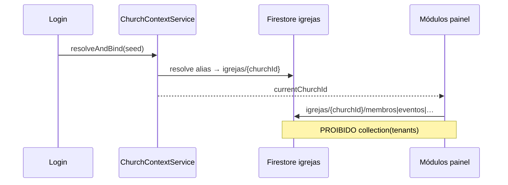

# Relatório de auditoria — coleção `tenants/`

**Data:** 2026-06-08  
**Política:** `tenants/` **não é apagada** — apenas deixa de ser fonte operacional.  
**Fonte da verdade:** `igrejas/{churchId}` + Storage `igrejas/{churchId}/…`

---

## Resumo executivo

| Camada | `collection('tenants')` | Status |
|--------|-------------------------|--------|
| **Flutter (app)** | **0 ocorrências** | ✅ Nenhum módulo operacional lê `tenants/` |
| **Cloud Functions** | **39 ocorrências** em `functions/src/index.ts` | ⚠️ Fallback legado + onboarding/cobrança |
| **Scripts** | 6 arquivos | 🔧 Migração/seed apenas |

### Causa provável da divergência Web × Mobile

O app Flutter **já não consulta** `collection('tenants')`. A divergência vinha de:

1. **Resolução de cluster** — `resolveOperationalChurchDocId` redirecionava para doc «mais rico» do cluster (ex.: BPC).
2. **Leituras multi-ID** — `getAllTenantIdsWithSameSlugOrAlias` carregava membros de vários docs `igrejas/`.
3. **Cloud Functions** — fallback `igrejas` → `tenants` em login/onboarding (linhas ~2350–2405).
4. **Coleção paralela no Firestore** — `tenants/igreja_batista_renovada` com dados duplicados vs `igrejas/igreja_batista_renovada`.

### Correções aplicadas no Flutter (esta sessão)

| Alteração | Efeito |
|-----------|--------|
| `ChurchContextService` no auth gate + shell | Resolve `churchId` **uma vez** após login |
| `TenantResolverService.operationalChurchId()` | Atalho para `currentChurchId` bound |
| `resolveOperationalChurchDocId` | Sem redirect de cluster; só `igrejas/{bound}` |
| `getAllTenantIdsWithSameSlugOrAlias` | Com contexto bound → retorna só `[currentChurchId]` |
| `ChurchRepository` | Sem `richestChurchProfileForCadastro` |
| Dashboard, Membros, Usuários | Usam `operationalChurchId` |
| `ChurchOperationalFirestoreTrace` | Diagnóstico: origem, path, churchId, tempo |

---

## Flutter — busca `collection('tenants')` e `.doc('tenants')`

```
Resultado: NENHUMA ocorrência em flutter_app/
```

### Referências a string `tenants/` (não são leituras Firestore)

| Arquivo | Tipo | Ação |
|---------|------|------|
| `core/feed_tenant_storage_map.dart` | Storage legado | `usePhysicalTenantPaths = false` → só `igrejas/` |
| `ui/pages/usuarios_permissoes_page.dart` | Comentários | Atualizados → `igrejas/{id}/users` |
| `ui/church_public_page.dart` | Comentário fallback | Atualizado — lê só `igrejas` |
| `ui/super_admin_console_page.dart` | Comentário desatualizado | Lista real: `collection('igrejas')` |
| `ui/pages/members_page.dart` | Variáveis `_tenants` (lista UI) | Nome legado; dados de `igrejas` |

### Padrões relacionados (parâmetro `tenantId`)

O parâmetro `tenantId` aparece em ~150 arquivos — na maioria é o **churchId canónico** passado pelo shell, não uma leitura de `tenants/`. Após login, o valor efetivo é `ChurchContextService.currentChurchId`.

---

## Cloud Functions — `collection('tenants')` (39× em `functions/src/index.ts`)

> **Não apagar** até migrar onboarding/cobrança. Prioridade: trocar leituras operacionais por `igrejas/{churchId}` com fallback só em compatibilidade.

### Categorias identificadas

| Categoria | Uso típico | Pode usar só `igrejas/`? |
|-----------|------------|--------------------------|
| **Login / resolve church by email** | Fallback se `igrejas/{id}` não existir (~L2352, L2374, L2404) | Sim, após garantir doc em `igrejas/` |
| **Onboarding / registro gestor** | `tenants/{id}.set({ alias, slug, cpf, … })` (~L590, L3760, L5630) | Manter escrita espelho temporária |
| **usersIndex / members legado** | `tenants/{id}/usersIndex`, `tenants/{id}/members` | Migrar para `igrejas/{id}/membros` |
| **Cobrança / licenciamento** | Leitura de plano, contadores (~L1524, L6727) | Auditar — pode precisar de `tenants` |
| **Admin / listagem** | `tenants.get()` (~L1472, L6727) | Substituir por `igrejas.get()` |
| **Notificações / FCM** | Dados da igreja via tenants (~L2039+) | Ler `igrejas` primeiro |

### Arquivo compilado

- `functions/lib/index.js` — espelho do TS (mesmas 39+ ocorrências)

### Scripts de migração (não operacionais)

| Arquivo | Uso |
|---------|-----|
| `functions/scripts/sync-members.js` | Sync legado members |
| `functions/scripts/migrate-membro-auth-uid.js` | Migração UID |
| `functions/backfillUsersIndex.js` | Backfill usersIndex |
| `scripts/seed-members-bpc-65.js` | Seed |
| `scripts/import-members-bpc.js` | Import |

---

## Fluxo correto (pós-refatoração)



---

## Diagnóstico

`SystemDiagnosticService.probe()` retorna:

- `churchId`, `firestorePath`, `storagePath`
- `loadDurationMs`, `firestoreReadMs`
- `readSource`, `lastError`
- `recentTraces[]` — origem, path, tempo (`ChurchOperationalFirestoreTrace`)

---

## Próximos passos recomendados

1. **Validar Web** — login BPC / Batista Renovada → Cadastro carrega de `igrejas/{churchId}`.
2. **Cloud Functions** — criar helper `readChurchDoc(churchId)` que lê `igrejas` primeiro; `tenants` só se `!exists` (compat).
3. **Espelho opcional** — manter `tenants/{id}` sincronizado por CF em writes de onboarding (não leitura).
4. **Limpeza de campos** — remover `logo_url`, URLs fixas nos docs `igrejas/` (não apagar coleção).
5. **Deploy** — somente com pedido explícito do usuário.

---

## Validação Fase 12

| Plataforma | churchId esperado (BPC) |
|------------|-------------------------|
| Web | `igreja_o_brasil_para_cristo_jardim_goiano` |
| Android | idem |
| iOS | idem |

| Igreja teste 2 | churchId |
|----------------|----------|
| Batista Renovada | `igreja_batista_renovada` |

Todos os módulos devem ler **apenas** `igrejas/{churchId}` — nunca `tenants/{id}` para dados operacionais.
